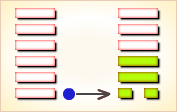
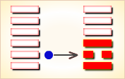
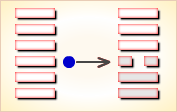
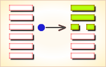
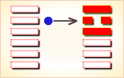
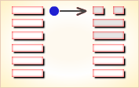

---
hide:
  - navigation
---
# 周易第1卦_乾卦(乾为天)_乾上乾下

<table>
	<tbody>
		<tr>
			<td class="td1">
				</td>
			<td class="td1">
				</td>
			<td class="td1">
				</td>
			<td class="td1">
				</td>
		</tr>
		<tr>
			<td style="text-align: center;">
				<strong>本卦</strong></td>
			<td style="text-align: center;">
				<strong>互卦</strong></td>
			<td style="text-align: center;">
				<strong>错卦</strong></td>
			<td style="text-align: center;">
				<strong>综卦</strong></td>
		</tr>
		<tr>
			<td style="text-align: center;">
				<a href="" style="text-decoration: none;">第1卦：乾卦(乾为天)</a></td>
			<td style="text-align: center;">
				<a href="" style="text-decoration: none;">第1卦：乾卦(乾为天)</a></td>
			<td style="text-align: center;">
				<a href="../02.坤为地" style="text-decoration: none;">第2卦：坤卦(坤为地)</a></td>
			<td style="text-align: center;">
				<a href="" style="text-decoration: none;">第1卦：乾卦(乾为天)</a></td>
		</tr>
	</tbody>
</table>

## 周易第一卦详解

**乾卦原文**

乾。元，亨，利，贞。

象曰：天行健，君子以自强不息。

**白话文解释**

乾卦：大吉大利，吉利的贞卜。

《象辞》说：天道刚健，运行不已。君子观此卦象，从而以天为法，自强不息。

**《断易天机》解**

乾象征天，六阳爻构成乾卦，为《易经》六十四卦之首。纯阳刚建，其性刚强，其行劲健，大通而至正，兆示大通而有利，但须行正道，方可永远亨通。

**北宋易学家邵雍解**

刚健旺盛，发育之功；完事顺利，谨防太强。

得此卦者，天行刚健，自强不息，名利双收之象，宜把握机会，争取成果。女人得此卦则有过于刚直之嫌。

**台湾国学大儒傅佩荣解**

时运：临事刚健，自强不息。

财运：施比受有福，不利买而利卖。

家宅：积善有余庆；女子过刚宜慎重。

身体：保健有恒。

**传统解卦**

这个卦是同卦（下乾上乾）相叠。象征天，喻龙（德才的君子），又象征纯粹的阳和健，表明兴盛强健。乾卦是根据万物变通的道理，以“元、亨、利、贞”为卦辞，表示吉祥如意，教导人遵守天道的德行。

大象：天行刚健，自强不息。

运势：飞龙在天，名利双收之象，宜把握机会，争取成果。

事业：大吉大利，万事如意，心想事成，自有天佑，春风得意，事业如日中天。但阳气已达顶点，盛极必衰，务须提高警惕，小心谨慎。力戒骄傲，冷静处世，心境平和，如是则能充分发挥才智，保证事业成功。

经商：十分顺利，有发展向上的大好机会。但切勿操之过急，宜冷静分析形势，把握时机，坚持商业道德，冷静对待中途出现的困难，定会有满意的结果。

求名：潜在能力尚未充分发挥，只要进一步努力，克服骄傲自满情绪，进业修德，以渊博学识和高尚品质，成君子之名。

婚恋：阳盛阴衰，但刚柔可相济，形成美满结果。女性温柔者更佳。

决策：可成就大的事业。坚持此卦的刚健、正直、公允的实质，修养德行，积累知识，坚定信念，自强不息，必能克服困难，消除灾难。

**第一卦的哲学含义**

**乾卦所包含的范围是：**凡是积极向上的、刚健有力的、权威的、圆形的、男性长辈、珍贵的、富有的、寒冷的、坚硬易碎的、在上的等事物，都归于乾卦。六十四卦中乾用来象征天、阳、日、君、父、夫、圆、玉、金、冰、寒、马、赤色、快速、快车、不知疲倦等。

**乾与人体对应的部位是：**头、首、胸部、大肠、肺、右足、右下腹、精液、男性生殖器等。

六十四卦之中的乾，是两个乾卦同卦相叠而成，象征天，用龙来喻指有德才的君子，又象征纯粹的阳和健，表明兴盛强健。乾卦是根据万物变通的道理，喻示吉祥如意，教导人们顺天道而行。

乾卦是六十四卦中的第一卦，《序卦》讲述了六十四卦的排列次序，其指出：“有天地，然后万物生焉。”意思是以乾卦为天，以坤卦为地。有天地才能化生万物。乾代表阳刚劲健的主动力，坤则是承受力，两者相摩相荡而变化生出万物。

《象》中这样解释乾卦：天行健，君子以自强不息。这里指出：天道运行周而复始，永无止息，谁也不能阻挡，君子应效法天道，自立自强，不停地奋斗下去。

乾卦属于上上卦。《象》中这样来断此卦：困龙得水好运交，不由喜气上眉梢，一切谋望皆如意，向后时运渐渐高。

## 周易第一卦初九爻详解

**初九爻辞**

初九。潜龙勿用。

象曰：潜龙勿用，阳在下也。

**白话文解释**

初九：潜藏的龙，无法施展。

《象辞》说：潜藏的龙，无法施展，因为初九阳爻处在一卦的下位，所以压抑难伸。

**北宋易学家邵雍解**

平：得此爻者，宜沉稳待机，若一动作即生灾疾，谋事不利，谨防小人。做官的会有阻力。经商的会有阻滞。女命则兴家业，孕生子。

**台湾国学大儒傅佩荣解**

时运：培养实力，等待机会。

财运：宜守不宜攻。

家宅：娶妻小心。

身体：保养为宜。

**初九变卦**

初九爻动变得周易第44卦：天风姤。这个卦是异卦（下巽上乾）相叠。乾为天，巽为风。天下有风，吹遍大地，阴阳交合，万物茂盛。姤（gǒu）卦与夬卦相反，互为“综卦”。姤即媾，阴阳相遇。但五阳一阴，不能长久相处。

**初九爻的哲学含义**

乾卦第一爻爻辞释义：初九：潜龙勿用。经文意思是：身居下位，时机还没有成熟，所以应当像潜藏的龙一样不要施展你的才干。

“初九”是本爻的序位。我们前面说过，六爻由下而上的位序是初、二、三、四、五、上。阳爻用“九”来表示，阴爻用“六”来表示。初九就是指位序最下的阳爻。

初九：潜龙勿用。的意思是：龙潜伏着，不要有所作为。

从卦象上看，初九属于阳爻居于刚位，属于得位。而九二的位置也是阳爻，位于初九之上，两爻同性相斥，属于敌比关系。初九虽然不甘居下，但是被九二所压制，刚健的阳气被埋在了地下。初九纵然有再高的才能，位置低，即使不服气，也要学会隐忍。

潜伏在水中的巨龙，发挥不出作用，是因为地位低下。这个卦象隐喻事物在发展之初，虽然有发展的势头，但是比较弱小，所以应该小心谨慎，不可轻动。

## 周易第一卦九二爻详解

**九二爻辞**

九二。见龙在田，利见大人。

象曰：见龙在田，德施普也。

**白话文解释**

九二：龙出现在大地上，有利于会见贵族王公。

《象辞》说：龙出现在大地上，喻指君子走出了压抑的低谷，正开始谋取能够广泛施予德泽的社会地位。

**北宋易学家邵雍解**

吉：得此爻者，会得到贵人的提拔。做官的会遇到明主，身居要职。读书人考试能获得佳绩。经商者获利。女命逢之，则又富又贵。

**台湾国学大儒傅佩荣解**

时运：得贵人之助，有发展机会。

财运：开始涨价，官方采购。

家宅：婚姻大吉。

身体：运动健身。

**九二变卦**

九二爻动变得周易第13卦：天火同人。这个卦是异卦（下离上乾）相叠，乾为天，为君；离为火，为臣民百姓，上天下火，火性上升，同于天，上下和同，同舟共济，人际关系和谐，天下大同。

**九二爻的哲学含义**

九二：见龙在田，利见大人。爻辞释义：龙出现在田野之上，有利于见到大人物来发展自己。

见：在这里有两种不同的理解，一种是出现的意思，一种是见到的意思。

本爻辞的意思是：龙出现在田野上，适宜见到大人。

从卦象上看，九二属于阳爻居于阴位，属于失位，但是位于下卦之中，居中。二为地之上，表示龙已经崭露头角，才华受到注意了，这时见到大人是有利的。因为这个时候虽然具备了一定的能力，但是还很有限，如果有遇到大人物，可以获得进一步的磨炼和栽培，另外若得到大人物的提携，会更加顺利。这个大人就是自己的贵人。最典铟的例子就是舜的经历，舜在耕田、捕负时，由于表现优秀，被尧所赏识，舜就是“利见大人”。

如果从人的一生来宥，这一阶段相当于25-35岁左右，表明经过一定时期的学习和积累，具备了一定的能力，到了渐露头角、一展身手的时候，这个时候，若是有贵人相助，会更有利于成功。

## 周易第一卦九三爻详解详解

**九三爻辞**

九三。君子终日乾乾，夕惕若；厉，无咎。

象曰：终日乾乾，反复道也。

**白话文解释**

九三：有才德的君子始终是白天勤奋努力，夜晚戒惧反省，虽然处境艰难，但终究没有灾难。

《象辞》说：君子整日里勤奋努力，意思是反复行道，坚持不舍。

**北宋易学家邵雍解**

平：得此爻者，会往来不停，财利难获，凡事不认真计划，躁动者会有损失。做官的会身兼重职，且事多繁冗，如果能保持忧虑和谨慎的态度则没有过失。女命逢之，性躁，难成为贤内助。

**台湾国学大儒傅佩荣解**

时运：功名未显，戒慎免咎。

财运：日夜防范，可脱险获利。

家宅：勤俭保家；不宜攀结高亲。

身体：小心保养。

**九三变卦**

九三爻动变得周易第10卦：天泽履。这个卦是异卦（下兑上乾）相叠，乾为天，兑为泽，以天喻君，以泽喻民，原文：“履（踩）虎尾，不咥（咬）人”。因此，结果吉利。君上民下，各得其位。兑柔遇乾刚，所履危。履意为实践，卦义是脚踏实地的向前进取的意思。

**九三爻的哲学含义：**

爻辞释义：乾乾：本是指太阳的运行不止，在这里比喻君子勤勉不懈。惕：有敬的意思，小心谨慎、警锡,，夕惕若：是说晚上也要保持警惕的样子。厉：是指危险。咎：是指灾害。历无咎：是说时刻保持警惕，这样虽然存在着危险，但是不会造成灾难。

本爻辞的意思是：君子整天自强不息，勤勉不懈，晚上还时刻保持警惕。这样虽然会存在着危险，但是不会造成灾难。

九三是阳爻，也称为刚爻，在《易经》的用例之中，刚爻为君子，柔爻为小人。《系辞》中说：二多誉，四多惧，三多凶，五多功”本爻也是处于“多凶"之中。《文言》之中这样解释此爻：九三本身过剛，做亊又不适中，成了上不挨天，下不挨地的人，所以需要有自强不息的精神，并根据变化了的时亊而随时加以警惕，这样做，即使遇到危险，也不会有灾难的发生。

从卦象上看，九三位于下卦，无法确知下—步的进展，唯有本者乾卦的精神，日夜精进。虽然从初九和九二的发展来看，阳气是呈增长趋势的，由“潜龙勿用”到“见龙在田”，按照这个趋势，阳气应该逐渐上升，但是，亊情发展并不是如此简单，事情并不一直都一帆风顺的。不过如果保持勤勉和警惕，即使有危险，也不会造成灾难。

《象》中这样解释本爻：“终日乾乾”，反复道也。这里指出：“整天自强不息”，是因为要避免出现反复，不敢有丝毫大意。

“九三”这个位置，位于下卦的结束，而且乾卦之中，从前两卦的趋势来看，正处于阳气上升阶段，但是由于在下卦，可以前虽还不明朗，甚至可以说是前途未卜。所以要保持一种勤奋而警觉的心理状态，也是亊功上正在进取以求成就者要经历的一个心理阶段。

这个阶段的人和刚刚毕业的学生有些相像，刚刚学业有成，自信满满，但是，社会是一个江湖，是否能在这里阳出一番天地还是未知数。进入社会中遇到的困难，远超出在学校时单纯的想像，会发现许多的前所未知的困难。

从人的一生来看，本爻所代表的时期应该是35-45岁左右，这个时期人生事业处于不上不下、压力最大的时期，在这个时期，满要坚持不懈，才能取得成功，否则，就可能就会半途而废了。

## 周易第一卦九四爻详解详解

**九四爻辞**

九四。或跃在渊，无咎。

象曰：或跃在渊，进无咎也。

**白话文解释**

九四：龙也许跳进深潭，没有灾难。

《象辞》说：龙也许跳进深潭，表示可以有所作为而没有灾难。

**北宋易学家邵雍解**

平：得此爻者，百为艰难。做官的会停缺待职，等待机会。女命逢之，则安乐富贵也。

**台湾国学大儒傅佩荣解**

时运：一举成名。

财运：物价高涨，可保无咎。

家宅：有一时振兴之象。

身体：继续健身。

**九四变卦**

九四爻动变得周易第9卦：风天小畜。这个卦是异卦（下乾上巽）相叠，乾为天，巽为风。喻风调雨顺，谷物滋长，故卦名小畜（蓄）。力量有限，须待发展到一定程度，才可大有作为。

**九四爻的哲学含义：**

爻辞释义：本爻辞的意思是：龙或跃上天空，或停留在深渊，只要根据形势的需要而前进，就不会有错误。

九四：或跃在渊，无咎。人生启示

此爻给人的启示是：进退有据。

从卦象上看，九四开始进入上卦，属于阳爻居于柔位，失位，显得不够安稳，所以卦辞中出现了“或”，并不确定。但是，这种不确定，或上或潜，由于是配合时位而变，反而是正确的表现，所以没有过错。

在乾卦之中，前几爻是指龙要隐忍、精进，到了第四爻，进人了上卦，“龙"主观上觉得自己的力量积聚得可以了，因此有时就跃跃欲试，想一试身手。但是，因为情况并不是十分有利，因为九四处于阳气曲折发展、上升的时期，阳气没有强大的足可以战胜阴气的程度，所以九四虽然想蠢蠢欲动，但是要把握好情况，该进时则进，该退时则退。

## 周易第一卦九五爻详解详解

**九五爻辞**

九五。飞龙在天，利见大人。

象曰：飞龙在天，大人造也。

**白话文解释**

九五：龙飞腾在空中，有利于会见贵族王公。

《象辞》说：龙飞腾在空中，意味着君子大有所为。

**北宋易学家邵雍解**

吉：得此爻者，会遇到贵人，谋遂志得。做官的会飞黄腾达。女命则兼男权，难免孤独。

**台湾国学大儒傅佩荣解**

时运：直上云霄。

财运：五谷之类的贸易，物价飞升，有官府支持。

家宅：富贵之家。

身体：蒙天所召，不吉。

**九五变卦**

九五爻动变得周易第14卦：火天大有。这个卦是异卦（下乾上离）相叠。上卦为离，为火；下卦为乾，为天。火在天上，普照万物，万民归顺，顺天依时，大有所成。

**九五爻的哲学含义：**

从卦象上看，九五属于阳爻居于刚位，五爻是君主之位，是整个卦中最高领导之位。纵观从初九、九二、九三、九四，到九五这里，表达了事情发展的一个过程，龙所象征的阳气经过与阴气的一番抗争，终于飞上天空，像正午的阳光一样普照大地，万物沐浴在温暖的阳光之中，好运气正是如日中天。

《象》中这样解释本爻：“飞龙在天”，大人造也。这里指出：“龙飞翔在天空”，象征德高势隆的大人物一定会有所作为。

如果从个人的发展来讲，九五这一爻好比一个有才能的人经过一番努力，终于迎来了大展宏图的机会。本人登上了高位，可以大有一番作为了。占得此爻，表示事业蒸蒸日上，人生得意，运势非常好。

如果从一个国家的角度来看，占得此卦，可能表示国家将在出现重大事件，举行盛大的活动，国家首脑会亲临现场。

## 周易第一卦上九爻详解详解

**上九爻辞**

上九。亢龙有悔。

象曰：亢龙有悔，盈不可久也。

**白话文解释**

上九：升腾到极限的龙会有灾祸之困。

《象辞》说：升腾到极限的龙会有灾祸之困，这是警戒人们崇高、盈满是不可能长久保持的。

**北宋易学家邵雍解**

凶：得此爻者，有过刚取凶之祸，五十以后者不寿。做官的会退职，或遭贬。女命逢之，其性必悍，难成为贤内助。

**台湾国学大儒傅佩荣解**

时运：由满招损，退而自省。

财运：过盈则必有亏。

家宅：婚嫁不利。

身体：命在旦夕。

**上九变卦**

上九爻动变得周易第43卦：泽天夬。这个卦是异卦（下乾上兑）相叠。乾为天为健；兑为泽为悦。泽气上升，决注成雨，雨施大地，滋润万物。五阳去一阴，去之不难，决（去之意）即可，故名为夬（guài），夬即决。

**上九爻的哲学含义：**

从卦象上看，此爻处于上九的位序，身居全卦最上一爻，阳爻处于柔位，属于失位，所以情势对其很不利。“亢龙”是说龙飞得太高了，阳气盛到了极点。物极必反，阳极则衰，如日中则侧，不可能长久下去。

《文言》中说：“亢”之为言也，知进而不知退，知存而不知亡，知得而不知丧，其唯圣人乎？知进退存亡，而不失其正者，其唯圣人乎？

这段话的意思是说：“亢”的含义，是指只知道前进，却不懂得后退；只知道生存，却不知道还有死亡；只知道得到东西，却不知道还有丧失的时候；看来唯有圣人才知道这一切。知道进退生存的道理，就会在处理这些问题上，不失正道原则，这岂不是唯有圣人才能做到吗？

《象》中这样说道：“亢龙有悔”，盈不可久也。这里指出：龙飞得过高，会有灾祸或后悔之事”，因为物极必反，事物发展到了尽头，必将走向自己的反反向。