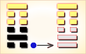
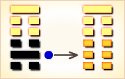
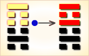
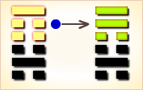
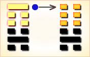

---
hide:
  - navigation
---
# 周易第4卦_蒙卦(山水蒙)_艮上坎下 

<table>
	<tbody>
		<tr>
			<td class="td1">
				</td>
			<td class="td1">
				</td>
			<td class="td1">
				</td>
			<td class="td1">
				</td>
		</tr>
		<tr>
			<td style="text-align: center;">
				<strong>本卦</strong></td>
			<td style="text-align: center;">
				<strong>互卦</strong></td>
			<td style="text-align: center;">
				<strong>错卦</strong></td>
			<td style="text-align: center;">
				<strong>综卦</strong></td>
		</tr>
		<tr>
			<td style="text-align: center;">
				<a href="" style="text-decoration: none;">第4卦：蒙卦(山水蒙)</a></td>
			<td style="text-align: center;">
				<a href="../24.地雷复" style="text-decoration: none;">第24卦：复卦(地雷复)</a></td>
			<td style="text-align: center;">
				<a href="../49.泽火革" style="text-decoration: none;">第49卦：革卦(泽火革)</a></td>
			<td style="text-align: center;">
				<a href="../03.水雷屯" style="text-decoration: none;">第3卦：屯卦(水雷屯)</a></td>
		</tr>
	</tbody>
</table>

## 周易第四卦详解

**蒙卦原文**

蒙。亨。匪我求童蒙，童蒙求我。初筮告，再三渎，渎则不告。利贞。

象曰：山下出泉，蒙。君子以果行育德。

**白话文解释**

蒙卦：通泰。不是我有求于幼稚愚昧的人，而是幼稚愚昧的人有求于我。第一次占筮，神灵告诉了他。轻慢不敬的再三占筮，轻慢不敬的占筮，神灵就不会告诉他。但还是吉利的卜问。

《象辞》说：上卦为艮，象征山；下卦为坎，象征泉。山下有泉，泉水喷涌而出，这是蒙卦的卦象。君子观此卦象，取法于一往无前的山泉，从而以果敢坚毅的行动来培养自身的品德。

**《断易天机》解**

蒙卦艮上坎下，为离宫四世卦。蒙即蒙昧，主回还往复，疑惑不前，多忧愁过失，乃是凶卦。

**北宋易学家邵雍解**

智慧未开，蒙昧闭塞；犹豫不决，缺乏果断。

得此卦者，智慧犹如童蒙，不辨是非，迷失方向；若能顺贤师良友之教，启其聪明则亨通。

**台湾国学大儒傅佩荣解**

时运：蓄积德行，出而用世。

财运：矿山生意，果决则吉。

家宅：君子居吉；婚姻之始。

身体：驱去邪热，可保平安。

**传统解卦**

这个卦是异卦（下坎上艮）相叠，艮是山的形象，喻止；坎是水的形象，喻险。卦形为山下有险，仍不停止前进，是为蒙昧，故称蒙卦。但因把握时机，行动切合时宜，因此，具有启蒙和通达的卦象。

大象：蒙者，昏而无所见也，故宜「启蒙」。

运势：初时迷惑不知方向，须忍耐待机而动，凡事多听取别人意见，则运可通。

事业：事业开始，混乱无序，危机四伏，以勇敢坚毅的行动可以扭转局面。然而必须接受严格教育，培养这种奋发图强的精神。务必脚踏实地，最忌好高骛远，否则会陷入孤立无援的境地。

经商：务必小心谨慎，不得急功近利，尤其应树立高尚的商业道德，以良好的信誉提高竞争力而取胜。

求名：必须接受良好的基础教育，陶冶情操。且动机纯正，可以达到目的。

婚恋：注意考察对方品德，不可以金钱为诱铒。夫妻需相互宽容、理解。

决策：有时会陷入迷惘困顿的境地，加上胆小、不果断，往往误事。如能接受长辈的教诲，甚至严酷的考验，抛弃疑惧的心理，等待适当时机，必然一帆风顺。

**第四卦的哲学含义 **

蒙卦是教育启蒙的智慧，艮为山，坎为泉，山下出泉。泉水始流出山，则必将渐汇成江河,正如蒙稚渐启，又山下有险，因为有险停止不前，所以蒙昧不明。事物发展的初期阶段，必然蒙昧，所以教育是当务之急，养学生纯正无邪的品质，是治蒙之道。

蒙卦，这个卦是异卦相叠，下卦为坎，上卦为艮。艮是山的形象，喻止；坎是水的形象，喻险。卦形为山下有险，仍不停止前进，是为蒙昧，故称蒙卦。但因把握时机，行动切合时宜;因此，具有启蒙和通达的卦象。

《蒙》卦是《屯》卦这个始生卦之后的第二卦。《序卦》中说：“物生必蒙，故受之以蒙。蒙者，蒙也，特之稚也。”物之幼稚阶段，有如蒙昧未开的状态，在人则是指童蒙。

《象》中这样解释蒙卦：山下出泉，蒙；君子以果行育德。

## 周易第四卦初九爻详解

**初六爻辞**

初六。发蒙，利用刑人，用说桎梏。以往，吝。

象曰：利用刑人，以正法也。

**白话文解释**

初六：启蒙教育，教育学生开发生产，教师用受刑之人作榜样，给犯人脱去手铐脚镣。往前走有困难。

《象辞》说：以刑罚惩治罪人是有利的，可以以此来整肃法纪。

**北宋易学家邵雍解**

凶：得此爻者，多有官诉，亲朋不和，多争斗，终能脱解。做官的为教育之职，或为司法系统之职。

**台湾国学大儒傅佩荣解**

时运：求荣反辱，收敛自己。

财运：避免兴讼，得理即止。

家宅：谨慎持家；可能罢婚。

身体：恐有外伤。

**初六变卦**

初六爻动变得周易第41卦：山泽损。这个卦是异卦（下兑上艮）相叠。艮为山；兑为泽。上山下泽，大泽浸蚀山根。损益相间，损中有益，益中有损。二者之间，不可不慎重对待。损下益上，治理国家，过度会损伤国基。应损则损，但必量力、适度。少损而益最佳。

**初九爻的哲学含义 **

蒙卦第一爻，爻辞：初六：发蒙，利用刑人，用说桎梏。以往吝。

初六：发蒙，利用刑人，用说桎梏。以往吝。爻辞释义

刑人：刑是“型”的古文，就是古代制造陶器用的坯模或铸器用的沙范，“刑”在这里可以理解为规范、强行引正，是一种教育。桎梏：木制刑具。说：同“脱”。

本爻辞的意思是说：启发蒙昧，适宜向人们宣传刑罚规定，以此来规范人们的行为，借此教育人们不去做违法犯罪之事，脱离那些桎梏之苦。如果有人不专心学习这些就前去行事，将来会陷入困难。

从卦象上看，初六这一爻以阴爻居于刚位，失位。而且没有居中，属于失中，做事冒进，不守正道，像不太懂事的孩子一样乱闯乱动。初六上承九二，九二像师长一样，对其严加管束，适时惩戒，使其走上正道。这样长大后就会遵纪守法，摆脱牢狱之灾。否则，若是任其发展，日后会铸成大错而后悔不及。

初六这一爻启示的是教育人的一种方法，可以说是榜样的作用，但是采用的是榜样的对立一面：坏典型的作用，由此来警醒人们。比如为了教育人不要违法，向他们宣讲法律法规，还让他们去看一看违法犯罪之人的下场，对他们说道：“如果你一旦犯法，就会像他们一样，戴上手铐脚镣。”通过这种方式，劝诫人们遵纪守法。

## 周易第四卦九二爻详解

**九二爻辞**

九二。包蒙吉。纳妇吉。子克家。

象曰：子克家，刚柔接也。

**白话文解释**

九二：教育包容，这是吉兆。筮遇此爻，娶迎妻子，吉利。男女能相配成家。

《象辞》说：男女相配成家，因为九二、六三两爻相近，表示阴阳刚柔相交会。

**北宋易学家邵雍解**

吉：得此爻者，人情和合，百事有成，或结婚，或生子孙，有财有福。做官的会守住官职。

**台湾国学大儒傅佩荣解**

时运：有财有福，子可继业。

财运：广纳财物，售至外地。

家宅：妻贤子孝，可振家业。

身体：柔软体操。

**九二变卦**

九二爻动变得周易第23卦：山地剥。这个卦是异卦（下坤上艮）相叠。五阴在下，一阳在上，阴盛而阳孤；高山附于地。二者都是剥落象，故为“剥卦”。此卦阴盛阳衰，喻小人得势，君子困顿，事业败坏。

## 周易第四卦九三爻详解详解

**六三爻辞**

六三。勿用娶女，见金夫，不有躬。无攸利。

象曰：勿用娶女，行不顺也。

**白话文解释**

六三：不要抢劫女子为婚，会遭到武装者的抵抗，丢掉性命，没有什么好处。

《象辞》说：不能聘娶女子，六三之爻居于九二之上，这是以柔乘刚之象，象征着以女虐男，这是悖逆不顺的。

**北宋易学家邵雍解**

凶：得此爻者，会生是非，小则破财，大则伤身。做官的会因为贪婪而自取其辱。

**台湾国学大儒傅佩荣解**

时运：见财忘义，声名破败。

财运：小则破财，大则伤身。

家宅：妻强夫弱，恐有不安；不宜婚嫁。

身体：小心饮食。

**六三变卦**

六三爻动变得周易第18卦：山风蛊。这个卦是异卦（下巽上艮）相叠，与随卦互为综卦。蛊本意为事，引申为多事、混乱。器皿久不用而生虫称“蛊”，喻天下久安而因循、腐败，必须革新创造，治理整顿，挽救危机，重振事业。

**九三爻的哲学含义 **

六三：勿用取女，见金夫，不有躬。无攸利。爻辞释义

取：娶。不有躬：失身。

本爻辞的意思是说：不要娶这样的女子。她见到有钱人，就会失身。娶她是没有任何好处的。

从卦象上看，六三属于阴爻居于阳位，失位，而且不能居中。此爻的断语是“无攸利”，指没有任何利益。娶一个拜金的女子，遇到有钱的男人就自失其身的女人，对婚姻是有害无益的。妻子对孩子的影响很大，一个不贤惠的妻子，会把家庭搞得一团糟，这对孩子的成长会产生不良的影响，所以是“无攸利”的。

《象》曰：“勿用取女”，行不顺也。解释过来就是：“不能娶这个女子”，主要是指这个女子的行为是不合乎礼仪的，即这个女子没有受过良好的启蒙教育。所以在娶妻时，注意要娶受到教育或有好的家教的女子。

占得此卦者，若是搞教育的老师或是父母，要注意自己学生或孩子的早恋问题。

## 周易第四卦九四爻详解详解

**六四爻辞**

六四。困蒙，吝。

象曰：困蒙之吝，独远实也。

**白话文解释**

六四：教育脱困，太可惜。

《象辞》说：为蒙昧无知所困扰，因为离群索居，远离生活。

**北宋易学家邵雍解**

凶：得此爻者，人情淡薄，经营受阻。静无灾，动有损。做官的因为无人赏识而难以晋升。

**台湾国学大儒傅佩荣解**

时运：远水近火，无济于事。

财运：缺乏资本，难免穷困。

家宅：地处偏僻，生活困苦。

身体：体质虚弱，阴寒之症。

**六四变卦**

六四爻动变得周易第64卦：火水未济。这个卦是异卦（下坎上离）相叠。离为火，坎为水。火上水下，火势压倒水势，救火大功未成，故称未济。《周易》以乾坤二卦为始，以既济、未济二卦为终，充分反映了变化发展的思想。

**九四爻的哲学含义 **

蒙卦第四爻，爻辞：六四：困蒙，吝。

六四：困蒙，吝。爻辞释义

本爻辞的意思是：困在蒙昧之中，有困难。

屯卦第四爻人生启示

蒙卦之中，包括两种类型的人，一种是启蒙者，一种是蒙昧的人。阳爻所代表的是启蒙者，而阴爻所代表的则是蒙昧的人。我们看六四这一爻，虽然它是阴爻占柔位，属于得位，但是看看它上下，全都是阴爻，而它远离了九二和上九两个阳爻，困于蒙昧之中，求告无门，无法行动，所以陷入困难之中。四爻上下全是阴爻，同性相斥，并且处于艮卦的下面像被一座山压着，自然难逃被困的命运了。在蒙卦中，阴爻代表蒙昧，六四被同性所困，不能与阳爻相合相应，所以被困。不过由于六四得位，所以不会有凶险，只是有些忧吝。

## 周易第四卦九五爻详解详解

**六五爻辞**

六五。童蒙，吉。

象曰：童蒙之吉，顺以巽也。

**白话文解释**

六五：教育少年儿童，吉利。

《象辞》说：幼稚蒙昧的人之所以吉利，是因为柔顺服从。

**北宋易学家邵雍解**

吉：得此爻者，依附贵人、良师者百事顺遂，谋望可成。

**台湾国学大儒傅佩荣解**

时运：功名未成，得良师则吉。

财运：无法独立，须靠人经营。

家宅：幼年定亲。

身体：听人指导锻炼。

**六五变卦**

六五爻动变得周易第59卦：风水涣。这个卦是异卦（下坎上巽）相叠。风在水上行，推波助澜，四方流溢。涣，水流流散之意。象征组织和人心涣散，必须用积极的手段和方法克服，战胜弊端，挽救涣散，转危为安。

**九五爻的哲学含义 **

爻辞释义

这句爻辞的意思是说：启蒙教育要及早实行，要针对蒙童的缺点，先发制人。不要等到蒙童的问题彻底暴露再去教育，而要防患于未然，事先进行启蒙教

《象》曰：“利用御宼”，上下顺也。也就是说到了孩子教育的问题，启蒙教育要及早实行，要针对蒙童的缺点，先发治人。孩子小时候是一张白纸，如果你不给他打上好的色彩，他很容易被其他颜色污染。孩子如果教育不好，类似于贼宼一样的思想可能会影响他，把他带坏，他成了像贼宼一样危害社会的人。如果教育得当，把正义的思想教授给他，他可能就会成为抵制贼宼的、有利于社会的好人。

## 周易第四卦上九爻详解详解

**上九爻辞**

上九。击蒙。不利为寇，利御寇。

象曰：利用御寇，上下顺也。

**白话文解释**

上九：教育击打，不应当作匪寇，而要抵御匪寇。

《象辞》说：有利于防御盗寇，因为上九阳爻居于一卦之首，说明臣下顺从拥戴。防御盗寇之举，获得众人支持，必能胜利。

**北宋易学家邵雍解**

平：得此爻者，宜守旧，须谨防争讼，寇盗之扰。做官的会有司寇之名职。

**台湾国学大儒傅佩荣解**

时运：宜守不宜攻，与人和睦。

财运：顺取为宜，买卖相洽。

家宅：妇道贵顺，家道和平。

身体：保养为宜。

**上九变卦**

上九爻动变得周易第7卦：地水师。这个卦是异卦（下坎上坤）相叠。“师”指军队。坎为水、为险；坤为地、为顺，喻寓兵于农。兵凶战危，用兵乃圣人不得已而为之，但它可以顺利无阻碍地解决矛盾，因为顺乎形势，师出有名，故能化凶为吉。

**上九爻的哲学含义 **

蒙卦第六爻，爻辞：上九：击蒙，不利为宼，利御宼。

上九：击蒙，不利为宼，利御宼。爻辞释义

这句爻辞的意思是说：启蒙教育要及早实行，要针对蒙童的缺点，先发制人。不要等到蒙童的问题彻底暴露再去教育，而要防患于未然，事先进行启蒙教

《象》曰：“利用御宼”，上下顺也。也就是说到了孩子教育的问题，启蒙教育要及早实行，要针对蒙童的缺点，先发治人。孩子小时候是一张白纸，如果你不给他打上好的色彩，他很容易被其他颜色污染。孩子如果教育不好，类似于贼宼一样的思想可能会影响他，把他带坏，他成了像贼宼一样危害社会的人。如果教育得当，把正义的思想教授给他，他可能就会成为抵制贼宼的、有利于社会的好人。