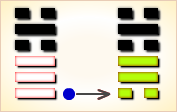
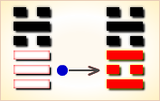
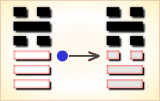
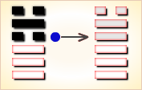
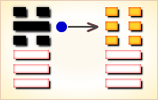
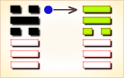

---
hide:
  - navigation
---
# 周易第5卦_需卦(水天需)_坎上乾下 

<table>
	<tbody>
		<tr>
			<td class="td1">
				</td>
			<td class="td1">
				</td>
			<td class="td1">
				</td>
			<td class="td1">
				</td>
		</tr>
		<tr>
			<td style="text-align: center;">
				<strong>本卦</strong></td>
			<td style="text-align: center;">
				<strong>互卦</strong></td>
			<td style="text-align: center;">
				<strong>错卦</strong></td>
			<td style="text-align: center;">
				<strong>综卦</strong></td>
		</tr>
		<tr>
			<td style="text-align: center;">
				<a href="" style="text-decoration: none;">第5卦：需卦(水天需)</a></td>
			<td style="text-align: center;">
				<a href="../38.火泽睽" style="text-decoration: none;">第38卦：睽卦(火泽睽)</a></td>
			<td style="text-align: center;">
				<a href="../35.火地晋" style="text-decoration: none;">第35卦：晋卦(火地晋)</a></td>
			<td style="text-align: center;">
				<a href="../06.天水讼" style="text-decoration: none;">第6卦：讼卦(天水讼)</a></td>
		</tr>
	</tbody>
</table>

## 周易第五卦详解

**需卦原文**

需。有孚，光亨，贞吉。利涉大川。

象曰：云上于天，需；君子以饮食宴乐。

**白话文解释**

需卦：抓到俘虏。大吉大利，吉利的卜问。有利于涉水渡河。

《象辞》说：需的上卦为坎，表示云；下卦为乾，表示天。云浮聚于天上，待时降雨是需卦的卦象。君子观此卦象，可以宴饮安乐，待时而动。

**《断易天机》解**

需卦坎上乾下，为坤宫游魂卦。需为踌躇、期待，虽然刚强，但前面有险阻，应当等待，涉大川则利。

**北宋易学家邵雍解**

坎陷当前，遇阻不进；大器晚成，收成在后。

得此卦者，时机尚未成熟，需要耐心等待，急进反会见凶。

**台湾国学大儒傅佩荣解**

时运：时机尚未成熟，耐心等待。

财运：资本未集，无法开张。

家宅：平安是福。

身体：调节饮食，健康有望。

**传统解卦**

这个卦是异卦（下乾上坎）相叠，下卦是乾，刚健之意；上卦是坎，险陷之意。以刚逢险，宜稳健之妥，不可冒失行动，观时待变，所往一定成功。

大象：云登天上而未雨，不能急进，等待时机之象。

运势：智者必须待时而行，急进反见凶险。

事业：关键在于审时度势，耐心等待，事成于安祥，切勿冒险，欲速不达。自己要充满自信，临危不惧，坚守中正，必可化险为夷。情况有利时，仍得居安思危。

经商：行动之初，情况困难，必须以极大的耐心，创造条件和机会，行事光明磊落，观时待变，实现愿望。事情接近成功时，更应小心谨慎，切莫功亏一篑。

求名：时机尚不成熟，应耐心等待。这时应坚定信念，不为闲言流语所动摇，努力丰富自己，再求助可靠的人便可成功。

婚恋：慎重，切不可草率行事，逐渐培养感情，以诚实、热情相待，会发生变故，仍可以有良好的结局。双方都应懂得以柔克刚的道理。

决策：前途光明，有雄心大志，且可实现。为此需要积蓄实力，等待时机，大器晚成。本人具有坚强的意志，冷静的头脑。前进途中会遇到困难和险阻，必须十分谨慎，坦然对待小人的中伤，在灾祸在面前能镇静自若。不轻举妄动，冷静选择方向。为人谦和、坦率，多有他人相助，促使事业成功。当时机成熟后，必然一帆风顺。

**第五卦的哲学含义**

需卦，本卦是异卦相叠，上卦为坎，下卦为乾。乾卦象征天空辽阔，坎卦象征乌云密布。雨水之于传统农业社会而言，是最大的需求，因此用这个意象来表现。古人引申为雨将下，万物皆待，所以叫需。

需，古体字结构是“雨上天下”，从雨而声。如苍天下雨，滋养万物及人。从人的角度看，天下雨，则不易出行耕作，因此在家喝酒吃肉、静待天时。所以，这一卦的基本象征就是等待、不进，还有饮食之义。

需卦位于蒙卦之后，《序卦》之中这样解释道：“物稚不可不养也，故受之以需。需者，饮食之道也。”有所需要，也是有所等待。

《象》曰：云上于天，需;君子以饮食宴乐。

《象》中这段话的意思是说：需卦的卦象是乾(天)下坎(水)上，为水在天上之表象。水汽聚集天上成为云层，密云満天，但还没有下雨，需要等待;君子在这个时候需要吃喝，饮酒作乐，即在等待的时候积蓄力量。

需卦象征等待，启示人们守正待机的道理，属于中上卦。《象》这样评断此卦：明珠土埋日久深，无光无亮到如今，忽然大风吹土去，自然显露有重新。

## 周易第五卦初九爻详解

**初九爻辞**

初九。需于郊，利用恒，无咎。

象曰：需于郊，不犯难行也；利用恒，无咎，未失常也。

**白话文解释**

初九：在郊外等侯，应该照旧等待下去，没有危险。

《象辞》说：在郊外等候，是说不能冒险前进。照旧等待下去，没有危险，这是因为待机而动没有违反正常的原则。

**北宋易学家邵雍解**

平：得此爻者，宜守旧，则无灾祸。做官的须守常职，耐心等待机会。

**台湾国学大儒傅佩荣解**

时运：必须久待，守恒为要。

财运：暂勿投资，货物无损。

家宅：可居郊外。

身体：幽居养病，终无大碍。

**初九变卦**

初九爻动变得周易第48卦：水风井。这个卦是异卦（下巽上坎）相叠。坎为水；巽为木。树木得水而蓬勃生长。人靠水井生活，水井由人挖掘而成。相互为养，井以水养人，经久不竭，人应取此德而勤劳自勉。

**初九爻的哲学含义**

初九：需于郊。利用恒，无咎。爻辞释义

郊：指郊外。初九这一爻选离坎卦，就像远离市中心的郊外一样。

从卦象上看，初九以阳爻居于刚位，得位。其远离上卦坎，也意味着远离危险，所以说是“需于郊”。但是阳爻具有好动、冒进的特性，但是其与九二逆比，必受九二的阻拦，会招来灾祸，所以最好办法就是静等时机。

占得此爻者，现在不宜采取任何行动，应耐心地等待。如果你缺乏耐心，贸然行动，可能就会铸成大错。

等待是很考验人的耐心的，有些人就是因为缺乏耐心，从而错失了机会。有个人到海上出行，不幸乘坐的船遇难，同船的人都被淹死了，他因为奋力地抱住了一根木头，总算保住了性命，漂到了一个小岛上。刚开始时，他满怀信心，等待有船路过，来搭救他。可是等了一个月之后，他再也等不下去了，于是自己用木头搭建筏子，打算过海，可是半路却被淹死了。

等待需要耐心和恒心，占得此卦者，要注意这一点。

## 周易第五卦九二爻详解

**九二爻辞**

九二。需于沙，小有言，终吉。

象曰：需于沙，衍在中也；虽小有言，以终吉也。

**白话文解释**

九二：在沙地上等待，稍微有过错，最后还是吉利的。

《象辞》说：在沙地上等待，沙地软柔难通行，将有延误事机之失，这过失在自身。虽然稍微有过错，最后的结果还是好的。

**北宋易学家邵雍解**

吉：得此爻者，会受到争诉之扰，若能以宽厚待人，则不辩自明。做官的会受到流言的困扰，但最后吉祥。

**台湾国学大儒傅佩荣解**

时运：流言困阻，最后吉祥。

财运：货运不通，无害商业。

家宅：口舌之争。

身体：心胸宽大，自然吉祥。

**九二变卦**

九二爻动变得周易第63卦：水火既济。这个卦是异卦（下离上坎）相叠。坎为水，离为火，水火相交，水在火上，水势压倒火势，救火大功告成。既，已经；济，成也。既济就是事情已经成功，但终将发生变故。

**九二爻的哲学含义**

九二：需于沙，小有言，终吉。爻辞释义

需于沙：待在沙滩之意。小有言：受别人责难。

此爻的意思说：此时有若处于沙滩之中，虽然遭到别人的责难，但这也无大碍，只要坚持，最终能吉利。

从卦象上看，九二以阳爻居于阴位，又得中位，象征刚柔相济善于忍让的君子。九二与九五敌应，与一个卦之中的主要领导为敌，日子必然不好过。但是九二、九三、六四组成了兑卦，兑为喜悦、光明之意，象征着九二会迎来喜悦和光明的日子，只是现在要静等时机，并且忍受别人的闲言碎语。

占得此爻者，还应该继续耐心等待，光明很快就会到来。有人要是讽刺你、挖苦你、指责你，也不要放在心上，不去理会他们。

## 周易第五卦九三爻详解详解

**九三爻辞**

九三。需于泥，致寇至。

象曰：需于泥，灾在外也。自我致寇，敬慎不败也。

**白话文解释**

九三：在泥淖中等待，把强盗招引过来。

《象辞》说：在泥淖中等待，泥淖污秽，环境险恶，灾难就在附近。由自己招致了强盗，但郑重谨慎，随机应变，就可不受损伤。

**北宋易学家邵雍解**

凶：得此爻者，须防止窃盗之患，亦要预防水险。做官的会被贬职。

**台湾国学大儒傅佩荣解**

时运：难期上达，谨慎自持。

财运：无法流通，小心受骗。

家宅：婚事难成，成则怨偶。

身体：小心外伤。

**九三变卦**

九三爻动变得周易第60卦：水泽节。这个卦是异卦（下兑上坎）相叠。兑为泽，坎为水。泽有水而流有限，多必溢于泽外。因此要有节度，故称节。节卦与涣卦相反，互为综卦，交相使用。天地有节度才能常新，国家有节度才能安稳，个人有节度才能完美。

**九三爻的哲学含义**

九三：需于泥，致宼至。爻辞释义

需于泥：待在泥泽中。

致宼至：招致贼宼的进犯。

此爻的意思是：在泥沼中等待，招来了强盗。

从卦象上看，九三这一爻居下卦之上，紧邻坎水，等于停留在河边的泥沼之中。坎是盗、是险之意，如果继续行动，就会陷入泥沼之中，引来强盗，因为强盗离得不远了。

象曰：需于泥，灾在外也。自我致宼，敬慎不败也。

这句话的意思是说：在泥沼中等待，是因为外面有强盗。由自己招来的强盗，只要恭敬谨慎就不会陷于祸败。

需卦是上坎下乾，乾卦是刚健有力的。占得此爻者，如果做事急躁冒进，就会陷入危险之中。但是，如要恭敬谨慎，就能自保，可立于不败之地。

停留在淤泥中，在淤泥中求食物，处境可就不是很好了。九三爻的上面是坎卦，坎含有贼寇的意思，所以“需于泥”的九三会招致贼寇的侵犯。

## 周易第五卦九四爻详解详解

**六四爻辞**

六四。需于血，出自穴。

象曰：需于血，顺以听也。

**白话文解释**

六四：起初在血泊中滞留，后来从凶险的陷阱中逃脱出来。

《象辞》说：在血泊中滞留，坐等不测的命运降临，六四之爻处在九五之爻的威逼之下，只得顺从强者，听从摆布。

**北宋易学家邵雍解**

平：得此爻者，坏运逐渐远离，恢复平静。做官的能全身而退。从事国学者可出身成名。

**台湾国学大儒傅佩荣解**

时运：用尽心力才可出头。

财运：投资矿业，有利可图。

家宅：乔迁之喜。

身体：调养气血，和顺阴阳。

**六四变卦**

六四爻动变得周易第43卦：泽天夬。这个卦是异卦（下乾上兑）相叠。乾为天为健；兑为泽为悦。泽气上升，决注成雨，雨施大地，滋润万物。五阳去一阴，去之不难，决（去之意）即可，故名为夬（guài），夬即决。

**九四爻的哲学含义**

六四：需于血，出自穴。爻辞释义

需于血：坎卦为血，六四处于此卦之中，而且它下面的三个都是阳爻，会发生阴阳之战，会见血。

出自穴：坎卦还象征着沟渎，代指陷阱或地下之穴。“出自穴”表示逃出洞穴。

需卦是等待的意思，但是在等待的过程中，也要看具体的情况，陷入血泊之中，就应该想办法从凶险中逃脱出来。这时如果还在坐着等待，那就有些愚笨了。遇到特殊情况，就不要坐等噩运的降临。六四属于阴爻，不妨听从强者，依附于强者，顺应客观规律，这样才能化险为夷。好在六四为人谦和，人缘不错，

下与初九有应，又与九三亲比，上承九五之君的帮助，因此能化险为夷。

## 周易第五卦九五爻详解详解

**九五爻辞**

九五。需于酒食，贞吉。

象曰：酒食贞吉，以中正也。

**白话文解释**

九五：在酒宴上等待，这是吉利的占兆。

《象辞》说：有酒有肉，吉利之兆，因为九五之爻处于上卦中位，象征其人有中正的品德，自能择善而居，处优容之境。

**北宋易学家邵雍解**

吉：得此爻者，会物产丰富，衣食不缺，也会有婚嫁之喜。做官的食禄会丰厚。

**台湾国学大儒傅佩荣解**

时运：功成名就，可以宴乐。

财运：投资饮食业，可获利。

家宅：婚嫁得宜。

身体：饮食调理。

**九五变卦**

九五爻动变得周易第11卦：地天泰。这个卦是异卦（下乾上坤）相叠，乾为天，为阳；坤为地，为阴，阴阳交感，上下互通，天地相交，万物纷纭。反之则凶，万事万物，皆对立，转化，盛极必衰，衰而转盛，故应时而变者泰（通）。

** 九五爻的哲学含义**

九五：需于酒食，贞吉。爻辞释义

爻辞的意思是：在享用酒食中等待，正固吉祥。

九五这一爻，是需卦的主爻，以阳爻居于君位，得位持中。

等待是让人焦急的，尤其是处于危险或迷茫之中，前途未卜之时，许多人会吃不下睡不着，整天忧心忡忡，甚至惶恐不安。九五爻则代表人的一种胸怀和境界，处于危难之中，仍旧品尝着酒食，自得其乐。

占得此卦的人，可能最近会出席酒宴，可以保持一颗纯正的心去参加，会通过酒宴达到目的，结局很吉祥。

九五居干君王之位，自然可以享受酒食之乐了。可是必须守正道才会吉祥。古代的帝王们，大多数是因为酒食之乐逐渐走向堕落和腐败的。比如封王，刚登基时是一位极其贤明的天子，可是后来做了一双象牙筷子，干是由一双象牙筷子发展到了酒池肉林，最后越来越奢侈，终于导致了国家的灭亡。所以说，酒食之乐要建立在正道的基础上才会吉祥。

## 周易第五卦上九爻详解详解

**上六爻辞**

上六。入于穴，有不速之客三人来，敬之终吉。

象曰：不速之客，敬之终吉；虽不当位，未大失也。

**白话文解释**

上六：进入地穴式的房屋，有三位不速之客来到，恭敬地接待他们，结果是吉利的。

《象辞》说：不速之客来了，恭敬地接待他们，结果是吉利的。因为全卦阳刚过甚，逼压阴柔，但是上六处阴位，位置合适，所以有惊无险，没有大的损失。

**北宋易学家邵雍解**

平：得此爻者，宜谨慎，则忧愁自散。做官的会有升迁之机会，但须防谗邪之流。

**台湾国学大儒傅佩荣解**

时运：凭险自守，和解为贵。

财运：得价则售，不可贮藏。

家宅：持家有道；少男乃吉。

身体：病况凶险，不存侥幸。

**上六变卦**

上六爻动变得周易第9卦：风天小畜。这个卦是异卦（下乾上巽）相叠，乾为天，巽为风。喻风调雨顺，谷物滋长，故卦名小畜（蓄）。力量有限，须待发展到一定程度，才可大有作为。

**上九爻的哲学含义**

上六：入于穴，有不速之客三人来;敬之，终吉。爻辞释义

不速之客：是指不召自来的客人。三人：古代以三喻多，这里指多人。

这一爻的意思就是：进入洞穴之中，有多位不请自来的客人，尊敬他们，结局会很吉祥。

上六的位置是在坎卦的上爻，坎卦代表洞穴。上六则代表着进入了洞穴。上六是阴爻，而上这一位置是柔位，所以上六属于得位，可以安居于此。

爻辞“入干穴”，也是根据变卦而来的。大壮卦上卦为震为雷，没有“穴”的含义，可是变为需卦后，上卦为坎，坎有“穴”的含义。上六于是有“入于穴”的形象了。“不速之客三人”指的便是下卦的三个阳爻，这三个阳爻以刚健之德跋涉大川，大川便是上面的坎卦，所以上六会遇到这三个不速之客。