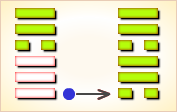
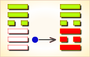
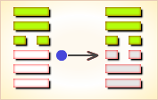
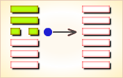
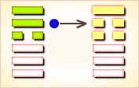
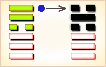

---
hide:
  - navigation
---
# 周易第9卦_小畜卦(风天小畜)_巽上乾下 

<table>
	<tbody>
		<tr>
			<td class="td1">
				</td>
			<td class="td1">
				</td>
			<td class="td1">
				</td>
			<td class="td1">
				</td>
		</tr>
		<tr>
			<td style="text-align: center;">
				<strong>本卦</strong></td>
			<td style="text-align: center;">
				<strong>互卦</strong></td>
			<td style="text-align: center;">
				<strong>错卦</strong></td>
			<td style="text-align: center;">
				<strong>综卦</strong></td>
		</tr>
		<tr>
			<td style="text-align: center;">
				<a href="" style="text-decoration: none;">第9卦：小畜卦(风天小畜)</a></td>
			<td style="text-align: center;">
				<a href="../38.火泽睽" style="text-decoration: none;">第38卦：睽卦(火泽睽)</a></td>
			<td style="text-align: center;">
				<a href="../16.雷地豫" style="text-decoration: none;">第16卦：豫卦(雷地豫)</a></td>
			<td style="text-align: center;">
				<a href="../10.天泽履" style="text-decoration: none;">第10卦：履卦(天泽履)</a></td>
		</tr>
	</tbody>
</table>

## 周易第九卦详解

**小畜卦原文**

小畜。亨。密云不雨，自我西郊。

象曰：风行天上，小畜。君子以懿文德。

**白话文解释**

小畜卦：吉利。在西郊一带浓云密布，但雨没有下来。

《象辞》说：上卦为巽，巽为风；下卦为乾，乾为天，和风拂地，草木低昂，勃勃滋生，这是小畜的卦象。君子观此卦象，取法催发万物的和风，自励风范，推行德教。

**《断易天机》解**

小畜卦巽上乾下，为巽宫初世卦。小畜为小的蓄积、小的阻碍，阳盛而阴不足，以致不得不暂时停顿，但终究还能亨通。

**北宋易学家邵雍解**

力量寡弱，阻止前进；藏器待时，耐心推进。

得此卦者，力量薄弱，运势反覆，宜蓄养实力，静待时机，急进则有险，凡事须耐心推进。

**台湾国学大儒傅佩荣解**

时运：平平无奇，受人牵制。

财运：外表不错，内多耗损。

家宅：小康，须防口舌；娶得淑女。

身体：风火之症；小孩吉，大人凶。

**传统解卦**

这个卦是异卦（下乾上巽）相叠，乾为天，巽为风。喻风调雨顺，谷物滋长，故卦名小畜（蓄）。力量有限，须待发展到一定程度，才可大有作为。

大象：蓄养之量有限，力不从心，故宜忍耐蓄养实力，静待时机。

运势：运势反覆，有口舌之争，但难于短期内解决，须忍耐，静待时机。

事业：时机尚不成熟，应当耐心而积极地积存力量，切不可冒险行动。遇到挫折不可灰心，鼓起勇气战胜困难，坚持原则，加强团结合作，提前做好各项准备，会有所成。

经商：已有一定的基础，但有失去危险，一定要特别慎重，争取与他人真诚合作，共同获利，决不贪心，适可而止，但更不能满足现状，不图进取。

求名：树立远大目标，尽最大努力去争取，虚心求教他人，取得真诚帮助，实现自己的理想，警惕小人的破坏。

婚恋：双方必须十分忠诚，第三者插足的现象极有可能发生。

决策：不很顺利，前进途中会遇到一些意想不到的困难。但由于本人性格坚强，具有战胜不利条件的意志。因此，可以实理自己的理想。但极有可能遭到小人的伤害，必须得到志同道合者的真诚相助，才能可能排除障碍。对所得应满足，适可而止，切不可过度追求，以免满招损。

**第九卦的哲学含义**

小畜卦，这个卦是异卦相叠，下卦为乾，上卦为巽。乾为天，巽为风。喻风调雨顺，谷物滋长，故卦名小畜。畜的本义是田中作物茂聚，引申为积畜，小畜为一点点积畜。因为力量有限，还没有达到大畜的程度，所以须待发展到一定程度，才可大有作为。

小畜卦位于比卦之后，《序卦》之中这样解释道：“比必有所畜，故受之以小畜。”比合在一起一定会有所积蓄，所以接着是小畜卦。

象辞中说“君子以懿文德”，荀爽认为指的是周文王在西岐时还没有做天子，不 能把恩泽、政令施于民，所以只能美化自己的道德。事实上，这一卦应当描述的是周 公摄政的事。周公称王代替年幼的成王治理天下，而其依然自认为是臣民，所以以柔 顺之德居于六四之位，周公的东征，正是为周公之治的兴盛打下了基础，所以周公摄 政东征后，使西周的经济出现了小小的积蓄。

## 周易第九卦初九爻详解

**初九爻辞**

初九。复自道，何其咎？吉。

象曰：复自道，其义吉也。

**白话文解释**

初九：由原路返回，有什么灾祸？吉利。

《象辞》说：由原路返回，其含义是吉利。

**北宋易学家邵雍解**

平：得此爻者，宜守旧业，不宜创新。谋事者，须防猜忌疑惑之祸。做官的会闲位复职。

**台湾国学大儒傅佩荣解**

时运：退守自保，无灾无难。

财运：守稳旧业，不宜创新。

家宅：不求于外，家道自亨。

身体：安静休养，可以复原。

**初九变卦**

初九爻动变得周易第57卦：巽为风。这个卦是同卦（下巽上巽）相叠，巽为风，两风相重，长风不绝，无孔不入，巽亦为顺、谦逊的态度和行为，可无往不利。

**初九爻的哲学含义**

从卦象上看，初九属于阳爻居于刚位，得位。但是其具有刚健冒进的特性，

我们知道，运行的每个天体都有自己的运行轨道，如果按自己的运行轨道来行事，就不会有什么差错，就会和谐而又吉祥。占得此卦者，应该明白这样的道

理，如果你想做自己并不擅长的事，或想转行到其他方面，做自己不熟悉的事情，此时最好不要行动。因为对于你来说，最重要的是回归本位。如果发现自己做了不符合本性的、与自己性格不相符的事，或者是从事自己并不擅长的事，所要做的就是回归，回归到“自道”上。

“复自道”便是回到原来的道路上。

## 周易第九卦九二爻详解

**九二爻辞**

九二。牵复，吉。

象曰：牵复在中，亦不自失也。

**白话文解释**

九二：牵引着返回，吉利。

《象辞》说：牵引着返回，吉利，因为九二之爻处于下卦中位，像人操行中正，自然不会有错失。

**北宋易学家邵雍解**

吉：得此爻者，有人相助，营谋遂意。做官的有升迁之机会。

**台湾国学大儒傅佩荣解**

时运：因人成事，获利大吉。

财运：创业守成，两皆为宜。

家宅：兄弟和睦，家道兴隆。

身体：旧疾复发，小心调养。

**九二变卦**

九二爻动变得周易第37卦：风火家人。这个卦是异卦（下离上巽）相叠。离为火；巽为风。火使热气上升，成为风。一切事物皆应以内在为本，然后伸延到外。发生于内，形成于外。喻先治家而后治天下，家道正，天下安乐。

**九二爻的哲学含义**

从卦象上看，九二这一爻与初九这一爻是相联系的，都是涉及到回归本位的问题。初九是自己意识到而复回本位，九二这一爻则是由于外力或外在的原因，被迫必须要回归本位。比如想出外闯荡，可是父母或家人坚决阻止，这时最好就不要去了。

由此可见，本爻也指携手返回原处，或被强拉硬扯牵引回到原来的位置，吉祥无灾。当你想做某事时，受到劝阻或阻挠，那就放弃吧，回归到本位上，会得到吉祥的。

## 周易第九卦九三爻详解详解

**九三爻辞**

九三。舆说辐，夫妻反目。

象曰：夫妻反目，不能正室也。

**白话文解释**

九三：车子坏了一个轮子。夫妻互相口角。

《象辞》说：夫妻口角，说明不能治理家庭。

**北宋易学家邵雍解**

凶：得此爻者，荣而见辱，进而见退，或有足目之疾，或夫妻反目，或君臣疏远，或朋友是非，血气损伤。

**台湾国学大儒傅佩荣解**

时运：阴盛阳衰，内外不安。

财运：逆向操作，可以获利。

家宅：家庭不和，婚姻不利。

身体：阴阳不察，慎择良医。

**九三变卦**

九三爻动变得周易第61卦：风泽中孚。这个卦是异卦（下兑上巽）相叠。孚本义孵，孵卵出壳的日期非常准确，有信的意义。卦形外实内虚，喻心中诚信，所以称中孚卦。这是立身处世的根本。

**九三爻的哲学含义**

占得此爻者，一定要注意“脱离”、“反目”这两个词。如果开车，则要检查一下车轮，还要准备好备胎。如果已婚，则要注意可能会夫妻反目失和甚至离异，就像车身与车辐相脱离那样。

《象》曰：“‘夫妻反目’，不能正室也。”

《象》中这段话的意思是说：夫妻不合，是因为丈夫不能正确对待妻室的缘故。遇到这样的情况，就要注意处理好夫妻关系。因为这就像车一样，如果车身与车辐脱离，必然会影响前进，各个方面都会受挫。

象辞说“夫妻反目，不能正室也。”便是指出之所以会发生叛乱，是因为身为人 臣者凌驾于君王之上，不能以臣子自居的缘故。这便是周公刚刚摄政时的政治背景。

## 周易第九卦九四爻详解详解

**六四爻辞**

六四。有孚，血去惕出，无咎。

象曰：有孚惕出，上合志也。

**白话文解释**

六四：捕获了俘虏，战争危险暂时消除了，但仍须保持警惕，才能没有灾难。

《象辞》说：捕获了俘虏，保持着警惕，说明尚能统一意志。

**北宋易学家邵雍解**

平：得此爻者，心诚者，人情和合，营谋颇遂。做官的会得到上司的提拔，久任者，能转运。

**台湾国学大儒傅佩荣解**

时运：切忌争斗，出门远避；升迁靠长官提拔。

财运：利西北，不利东南；邻里相助。

家宅：管理得宜，否则受累。

身体：宽解治之，燥烈之药不宜。

**六四变卦**

六四爻动变得周易第1卦：乾为天。这个卦是同卦（下乾上乾）相叠。象征天，喻龙（德才的君子），又象征纯粹的阳和健，表明兴盛强健。乾卦是根据万物变通的道理，以“元、亨、利、贞”为卦辞，表示吉祥如意，教导人遵守天道的德行。

**九四爻的哲学含义**

有孚：是指有诚信。血去：就是远离流血事件。惕出：就是不再恐惧。这句爻辞的意思是说：心怀诚信，就能免去伤害，走出恐惧，没有灾难。

占得此爻之人，可能处于某种选择之中，欲要做事。记住，在做事的时候一定要心怀诚信，这样可以避免流血事件，不会有过失。当然，对于一个领导者来说，除了自己心怀诚信，还要保证部下在做事时也对自己讲诚信才行。

《象》曰：“‘有孚惕出’，上合志也。”意思是说，以诚信取人，脱离恐惧，这是和上级的意志相符合的。由此我们可以得出，要与上级的意志相合，正如陶谦与曹操的意志相合，但是，在执行时，他的部下张与陶谦意志不合，结果事情办砸，陷入了麻烦和恐惧之中。

但是从卦象上看，六四以阴爻居于柔位，得位。其做为近君大臣，对九五谦卑顺从，又能诚信地对待下级，劝阻下卦之中冒进之爻回归本位，所以最终能脱离危险，免除了恐惧。

## 周易第九卦九五爻详解详解

**九五爻辞**

九五。有孚挛如，富以其邻。

象曰：有孚挛如，不独富也。

**白话文解释**

九五：捕获俘虏，串连搁缚，这些财物与邻邑同享。

《象辞》说：捕获俘虏，串连捆缚，财物与邻邑同享，并非一人独享。

**北宋易学家邵雍解**

吉：得此爻者，能得到他人的帮助，百谋称心。做官的会得到上级的赏识，下属的拥戴，德高望重。

**台湾国学大儒傅佩荣解**

时运：一时亨通，无往不利。

财运：百货聚积，自有大利。

家宅：既富且贵，惠及邻里。

身体：手足麻痹之症。

**九五变卦**

九五爻动变得周易第26卦：山天大畜。这个卦是异卦（下乾上艮）相叠。乾为天，刚健；艮为山，笃实。畜者积聚，大畜意为大积蓄。为此不畏严重的艰难险阻，努力修身养性以丰富德业。

**九五爻的哲学含义**

从卦象上看，九五以阳爻居于刚位，是君主之位，持中守正，深得大家的拥护。

九五这句爻辞讲的还是诚信，而且要与大家紧密团结，不可只为自己。这时的诚信要落实在帮助人上。“富以其邻”，就是要让邻居也富起来。

《象》中解释此句云：“有孚挛如，不独富也。”“不独富”也就是要让大家，首先是邻居也富起来。

占得此卦的人，注意在工作或做生意时，不要只考虑自己，也要让别人得到些利益，尤其是要做些帮助亲朋近邻的事情了。要知道，总是想着自己，如果非常富裕，而周围的邻居非常贫困，那么你自己的日子也过不踏实。所以，要注意帮助别人，要注意与身边的人之间相处和谐，并能互惠互利。

## 周易第九卦上九爻详解详解

**上九爻辞**

上九。既雨既处，尚德载。妇贞厉。月几望，君子征凶。

象曰：既雨既处，德积载也。君子征凶，有所疑也。

**白话文解释**

上九：久雨新停，还赶得上栽种作物。妇女占得此爻则凶险。夏历某月十四日君子离家出行也有危险。

《象辞》说：久雨新停，未误农时，当能丰登满载。君子离家出行有凶险，因为对充满危险的旅途缺乏了解。

**北宋易学家邵雍解**

平：得此爻者，会受到小人的骚扰，宜修德养身，不妄进者，则可免灾。妇女占得此爻则凶，君子离家出行有凶险。

**台湾国学大儒傅佩荣解**

时运：长期梦想，终可如愿。

财运：得利则止，切忌过贪。

家宅：前困后亨。

身体：须防营养过多。

**上九变卦**

上九爻动变得周易第5卦：水天需。这个卦是异卦（下乾上坎）相叠，下卦是乾，刚健之意；上卦是坎，险陷之意。以刚逢险，宜稳健之妥，不可冒失行动，观时待变，所往一定成功。

**上九爻的哲学含义**

本爻是小畜积累到最后，盛极而衰。既经降雨，就应当安于现状，不可再贪多无厌，要懂得适可而止的道理。

从卦象上看，上九以阳爻居于阴位，失位，而且不能守持中道，以阴险之德胆大妄为。就像妻子管制丈夫一样，代表着阴很盛。当接近满月时，月亮匹敌太阳;阴盛极时，就与阳抗衡，君子就不得不出走，所以凶。

小蓄这一卦主要是谈要积蓄力量，但是蓄积已经达到极限，蓄积过度丰盛，就将招损。这一爻再以盈满告诫蓄积应当适可而止。

占得此爻者，在夫妻关系上出现了女强男弱的局面。身为女人一定要收敛自己，若是再过于要强，则丈夫有离家出走或离异的可能。