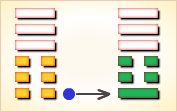
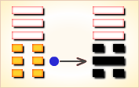
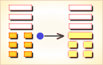
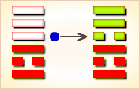
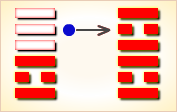
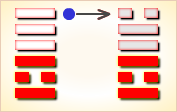

---
hide:
  - navigation
---
# 周易第12卦_否卦(天地否)_乾上坤下 

<table>
	<tbody>
		<tr>
			<td class="td1">
				</td>
			<td class="td1">
				</td>
			<td class="td1">
				</td>
			<td class="td1">
				</td>
		</tr>
		<tr>
			<td style="text-align: center;">
				<strong>本卦</strong></td>
			<td style="text-align: center;">
				<strong>互卦</strong></td>
			<td style="text-align: center;">
				<strong>错卦</strong></td>
			<td style="text-align: center;">
				<strong>综卦</strong></td>
		</tr>
		<tr>
			<td style="text-align: center;">
				<a href="" style="text-decoration: none;">第12卦：否卦(天地否)</a></td>
			<td style="text-align: center;">
				<a href="../53.风山渐" style="text-decoration: none;">第53卦：渐卦(风山渐)</a></td>
			<td style="text-align: center;">
				<a href="../11.地天泰" style="text-decoration: none;">第11卦：泰卦(地天泰)</a></td>
			<td style="text-align: center;">
				<a href="../11.地天泰" style="text-decoration: none;">第11卦：泰卦(地天泰)</a></td>
		</tr>
	</tbody>
</table>

## 周易第十二卦详解

**否卦原文**

否。否之匪人。不利君子贞。大往小来。

象曰：天地不交，否。君子以俭德辟难，不可荣以禄。

**白话文解释**

否卦：为小人所隔阂，这是不利于君子的占卜，事业也将由盛转衰。

《象辞》说：天地隔阂不能交感，万物咽窒不能畅釜，这是否卦的卦象。君子观此卦象，从而在国家政治否塞之时，应思隐居不仕，以崇尚俭约来躲避灾难，不要以利禄为荣。

**《断易天机》解**

否卦乾上坤下，为乾宫三世卦。否象征闭塞不通，是不吉之兆。否卦中，阴阳不交，是一切都不和谐之象。

**北宋易学家邵雍解**

大往小来，闭塞不通；否极泰来，修德避难。

得此卦者，万物闭塞之象，上下不合，诸事不顺，凡事宜忍，须待时运好转而有为。

**台湾国学大儒傅佩荣解**

时运：诸事不顺，不可妄动。

财运：适宜买入，后可获利。

家宅：勤俭免祸；仳离之象。

身体：气血不通，节制饮食。

**传统解卦**

这个卦是异卦（下坤上乾）相叠，其结构同泰卦相反，系阳气上升，阴气下降，天地不交，万物不通。它们彼此为“综卦”，表明泰极而否，否极泰来，互为因果。

大象：天气上升，地气下降，天地之气不交，主闭塞不通。

运势：上下不和，百事不通，凡事宜忍，须知否极泰来。

事业：陷入逆境，事业处于衰退阶段，多有不顺利。受小人干扰而不得志，多挫折。应坚持正道，勿与小人合流，团结志同道合者，自保以等待时机。保持自信心，戒慎恐惧，形势定会好转，事业终能成功。

经商：遇到强大的竞争对手，处于不利地位，信息不灵造成重大损失。应格外小心谨慎，坚持守势，等待有利时机到来，再努力发展自己的事业。

求名：条件还不成熟，再努力一阵子，并得到他人的帮助，理想可以实现。

婚恋：容易出现节外生枝的事情，甚至发生挫折和变故，双方若都充满信心，好的结果会出现。

决策：本人聪慧，精明，勤奋努力，但不注意人际关系，加上小人的排斥，命运或遭厄运。意志坚强，具有奋斗精神，且克服了不足，尽管付出的代价很高，必能成全事业。

**第十二卦的哲学含义 **

从卦形上看，乾在上，上为天，坤在下，下为地，各在各的位置上，这意味着互不交往，不与外界发生关系，位置固定不变，按着陈规陋习办事。“否”卦是不通畅、阻塞、恶化、贬斥的意思。是自己把自己封闭起来，阻塞了前进的道

否卦是不利君子，小人就要得势，君子将要隐退的趋向。小人挡住了君子的道路，因为坤属于内卦，乾属于外卦，有小人主内政，君子靠外，小人得势，君子受排斥之像。

否卦位于泰卦之后，《序卦》之中这样解释道：“物不可终通，故受之以否。”永远通达是不可能的，所以会有阻塞，所以接下来讲的就是否卦。

《象》曰：天地不交，“否”；君子以俭德辟难，不可荣以禄。

《象》中指出：否卦的卦象为坤（地）下乾（天）上，为天在地上之表象。天在极高之处，地在极低之处，天地阴阳之间因而不能互相交合，所以时世闭塞不通，这时候君子必须坚持勤俭节约的美德，以避开危险与灾难不能谋取高官及丰厚的俸禄，去追求荣华富贵。否卦象征闭塞，属于中中卦。《象》中这样来断此卦：虎落陷坑不堪言，进前容易退后难，谋望不遂自己便，疾病口舌事牵连。

## 周易第十二卦初九爻详解

**初六爻辞**

初六。拔茅茹，以其汇，贞吉，亨。

象曰：拔茅贞吉，志在君也。

**白话文解释**

初六：连根拔掉茅草，及其同类，占得此爻则吉利，亨通。

《象辞》说：连根拔掉茅草，占得此爻吉利，比喻其志在清理君侧，为国尽忠。

**北宋易学家邵雍解**

平：得此爻者，宜守旧，小人得势之时，爻辞虽好，但须谨防小人牵连之事。做官的受职者待缺，当权者防扰。

**台湾国学大儒傅佩荣解**

时运：合伙谋事，家有吉祥。

财运：新设商业，用人谨慎。

家宅：亲戚同住；可以照应。

身体：传染之症，但无大碍。

**初六变卦**

初六爻动变得周易第25卦：天雷无妄。这个卦是异卦（下震上乾）相叠。乾为天为刚为健；震为雷为刚为动。动而健，刚阳盛，人心振奋，必有所得，但唯循纯正，不可妄行。无妄必有获，必可致福。

** 初九爻的哲学含义 **

初六：拔茅茹，以其汇，贞吉，亨。爻辞释义

茹：指根，为根茎相连的样子。以：同“及”。汇，种类。

此爻辞的意思是：连根拨掉茅草，及其同类。结果是吉祥的，亨通。

否卦初六爻辞与泰卦初六爻辞极为相近，泰卦是：初九：拔茅茹，以其汇。

征，吉。否卦是：初六，拔茅茹，以其汇，贞吉，亨。

初六为阴爻居于阳位，位不正。处在这个位置，很难实现自己的报负，所以不可“征”只宜“贞”。但是，初六阴爻虽于阳位，但是与九四有应，这指其与上层权势人物有关系，所以只要安分守己、与上级保持一致，就可平安通达。

占得此卦者，要知道自己所处的环境非常不利，不可有所动作，但是，你要注意去结交朋友，不吝惜钱财而结交真心的朋友，在你需要的时候，他们才会全力以赴地帮助你。在这种闭塞不通的时候，不可盲目前进，要引退而守持正道，这样才能吉祥亨通。

## 周易第十二卦九二爻详解

**六二爻辞**

六二。包承，小人吉；大人否，亨。

象曰：大人否，享，不乱群也。

**白话文解释**

六二：厨中有肉，这对老百姓来说是吉利，对贵族来说并不是通泰的表现。

《象辞》说：贵族身处窘境，则能心怀惩戒，使其安守本分。

**北宋易学家邵雍解**

平：得此爻者，宜忍耐，宽容待人，不然会生是非。做官的宜低调行事。

**台湾国学大儒傅佩荣解**

时运：宽容待人，万事皆吉。

财运：买卖皆利，讼则上诉。

家宅：老人有疾无害。

身体：修身养性。

**六二变卦**

六二爻动变得周易第6卦：天水讼。这个卦是异卦（下坎上乾）相叠。同需卦相反，互为“综卦”。乾为刚健，坎为险陷。刚与险，健与险，彼此反对，定生争讼。争讼非善事，务必慎重戒惧。

** 九二爻的哲学含义 **

六二：包承，小人吉；大人否，亨。爻辞释义

这句爻辞的意思是：阿谀奉承有权势的人，小人因此获得吉祥；大人物安于闭塞，是吉利的。

六二是阴爻居柔位，属于得位，又处于下卦的中位，持中。由于其柔顺安守，很容易被小人拉拢，作为其同党。这时若是小人，肯定会归附过去；若是君子，则避而远之。

## 周易第十二卦九三爻详解详解

**六三爻辞**

六三。包羞。

象曰：包羞，位不当也。

**白话文解释**

六三：厨中有美味。

《象辞》说：心怀羞愧，因为才德不称其位。

**北宋易学家邵雍解**

凶：得此爻者，须防是非争诉之扰。做官的会退休离职。

**台湾国学大儒傅佩荣解**

时运：谨慎自守，以避羞辱。

财运：用人不当，暗中损耗。

家宅：行为不检，家门有羞。

身体：寒中带热，远求良医。

**六三变卦**

六三爻动变得周易第33卦：天山遁。这个卦是异卦（下艮上乾）相叠。乾为天，艮为山。天下有山，山高天退。阴长阳消，小人得势，君子退隐，明哲保身，伺机救天下。

**九三爻的哲学含义 **

六三：包羞。爻辞释义

这句爻辞的意思是：忍受羞辱。

“包羞”一词指的是包藏羞辱。占得此卦的人，应该远离小人。如果必须要与小人共事，也要容忍他人对自己的羞辱，将羞辱包藏在心中，违心地侍奉着小人或达官贵人。

六三这一爻是阴爻居于阳位，失位，又不是处于中位。《象》曰：“包羞”，位不当也。就是说招致羞辱，是因为此时处的位置不正。

占得此爻者，因为位置不当，会遭受羞辱，但是要隐藏于心，不要表现出来。最好能不计较别人的态度，埋头于自己的工作。要调整好自己的情绪，修订或重新制定自己的计划。如果你负责一个团队，就要重新调整内部与外部的关系，使其和谐共处。

这里讲了时代变坏的一个现象，就是人们不再有廉耻心，男女之间会有淫乱邪恶的事情发生。为什么在六三只写了这两个爻辞呢？因为乾卦为阳，坤卦为阴，六三处于阴阳相接处，有男女授受之象，所以会“羞”六三阴爻居于阳位又不得中，紧临九四，九四与六三处于全卦的中部，所以有“包”的形象。这里是说六三小人媚上欺下，不知廉耻，所以说“包羞”。

## 周易第十二卦九四爻详解详解

**九四爻辞**

九四。有命无咎，畴离祉。

象曰：有命无咎，志行也。

**白话文解释**

九四：君王有赏赐之命，没有灾害，谁能得到赏赐呢?

《象辞》说：君王有赏赐之命，没有灾害，说明君王论功行赏，臣下尽职效力，各行其志。

**北宋易学家邵雍解**

吉：得此爻者，家产日增，吉庆安乐。做官的会得到朋友和同僚之助，或升迁，或进财。

**台湾国学大儒傅佩荣解**

时运：好运来到，谋事可成。

财运：打定主意，转亏为盈。

家宅：家运转吉。

身体：体质尚强。

**九四变卦**

九四爻动变得周易第20卦：风地观。这个卦是异卦（下坤上巽）相叠，风行地上，喻德教遍施。观卦与临卦互为综卦，交相使用。在上者以道义观天下；在下者以敬仰瞻上，人心顺服归从。

**九四爻的哲学含义 **

九四：有命，无咎，畴尚祉。爻辞释义

畴：同“俦”，是指同类或众人。离：同“丽”，附丽或依附。

本爻的意思是：有所受命，没有灾难，众人依附而得福。

占得此爻者，意味着经过一段时间的隐忍，运气逐渐转好了，可以开始一展身手了。如果你原来的事业因为小人当道而停止不前，现在可以回到它原来的轨道了。如果你是农民，可以耕种自己的土地，如果有机会可以承包其他土地，自可以放心地去承包。如果你是职员，发现有更好的工作机会，可以离开现有的公司，去谋求更好的发展。当然，你所要做的事必须是正当的，对他人和社会有益的。你要寻找志同道合的人，大家相互依附，这样会谋求到幸福。

## 周易第十二卦九五爻详解详解

**九五爻辞**

九五。休否，大人吉；其亡其亡，系于苞桑。

象曰：大人之吉，位正当也。

**白话文解释**

九五：警戒覆亡，贵族王公如此存心则吉利。危险呵，危险，国家命运好像系在柔弱的苞草、桑枝上一样。

《象辞》说：**九五爻辞**讲贵族王公安不忘危，则吉利。因为九五之爻居上卦中位，像其人忧国忧君，才德正当其位。

**北宋易学家邵雍解**

吉：得此爻者，旧祸已去，好运将至，诸事皆吉。做官的会身居重位。

**台湾国学大儒傅佩荣解**

时运：安不忘危，诸事皆吉。

财运：机会尚佳，慎选伙伴。

家宅：祖业深厚。

身体：小心保养。

**九五变卦**

九五爻动变得周易第35卦：火地晋。这个卦是异卦（下坤上离）相叠。离为日，为光明；坤为地。太阳高悬，普照大地，大地卑顺，万物生长，光明磊落，柔进上行，喻事业蒸蒸日上。

**九五爻的哲学含义 **

九五：休否，大人吉；其亡其亡，系于苞桑。

九五这一爻是君主之位，而且是阳爻居阳位，很得势。《象》曰：“大人之吉”，位正当也。

这就是说，之所以出现了“大人之吉”，说明此时处于居中位置，合适得当。否卦到这里，其闭塞、小人当道的局面彻底结束了。德高势重的大人物获得吉祥，重新当政。否定的阻力少了，遇到的困难也开始减少了。这个时候，一定警惕自满的情绪产生。而且，大人物是从闭塞的局面里走出来的，一定要居安思危，防止再发生类似的事情。不管形势怎样缓和、有利，都不能掉以轻心。

## 周易第十二卦上九爻详解详解

**上九爻辞**

上九。倾否，先否后喜。

象曰：否终则倾，何可长也。

**白话文解释**

上九：短暂的恶运，先遇恶运后交好运。

《象辞》说：恶运快终了，好运岂迢遥。命运交变之际，什么力量可以制止呢？

**北宋易学家邵雍解**

平：得此爻者，将会转好运，久困者利可期，久讼者讼事解。做官的失职者复职，闲缺者会走马上任。

**台湾国学大儒傅佩荣解**

时运：亨通如意，讼事可结。

财运：秋冬有利，春夏不利。

家宅：迁居大吉。

身体：即可病愈，须防复发。

**上九变卦**

上九爻动变得周易第45卦：泽地萃。这个卦是异卦（下坤上兑）相叠。坤为地、为顺；兑为泽、为水。泽泛滥淹没大地，人众多相互斗争，危机必四伏，务必顺天任贤，未雨绸缪，柔顺而又和悦，彼此相得益彰，安居乐业。萃，聚集、团结。

**上九爻的哲学含义 **

否卦发展到上九，闭塞不通的局面已经到了尽头，物极必反，否塞必然转为通泰，这就是人们常说的“否极泰来”。占得此爻者，大有苦尽甘来之象。

否卦卦辞告诉人们处于这种时期应当隐藏，而爻辞则是告诉人们怎样隐藏真意而用行动驱除小人的势力。其中需要审时度势，又需要机智与勇气，能够懂得否泰的道理，将会使人受益匪浅。