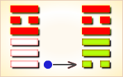
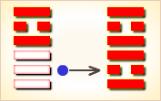
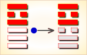
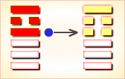
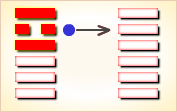
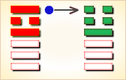

---
hide:
  - navigation
---
# 周易第14卦_大有卦(火天大有)_离上乾下 

<table>
	<tbody>
		<tr>
			<td class="td1">
				</td>
			<td class="td1">
				</td>
			<td class="td1">
				</td>
			<td class="td1">
				</td>
		</tr>
		<tr>
			<td style="text-align: center;">
				<strong>本卦</strong></td>
			<td style="text-align: center;">
				<strong>互卦</strong></td>
			<td style="text-align: center;">
				<strong>错卦</strong></td>
			<td style="text-align: center;">
				<strong>综卦</strong></td>
		</tr>
		<tr>
			<td style="text-align: center;">
				<a href="" style="text-decoration: none;">第14卦：大有卦(火天大有)</a></td>
			<td style="text-align: center;">
				<a href="../43.泽天夬" style="text-decoration: none;">第43卦：夬卦(泽天夬)</a></td>
			<td style="text-align: center;">
				<a href="../08.水地比" style="text-decoration: none;">第8卦：比卦(水地比)</a></td>
			<td style="text-align: center;">
				<a href="../13.天火同人" style="text-decoration: none;">第13卦：同人卦(天火同人)</a></td>
		</tr>
	</tbody>
</table>

## 周易第十四卦详解

**大有卦原文**

大有。元亨。

象曰：火在天上，大有。君子以遏恶扬善，顺天休命。

**白话文解释**

大有卦：昌隆通泰。

《象辞》说：本卦下卦为乾为天，上卦为离为火，火在天上，明烛四方，这是大有的卦象。君子观此卦象，取法于火，洞察善恶，抑恶扬善，从而顺应天命，祈获好运。

**《断易天机》解**

大有卦离上乾下，为乾宫归魂卦。大有卦为柔得尊位，抑恶扬善，丰财利义，象征天命所归，得人心，因此主吉。

**北宋易学家邵雍解**

日丽中天，遍照万物；盛大富有，持盈保泰。

得此卦者，正当好运，事事吉祥，大有收获，但需防物极必反，盛极转衰。

**台湾国学大儒傅佩荣解**

时运：亨通无比，大放异彩。

财运：放手去做，财富自来。

家宅：积善之家，子孙保之。

身体：虚火上升，小心诊治。

**传统解卦**

这个卦是异卦（下乾上离）相叠。上卦为离，为火；下卦为乾，为天。火在天上，普照万物，万民归顺，顺天依时，大有所成。

大象：太阳在天，遍照大地万物，但五阳争一阴，须知有盈即缺。

运势：得时得运，昌荣大吉，但防物极必反，盛极而衰。

事业：事业已经取得一定的成就，最忌得意忘形，胡作非为。务必止恶扬善，坚守中正，交往正直的朋友，戒惧谨慎，兢兢业业，真正做到大而不盈，满而不溢，事业可望迈上新的台阶。

经商：兴隆昌盛，已摆脱困难状态，进入兴旺发达的阶段，如能克制贪财的心理，确守诚信原则，公平待人，克勤克俭，尤其应时刻注意市场动向，适时转轨，可望长久。

求名：已经小有名气，切勿就此满足，停顿不前，尤其不可陷入世俗圈内，应继续努力，在真正朋友的帮助下，更上一层楼。

婚恋：条件优越，可供选择者多，以慎重为好。对于家庭双方应尽力维护。

决策：性格坚强，勇于战胜困难，奋斗向上，前进途中困难和厄运很多，唯有认真对待才能不断取得成功，如放松警惕，骄傲自满，将带来惨重失败。朋友很多，交际广泛，对事业很有帮助，但其中也有拆台的小人。

**第十四卦的哲学含义**

	大有这一卦是异卦，由乾卦和离卦组成，上卦为离，为火;下卦为乾，为天。火在天上，普照万物，万民归顺，顺天依时，大有所成。

	火天大有这一卦，从以下方面的含意而得其名：乾刚健，离光明，以刚健的行为，朝着光明的方向去奋斗，成功就大有希望，就会有所得。乾刚健，为内卦，

	说明美在内心;离光明，为外卦，说明体现在外部的手段光明磊落。具备这种表里一致的美德，才是真正的大有。

	火天大有卦位于同人卦之后，《序卦》中这样解释道：“与人同者，物必归焉，故受之以大有。”寻找到志同道合的人，大家齐心协力做事，物产自然丰富起来，所以接下来就是大有了。

	《象》曰：火在天上，“大有”;君子以遏恶扬善，顺天休命。

	这句话的意思是说，大有卦的卦象是乾(天)下离(火)上，为火在天上之表象。火焰高悬于天上，象征太阳照耀万物，世界一片光明，农业大丰收，“大有收获”。“顺天休命”，“顺”就是服从的意思;“休”有顺其自然的意思。

	有道之士在“大有”的时候所作的事就是只需要顺服“天道”;不必过多地操心自己的命运。君子在这个时候要阻止邪恶，颂扬一切善行，顺应天命，替天行道，以保护万物性命。所以一定要注意遏恶扬善，顺天休命。

	大有卦启示的是顺天依时的道理，属于上上卦。象征大有收获，象征富有，从一开始就顺达，昌隆通泰。在占卦时，大有卦属于上上卦，求官得官、求财得财，其间纵有反复，必如所愿。《象》是这样来断此卦：砍树摸雀作事牢，是非口舌自然消，婚姻合伙来费力，若问走失未脱逃。

	大有卦的卦象是上卦为离为火，下卦为乾为天，火着到了天上便是大有卦的卦象。俗话说“众人拾柴火焰高”，大家围在一个火堆旁构成同人卦，可是众人聚在一起每个人给火堆添一把柴便可以让火焰烧到天上去，可见众人团结起来才会有更大的力量，才会有更大的收获。另外，离为日，乾为天，大有卦的卦象还有明日中天的形象。中午的太阳是最亮的，最热的，所以古代常以日中表示事物的鼎盛时期。

## 周易第十四卦初九爻详解

**初九爻辞**

初九。无交害，匪咎；艰则无咎。

象曰：大有初九，无交害也。

**白话文解释**

初九：不要彼此侵害，即没有灾祸，既使处于艰难之中，也没有灾祸。

《象辞》说：大有初九爻辞说，不要彼此侵害。

**北宋易学家邵雍解**

平：得此爻者，心绪不定，小人欺凌，很是艰辛，长辈或有灾难。做官的须急流勇退，不可贪婪荣华富贵。

**台湾国学大儒傅佩荣解**

时运：刻苦自勉，等待好运。

财运：基业初创，慎始无害。

家宅：新富可喜，值得珍惜。

身体：健康无虞，讼事宜解。

**初九变卦**

初九爻动变得周易第50卦：火风鼎。这个卦是异卦（下巽上离）相叠。燃木煮食，化生为熟，除旧布新的意思。鼎为重宝大器，三足稳重之象。煮食，喻食物充足，不再有困难和困扰。在此基础上宜变革，发展事业。

**初九爻的哲学含义**

初九这一爻为同人卦最初始的状态，这一爻属于阳爻居刚位，位正，得势。与“九四”同性相斥，不相应；但也象征他们中间没有私情存在，与人交往的公正与广阔。所以说，是在门外与人交往。虽然没有到达“卦辞”中的“野”那样的大同程度，但已超越在一门之内的狭隘的近亲关系。像这样交往广阔，当然不会有过失。

如果你在做事时，出于公心，不偏私，不护短，那么就能得志同道合的人，来一起开创事业。

走出家门，去与志同道合的人相聚，怎么会有过失呢？有了问题，到外面求众人的帮助，怎么会有过失呢？走出家门，脱离自己的小圈子，到民众中去，怎么会有过失呢？这就是“同人干门，无咎”。在我国古代，一般有了大事，君王不能解决的大事，便要贴皇榜，请天下有能力之人前来解决。

这皇榜一般贴在午门外或城门口，可以使更多的人看到。这就是“同人于门”。

所以说，“同人于门”即有求天下贤人辅佐的意思，又有与民众打成一片的意思。能做到这些，肯定不会有过失的。

## 周易第十四卦九二爻详解

**九二爻辞**

九二。大车以载，有攸往，无咎。

象曰：大车以载，积中不败也。

**白话文解释**

九二：用大车装物载人，有明确的目的地，没有灾祸。

《象辞》说：用大车装物载人，物积于车中不会散失。

**北宋易学家邵雍解**

吉：得此爻者，营谋得利，财利丰厚，但不利于老人的健康。做官的闲职者会受到重用。

**台湾国学大儒傅佩荣解**

时运：正交好运，一路顺风。

财运：国内国际，无不获利。

家宅：可以乔迁。

身体：出外就医，讼事得胜。

**九二变卦**

九二爻动变得周易第30卦：离为火。这个卦是同卦（下离上离）相叠。离者丽也，附着之意，一阴附丽，上下二阳，该卦象征火，内空外明。离为火、为明，太阳反复升落，运行不息，柔顺为心。

**九二爻的哲学含义**

宗：是宗族。吝：偏狭，鄙吝。

从卦象上看，六二属于阴爻居阴位，得位，中正，与“九五”阴阳相应，通常是吉象。但是，在这个同人的卦中，相应代表有私情、私心的存在，这一卦，是在阐扬天下大同的理想世界，需要公正、无私地交往，所以六二与九五相应反而成为不利的关系，因而不相宜。这就像只是在宗族中交往，只是在同姓中交往，有着私心一样。这种宗族和同的态度，虽然不能说错，但也不值得赞扬。这一爻，说明应进一步打破宗族观念，扩大交友的圈子和交往的范围。只与同宗人亲附，会有弊病，行事必然艰难。应该把目光放长远一些，多和外界接触。

《象》曰：“同人于宗”，吝道也。这是告诉人们，不能团结各个阶层的人，是引起麻烦的根源。所以如果你想做事，不要只依赖于同宗族的人。尤其是一些夫妻店、家族企业，处理不好可能会因为利益而互相猜疑，为此伤了亲情。

要打破这个界限，团结上上下下的人，这样对事业会更有利。

## 周易第十四卦九三爻详解详解

**九三爻辞**

九三。公用亨于天子，小人弗克。

象曰：公用亨于天子，小人害也。

**白话文解释**

九三：天子宴请公侯。小人则不能参与。

《象辞》说：天子宴请公侯，（小人不能参与）因为小人参与国政，将是国家的祸害。

**北宋易学家邵雍解**

平：得此爻者，有灾难，举步维艰，勿近小人。做官的会受到重任，读书人会取得很好的成绩。

**台湾国学大儒傅佩荣解**

时运：显荣之时，取贿必败。

财运：名利并至，勿近小人。

家宅：喜庆宴会，须防仆婢。

身体：饮食小心，不可争讼。

**九三变卦**

九三爻动变得周易第38卦：火泽睽。这个卦是异卦（下兑上离）相叠。离为火；兑为泽。上火下泽，相违不相济。克则生，往复无空。万物有所不同，必有所异，相互矛盾。睽即矛盾。

**九三爻的哲学含义**

九三：伏戎于莽，升其高陵，三岁不兴。爻辞释义

伏：指埋伏，潜伏，欲战而不出。戎：指军队，士兵。莽：指荒原草丛，丛林。升：登上。陵：山丘。

本句爻辞的意思是：把军队埋伏在密林草莽之中，占据附近的制高点守望着，过了三年，都不敢贸然出兵。

九三这一爻，从与其他爻的关系来看，可以这样打个比方：六二是阴爻代表女人，九三是阳爻居阳位，而且处于下卦的最上端，代表男人。而全卦之中，最强势的是九五这位，同样是阳爻居阳位，处于君主之位，是比九三更强一个男人。九三是一个小国的首领，一个比自己更强大的外帮首领看中了九三境内的一个美女。为了讨好比自己更强大的外帮首领，打算把这位美女派去和亲，可是九三自己看了这位美女，强行把美女留下来与自己成婚。他担心对方的首领一怒之下前来进犯，而自己又不是人家的对手，所以才出现了爻辞中所描绘的那样，带兵埋伏在林莽之中，时刻警惕着，好在盟国没有来犯，没有发生灾难。

占得此爻者，要注意维持与外界的关系，不要因为一己私利，而将与盟友的关系搞得剑拔弩张，让自己费尽了精力，给自己带来了恐惧与不安。

埋伏兵甲于草莽中，三年都不敢与敌人进行正面的交锋，这可真是够谨慎的。可是谨慎总不会犯大错误，虽然伏于草莽中日子清苦，但却可以保存实力。这里讲的可能仍是高宗讨伐鬼方的事情。鬼方是我国古代西北的一个部落。历来我国北部的民族勇猛好战，所以高宗这次征伐最初肯定是出师不利。敌人太强大，怎么办?只能等待时机。伏兵于草莽中，研究新的作战部署，寻找可以一举歼灭敌人的战机。“三年不兴”，其实也就是说三年后始兴。也就是说三年后打败了敌人。这是面对强敌必须采取的战略战术。

## 周易第十四卦九四爻详解详解

**九四爻辞**

九四。匪其彭，无咎。

象曰：匪其彭，无咎，明辩晰也。

**白话文解释**

九四：用曝晒男巫来求雨，旱情严重，但没有灾祸。

《象辞》说：反对坏人坏事没有灾祸，因为明于考察辨析。

**北宋易学家邵雍解**

平：得此爻者，宜守常，则可避免伤害，眼睛方面或会出现病症。做官的须安于现状，不可激进，则可免祸。

**台湾国学大儒傅佩荣解**

时运：持盈保泰，知足不辱。

财运：利益已足，勿再贪求。

家宅：荣美可观，满则招损。

身体：膨胀之症。

**九四变卦**

九四爻动变得周易第26卦：山天大畜。这个卦是异卦（下乾上艮）相叠。乾为天，刚健；艮为山，笃实。畜者积聚，大畜意为大积蓄。为此不畏严重的艰难险阻，努力修身养性以丰富德业。

**九四爻的哲学含义**

同人卦第四爻，爻辞：九四：乘其墉，弗克攻，吉。

占得此爻者，要懂得适时放弃。就像登上城墙准备与敌人开战，却放弃了，这样反而能得到吉祥的结果。

《象》曰：“乘其墉”，义弗克也，其“吉”，则困而反则也。这就是告诉人们说，“准备登城向敌人进攻”，但终于没有进攻，是因为发现这种进攻是不仁义的，这样做能获得吉祥，是因为在困惑时能及时醒悟，反过来能按正确的办法行事。

## 周易第十四卦九五爻详解详解

**六五爻辞**

六五。厥孚交如，威如，吉。

象曰：厥孚交如，信以发志也；威如之吉，易而无备也。

**白话文解释**

六五：来犯之敌被紧紧捆绑，严厉惩罚，吉利。

《象辞》说：其人诚信坦白，因为他以诚信来表现自己的志向。威服众人之所以吉利，因为众人敬畏，则能平安而不困惫。

**北宋易学家邵雍解**

吉：得此爻者，须相时而动，切不可骄傲自负，以免自取其祸。做官的宜退不宜进。

**台湾国学大儒傅佩荣解**

时运：众人信服，晚运亨通。

财运：人和为贵，富有不难。

家宅：一家和睦，须防盗贼。

身体：保持门面。

**六五变卦**

六五爻动变得周易第1卦：乾为天。这个卦是同卦（下乾上乾）相叠。象征天，喻龙（德才的君子），又象征纯粹的阳和健，表明兴盛强健。乾卦是根据万物变通的道理，以“元、亨、利、贞”为卦辞，表示吉祥如意，教导人遵守天道的德行。

**九五爻的哲学含义**

同人卦第五爻，爻辞：九五：同人，先号眺，而后笑，大师克相遇。

《象》中这样解释本爻：同人之先，以中直也；大师相遇，天罔极上遇，言相克也。

这是在说，开始大声痛哭，说明这时内心中正诚信，因不知战事的胜败而焦急痛哭；大军遇到了志同道合者，终于获得了战争的胜利，于是欢笑起来。

在寻找志同道合的人时，肯定会有些阻力，不是轻易就能找到的，你可能为此深深痛苦过。但是只要你不放弃，克服这些阻力，终将会达到目的，露出笑颜。

占得此爻者，当与合作者的谈判正僵持不下时，可能意外地出现一个第三方，使事情向对你有利的方向发展。这个时候，你可以视第三方为“同人”，并想办法扩大自己的战果。

## 周易第十四卦上九爻详解详解

**上九爻辞**

上九。自天祐之，吉无不利。

象曰：大有上吉，自天祐也。

**白话文解释**

上九：上天保祐，吉利，无所不顺利。

《象辞》说：大有是大吉大利之卦，因为得到上天的保祐。

**北宋易学家邵雍解**

吉：得此爻者，得到祖上之庇佑，一路好运。做官的以及读书人会进职成名。

**台湾国学大儒傅佩荣解**

时运：一路好运，事皆吉祥。

财运：百货畅达，自然获利。

家宅：福庆满门。

身体：得神庇佑，或即归天。

**上九变卦**

上九爻动变得周易第34卦：雷天大壮。这个卦是异卦（下乾上震）相叠。震为雷；乾为天。乾刚震动。天鸣雷，云雷滚，声势宏大，阳气盛壮，万物生长。刚壮有力故曰壮。大而且壮，故名大壮。四阳壮盛，积极而有所作为，上正下正，标正影直。

**上九爻的哲学含义**

同人卦第六爻，爻辞：上九：同人于郊，无悔。

上九这一爻是同人卦的最后一爻，属于阳爻居柔位，失位，不得势。而且与九三敌应，距离六二又太远，中间有群阳阻隔，如果强行去与六二结交，必然耗费太多的精力，陷入争乱之中。所以不必争取最佳的状态，不如就近结交，

与“郊”之人合同，可以平静无争地生活。

象曰：“同人于郊”，志未得也。这里指出，“聚合众人于郊外”，显然没有实现自己最初的志向。

占得此爻者，你想做某件事，想结交重要的人或志同道合的人，可是想结交他的人太多，发生内争，你也没有机会去结交，那不如去结交较容易亲近的人。

上九处于乾卦的最外面，乾为郊野，所以此艾有“同人于郊”艾辞。其实在任何一个社会，都有不得志的人。有能力而不得志，只能隐居于平淡之中，这种人可以称之为隐士。上九就是一位隐士，虽然不得志，但是能够与其他隐士一起安守于偏僻的郊区，因为能够守于平淡之中而无非分之想，所以不会发生悔恨的事情。这就如同诸葛亮在《诫外甥》中所言:“夫志当存高远，慕先贤，决情欲，弃凝滞，使庶几之志，揭然有所存，恻然有所感;忍屈伸，去细碎，广咨问，除闲吝，虽有淹了流，何损于美趣，何患于不济。”在平淡之中能做到这些，则自然会成可进，败可守了。