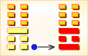
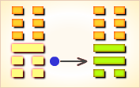
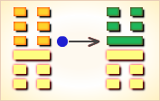
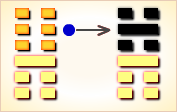
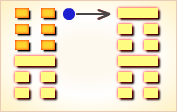

---
hide:
  - navigation
---
# 周易第15卦_谦卦(地山谦)_坤上艮下 

<table>
	<tbody>
		<tr>
			<td class="td1">
				</td>
			<td class="td1">
				</td>
			<td class="td1">
				</td>
			<td class="td1">
				</td>
		</tr>
		<tr>
			<td style="text-align: center;">
				<strong>本卦</strong></td>
			<td style="text-align: center;">
				<strong>互卦</strong></td>
			<td style="text-align: center;">
				<strong>错卦</strong></td>
			<td style="text-align: center;">
				<strong>综卦</strong></td>
		</tr>
		<tr>
			<td style="text-align: center;">
				<a href="" style="text-decoration: none;">第15卦：谦卦(地山谦)</a></td>
			<td style="text-align: center;">
				<a href="../40.雷水解" style="text-decoration: none;">第40卦：解卦(雷水解)</a></td>
			<td style="text-align: center;">
				<a href="../10.天泽履" style="text-decoration: none;">第10卦：履卦(天泽履)</a></td>
			<td style="text-align: center;">
				<a href="../16.雷地豫" style="text-decoration: none;">第16卦：豫卦(雷地豫)</a></td>
		</tr>
	</tbody>
</table>

## 周易第十五卦详解

**谦卦原文**

谦。亨，君子有终。

象曰：地中有山，谦。君子以裒多益寡，称物平施。

**白话文解释**

谦卦：通泰。筮遇此卦，君子将有所成就。

《象辞》说：本卦外卦为坤为地，内卦为艮为山，地中有山，内高外卑，居高不傲，这是谦卦的卦象。君子观此卦象，以谦让为怀，裁取多余昀，增益缺乏的，衡量财物的多寡而公平施予。

**《断易天机》解**

谦卦坤上艮下，为兑宫五世卦。谦为谦逊，内卦艮和外卦坤都是谦虚之象，所以为吉利之卦。

**北宋易学家邵雍解**

谦和忍让，尊人自卑；利用谦虚，万事可达。

得此卦者，吉利平安，步步高升。谦虚忍让者前途大好，骄横者必招败。谦受益，满招损。

**台湾国学大儒傅佩荣解**

时运：眼前平顺，步步高升。

财运：物价合理，利益保障。

家宅：近山之居，合家平安。

身体：内郁之症，放宽心胸。

**传统解卦**

这个卦是异卦（下艮上坤）相叠，艮为山，坤为地。地面有山，地卑（低）而山高，是为内高外低，比喻功高不自居，名高不自誉，位高不自傲。这就是谦。

大象：山应在地面上，而今在地下，代表谦逊之德。

运势：吉利平安，前途无限，但必须去除骄横之气。

事业：尚未被人器重，但因品德高尚，终会为人发现。自己不必有意表现，尤其不可放弃谦虚的美德，埋头苦干，一定会得到他人的帮助，在事业上大有作为。

经商：较为顺利，但不会获暴利，须逐步积累，故应极其小心谨慎，诚心与他人合作，遵守商业道德，通过自己的勤劳努力，取得商业的发展。

求名：天资聪明，但因性格不善于表现自己，起初往往被埋没，自己只要不灰心，继续努力钻研业务，保持谦逊好学精神，更大的成功正在未来。

婚恋：美满的婚姻应由双方共同去努力争取。否则，恋爱不成功，家庭不能和睦。

决策：具有内高外低的谦虚美德，善于团结他人，也能得到别人的帮助，事业很顺利，遇到困难，很快可以化险为夷，有惊无险。由于能够认真吸取别人的长处，进步很快，会畅通无阻，但需要特别注意学业、德业和修养。

**第十五卦的哲学含义**

火天大有这一卦，从以下方面的含意而得其名：乾刚健，离光明，以刚健的行为，朝着光明的方向去奋斗，成功就大有希望，就会有所得。乾刚健，为内卦，

说明美在内心；离光明，为外卦，说明体现在外部的手段光明磊落。具备这种表里一致的美德，才是真正的大有。

火天大有卦位于同人卦之后，《序卦》中这样解释道：“与人同者，物必归焉，故受之以大有。”寻找到志同道合的人，大家齐心协力做事，物产自然丰富起来，所以接下来就是大有了。

《象》曰：火在天上，“大有”；君子以遏恶扬善，顺天休命。

大有卦的卦象是上卦为离为火，下卦为乾为天，火着到了天上便是大有卦的卦象。俗话说“众人拾柴火焰高”，大家围在一个火堆旁构成同人卦，可是众人聚在一起每个人给火堆添一把柴便可以让火焰烧到天上去，可见众人团结起来才会有更大的力量，才会有更大的收获。另外，离为日，乾为天，大有卦的卦象还有明日中天的形象。中午的太阳是最亮的，最热的，所以古代常以日中表示事物的鼎盛时期。

## 周易第十五卦初九爻详解

**初六爻辞**

初六。谦谦君子，用涉大川，吉。

象曰：谦谦君子，卑以自牧也。

**白话文解释**

初六：谦让，再谦让，这才是君子的风度。具有这种品德，即使冒险涉水过河，也是吉利的。

《象辞》说：十分谦让的君子，就是从谦让入手进行自我修养。

**北宋易学家邵雍解**

平：得此爻者，宜远行或出游，出外做生意会发财。做官的须退守，不宜与人争利，出差的机会会多。

**台湾国学大儒傅佩荣解**

时运：不与人争，自可无难。

财运：投资航业，有利可图。

家宅：治家以德，平安和睦。

身体：游泳健身。

**初六变卦**

初六爻动变得周易第36卦：地火明夷。这个卦是异卦（下离上坤）相叠。离为明，坤为顺；离为日；坤为地。日没入地，光明受损，前途不明，环境困难，宜遵时养晦，坚守正道，外愚内慧，韬光养晦。

**初九爻的哲学含义**

从整个卦像看，如果拿积累财富来说，初九属于挣钱初期，处于艰难的创业阶段。在本卦之中，最富有的是六五，初九与六五无正应，无交往，也没有什么伤害。而且，在卦之中，其他爻的位置也都比初九强势，初九不能顶撞，匹配不上。只有小心谨慎地艰苦创业、奋进直追才行。这就好比一个人，本身并不富有，可是周围的人都是有钱有势的人，不要去巴结，不如自己埋头去致富，奋进直追，才能无咎。

除了积累财富之外，本爻也适用于才能、学识、德行、名声等。比如演员，没名气的人，周围都是名星大腕，你不必去与巴结他们，也不必斗气，互相伤害，只是演好自己的戏，锤炼自己的演技，这样你的名气自然就上来了。

《象》曰：大有初九，无交害也。意思是说，此时不互相往来，一动不如一静，就不会有什么是非，自然没有什么祸患了。

## 周易第十五卦九二爻详解

**六二爻辞**

六二。鸣谦，贞吉。

象曰：鸣谦贞吉，中心得也。

**白话文解释**

六二：明智而谦让，卜问得吉兆。

《象辞》说：明智而谦让，心正而吉利，因为六二之爻居下卦中位，像人守中正之道。

**北宋易学家邵雍解**

吉：得此爻者，不宜轻举妄动，宜退守。做官的会升迁，读书人会进取成名。

**台湾国学大儒傅佩荣解**

时运：声名传开，颇为得意。

财运：得人呼应，利益自来。

家宅：家有恒产，亦有善名。

身体：用心过劳之症。

**六二变卦**

六二爻动变得周易第46卦：地风升。这个卦是异卦（下巽上坤）相叠。坤为地、为顺；巽为木、为逊。大地生长树木，逐渐成长，日渐高大成材，喻事业步步高升，前程远大，故名“升”。

**九二爻的哲学含义**

《象》曰：“大车以载”，积中不败也。“积中不败”一一中有所“积”，才能不败。打仗，粮草、弹药、辎重充足，那么就是胜利的保障；考试、应举如果满腹诗书、胸罗万象，必然高中；对于修行道德的人来说，厚德才能载物，“天薄我福，我厚我德以迎之”。

占得此爻者，如果想做某事，要先考量一下自己所“积”，有没有“货”，然后再行动。在财产、才能、道德上都有所积，再去行动，就不会什么过错了。

九二与六五相应，所以有利干前往。去哪里呢？自然是去与六五交往了。“大车以载”是什么意思呢？大有卦是大有收获的意思，九二身为大夫之位，收获自然是不小了，他用大车装着货物去见六五的君王，怎么会有过失呢？前人认为九二爻之所以有“大车”的词句，是因为大有卦是从夬卦变化来的，而夬卦则是由坤一阳复出而逐渐变化过来的。所以九二原为坤卦的下卦之中爻，坤为大车，所以这里也提到“大车”二字。这种解释不是让人很信服，太绕了。如这样变，任何一卦都可以变成大有卦。所以这里的大车是因为人们富裕了，送礼不再小家子气了，用大车盛着礼物去，所以说“大车以载”。

## 周易第十五卦九三爻详解详解

**九三爻辞**

九三。劳谦君子，有终吉。

象曰：劳谦君子，万民服也。

**白话文解释**

九三：勤劳而谦让，这样的人将有好结果，凡事吉利。

《象辞》说：勤劳而谦让的君子，万民敬服。

**北宋易学家邵雍解**

吉：得此爻者，营谋得利，但会劳心劳力。做官的会高升。

**台湾国学大儒傅佩荣解**

时运：劳苦有成，晚运亨通。

财运：基业已成，永保利益。

家宅：持盈保泰，安居乐业。

身体：劳累过度，可能归天。

**九三变卦**

九三爻动变得周易第2卦：坤为地。这个卦是同卦（下坤上坤）相叠，阴性。象征地（与乾卦相反），顺从天，承载万物，伸展无穷无尽。坤卦以雌马为象征，表明地道生育抚养万物，而又依天顺时，性情温顺。它以“先迷后得”证明“坤”顺从“乾”，依随“乾”，才能把握正确方向，遵循正道，获取吉利。

**九三爻的哲学含义**

从卦象上看，九三属于阳爻居于刚位，得位。其居下卦之上，公侯之象。全卦的最高领导为六五，六五能阴爻居君位，有礼贤下士之德，其设宴款待公侯。小人却被排斥在外。

《象》曰：公用亨于天子，小人害也。这里指出，小人如果接受这样的款待，将会放肆僭礼，反而有害。

“用亨于天子”，也指食君禄，就是担任官职。品行端正的君子被授予官职，小人却被排除在外。

占得此卦者，若想求名求职位，一定要注意自己的品行。有时候，道德是自己最好的推荐书，所有的领导或是用人单位，都非常重视这一点的。

## 周易第十五卦九四爻详解详解

**六四爻辞**

六四。无不利，撝谦。

象曰：无不利，撝谦，不违则也。

**白话文解释**

六四：无所不利，只要奋勇直前而又谦虚谨慎。

《象辞》说：无所不利，只要奋勇直前而又谦虚谨慎，因为这样才不会违犯法则。

**北宋易学家邵雍解**

吉：得此爻者，无所不通，但做官的、读书人及商人宜固守退让，太盛则有过。

**台湾国学大儒傅佩荣解**

时运：正当好运，诸事皆吉。

财运：利益甚多，留些余地。

家宅：谦和相处，自无不利。

身体：多多散心，自可痊愈。

**六四变卦**

六四爻动变得周易第62卦：雷山小过。这个卦是异卦（下艮上震）相叠。艮为山，震为雷，过山雷鸣，不可不畏惧。阳为大，阴为小，卦外四阴超过中二阳，故称“小过”，小有越过。

**九四爻的哲学含义**

大有卦第四爻，爻辞：九四：匪其彭，无咎。

《象》曰：“匪其彭，无咎”，明辨晳也这里指出，“富有而不过盛，不炫耀自己的盛大，没有过错。”说明眼光远大，智慧过人能明辨事非，懂得凡事不能做过头的哲理。这一点显然石崇没有意识到。

有了财钱不要过于炫耀，也不要过于贪婪。九四属于阳爻居于柔位，失位，有不安于现状、贪婪之象，其处于近君大臣之位，如果这样做会威胁到君主，是很危险的。大贪官和珅的经历足可以印证此爻。占得此爻者，一定要注意收敛自己，不要太贪婪，与人交易时，不要追求太高的利润。也不要过分地炫耀自己的钱财，这才是明智的做法。

## 周易第十五卦九五爻详解详解

**六五爻辞**

六五。不富以其邻，利用侵伐，无不利。

象曰：利用侵伐，征不服也。

**白话文解释**

六五：贫穷是由于敌国的侵掠，应该对之讨伐，无所不利。

《象辞》说：筮遇此爻有利于征战讨伐，因为是征讨不服从王命的人。

**北宋易学家邵雍解**

平：得此爻者，会得到贵人的帮助而成事，会获得利益，但须谨防生出祸端，与人争诉。当官的会文武兼用，利于进取。读书人会有金榜题名之机会。

**台湾国学大儒傅佩荣解**

时运：振作自强，不可姑息。

财运：防人分取，更生事端。

家宅：择邻而处，守望相助；近邻议婚。

身体：消热去火。

**六五变卦**

六五爻动变得周易第39卦：水山蹇。这个卦是异卦（下艮上坎）相叠。坎为水，艮为山。山高水深，困难重重，人生险阻，见险而止，明哲保身，可谓智慧。蹇，跋行艰难。

**九五爻的哲学含义**

大有卦第五爻，爻辞：六五：厥孚交如，威如，吉。

占得此卦者，要记住，既要做到诚信，又要有威信。在与同事或他人交往时，既要平和亲切，又要保持威严，这样就会吉祥。

从卦象上看，六五以阴爻居于柔位，具有虚己纳贤的品德，对待下属讲究诚信使下属都很信服他，又能威严自重而使人敬畏他。《象》中这样解释本爻：“厥孚交如”，信以发志也；威如之吉，易而无备这里指出：只有以诚信待人、善于自处下位，才能获得部下的全力效忠；这种威信和威严并不是勉强做作出来的，而是自然而然形成的一种让人尊重、让人信服的人格魅力。不依靠职位、权力、环境约束来让人敬服，才是“威如之士”

占得此卦者，应该以诚实守信的准则对外交往，对上尊敬，对下怀柔，以自己的诚实信用感动别人，使别人也变得诚实守信起来，这样必然增加个人的威信，因为平易近人，纯真简朴，无所防备，反而使人人敬畏。结果是吉祥的。

## 周易第十五卦上九爻详解详解

**上六爻辞**

上六。鸣谦，利用行师，征邑国。

象曰：鸣谦，志未得也；可用行师，征邑国也。

**白话文解释**

上六：明智而谦让，出兵征伐邑国自然获胜。

《象辞》说：明智而谦让，尚不能感化邑国得行其志，就可以出兵征讨邑国。

**北宋易学家邵雍解**

平：得此爻者，有争诉之扰，但会不辨自明。做官的须修德养身，进取有望。

**台湾国学大儒傅佩荣解**

时运：大运已过，心意受阻。

财运：有名无实，认真整顿。

家宅：防范邪祟。

身体：调养心志。

**上六变卦**

上六爻动变得周易第52卦：艮为山。这个卦是同卦（下艮上艮）相叠。艮为山，二山相重，喻静止。它和震卦相反。高潮过后，必然出现低潮，进入事物的相对静止阶段。静止如山，宜止则止，宜行则行。行止即动和静，都不可失机，应恰到好处，动静得宜，适可而止。

**上九爻的哲学含义**

大有卦第六爻，爻辞：上九：自天佑之，吉无不利。

占得上九这一爻，是非常吉祥的，老天爷会保佑你，你是天之骄子，做什么事情都吉利。关于这一爻，可以用孔子的话来说明：“佑者，助也。天之所助者，顺也；人之所助者，信也。履信思乎顺，又以尚贤也，是以自天佑之，吉无不利也。”这个时候可以说是要风得风，要雨得雨。但是一定不能忘记“居安思危”、“居顺思逆”的道理。“上”位毕竟衰竭位。人生多少苦厄、灾难往往都是得意时种下的祸根。

人们往往会认为天上的神灵会保佑人类吧。其实这句“自天佑之”指的不是这个意思。而是指天道。也就是说你顺应天道，就会得到天的保佑。其实能保佑你的，还是你自己的言行。你的一举一动是否符合天道的规律，才是决定你是否吉祥的关键所在。大有卦讲的是大有收获，上九已经是收获到了极点，该发生物极必反了，可是怎么会“自天?右之”呢？因为要想在大有收获的基础上得到进一步的发展，天道的法则是谦虚，所以接下来便是谦卦。