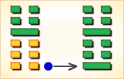
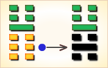
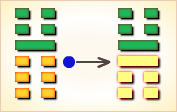
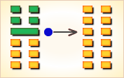
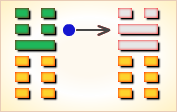
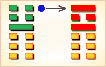

---
hide:
  - navigation
---
# 周易第16卦_豫卦(雷地豫)_震上坤下 

<table>
	<tbody>
		<tr>
			<td class="td1">
				</td>
			<td class="td1">
				</td>
			<td class="td1">
				</td>
			<td class="td1">
				</td>
		</tr>
		<tr>
			<td style="text-align: center;">
				<strong>本卦</strong></td>
			<td style="text-align: center;">
				<strong>互卦</strong></td>
			<td style="text-align: center;">
				<strong>错卦</strong></td>
			<td style="text-align: center;">
				<strong>综卦</strong></td>
		</tr>
		<tr>
			<td style="text-align: center;">
				<a href="" style="text-decoration: none;">第16卦：豫卦(雷地豫)</a></td>
			<td style="text-align: center;">
				<a href="../39.水山蹇" style="text-decoration: none;">第39卦：蹇卦(水山蹇)</a></td>
			<td style="text-align: center;">
				<a href="../09.风天小畜" style="text-decoration: none;">第9卦：小畜卦(风天小畜)</a></td>
			<td style="text-align: center;">
				<a href="../15.地山谦" style="text-decoration: none;">第15卦：谦卦(地山谦)</a></td>
		</tr>
	</tbody>
</table>

## 周易第十六卦详解

**豫卦原文**

豫。利建侯行师。

象曰：雷出地奋，豫。先王以作乐崇德，殷荐之上帝，以配祖考。

**白话文解释**

豫卦：有利于封侯建国，出兵打仗。

《象辞》说：本卦上卦为震，震为雷，下卦为坤，坤为地。春雷轰鸣，大地震动，催发万物，这是豫卦的卦象。先王观此卦象，取法于声满大地的雷鸣，制作音乐，歌功颂德，光荣归于上帝，光荣归于祖考。

**《断易天机》解**

豫卦震上坤下，为震宫初世卦。雷出地奋，象征春雷使万物苏醒，君王之威行于子民，因此有利于建候、行师。

**北宋易学家邵雍解**

雷出地上，悦服快乐；安乐之中，预防忧患。

得此卦者，顺天应时，事事吉祥，可得长辈之助，但须防色难，切不可沉迷于声色欢场之中。

**台湾国学大儒傅佩荣解**

时运：春雷发动，诸事吉祥。

财运：新货上市，必有大利。

家宅：祈神祭祖，可保平安。

身体：祷告静心。

**传统解卦**

这个卦是异卦（下坤上震）相叠，坤为地，为顺；震为雷，为动。雷依时出，预示大地回春。因顺而动，和乐之源。此卦与谦卦互为综卦，交互作用。

大象：雷出于地上，阳气奋发，万物欣欣向荣。

运势：如意安泰，可得长辈扶助，但须防色难，凡事应有备而战。

事业：十分顺利，事业可以获得成功，但必须符合实际，顺应潮流，且得自己努力奋斗，树立远大目光，尤其不可因事业的顺利而放松谨慎小心的态度，陷于懒散享乐。否则，必将后悔莫及。

经商：时运已到，应大胆行动，即使发生挫折，也可以很快化险为夷。应加强同他人的合作，开诚布公，共同开发事业。

求名：天资聪颖，如能坚守正直的品德，严格要求自己，努力上进，不因有成绩骄傲满足，停止前进，而是兢兢业业，不惰不怠，必定可以有重大成功。

婚恋：十分顺利，一生顺利和吉祥，但万不可掉以轻心，更不可玩弄感情，否则将会出现悲剧。

决策：一生顺利，不会出现大的波折，容易比较顺利得到自己应该得到的。但关键在于自己的努力和奋斗，不得耽于安乐，不可玩物丧志。豁达、大度更有利于健康和长寿。一旦遇到意外的灾害，只要时时严格要求自己，坚守纯正，乐不忘忧，居安思危，必可转危为安。

**第十六卦的哲学含义**

雷地豫卦，由坤卦和震卦组成，下坤上震，坤为地，为顺；震为雷，为动。雷依时出，预示大地回春。

从卦象上看，坤为地在下，是万物生长之处，震为雷在上，雷在沉寂的大地上发生轰鸣，表明春天来了，给万物带来了生机，所以形成了万物合乐的局面。震为动在上，坤为顺在下，说明震在前动，坤在后顺其意志而行，从而显出彼此的和好，其乐无穷的气氛。

豫卦位于谦卦之后，《序卦》之中这样说道：“有大而能谦必豫，故受之以豫。”在此之前是大有卦与谦卦，接着一定是代表愉悦的豫卦。豫卦与谦卦互为正覆关系，“豫”有愉悦之意，但也有居安思危的预备之意。

《象》中这样解释豫卦：雷出地奋，豫。先以作乐崇德，殷荐之上帝，以配祖考。

《象》中指出：雷从地下出来，万物振作，这就是豫卦。古代君王学习这种精神，制作音乐来推崇道德，并以隆重的仪式向上帝祭祀，连带也向祖先祭祀。

雷地豫卦启示了顺时依势的道理，属于中中卦。《象》中这样来断此卦：太公插下杏黄旗，收妖为徒归西歧，自此青龙得了位，一旦谋望百事宜。

豫卦之象:有两重山，为出字；官人在中，出求贵义；一鹿一马，指禄马运动；金钱数锭一堆者，乃厚获钱钞无数，占者得之求才遇贵吉利之兆。凤凰生雏之卦，万物发生之象。

## 周易第十六卦初九爻详解

**初六爻辞**

初六。鸣豫，凶。

象曰：初六鸣豫，志穷凶也。

**白话文解释**

初六：津津乐道于荒淫享乐，凶险。

《象辞》说：**初六爻辞**讲，津津乐道于荒淫享乐，其人意志必消退，身名必败裂。

**北宋易学家邵雍解**

凶：得此爻者，不顺，有口舌之争，前进有阻力。做官的不要得意忘形，须谨慎，以免生祸。读书人则可能会一鸣惊人。

台湾国学大儒傅佩荣解

时运：得意忘形，致遭困境。

财运：初可得利，切忌过贪。

家宅：怪异之惊，应防凶险。

身体：颇为不利。

**初六变卦**

初六爻动变得周易第51卦：震为雷。这个卦是同卦（下震上震）相叠。震为雷，两震相叠，反响巨大，可消除沉闷之气，亨通畅达。平日应居安思危，怀恐惧心理，不敢有所怠慢，遇到突发事变，也能安然自若，谈笑如常。

**初九爻的哲学含义**

豫卦第一爻，爻辞：初六：鸣豫，凶。

从卦像上看，初六位于豫卦的最底端，没有什么地位，但是因为其能与九四相应，有这个卦中唯一的领导的“关照”，所以心生得意。

象曰：“初六鸣豫”，志穷凶也。

这就是说，初六在最低位又德行修养不够，却自鸣得意，会导致凶险。

初六爻阴爻居于阳位，并且与九四阳爻相应，由于豫卦的背景是和平年代的娱乐，所以初六与九四有贪图享乐的含义。谦卦的初六爻辞为“鸣谦”，前面已经讲过了，是宣扬谦虚之德。而这里是“鸣豫”，即宣扬享乐之意。其“鸣”的含意与谦卦所述的意思相同。所以此处的“鸣豫”中初六与九四互相应和、共鸣一种享乐的思想。和平年代人们追求享乐本无可厚非，但是如果一味贪求，享乐过分，则会有凶险。所以初六的爻辞为凶险。这就好比李隆基和杨玉环纵情享乐的时候，而等待他们的却是一个盛世的结束，叛乱的开始。所以说和平年代，应当提高精神文明建设，以杜绝人们的奢欲。

## 周易第十六卦九二爻详解

**六二爻辞**

六二。介于石，不终日，贞吉。

象曰：不终日，贞吉，以中正也。

**白话文解释**

六二：夹在石缝中，幸而不到一天就被人救出。卜问得吉兆。

《象辞》说：磨难不足一日即解除，卜问得吉兆，因为六二之爻居下卦中位，像人得中正之道。

**北宋易学家邵雍解**

吉：得此爻者，会获利。做官的宜急流勇退，读书人有成名之机。

台湾国学大儒傅佩荣解

时运：人品高尚，不逐浮华。

财运：自定其志，快速获利。

家宅：严正持家，拒斥小人。

身体：新病可愈，宿疾即忘。

**六二变卦**

六二爻动变得周易第40卦：雷水解。这个卦是异卦（下坎上震）相叠。震为雷、为动；坎为水、为险。险在内，动在外。严冬天地闭塞，静极而动。万象更新，冬去春来，一切消除，是为解。

**九二爻的哲学含义**

占得此爻者，你要保持清醒，不要在娱乐中放纵自己而忘了该办的正事。这样，你就能做到享乐、事业两不误。

在这个方面有一个反面的例子，就是刘备的儿子刘禅。刘禅庸碌无能，贪图享乐，沉溺其中。在位前期，主要依靠诸葛亮来治理国政。自诸葛亮死后，刘禅更加昏庸无道，贪图享乐，不理朝政，宦官黄皓乘机取宠弄权，结党营私，朝政日非。魏国来攻，刘禅反缚自己双手，出城投降。在魏国时还是沉溺于玩乐之中，乐不思蜀。

占得此爻者，要深知欢乐必须适中有度，并能固守贞正之道，这样才会有吉祥的结果。

## 周易第十六卦九三爻详解详解

**六三爻辞**

六三。盱豫，悔。 迟有悔。

象曰：盱豫有悔，位不当也。

**白话文解释**

六三：懒散游乐，将招致后悔；再加上懈怠大意，那就后悔莫及。

《象辞》说：懒散游乐，将招致后悔，因为六三之爻居于阳位，是处置不当，像人之行事与所处地位不相称。

**北宋易学家邵雍解**

凶：得此爻者，投机取巧，是非不一。

台湾国学大儒傅佩荣解

时运：本身不正，因而有悔。

财运：稍纵即逝，快速得利。

家宅：速防窃盗。

身体：立即就医。

**六三变卦**

六三爻动变得周易第62卦：雷山小过。这个卦是异卦（下艮上震）相叠。艮为山，震为雷，过山雷鸣，不可不畏惧。阳为大，阴为小，卦外四阴超过中二阳，故称“小过”，小有越过。

**九三爻的哲学含义**

豫卦第三爻，爻辞：六三：盱豫悔；迟有悔。

从卦象上看，整个卦之中九四居于主爻，是全卦之中的领导。六三仰目上望，企图巴结九四。可是六三属于阴爻居于阳位，不得势，位不当，所以无法如愿，结果懊恼。占得此爻者，不必去巴结讨好别人，以求安乐，这样会难以如愿的，必然心生后悔。

从卦象上看，六三一爻在六二、六三、九四组成的互艮中，比六二更接近艮的上爻，艮为止的意思，所以六三不是“不终日”而是“迟”，迟迟不能摆脱诱惑，迟迟不能去做正事，结果必然后悔。

占得此爻者，已经意识到了自己这样耽于安乐是不对的，但是却意志薄弱，无法摆脱诱惑，无法立刻去做正事，这样拖下去，早晚会后悔的。

经文意思是：小人揭上以逸乐惑主，会有忧悔。悔恨太迟更要后悔。象辞意思是：小人媚上以逸乐惑主的忧悔，是因为六三爻阴居阳位的缘故。

## 周易第十六卦九四爻详解详解

**九四爻辞**

九四。由豫，大有得，勿疑，朋盍簪。

象曰：由豫大有得。志大行也。

**白话文解释**

九四：田猎取乐，大获鸟兽。筮遇此爻，勿疑友人多嘴而谗己。

《象辞》说：田猎取乐，大获鸟兽，说明猎获甚多，如愿以偿。

**北宋易学家邵雍解**

吉：得此爻者，进取成名，经营获利。做官的会得到知己，进取有望。

台湾国学大儒傅佩荣解

时运：大运正行，不必担心。

财运：众货聚集，大有利市。

家宅：得福有财。

身体：不必担心。

**九四变卦**

九四爻动变得周易第2卦：坤为地。这个卦是同卦（下坤上坤）相叠，阴性。象征地（与乾卦相反），顺从天，承载万物，伸展无穷无尽。坤卦以雌马为象征，表明地道生育抚养万物，而又依天顺时，性情温顺。它以“先迷后得”证明“坤”顺从“乾”，依随“乾”，才能把握正确方向，遵循正道，获取吉利。

**九四爻的哲学含义**

豫卦第四爻，爻辞：九四：由豫，大有得；勿疑，朋盍簪。

在整个豫卦之中，只有九四这一爻是阳爻。众阴归附所从，朋友前来簪聚，他给人们带来了生机和欢乐。可是，在卦之中九五是君主之位，九四是阳爻居阴位，所以要对九五至诚相待，以免引起怀疑。这样才能上下信服，出现一派合乐的场面。

在这方面有一个典型的例子，便是诸葛亮。刘备死后，他辅佐刘禅，兢兢业业，对刘禅表现出臣子对天子的尊重。诸葛亮既得到了士兵的拥护，也得到了刘禅的信任。占得此爻者，既要注意礼贤下士，又要注意尊重领导，这样才能吉祥。

九四爻是卦中唯一的阳爻，他可以得到众阴爻的应和。所以喜乐自来，会有大的收获。“朋盍簪”是什么意思呢？“朋”便是朋友；“盖”便是相合；“簪”就是聚拢头发用的发针，古代男人也留长发，所以男人与女人都用簪子聚拢头发。这三个合起来便是说将朋友聚集起来，就像用簪子聚拢头发一样。从卦象上看，豫卦九四爻就像一根发簪，其他阴爻则像盘在一起的头发，所以九四的爻辞有“朋盍簪”的说法。众阴爻应和、归顺于九四阳爻，所以会有大的收获，可以得志。

## 周易第十六卦九五爻详解详解

**六五爻辞**

六五。贞疾，恒不死。

象曰：六五贞疾，乘刚也。恒不死，中未亡也。

**白话文解释**

六五：卜问疾病，长时间内不会死去。

《象辞》说：六五爻辞讲患病，因为六五阴爻居于九四阳爻之上，犯了柔乘刚之象。“长时间不会死去”，因为六五之爻居于上卦中位，正当不死之象。

**北宋易学家邵雍解**

凶：得此爻者，多心事，有灾难，或有腹疾。做官的多洋洋得意，持恩固宠，难免有失。

台湾国学大儒傅佩荣解

时运：性格柔弱，难以振作。

财运：用人不当，致生损失。

家宅：恐被侵占。

身体：带病延年。

**六五变卦**

六五爻动变得周易第45卦：泽地萃。这个卦是异卦（下坤上兑）相叠。坤为地、为顺；兑为泽、为水。泽泛滥淹没大地，人众多相互斗争，危机必四伏，务必顺天任贤，未雨绸缪，柔顺而又和悦，彼此相得益彰，安居乐业。萃，聚集、团结。

**九五爻的哲学含义**

豫卦第五爻，爻辞：六五：贞疾，恒不死。

从卦象上看，六五这一爻本来是属于君主之位，可是却是阴爻，而且下面九四是全卦之中唯一的阳爻。六五不得位，势力不如九四，但是因为居中，处于君主这一位置上，所以平安无事。

六五爻得了病，这是怎么回事呢?对此，虞翻的解释是：“坎为疾，坤为死，震为反生，位在震中，与坤体绝，故‘贞疾，恒不死’也。”意思是说，豫卦上互卦为坎，坎含有疾病的意思，所以六五处于疾病的边缘。又由于坤为归藏代表死，可是豫卦的上卦为震，与坤没有一点关系，震有起死回生的含义，六五处于震卦的中位，所以他患有疾病，但不会因此而死亡。但六五得的是什么病呢？是心病。为什么这样说呢？因为坎便代表心病。六五的心病便是对九四的心病。打个比方说，九四是一个男人，众阴爻是他的五个妻子，有一个妻子在家里处干领导地位，凌驾在丈夫之上，这个妻子便是六五爻，为什么六五会有心病呢？因为丈夫更爱六二与六三这两个妻子，有权势的六五自然会吃醋而生心病了。可是由于六五居中，能够做到以中庸之道持家，所以她尽管受了心灵的伤害，但还不至干因此而丢掉性命。不过这种醋劲也使她徘徊在生与死的边缘。若是占问身体健康状况，则意味着会生病，但病小致死。

## 周易第十六卦上九爻详解详解

**上六爻辞**

上六。冥豫，成有渝，无咎。

象曰：冥豫在上，何可长也。

**白话文解释**

上六：末日将至尚且享乐，已成之事也将毁败。

《象辞》说：末日将至尚且享乐，以此居上位，怎能长久。

**北宋易学家邵雍解**

平：得此爻者，因为心气太高，会有诉争之扰，但若能改过自新，心态平和，则不会有过失。做官的会有贪污之嫌，须明哲保身。

台湾国学大儒傅佩荣解

时运：冬去春来，奋发有为。

财运：改旧从新，将可获利。

家宅：迁居改造为宜。

身体：应有转机。

**上六变卦**

上六爻动变得周易第35卦：火地晋。这个卦是异卦（下坤上离）相叠。离为日，为光明；坤为地。太阳高悬，普照大地，大地卑顺，万物生长，光明磊落，柔进上行，喻事业蒸蒸日上。

**上九爻的哲学含义**

豫卦第六爻，爻辞：上六：冥豫成，有渝无咎。

豫卦是愉悦之意，上六是整个卦之中最后一爻，意指愉悦到了极点，有些执迷不悟了。但是因为本卦已到头，再无去路，终究会有变化，如此就可以“无咎”。

上六沉溺于喜乐昏了头，可是能够及早地发现自己的过失，及早地改正，所以不会有大的过失。因为喜乐一过度，喜乐的害处马上就要显出来了，也就是说接下来也就喜乐不成了。不能拥有喜乐了，可是能够认识到喜乐的害处，当然不会再有过失了。

豫卦第六爻，爻辞：上六：冥豫成，有渝无咎。占得此爻者，要反省一下自己，是否因贪玩而耽误了正事，是否养成了纵情玩乐的恶习，使自己陷入了危机之中。如果这样就要及时改正，还是为时不晚。