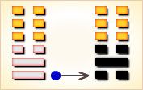
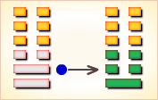
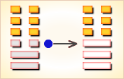
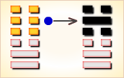
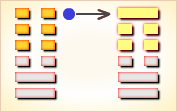

---
hide:
  - navigation
---
# 周易第19卦_临卦(地泽临)_坤上兑下 

<table>
	<tbody>
		<tr>
			<td class="td1">
				</td>
			<td class="td1">
				</td>
			<td class="td1">
				</td>
			<td class="td1">
				</td>
		</tr>
		<tr>
			<td style="text-align: center;">
				<strong>本卦</strong></td>
			<td style="text-align: center;">
				<strong>互卦</strong></td>
			<td style="text-align: center;">
				<strong>错卦</strong></td>
			<td style="text-align: center;">
				<strong>综卦</strong></td>
		</tr>
		<tr>
			<td style="text-align: center;">
				<a href="" style="text-decoration: none;">第19卦：临卦(地泽临)</a></td>
			<td style="text-align: center;">
				<a href="../24.地雷复" style="text-decoration: none;">第24卦：复卦(地雷复)</a></td>
			<td style="text-align: center;">
				<a href="../33.天山遁" style="text-decoration: none;">第33卦：遁卦(天山遁)</a></td>
			<td style="text-align: center;">
				<a href="../20.风地观" style="text-decoration: none;">第20卦：观卦(风地观)</a></td>
		</tr>
	</tbody>
</table>

## 周易第十九卦详解

**临卦原文**

临。元，亨，利，贞。至于八月有凶。

象曰：泽上有地，临。君子以教思无穷，客保民无疆。

**白话文解释**

临卦：大吉大利，吉利的卜问。到了八月，可能有凶险。

《象辞》说：本卦下卦为兑为泽，上卦为坤为地，堤岸高出大泽，河泽容于大地，这是临卦的卦象。君子观此卦象，君临天下，教化万民，覃恩极虑，保容万民，德业无疆。

**《断易天机》解**

临卦坤上兑下，为坤宫二世卦。临卦下兑为悦，上坤为顺，欢悦而顺从，保证可以亨通。

**北宋易学家邵雍解**

以上临下，相佐相互；居安思危，时时慎戒。

得此卦者，好运来到，诸事如意，人情和合，但行事不宜过于急进。

台湾国学大儒傅佩荣解

时运：活水流行，好运方来。

财运：经营有成，获利可期。

家宅：家业正旺；两姓和合。

身体：疾病拖延，不致危险。

**传统解卦**

这个卦是异卦（下兑上坤）相叠。坤为地，兑为泽，地高于泽，泽容于地。喻君主亲临天下，治国安邦，上下融洽。

大象：池泽之水灌溉地面万物，相辅相成，生生不息。

运势：诸事亨通，上下和合，前途有望，但不宜过于急进。

事业：正是成功的极好时机，务必抓紧，不可失去良机。但却不可就此满足，时运会很快消失，一定要从长计议，注意总结经验，团结他人，共同开拓新领域。

经商：会十分顺利，并有收获，但须随时注意市场动向，兢兢业业，防止出现意外的事故，尤其应妥善处理人际关系。

求名：自己的努力已到了收获的季节，应更加虚心，严格要求自己，谨慎小心地实现自己的目标。很可能出现意外，应以刚强的意志去从容对付，过于软弱将失去机会。

婚恋：加紧进行，全力以赴，双方以诚信相待，美满、和谐。

决策：头脑灵活，善于同他人交往，并有主见，具有领导才能。务必加强个人的全面修养，诚信待人，树立良好的个人威望，尤其要有远大的眼光，长久的计划，可以保证事业的发达和前程的光明。

**第十九卦的哲学含义**

临卦卦象，地泽临卦的象征意义

地泽临卦，是由兑和坤所组成，兑卦在下，坤卦在上。兑代表愉悦，象征泽；坤代表顺，象征地。地在上，泽在下，象征大地对泽水采取居高临下的监督。大地压在泽上，像上级对下级在施加压力，强制推行自己的意志。本卦取名为临，临的本意就是从上往下看，本卦的含义就是上级对下级的领导和管理。监临、面临，随着所临对象的不同，包含以君临民、以己临事多重含义，如何正确处理自我与他人、主体与客体的关系，是临卦所讨论的主题。《象》中这样解释临卦：泽上有地，临；君子以教思无穷，容保民无疆。

地泽临卦《象》中这段话的意思是：临卦的卦象是兑（泽）下坤（地）上，为地在泽上之表象。泽上有地，地居高而临下，象征督导。君子由此受到启发，费尽心思地教导人民，并以其无边无际的盛德保护人民。

地泽临卦以在地与泽水接壤通气为象，表明君与民和平相处，君亲近于民，民和悦于君。这一卦既有领导亲临下级，又有下级恭迎领导之意。临卦启示了教民保民的道理，属于中上卦。《象》中这样来断此卦：君王无道民倒悬，常想拨云见青天，幸逢明主施仁政，重又安居乐自然。

地泽临卦的卦画为下面两个阳爻，上面四个阴爻。

地泽临卦从卦象上分析，下面的两个阳爻代表阳气的逐渐增强，也可引申为正气的增长。临卦是十二消息卦之一，代表的节气为大寒。临卦六爻代表小寒至立春的三十余天。五天为一候，一爻代表一候。此时卦象上已有两个阳了，表示阳气逐渐在壮大。所以临卦也有壮大的意思。另外，临卦的上卦为坤为地，下卦为兑为泽，所以泽上有地便是临卦的卦象。什么叫“泽上有地”?意思是说，沼泽的外边是无边的土地，而土地的位置是高于沼泽的，所以说“泽上有地”。站在沼泽边上的土地上往沼泽里看，这就是临。可见卦象与卦名的含义还是较为一致的。

## 周易第十九卦初九爻详解

**初九爻辞**

初九。咸临，贞吉。

象曰：咸临贞吉，志行正也。

**白话文解释**

初九：以感化的政策治民。卜问得吉兆。

《象辞》说：以感化的政策治民，治道贞正，自然吉利，因为居心端正，作风正派。

**北宋易学家邵雍解**

吉：得此爻者，会交好运，营谋称意。做官的会得到众人的拥戴，能升迁。读书人参加考试者必能考出佳绩。

台湾国学大儒傅佩荣解

时运：初交好运，守正大吉。

财运：新货推出，自然获利。

家宅：吉事临门；佳偶可成。

身体：初起之病，可保治愈。

**初九变卦**

初九爻动变得周易第7卦：地水师。这个卦是异卦（下坎上坤）相叠。“师”指军队。坎为水、为险；坤为地、为顺，喻寓兵于农。兵凶战危，用兵乃圣人不得已而为之，但它可以顺利无阻碍地解决矛盾，因为顺乎形势，师出有名，故能化凶为吉。

**初九爻的哲学含义**

临卦第一爻，爻辞：初九：咸临，贞吉。爻辞释义

咸：指无心之感，就是发自内心的诚恳，是一种无私心偏见的交合接触，而没有做作、做秀的意思。

本爻的意思是：怀感化之心而下临万民，可获吉祥。

《象》曰：“咸临，贞吉”，志行正也。《象》中这句的话意思是：怀感化之心下临万民，去行领导的督导之责，之所以可获吉祥，是因为其志向和行为都很正派，没有私心杂念，没有做秀、炫耀之意。

占得此爻者，可能会到下级部门或单位前去检查工作，但是要记住，你要真心地以工作为出发点，对下级无私心偏见，带着发自内心的诚恳去做事，不要摆摆样子，走走形式，或者是对下级摆出领导的架子，这样对你不利。要以感化的方法统御民众或下级，坚持正道才可获得吉祥。

初九爻处干社会的最下层，可是他却能感受到上层人物对他的视察，所以他必须守正道才会吉祥。初九阳爻居于奇位为得位，说明他能够安分守己，做好自己分内的事情，并因此而受到领导的赏识。

## 周易第十九卦九二爻详解

**九二爻辞**

九二。咸临，吉，无不利。

象曰：咸临，吉无不利，未顺命也。

**白话文解释**

九二：用温和的政策治民，吉利，无不吉利。

《象辞》说：用温和的政策治民，吉利，无不吉利，因为百姓尚未驯化从命。

**北宋易学家邵雍解**

吉：得此爻者，营谋获利，但宜认清时机，不然不能成事，美中不足。做官的会光明磊落，地位清高。

台湾国学大儒傅佩荣解

时运：贵人相助，运气正佳。

财运：一再经营，依然获利。

家宅：福星高照；婚嫁亦吉。

身体：并无大碍；讼事未决。

**九二变卦**

九二爻动变得周易第24卦：地雷复。这个卦是异卦（下震上坤）相叠。震为雷、为动；坤为地、为顺，动则顺，顺其自然。动在顺中，内阳外阴，循序运动，进退自如，利于前进。

**九二爻的哲学含义**

临卦第二爻，爻辞：九二：咸临，吉，无不利。爻辞释义

本爻与初九爻意思相近，意思是：怀感化之心而下临万民，可获吉祥，没有什么不利的。

《象》曰：“咸临，吉，无不利”，未顺命也。《象》分析这一爻，认为“怀感化之心而下临万民，可获吉祥，没有什么不利的”。

从卦象上看，九二属于阳爻居于刚位，具有阳爻的办事果决、敢作敢为的特点。九二这一爻上应六五，而六五是属于阴爻居君位，失位。九二与六二都属于失位，表明九二在做事时与六五的意见相左，没有遵从六五之命。但是，这并没有什么不吉利的，原因在于九二没有私心，而是谦柔和顺地对待百姓。

占得此爻，在做事时，要心怀诚意，采取谦柔和顺的态度对待他人，坚守正道，那么即使你违背了上级的命令，也不会出现不利的结果。

九二是大夫之位，九二阳爻居偶位，虽不得位但是能够居中。能够以中正之道做事，自然也会得到上面的嘉奖。九二与身为君王的六五相应，他的一举一动可以受到君王的赏识，怎么会有不利的因素呢？做得好可以得到君王的嘉奖，九二自然也就更加好好表现了。

## 周易第十九卦九三爻详解详解

**六三爻辞**

六三。甘临，无攸利。即忧之，无咎。

象曰：甘临，位不当也。即忧之，咎不长也。

**白话文解释**

六三：用压服的政策治民，没有什么好处。如果有所忧悔，灾祸可以消除。

《象辞》说：用压服的政策治民，正如六三阴爻不当居阳位一样，这样的君王不是称职的君主。如果能有所忧悔，其灾祸则可消除。

**北宋易学家邵雍解**

凶：得此爻者，有忧愁，会受苦劳累。做官的会受到小人的谗言攻击，志不能伸。

台湾国学大儒傅佩荣解

时运：知悔改正，后运可期。

财运：糖业有利，其余未必。

家宅：迁徙为宜；婚姻不合。

身体：药不对症，可服苦辛。

**六三变卦**

六三爻动变得周易第11卦：地天泰。这个卦是异卦（下乾上坤）相叠，乾为天，为阳；坤为地，为阴，阴阳交感，上下互通，天地相交，万物纷纭。反之则凶，万事万物，皆对立，转化，盛极必衰，衰而转盛，故应时而变者泰（通）。

**九三爻的哲学含义**

临卦第三爻，爻辞：六三：甘临，无攸利；既忧之，无咎。爻辞释义

甘，指甜言蜜语。忧之，反思，后悔。

这句爻辞的意思是：居高临下，靠甜言蜜语去督导，必无所利；但是，已经意识到自己的过失，能忧惧改过，这样就不会招致灾祸。

《象》中这样分析此爻：“甘临”，位不当也。“既忧之”，咎不长也。《象》中指出：“居高临下，靠甜言蜜语去督导”，这是因为六三爻位置不当的缘故。但是，“已经觉悟，能忧惧改过”，危害就不会长久了。《象》从卦象上分析，认为六三属于阴爻居刚位，位不当，而且位于下卦的顶端，远离中位，不能守持中道。靠花言巧语去统御民众，只说不做，善于做秀。

占得此爻者，如果你是领导，要反思一下自己对待下属的态度，是否总是甜言蜜语来拉拢他们，总是空头许诺而不去兑现。如果这样，就需要立刻改正，少做巧佞之事，改过迁善，方能无碍。

经文意思是：甘美地对待来临，来往不会有利益。能为处境忧虑，则不会有灾难。象辞意思是：甘美地对待来临，是位置不当的缘故。如果能对这种处境有忧虑，则灾难不会长久。

六三处于下卦兑卦的最上面，所以有喜悦之象，并且临于两个阳爻之上，所以会得到好处。但是他虽然权力大干两个阳爻，但却无法得到上面的赏识，所以“无攸利”。六三阴爻居干奇位，又不得中，所以处境不是很好，不过他能够发觉这种隐伏的危机，心存忧患，想办法解决，所以不会有灾难。

## 周易第十九卦九四爻详解详解

**六四爻辞**

六四。至临，无咎。

象曰：至临无咎，位当也。

**白话文解释**

六四：亲自理国治民，没有害处。

《象辞》说：亲自理国治民，没有害处，正如六四阴爻居阴位一样。这样的君王是称职的君王。

**北宋易学家邵雍解**

平：得此爻者，人情和合，经营得利，但要成大事者，须谨慎而行，做好准备再进取。做官的会得到同僚的帮助。

台湾国学大儒傅佩荣解

时运：好运已到，有吉无凶。

财运：买卖得时，无往不利。

家宅：家业正旺；婚嫁合宜。

身体：危险之志，但仍可愈。

**六四变卦**

六四爻动变得周易第54卦：雷泽归妹。这个卦是异卦（下兑上震）相叠。震为动、为长男；兑为悦、为少女。以少女从长男，产生爱慕之情，有婚姻之动，有嫁女之象，故称归妹。

**九四爻的哲学含义**

临卦第四爻，爻辞：六四：至临，无咎。临卦爻辞释义，至临：亲自处理国事。本爻的意思是：亲自处理国事，没有灾祸。

临卦第四爻，爻辞：六四：至临，无咎。人生启示

从卦象上看，六四属于阴爻居于柔位，得位，具备谦卑柔顺的特性。四爻属于近君大臣之位，是上卦六五的助手。六四紧邻六五，又与初九相应。其为近君大臣，能秉持正道，待上则忠于职守，又能接应下面的贤才初九，极力推荐这样的有用之人。初九是阳爻，六四是阴爻，很明显，若是初九这个阳爻得势，六四这个阴爻会受到影响，阳长阴消，但是，六四不顾及自己的利益，为领导举荐贤才，所以没有灾祸。

《象》中这样分析此爻：“至临，无咎”位当也。

《象》解释说：“亲自处理国事，没有灾祸”，这是因为六四爻位置恰当的缘故。身在高位，上不欺君主，下不压万民，自己兢兢业业，还积极举荐贤能，为后起之秀让路，这样做的人会赢得赞誉。正如春秋时期，齐恒公的老师鲍叔牙，他做为近君臣子，对齐恒公尽心尽力，同时又向他举荐贤才。在他的劝谏下，齐恒公任用曾射杀过自己的仇人管仲为相。在管仲的辅佐下，确立了霸主地位。鲍叔牙不计自己的名利，退位让贤，受到了人们的称赞。

占得此爻者，应该学习鲍叔牙的做法，哪怕一时吃些亏，受些委屈，但终究是会名利双收的。

六四为诸侯之位，可是他能够与初九相应，所以称之为“至临”。也就是说六四体察民情，深入到最下层，与下层民众心连心，这种视察就是“至临”。领导能做到这一点，是难能可贵的，怎么会有灾难呢？

## 周易第十九卦九五爻详解详解

**六五爻辞**

六五。知临，大君之宜，吉。

象曰：大君之宜，行中之谓也。

**白话文解释**

六五：以明智治民，得君王之体，自然吉利。

《象辞》说：得君王之体，因为六五之爻居上卦中位，像人行事得中正之道。

**北宋易学家邵雍解**

吉：得此爻者，万事如意。做官的会得到上司的赏识。

台湾国学大儒傅佩荣解

时运：正当好运，又有人助。

财运：了解商情，当然有利。

家宅：五福临门；宜室宜家。

身体：良医诊治，自然可愈。

**六五变卦**

六五爻动变得周易第60卦：水泽节。这个卦是异卦（下兑上坎）相叠。兑为泽，坎为水。泽有水而流有限，多必溢于泽外。因此要有节度，故称节。节卦与涣卦相反，互为综卦，交相使用。天地有节度才能常新，国家有节度才能安稳，个人有节度才能完美。

**九五爻的哲学含义**

临卦第五爻，爻辞：六五：知临，大君之宜，吉。爻辞释义知，同“智”，明智。

本爻的意思是：以聪明才智来实行督导，这是伟大君主最适宜的统治之道，能获得吉祥。

临卦第五爻，爻辞：六五：知临，大君之宜，吉。人生启示

《象》曰：“大君之宜”，行中之谓也。六五以柔爻居于上卦中位，是具备忠顺之德的君王。《象》解释说：“以聪明才智来实行督导，这是伟大君主最适宜的统治之道。”说的就是行中庸之道，用的是以柔克刚之法，用天下之至柔，胜天下之至刚。

占得此爻者，应该学习六五之爻的做法，即使事业曾经遇到过挫折，如果这样去做，也能拯救于危难之中，使事业重焕生机。占得此爻者，谋望有所成，期待的消息很快就会有回音了。

用智慧去体察民情，这正是天子必须掌握的一种本领。六五以智慧体察民情，能够得到真实的情况，所以吉祥。身为国君，必须要了解自己的子民。天安门的两个华表上，分别有两个小兽，兽头的方向一个朝南一个南北，这就是两个华表的不同之处。有什么说法吗？有，兽头朝南的便是警示国君不要忘记常到民间去体察民情。为什么要这么做呢？因为大臣们会粉饰太平，对君王说假话。举个例子，袁世凯当了皇帝后，举国一片反对之声。一些大臣为了讨好袁世凯，便给袁世凯专门印制了一份报纸，这个报纸每天只印一份，只给袁世凯一个人看。上面全是形式一片大好之类的话，袁世凯看后开心。结果，登基八十一天后，他便被人从龙椅上撵了下来。所以说君王必须要用自己的眼睛去看一看百姓的生活。清朝盛世期间，康熙、乾隆屡次来到江南，便是巡视，体察民情。天安门华表上朝北的兽头，则是警示君王在外面巡视游玩不要忘了国家朝政的安危。总在外面巡视，朝廷出了奸臣叛乱怎么办？所以君王在外面巡视不要时间太长，还必须回来巩固自己的政权。

但身为君王，不能外出时间长了，怎么能掌握真实的民情呢？这就需要“智临”。怎么“智临”呢？电视里演的康熙、乾隆的微服私访便是“智临”，当然除了微服私访外还可以利用忠臣去巡视获得准确的消息。但关键在于“智”，只有“智”才能达到真正的“临”。

## 周易第十九卦上九爻详解详解

**上六爻辞**

上六。敦临，吉，无咎。

象曰：敦临之吉，志在内也。

**白话文解释**

上六：以敦厚之道治民，吉利，自然无灾祸。

《象辞》说：以敦厚之道治民，吉利，因为敦厚诚实之意存于内心。

**北宋易学家邵雍解**

吉：得此爻者，多获利，无往不利，但谨防气势太盛而变衰。做官的会得到上司的器重，委以重用。

台湾国学大儒傅佩荣解

时运：好运已止，忠厚无咎。

财运：贩卖内地，尚有利益。

家宅：忠厚肃穆。

身体：培养元气，自然健康。

**上六变卦**

上六爻动变得周易第41卦：山泽损。这个卦是异卦（下兑上艮）相叠。艮为山；兑为泽。上山下泽，大泽浸蚀山根。损益相间，损中有益，益中有损。二者之间，不可不慎重对待。损下益上，治理国家，过度会损伤国基。应损则损，但必量力、适度。少损而益最佳。

**上九爻的哲学含义**

 临卦第六爻，爻辞：上六：敦临，吉，无咎。爻辞释义：敦：指敎厚。

本爻的意思是：以敦厚诚实治民，吉利，没有灾祸。

爻辞：上六：敦临，吉，无咎。人生启示

《象》曰：“敦临之吉”，志在内也。

《象》中解释说：“以敦厚诚实治民，吉利，没有灾祸。”说明其志在于利国利家。占得此爻者，切记敦厚、厚道，这是本爻给人的主要启示。在工作和生活中，要宽容地接纳各种意见，包括一些批评的意见。这种敦厚的长者之风将会赢得人们对你的尊敬。对待下属，要显示出自己的敦厚之德，这样才能吉利而远离灾祸。

上六处干太上皇的位置，自然失去了一些君王的威风，所以他巡视民众时，要以敦厚的性情去巡视。在古代，天下是统治者家族的天下，所以太上皇也得为天下的和平做些贡献。他平和地与民众相处，是为了得到真实的民情，然后帮助皇上谋划治理天下的决策。

上六又属于隐士阶层，在古代的隐士阶层，对社会的贡献是很大的。他们表面上隐居山林，但实际上心系国家。由于没有地位与权势，所以他们更能了解到民众内心的真实想法。并且，隐士往往与统治者有一定的往来，统治者也很重视这一阶层，所以隐士往往会对君王提出一些对治理天下有价值的忠告。