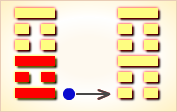
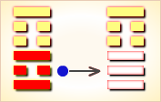
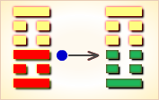
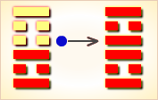
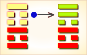
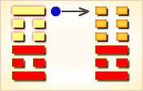

---
hide:
  - navigation
---
# 周易第22卦_贲卦(山火贲)_艮上离下 

<table>
	<tbody>
		<tr>
			<td class="td1">
				</td>
			<td class="td1">
				</td>
			<td class="td1">
				</td>
			<td class="td1">
				</td>
		</tr>
		<tr>
			<td style="text-align: center;">
				<strong>本卦</strong></td>
			<td style="text-align: center;">
				<strong>互卦</strong></td>
			<td style="text-align: center;">
				<strong>错卦</strong></td>
			<td style="text-align: center;">
				<strong>综卦</strong></td>
		</tr>
		<tr>
			<td style="text-align: center;">
				<a href="" style="text-decoration: none;">第22卦：贲卦(山火贲)</a></td>
			<td style="text-align: center;">
				<a href="../40.雷水解" style="text-decoration: none;">第40卦：解卦(雷水解)</a></td>
			<td style="text-align: center;">
				<a href="../47.泽水困" style="text-decoration: none;">第47卦：困卦(泽水困)</a></td>
			<td style="text-align: center;">
				<a href="../21.火雷噬嗑" style="text-decoration: none;">第21卦：噬嗑卦(火雷噬嗑)</a></td>
		</tr>
	</tbody>
</table>

## 周易第二十二卦详解

**贲卦原文**

贲。亨。小利有攸往。

象曰：山下有火，贲。君子以明庶政，无敢折狱。

**白话文解释**

贲卦：通达。有所往则有小利。

《象辞》说：本卦上卦为艮为山，下卦为离为火，山下有火，火燎群山，这是贲卦的卦象。君子观此卦象，思及猛火燎山，玉石俱焚，草木皆尽，以此为戒，从而明察各项政事，不敢以威猛断狱。

**《断易天机》解**

贲卦艮上离下，为艮宫初世卦。贲为装饰之意，离为明，艮为止，表示有文明的制度使人们止于一定的规范，因此多为吉兆。

**北宋易学家邵雍解**

文饰光明，外实内需；隐忧之时，量力而为。

得此卦者，表面风光，内在空虚，多虚少实。宜充实自己，稳重行事，量力而为。

台湾国学大儒傅佩荣解

时运：上有阻力，不可任意。

财运：经理精明，须防套牢。

家宅：小心火灾。

身体：郁火上升，慎用寒剂。

**传统解卦**

这个卦是异卦（下离上艮）相叠。离为火为明；艮为山为止。文明而有节制。贲卦论述文与质的关系，以质为主，以文调节。贲，文饰、修饰。

大象：日落西山，照耀通明，华美灿烂，同时喻光明力量渐消，阴暗的力量扩大。

运势：表面风光，内里空虚，必须充实自己，凡事宜踏实、按部就班。

事业：顺利，小有成绩，宜即时总结经验，图谋更大的发展。树立信心，不计较一时的得失。追求实质性的内容，慎重行事，不要随波逐流，寻求有实力的人物提携自己。

经商：开始会遇到困难，不应灰心，宜全面分析形势，大胆开拓，勇敢地投入，联合他人，共同合作，根据市场，运转业务。

求名：不可过多地注重外表，而应着重于内在的素质。大胆地推荐自己，但应坚持自己的理想。

婚恋：慎重选择，有合适者，则应迫切追求，不可三心二意，务必专一。注重对方的内在气质，勿为表面现象所欺骗。

决策：喜爱注重外表，缺乏追求内在气质的恒心。生性较为浮躁，好务虚名，往往因此而碰壁，或半途而废。在事实的教育下，改变不切实际的做法，明察社会和人生，会有所收敛，变得自持，注重自身修养，成全事业，中年以后会大有作为，老年仍可发挥余热。

**第二十二卦的哲学含义**

贲卦卦象，山火贲卦的象征意义

山火贲贲，这个卦是异卦相叠，下卦为离，上卦为艮。离为火为明；艮为山为止。

贲，指贝壳的光泽。光泽和贝壳相互映衬，彼此装饰，色彩交错，合为一体，显得文雅又光明。因此，贲含有装饰和文明之意。贲卦论述文与质的关系，以质为主，以文调节，文明而有节制。

《象》曰：“山下有火，贲。君子以明庶政，无敢折狱。”《象》中指出：离火在下，艮山在上，所以离下艮上之卦如同山下有火一般，形成山火相映，彼此装饰之势，故本卦起名为贲。君子应该学习这种精神，以光明磊落的行为处理各种政事，对人狱的事，不可轻易地决断。

贲卦属于中上卦，象征装饰，告诉人们饰外扬质，返朴归真的道理，告诫人们要笃实平淡，不慕虚名。贲卦启示了饰外扬质的道理，属于中上卦。《象》对此卦的断语是：近来运转锐气周，窈窕淑女君子求，钟鼓乐之大吉庆，占者逢之喜临头。

## 周易第二十二卦初九爻详解

**初九爻辞**

初九。贲其趾，舍车而徒。

象曰：舍车而徒，义弗乘也。

**白话文解释**

初九：脚穿花鞋，舍车不乘，徒步而行。

《象辞》说：舍车不乘，徒步而行，为显示鞋子之美丽，理应不乘车。

**北宋易学家邵雍解**

平：得此爻者，多奔波，静凶动吉。做官的须防退职之患。

台湾国学大儒傅佩荣解

时运：个性清高，德优于名。

财运：脚踏实地，虽小亦亨。

家宅：勤俭起家，知足不辱。

身体：初起之病，自可痊愈。

**初九变卦**

初九爻动变得周易第52卦：艮为山。这个卦是同卦（下艮上艮）相叠。艮为山，二山相重，喻静止。它和震卦相反。高潮过后，必然出现低潮，进入事物的相对静止阶段。静止如山，宜止则止，宜行则行。行止即动和静，都不可失机，应恰到好处，动静得宜，适可而止。

**初九爻的哲学含义**

贲卦第一爻，爻辞：初九：贲其趾，舍车而徒。

初九：贲其趾，舍车而徒。爻辞释义

贯：是指装饰。址：指脚址。徒：指步行。

本爻的意思是：装饰自己的脚趾头，舍弃乘坐马车而徒步行走。初九代表社会的下层，社会的下层一般是不坐车的。由于生活富裕了，所以为了走路方便，便开始对脚进行修饰了。怎么修饰呢？剪剪趾甲，把脚洗净了，穿上舒适而结实的鞋子，这就是“贲其趾”。当然，古时的女人，还可以在趾甲上涂上各种颜色，来美化双脚。

《象》曰：“舍车而徒”，义弗乘也。也就是说，初九“舍弃乘坐车马而徒步行走”，这是因为按道义不该乘坐车马。

占得此爻者，要想发展事业，靠别人是靠不住的，想搭便车是行不通的，不如自己做好准备，脚踏实地，一步一个脚印地去做，这样虽然慢一点，但是更有

效。

占得此爻者，还要注意一种情况，本来是可以乘车的，但是因为自己的脚趾做了修饰，或者穿上了一双新的漂亮的鞋子，为了显示一下，故意有车不坐，这种故作清高、爱好表现的作法需要改正。

## 周易第二十二卦九二爻详解

**六二爻辞**

六二。贲其须。

象曰：贲其须，与上兴也。

**白话文解释**

六二：修饰自己的胡须。

《象辞》说：修饰自己的胡须，说明老人不服老，帮助君王振兴国家。

**北宋易学家邵雍解**

平：得此爻者，得人提拔，好运可期，但也要相时而动，不可随性而为，以免遭难。做官的会因人成事，升迁有望。

台湾国学大儒傅佩荣解

时运：平平淡淡，依人成事。

财运：配合富商，必可获利。

家宅：祖上福泽；婚嫁宜待。

身体：遵照医嘱。

**六二变卦**

六二爻动变得周易第26卦：山天大畜。这个卦是异卦（下乾上艮）相叠。乾为天，刚健；艮为山，笃实。畜者积聚，大畜意为大积蓄。为此不畏严重的艰难险阻，努力修身养性以丰富德业。

**九二爻的哲学含义**

贲卦第二爻，爻辞：六二：贲其须。

六二：贲其须。爻辞释义

本爻的意思是：装饰长者的胡须。修饰胡须，在今天男人们者湖子了。所以这个观点对现在人意义不大。可是对古人却很有用。古人认为“身之肤发，受之父母”，所以不能轻易剪头发、刮胡子。所以胡子会越长越长，如果不加以修饰，确实是影响形象。不过如果修饰得当，也会显示出一种男人的气质。古人对胡子的称呼根据部位不同而有所不同。长在嘴上面的叫作髭，下嘴唇下面的叫作须，下巴附近的叫作胡，两颊的叫作髯。古代男子有的胡须太长了，就得做一个锦囊将胡须包起来。

六二：贲其须。人生启示

《象》曰：“贲其须”，与上兴也。这句话指出，六二阴爻居于阴位，性情柔顺，“装饰长者的胡须”，是说六二爻与它上面的九三爻同心而互饰之意。

占得此爻者，在单位应该拥护上级领导，尽量多说领导的好话，这样会得到领导的赏识。“六二”中正，与五无应，二专承三。异性相吸，就像须装饰下颚，与下颚一起行动，相得益彰。

## 周易第二十二卦九三爻详解详解

**九三爻辞**

九三。贲如，濡如，永贞吉。

象曰：永贞之吉，终莫之陵也。

**白话文解释**

九三：奔跑向前，汗流浃背。卜问长时期的凶吉而得吉兆。

《象辞》说：永远贞正，必吉利，因为决没有人侵凌正人君子。

**北宋易学家邵雍解**

吉：得此爻者，好运来到，不必费力，自然荣盛，即使有是非纠纷，也不足为患。做官的与人和睦，能居要职。

台湾国学大儒傅佩荣解

时运：名利双收，光华润泽。

财运：财源如水，可保基业。

家宅：可以久居；百年偕老。

身体：游泳健身。

**九三变卦**

九三爻动变得周易第27卦：山雷颐。这个卦是异卦（下震上艮）相叠。震为雷，艮为山。山在上而雷在下，外实内虚。春暖万物养育，依时养贤育民。阳实阴虚，实者养人，虚者为人养。自食其力。

**九三爻的哲学含义**

贲卦第三爻，爻辞：九三：贲如，濡如，永贞吉。

九三：贲如，濡如，永贞吉。爻辞释义

本爻的意思是：装饰得光泽柔润，永远坚守正道，便可获得吉祥。这里讲的是对全身的打扮，用油脂把皮肤涂抹得湿润而有光泽，穿上焕然一新的新服。内心守正道就会吉祥。这就是说，打扮不能只打扮外表，也要注重心灵美。心中有道德，并且能坚持这种美德，所以就会吉祥。在太平盛世，一个衣着得体整洁，显得光彩照人，并且内心既善良又纯正，也就是说外表美与心灵美相统一，表里如一的人，怎么能不吉祥呢？对于这种人，领导也愿意任用他，提拔他；周围邻居、左右同事也愿意与他交往。

我们常看到这样的情景：一到喜庆之日，许多人家就开始给大门或一些建筑刷漆，重新装饰，使其面貌一新。占得此爻，正处于这种情景之中，意味着有喜

事来临，非常吉祥。

九三这一爻处在互坎〔六二、九三、六四）之中，坎为水，水有润泽之意。九三又是阳爻居阳位，得势。占得此爻者，事业、感情等方面都很顺利，不过要注意坚守正道，不要得意忘形。

贲卦第三爻，爻辞：九三：贲如，濡如，永贞吉。

九三：贲如，濡如，永贞吉。爻辞释义

本爻的意思是：装饰得光泽柔润，永远坚守正道，便可获得吉祥。这里讲的是对全身的打扮，用油脂把皮肤涂抹得湿润而有光泽，穿上焕然一新的新服。内心守正道就会吉祥。这就是说，打扮不能只打扮外表，也要注重心灵美。心中有道德，并且能坚持这种美德，所以就会吉祥。在太平盛世，一个衣着得体整洁，显得光彩照人，并且内心既善良又纯正，也就是说外表美与心灵美相统一，表里如一的人，怎么能不吉祥呢？对于这种人，领导也愿意任用他，提拔他；周围邻居、左右同事也愿意与他交往。

我们常看到这样的情景：一到喜庆之日，许多人家就开始给大门或一些建筑刷漆，重新装饰，使其面貌一新。占得此爻，正处于这种情景之中，意味着有喜

事来临，非常吉祥。

九三这一爻处在互坎〔六二、九三、六四）之中，坎为水，水有润泽之意。九三又是阳爻居阳位，得势。占得此爻者，事业、感情等方面都很顺利，不过要注意坚守正道，不要得意忘形。

## 周易第二十二卦九四爻详解详解

**六四爻辞**

六四。贲如，皤如，白马翰如，匪寇婚媾。

象曰：六四当位疑也。匪寇婚媾，终无尤也。

**白话文解释**

六四：奔跑气吁吁，太阳火辣辣。高头白马，向前飞奔。不是来抢劫，而是来娶亲。

《象辞》说：六四阴爻居阴位，所处恰当。既知不是来抢劫，而是来娶亲，疑虑冰释，终无灾祸。

**北宋易学家邵雍解**

平：得此爻者，先凶后吉，忧中有喜，虽有危险，终得安宁。未婚者，有望成家。做官的先难后易。

台湾国学大儒傅佩荣解

时运：安分则吉，明年亨通。

财运：早些售出，获利了结。

家宅：先有丧事，后有婚事。

身体：胸中气阻，调节上下。

**六四变卦**

六四爻动变得周易第30卦：离为火。这个卦是同卦（下离上离）相叠。离者丽也，附着之意，一阴附丽，上下二阳，该卦象征火，内空外明。离为火、为明，太阳反复升落，运行不息，柔顺为心。

**九四爻的哲学含义**

贲卦第四爻，爻辞：六四：贲如，皤如，白马翰如；匪宼，婚媾。

六四：贲如，皤如，白马翰如；匪宼，婚媾。爻辞释义

皤：素白色。白马翰如：白马壮硕的样子。匪宼：不是强盗。婚媾：本指结婚，这里指美好的结合。

本爻辞的意思是：装饰洁白素雅，骑着一匹雪白的骏马，轻捷地往前奔驰。前方的人并非敌宼，而是自己求聘的婚配佳人。穿着干干净净、漂漂亮亮的新衣服，骑上一匹白马，飞跑着去做什么？不是去抢劫，而是去求婚。在这里由于是盛世，所以求婚时更加注重个人形象了。一般来说，每个时代都会出现新的风俗，移风易俗反映着时代的发展。古人求婚也是，最初是血腥的抢婚，接着是扮成鬼一样地去求婚，现在人们富裕了，幵始了更健康的求婚方式。穿着干净漂亮的衣服，骑着干净漂亮的白马，这种求婚方式反映了人们追求整洁、追求健康的心理。

六四这一爻，属于阴爻居柔位，得势。但是四爻天性具有恐惧多疑的特性，使他在做事时会犹豫不决。

《象》曰：“六四当位，疑也；”“非宼婚媾”，终无尤也。

这是告诉占得此爻的人：六四爻虽然当位得正，但心中却疑虑重重。“前方的人并非敌宼，而是自己求聘的婚配佳人”。说明尽管放心前往，最终将无所怨占得此爻者，可能做事时有些追求速度，显得急躁，这一点是需要注意的。如果你是一位男士，可能是位急脾气。

但是与女性相处时应多些温柔，并努力争取保持与她的长久关系。

## 周易第二十二卦九五爻详解详解

**六五爻辞**

六五。贲于丘园，束帛戋戋。吝，终吉。

象曰：六五之吉，有喜也。

**白话文解释**

六五：奔向丘园，送上许多布帛，初遇困难，终则顺利。

《象辞》说：**六五爻辞**说的吉利，是指有婚姻之喜。

**北宋易学家邵雍解**

吉：得此爻者，会遇贵人，经营获利，多喜事。做官的闲职者会受到重用，在职者福禄双全。

台湾国学大儒傅佩荣解

时运：虽为正运，勤俭为宜。

财运：木材丝绸，皆可获利。

家宅：家风勤俭；贤妇可喜。

身体：园林修养。

**六五变卦**

六五爻动变得周易第37卦：风火家人。这个卦是异卦（下离上巽）相叠。离为火；巽为风。火使热气上升，成为风。一切事物皆应以内在为本，然后伸延到外。发生于内，形成于外。喻先治家而后治天下，家道正，天下安乐。

**九五爻的哲学含义**

贲卦第五爻，爻辞：六五：贲于丘园，束帛矣矣；吝，终吉。

贲于丘园，束帛矣矣；吝，终吉。爻辞释义

丘园：指荒郊野外的山林之地，这里喻指定居的贤能隐士。帛：丝织品。束：量词，五匹丝为一束。束帛：这里指礼品。戋戋：为少量，微薄。

此爻辞的意思是：装饰山丘陵园，质朴无华，再拿一束薄薄的丝绢，来聘纳贤士；虽可能产生遗憾，然而最终必获吉祥。

六五身处君王之位，他的修饰就显得更大气了。他对皇家园林进行修饰，并且用了大量彩色的丝织品。这么做难免有些奢侈，所以会有忧吝。但最终是吉祥的。因为盛世之国常有喜庆之事，其他诸侯国会常来访问，对园林进行装饰，天子可以在诸侯心目中提高地位。

经文意思是：修饰山丘园林，用了大量的布帛，有忧吝，最终吉祥。象辞意思是：六五爻的吉祥，是有喜庆的事情。

从卦象上看，六五这一爻，属于君主之位，但是阴爻居此位，显示出阴爻的特性，能采取怀柔政策，具有礼贤下士之德。上九属于阳爻，在这一卦之中，六五得到了上九的辅佐，事业更加发达。但是从卦象上看，上卦为艮，为山林郊外，上九阳爻不在六五所辖之内，表

明其是不在位的贤人退休的旧臣，或为隐居贤士。他帮助六五之后，六五对其进行嘉奖。虽然六五拿出的礼物微薄，但是这种行为本身重于物质，而且上九这种贤人也不重视物质，所以虽然六五看上去有些吝啬，但结果是吉祥的。

占得此爻者，在工作中你遇到了困难，有人出面帮你解决，这个人不是你的属下或同事，也不是负责此事的人，而是你的朋友或是一些有能力而不属于你们单位的人。得到别人的帮助之后，你应该表示感谢，不在于礼物的多少，只要你去感谢，就会吉祥。

## 周易第二十二卦上九爻详解详解

**上九爻辞**

上九。白贲，无咎。

象曰：白贲无咎，上得志也。

**白话文解释**

上九：送上白底饰以诸色花纹的布帛，不会坏事。

《象辞》说：白底的布帛饰以诸色花纹，没有灾祸，因为上九居一卦之首位，像人高高在上，志得意满。

**北宋易学家邵雍解**

平：得此爻者，须防好运转凶，家中、亲属有长辈或命终。做官的会升迁。

台湾国学大儒傅佩荣解

时运：好运已终，恬谈自适。

财运：直接出售，依然有利。

家宅：清白高尚。

身体：清谈解热，可能归天。

**上九变卦**

上九爻动变得周易第36卦：地火明夷。这个卦是异卦（下离上坤）相叠。离为明，坤为顺；离为日；坤为地。日没入地，光明受损，前途不明，环境困难，宜遵时养晦，坚守正道，外愚内慧，韬光养晦。

**上九爻的哲学含义**

 贲卦第六爻，爻辞：上九：白贲，无咎。

上九：白贲，无咎。爻辞释义

白：指白色，引申为纯洁，天然的本色，含返朴归真之意。本爻辞的意思是：用白色来装饰，不喜好华丽，没有祸害。白色是朴素的颜色，可是它的装饰效果却非常好。上九表示事物的极至，一般来讲，事物一发展到极至便不太好了。可是对于装饰则不然，因为装饰的极至是返回到朴素状态中来，是返回到简单的状态中来。我们通过我国建国后的穿着打扮就会发现，打扮的最高境界仍然是朴素。比如八十年代以前，人们的穿着是统一的蓝、绿、红。八十年代后，生活水平提高了，人们幵始穿奇装异服，衣服的颜色也五颜六色，样式五花八门，但今天我们再一看，主领服装市场的还是朴素的单色服装。而白色服装一直是高贵的柄^志，从几千年前至今天没有改变过。蓝色服装一直是销量最大的服装，也是人们穿着最多的一种服装。所以说，修饰、装饰的艺术，也有一个循环的过程，当发展到极至后，又回到初始。

《象》曰：“白贲，无咎”，上得志也。

这是告诉人们：回到最初的纯洁状态，不要用外部的装饰去美化，在简朴实用的形式之中，更能欣赏到生活本身的自然之美。

占得此爻者，如果你想去见某个人，不用刻意打扮，保持自然美，就不会有过错。