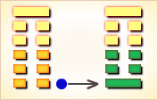
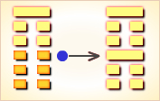
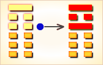
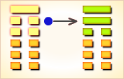
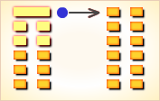

---
hide:
  - navigation
---
# 周易第23卦_剥卦(山地剥)_艮上坤下 

<table>
	<tbody>
		<tr>
			<td class="td1">
				</td>
			<td class="td1">
				</td>
			<td class="td1">
				</td>
			<td class="td1">
				</td>
		</tr>
		<tr>
			<td style="text-align: center;">
				<strong>本卦</strong></td>
			<td style="text-align: center;">
				<strong>互卦</strong></td>
			<td style="text-align: center;">
				<strong>错卦</strong></td>
			<td style="text-align: center;">
				<strong>综卦</strong></td>
		</tr>
		<tr>
			<td style="text-align: center;">
				<a href="" style="text-decoration: none;">第23卦：剥卦(山地剥)</a></td>
			<td style="text-align: center;">
				<a href="../02.坤为地" style="text-decoration: none;">第2卦：坤卦(坤为地)</a></td>
			<td style="text-align: center;">
				<a href="../43.泽天夬" style="text-decoration: none;">第43卦：夬卦(泽天夬)</a></td>
			<td style="text-align: center;">
				<a href="../24.地雷复" style="text-decoration: none;">第24卦：复卦(地雷复)</a></td>
		</tr>
	</tbody>
</table>

## 周易第二十三卦详解

**剥卦原文**

剥。不利有攸往。

象曰：山附于地，剥。上以厚下，安宅。

**白话文解释**

剥卦：有所往则不利。

《象辞》说：本卦上卦为艮为山，下卦为坤为地，山在地上，风雨剥蚀，这是剥卦的卦象。君子观此卦象，以山石剥落，岩角崩塌为戒，从而厚结民心，使人民安居乐业。

**《断易天机》解**

剥卦艮上坤下，为乾宫五世卦。剥卦象征剥落，因山高倾危而剥落。此时为阴气极盛之时，君子宜谨慎隐忍，不可贸然行动。

**北宋易学家邵雍解**

剥削蚀烂，灾情之忧；进取难成，顺时而止。

得此卦者，时运不佳，多有损失，前进有阻，宜顺时而止，安份自守。

台湾国学大儒傅佩荣解

时运：时运不佳，安心自守。

财运：出口获利，剥人之财。

家宅：不离己宅，寄居可买。

身体：魂不附体，千万小心。

**传统解卦**

这个卦是异卦（下坤上艮）相叠。五阴在下，一阳在上，阴盛而阳孤；高山附于地。二者都是剥落象，故为“剥卦”。此卦阴盛阳衰，喻小人得势，君子困顿，事业败坏。

大象：山附于地喻山石崩而落于地面上，五阴迫一阳，正义被损。

运势：恶运缠身，宜重新部署，不宜自作聪明，防被女子及小人连累。

事业：时运不佳，乃大势所趋，个人只能顺应时势而暂停行动，静观待变，不可冒险，积极创造条件，增强实力，谨慎隐忍，勿与小人同流。时来运转，成就事业，为期不远。

经商：已从高峰转入低落，进入不景气时期，需要认真总结经验教训，进行整顿，尤其不可孤注一掷。景气形势一旦到来，可顺势从容再起。

求名：成功的可能性不大，不宜执意强求，应继续创造条件，努力提高自己，充实处世的本领，增强实力，待机东山再起。

婚恋：务须慎重考虑，除非有十分般配者，不要随便进行。双方应注意维护家庭的和睦。

决策：一生曲折较多，往往隐入不顺利的境况，甚至绝境，但可绝处逢生。只要冷静分析形势，顽强拼搏，一定会彻底改变命运，获得美好的结果，为他人惊羡。关键是不可急于求成，尤其不可冒险。须顺应时势，并防小人陷害。

**第二十三卦的哲学含义**

剥卦卦象，山地剥卦的象征意义

剥卦，是异卦相叠，坤卦在下，艮卦在上。坤为地，在山之下；艮为山，在地之上。山在地上，常年受到风吹雨打，雷击日晒，被剥蚀不止。

从整个卦象上看，五阴在下，一阳在上，阴盛而阳孤；高山附于地。高山被风雨侵蚀而剥落，其原来的美色遭到破坏，剥落物落在地上，把大地上的原物压坏，破坏了大地原有的美色，对大地也是一种破坏。所以剥卦具有破坏性。此卦阴盛阳衰，喻小人得势，君子困顿，事业败坏。当然，易经是充满辩证思想和发展变化的哲理，若是剥落物落到地上，地上正是一个坑，剥落物将其填平；或者地上是贫瘠的土地，剥落之物土壤肥沃，这又是好事了。

剥卦位于贲卦之后，《序卦》之中这样说道：“致饰，然后享则尽矣，故受之以剥。剥者，剥也。”经过贲卦的文饰，通达到了尽头，接着就是剥蚀了。

剥卦是承接上一象征盛大无比的贲卦而来的一卦。此卦谈的是事物有盛必有衰落的道理。从初爻到第四爻基本上都是这个意思。其第五爻谈的是对衰落采取的一些补救办法，其最后一爻谈的是采取的一些补救办法之后所取得的效果。

剥卦属于中下卦。《象》中这样评断此卦：鹊遇天晚宿林中，不知林内先有鹰，虽然同处心生恶，卦若逢之是非轻。

此卦卦名为剥。《说文》中说：“剥，裂也。”《广雅》中说：“剥，离也。”可见“剥”字的本义是指去掉物体表面上的东西，也就是剥离、剥脱、剥落的意思。装饰的东西不会长久，最终都要脱落，就像我们搞家装一样，过几年，墙表面就得剥落，还得重新装修。所以贲卦的下面，便是剥卦。《序卦传》中说：“致饰，然后亨则尽矣，故受之以剥。”《杂卦传》中说：“剥，烂也。”可见《序卦传》与《杂卦传》是社会变化而言的。盛世之时，人们讲究装饰，过度的奢侈，就像腐烂物一样，会逐渐剥蚀盛世的繁荣，使盛世走向衰落。

## 周易第二十三卦初九爻详解

**初六爻辞**

初六。剥床以足，蔑贞，凶。

象曰：剥床以足，以灭下也。

**白话文解释**

初六：床足脱落。无须占问，这是凶险之象。

《象辞》说：床足脱落，这是自毁根基。

**北宋易学家邵雍解**

凶：得此爻者，营谋不遂，或有手足之灾，或兄弟不睦，凶则家破身亡。做官的有升迁之机会，但宜见机行事。

台湾国学大儒傅佩荣解

时运：命当剥削，防有足疾。

财运：底部有损，减少损失。

家宅：基础不稳，防备下人。

身体：足部忧伤，小心诊治。

**初六变卦**

初六爻动变得周易第27卦：山雷颐。这个卦是异卦（下震上艮）相叠。震为雷，艮为山。山在上而雷在下，外实内虚。春暖万物养育，依时养贤育民。阳实阴虚，实者养人，虚者为人养。自食其力。

**初九爻的哲学含义**

剥卦第一爻，爻辞：初六：剥床以足，蔑贞，凶。

初六：剥床以足，蔑贞，凶。爻辞释义

蔑：同“灭”，为消除。蔑贞：是指阴爻逐渐驱逐阳爻，以邪胜正。

本爻辞的意思是：剥落床体先由床的最下方床腿部位开始，整个床腿都损坏了，结果必然凶险

这一爻给人的启示是，不要忽视小错误、小问题，蚁穴可以毁堤。当剥蚀从床脚开始时，你就要注意了。

《象》曰：“剥床以足”，以灭下也。

这是告诉人们：“剥落床体先由床的最下方床腿部位开始”，是说先损毁床的基础。基础损坏毁灭了，自然就会有凶险的情况发生，而且还会逐渐扩展波及到上面。

占得此卦者，在做事时要坚定自己的意志，注意基础，在基础上下足功夫。如果基础出现剥损，计划会毁于一旦。此刻，应该放缓做事的进度，采取切实可行的办法去加固自己的基础，这样才能避免损失。

## 周易第二十三卦九二爻详解

**六二爻辞**

六二。剥床以辨，蔑贞，凶。

象曰：剥床以辨，未有与也。

**白话文解释**

六二：床板脱落。无须占问，这是凶险之象。

《象辞》说：床板脱落，这是自毁辅佐。

**北宋易学家邵雍解**

凶：得此爻者，营谋不遂，或受到小人的侵辱，或受到他人的猜忌。做官的须防被贬职。

台湾国学大儒傅佩荣解

时运：日益低落，哑子黄莲。

财运：成本堆积，难以获利。

家宅：宜速变迁。

身体：卧床待医，防其不起。

**六二变卦**

六二爻动变得周易第4卦：山水蒙。这个卦是异卦（下坎上艮）相叠，艮是山的形象，喻止；坎是水的形象，喻险。卦形为山下有险，仍不停止前进，是为蒙昧，故称蒙卦。但因把握时机，行动切合时宜，因此，具有启蒙和通达的卦象。

**九二爻的哲学含义**

剥卦第二爻爻辞：六二：剥床以辨，蔑贞，凶。

爻辞释义

辨：是分隔上下的，对于床来说，则是指床足和床板之间。

本爻辞的意思是：床腿剥掉后，又开始剥落床头，以至于整个床头都剥落了，结果必然凶险。

从卦象上看，六二这一爻“剥落”得比初六更加严重了，已经从床足到床腿和床头了。六二与六五无应，上下又都是阴爻。

《象》曰：“剥床以辨”，未有与也。

这就是说，“床腿剥掉后，又开始剥落床头”，是因为六二爻没有相应的阳爻援助。由于没有外援，所以导致凶险的情况发生。

占得此爻者，注意要坚守正道，不要陷害他人。如果你乘机陷害他人，虽然报复了别人，但是自己也会受损。你要关注自己的事业，当看到衰退出现时，就要丢弃脱离现实的空想，否则你将进一步被小人侵害。这时仿佛走到了断桥上，不要再前行了，唯一的办法就是坚守和等待。

## 周易第二十三卦九三爻详解详解

**六三爻辞**

六三。剥之，无咎。

象曰：剥之无咎，失上下也。

**白话文解释**

六三：割取邻国邻邑的土地人民，可以无灾祸。

《象辞》说：割取邻国邻邑的土地人民，可以无灾祸，因为邻国邻邑的统治者已失去了上下臣民的支持。

**北宋易学家邵雍解**

平：得此爻者，难遇知己，生涯不顺，欲求名利，必须创新，此爻像父母妻子或有忧，须谨防。做官的会遇到明主或大官提拔。

台湾国学大儒傅佩荣解

时运：运虽不正，尚能自反。

财运：自行脱售，因而得利。

家宅：旧宅改造。

身体：消除火气。

**六三变卦**

六三爻动变得周易第52卦：艮为山。这个卦是同卦（下艮上艮）相叠。艮为山，二山相重，喻静止。它和震卦相反。高潮过后，必然出现低潮，进入事物的相对静止阶段。静止如山，宜止则止，宜行则行。行止即动和静，都不可失机，应恰到好处，动静得宜，适可而止。

**九三爻的哲学含义**

剥卦第三爻，爻辞：六三：剥，无咎。

爻辞释义

本爻辞的意思是：虽被剥落，却没有灾祸。

剥卦第三爻，爻辞：六三：剥，无咎。人生启示

《象》曰：“剥之无咎”，失上下也。

处于“剥落”这一卦，下面两爻都处于凶险之中，为什么六三能做到“无咎”，这是因为六三脱离了上下阴爻的行列，它潜藏着阳刚的性质。阴爻居阳位，说明并非“剥道”之同党，不愿与其同流合污，而独与阳爻上九相应。想脱离这种剥落的状态，就要弃暗投明，这样自然没有灾害。

占得此爻者，在你身边可能会一些奢侈腐败的情况出现，你要独善其身，不与其同流合污，这样可以免除灾祸。

六三相当于社会上追求享乐的人，但是他没有灾难。为什么呢？因为六三不与群阴为伍。盛世之中，如果人人都能做到艰苦朴素，那就不叫盛世了。人们追求享乐是盛世的必然产物。六三也追求享乐，可是他不结朋党，不损害朝廷的利益，所以他没有灾难。举个例子来说，清朝的某个官员，每天也是吃好的喝好的，也是妻妾成群，纵情于享乐。可是他能够做好自己的本职工作，不欺压百姓，不贪污国库。他怎么会有灾难呢？电视剧中的纪晓岚大家都说是个清官，可是纪晓岚也追求个人享受。史料上记载，他性欲极其旺盛，一个妻子无法满足他，所以他妻妾也不少。可是他不强抢民女，不从国库中偷钱，不损坏国家利益，还勇于同大贪官何珅作斗争，所以他得到人民与君王的敬重，不会有灾难。

## 周易第二十三卦九四爻详解详解

**六四爻辞**

六四。剥床以肤，凶。

象曰：剥床以肤，切近灾也。

**白话文解释**

六四：剥取床上的垫席，这是凶险之象。

《象辞》说：剥取床上的垫席，灾祸就在眼前。

**北宋易学家邵雍解**

凶：得此爻者，时运不佳，危难之时，多有争诉刑克之事。做官的须谨防小人的谗言，以免遭难。

台湾国学大儒傅佩荣解

时运：显然不佳，须防受伤。

财运：剥耗过多，意外之祸。

家宅：破败防塌。

身体：颇为凶险。

**六四变卦**

六四爻动变得周易第35卦：火地晋。这个卦是异卦（下坤上离）相叠。离为日，为光明；坤为地。太阳高悬，普照大地，大地卑顺，万物生长，光明磊落，柔进上行，喻事业蒸蒸日上。

**九四爻的哲学含义**

剥卦第四爻，爻辞：六四：剥床以肤，凶。

爻辞释义肤：指床面。

本爻辞的意思是：床面开始剥落，必然发生凶险。

六四：剥床以肤，凶。人生启示

《象》曰：“剥床以肤”，切近灾也。

剥落从床足开始，到床腿、床头，现在开始剥落床面，是说已经迫近灾祸了。因为床面剥落损坏，必将危及到床上之人，所以说迫近灾祸了。

六四这一爻，属于阴爻居柔位，是得位的小人，又是临近于君主六五的近君大臣，他要毁灭正道。正如历史上李林甫等一些小人掌权一样，正义全失。六四虽然得势，但是与上九这一阳爻关系对立，当阴消阳长之时，可能会与代表正义的阳爻进行搏斗，非常凶险。

占得此爻者，要注意，旧的基础已经土崩瓦解，已经剥落掉了。你可能面临着即将到来的变动，可以重新建立新的基础。

这个六四爻重权在握，又贪得无厌，既欺压百姓又损害国家利益，所以他的势力太大了，罪恶太明显了，自然难逃凶险的命运。这就好比何珅，比国王都富有，他贪污的行径皇上怎么会不知道呢？

## 周易第二十三卦九五爻详解详解

**六五爻辞**

六五。贯鱼，以宫人宠，无不利。

象曰：以宫人宠，终无尤也。

**白话文解释**

六五：宫人依次当夕受宠，无所不利。

《象辞》说：宫人依次当夕受宠，秩序不乱，厚薄均匀，因而终无忧患。

**北宋易学家邵雍解**

吉：得此爻者，人情和合，营谋得时，家和福生，妇人进财。做官的升高进职，居要位。读书人、学子考试必能考出佳绩。

台湾国学大儒傅佩荣解

时运：气运堂皇，事无不利。

财运：利润甚丰，海产犹佳。

家宅：妇女持家。

身体：内亏之症，爱惜身体。

**六五变卦**

六五爻动变得周易第20卦：风地观。这个卦是异卦（下坤上巽）相叠，风行地上，喻德教遍施。观卦与临卦互为综卦，交相使用。在上者以道义观天下；在下者以敬仰瞻上，人心顺服归从。

**九五爻的哲学含义**

剥卦第五爻，爻辞：六五：贯鱼，以宫人宠，无不利。

爻辞释义

本爻辞的意思是：鱼贯而入，像率领内宫之人顺承君主那样就能得到宠爱，就没有什么不利。

从剥卦来看，除了六三属于阴爻居刚位，又与上九相应而无险之外，其他阴爻都处于凶险之中，为什么到了六五这一爻而出现了“无不利”的结局呢？这是

告诉人们善于管理的好处。在这一爻之中，小人们都像宫人一样，来顺承君主，安于其位与其分，这样就化险为夷了。

占得此爻者，要逐一地重用贤人。用人时，注意有效分工，让他们各施其能，各负其责。这样既能避免他们因权责不清而做事草率，另外也可避免他们之间产生矛盾。作为领导，要让所有的员工感觉到自己是一个英明的领导，让他们信服自己，这样他们即使心怀鬼胎，迫于你的威信，也不敢放肆，会规规矩矩地做事。

## 周易第二十三卦上九爻详解详解

**上九爻辞**

上九。硕果不食，君子得舆，小人剥庐。

象曰：君子得舆，民所载也；小人剥庐，终不可用也。

**白话文解释**

上九：劳者不得食，不劳者得食；君子乘坐华丽的车子，小人的草屋不蔽风雨。

《象辞》说：君子乘坐华丽的车辆，这是老百姓沉重的负担。小人的破屋不蔽风雨，这种取象表明终究难保平安。

**北宋易学家邵雍解**

平：得此爻者，须谨慎，踏实稳重者可无忧。商人生意买卖会不错。做官的会有权柄。

台湾国学大儒傅佩荣解

时运：眼前衰落，一年方起。

财运：卖出尚可，买入必剥。

家宅：忠厚可保，刻薄无屋。

身体：饮食不进，小心调养。

**上九变卦**

上九爻动变得周易第2卦：坤为地。这个卦是同卦（下坤上坤）相叠，阴性。象征地（与乾卦相反），顺从天，承载万物，伸展无穷无尽。坤卦以雌马为象征，表明地道生育抚养万物，而又依天顺时，性情温顺。它以“先迷后得”证明“坤”顺从“乾”，依随“乾”，才能把握正确方向，遵循正道，获取吉利。

**上九爻的哲学含义**

剥卦第六爻，爻辞：上九：硕果不食，君子得舆，小人剥庐。

爻辞释义

舆：指车子。庐：指房屋。

本爻辞的意思是：虽有硕大的果实却不去吃，对于君子来说，则会获得马车；对于小人来说，将会被剥除房屋。

上九为剥卦之中唯一的阳爻，又居上位，有如仅存的硕果。在与“剥”这种情况做斗争时，上九做为唯一的阳爻，历经磨难，终于取得成功，由此得到了百姓的拥护。而那些小人，则被战败。

《象》曰：“君子得舆”，民所载也；“小人剥庐”，终不可用也。

这里指出：君子被百姓拥戴，有如坐在车子上受到欢呼一样。而小人终究是不可以任用的。

占得此爻者，要坚守正道，而你最终能守得云开见月明。如果在一个单位之中，有贪污或一些不正之风，你不参与其中，而是坚决与其做斗争，虽然历经磨难，可是最终必将获胜。

上九虽然是弱阳，但是却代表着众阴剥阳的形势已经走到了尽头。物极必反，所以小人的势力又开始瓦解了。上九有容忍退让之德，所以他不把大果子拿来自己享用，正因为这样，他得到了人民的拥护。因为人民的拥护，使上九重新拥有了地位与权力，所以与他为敌的小人，开始受到惩治。