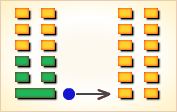
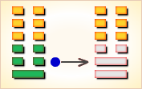
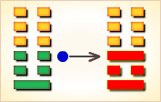
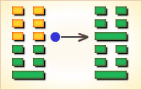
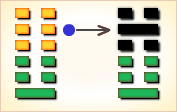
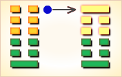

---
hide:
  - navigation
---
# 周易第24卦_复卦(地雷复)_坤上震下 

<table>
	<tbody>
		<tr>
			<td class="td1">
				</td>
			<td class="td1">
				</td>
			<td class="td1">
				</td>
			<td class="td1">
				</td>
		</tr>
		<tr>
			<td style="text-align: center;">
				<strong>本卦</strong></td>
			<td style="text-align: center;">
				<strong>互卦</strong></td>
			<td style="text-align: center;">
				<strong>错卦</strong></td>
			<td style="text-align: center;">
				<strong>综卦</strong></td>
		</tr>
		<tr>
			<td style="text-align: center;">
				<a href="" style="text-decoration: none;">第24卦：复卦(地雷复)</a></td>
			<td style="text-align: center;">
				<a href="../02.坤为地" style="text-decoration: none;">第2卦：坤卦(坤为地)</a></td>
			<td style="text-align: center;">
				<a href="../44.天风姤" style="text-decoration: none;">第44卦：姤卦(天风姤)</a></td>
			<td style="text-align: center;">
				<a href="../23.山地剥" style="text-decoration: none;">第23卦：剥卦(山地剥)</a></td>
		</tr>
	</tbody>
</table>

## 周易第二十四卦详解

**复卦原文**

复。亨。出入无疾，朋来无咎。反复其道，七日来复，利有攸往。

象曰：雷在地中，复。先王以至日闭关，商旅不行，后不省方。

**白话文解释**

复卦：通泰。出门、居处均无疾病。有钱可赚而可以无灾祸。往返途中，七日可归。有所往则有所利。

《象辞》说：本卦内卦为震为雷，外卦为坤为地，天寒地冻，雷返归地中，往而有复，依时回归，这是复卦的卦象。先王观此卦象，取法于雷，在冬至之日关闭城门，不接纳商旅，君王也不巡视邦国。

**《断易天机》解**

复卦坤上震下，为坤宫初世卦。复代表阴阳去而复返，使万物生生不息，预示已逝去的可能会再回来。

**北宋易学家邵雍解**

循环往复，生机复萌；成功在望，性急即败。

得此卦者，时运好转，顺势而为，谋事可成，但不宜过于急进。

台湾国学大儒傅佩荣解

时运：好运初来，静待发动。

财运：暂停售物，必可获利。

家宅：待春再迁；婚嫁初春可成。

身体：有痰上火，冬令宜防。

**传统解卦**

这个卦是异卦（下震上坤）相叠。震为雷、为动；坤为地、为顺，动则顺，顺其自然。动在顺中，内阳外阴，循序运动，进退自如，利于前进。

大象：雷在地中振发，喻春回大地，一元始，万象更生。

运势：开运亨通之象，万事不宜急进，按部就班可成。

事业：已经渡过了困难时期，开始进入积极行动的阶段。但务必抓住时机，当机立断，却不可急躁，且应时常反省个人行动，严于修身，勇往直前，可望成功。

经商：可大胆投资，与志同道合的伙伴坦诚合作，打开市场，勿因挫折而退缩。更可以打入外地，坚持商业道德，循序渐进，一定会有所赢利。

求名：时机正在成熟，不要急于求成，继续奠定基础，机遇一旦到来，务必要抓住，必将转运。最忌自伤意志。

婚恋：顺利。但切不可性急，应冷静考虑。家庭的美满幸福，靠严于律己维持。

决策：性格活泼，精力旺盛，但因急躁情绪会造成事业损失。一定要冷静思考，勇于改正错误，必能重振事业。此时应抓住时机，明确方向，灵活机敏，脚踏实地改变处境。一旦出现意外，宜当机立断，暂行退让。如能准确驾驶自己，努力奋斗，成就事业十分顺利。

**第二十四卦的哲学含义**

复卦卦象，地雷复卦的象征意义

复卦，本卦是异卦相叠，震卦在下，坤卦在上。震为雷、为动；坤为地、为顺，动则顺，顺其自然。动在顺中，内阳外阴，循序运动，进退自如，利于前震为雷，为内卦；坤为地，为上卦。地内有雷，意味着雷声一震，大地松动，万物萌生。复，有复兴和回归之意，是事物新生的转折点。从卦象上看，除第一爻为阳外，余爻皆为阴，似有太阳从地平线的一端升起的景象。复卦代表的节气是冬至，正如“冬天来了，春天还会远吗？”，复卦代表阳性力量复兴而阴性元素衰退，长夜过后太阳升起，复卦启示去而复回和失而复行的方法与哲理，并告诫人们：发现错误就是敢紧复归正道，这样才能吉祥。若是执迷不悟，就会产生灾祸。

复卦位于剥卦之后，《序卦》之中这样说道：“物不可以终尽，剥穷上反下，故受之以复。”剥卦走到极点，阳爻又须回到底下重新开始。复卦为剥卦的覆卦，称作“由剥而复”，是“一阳复始”的局面，大地重现生机。

复卦启示了寓动于顺的道理，属于中中卦。《象》中对此卦的评断是：马氏太公不相合，世人占之忧疑多，恩人无义反为怨，是非平地起风波。

此卦卦名为复。“复”在《说文》中的解释是：“复，往来也。”可见复的意思是返回、回来的意思。前面泰卦的九三爻说“无往不复”，说的便是没有一直往前走而不返回的，事物都有一个循环往复、周而复始的规律，前面剥卦群阴剥去阴爻，接下来便开始一阳复生。所以剥卦的下面是复卦。这正如《序卦传》所说：“物不可以终尽，剥穷上反下，故受之以复也。”

## 周易第二十四卦初九爻详解

**初九爻辞**

初九。不远复，无只悔，元吉。

象曰：不远之复，以修身也。

**白话文解释**

初九：出外不远就返回，没有大的过失，大吉大利。

《象辞》说：出外不远就返回，比喻能时时反省，严于修身。

**北宋易学家邵雍解**

吉：得此爻者，万事如意，经营获利。做官的会位高权重。读书人会取得佳绩。

台湾国学大儒傅佩荣解

时运：好运渐起，一切顺利。

财运：赚回所损，不必懊恼。

家宅：旧业复兴；婚嫁又成。

身体：静养可复。

**初九变卦**

初九爻动变得周易第2卦：坤为地。这个卦是同卦（下坤上坤）相叠，阴性。象征地（与乾卦相反），顺从天，承载万物，伸展无穷无尽。坤卦以雌马为象征，表明地道生育抚养万物，而又依天顺时，性情温顺。它以“先迷后得”证明“坤”顺从“乾”，依随“乾”，才能把握正确方向，遵循正道，获取吉利。

**初九爻的哲学含义**

复卦第一爻，爻辞：初九：不远复，无祗悔，元吉。

复卦第一爻，爻辞：初九：不远复，无祗悔，元吉。爻辞释义

抵：指大。抵悔：指大的悔恨。

本爻辞的意思是：走得不远就复归正道，没有到懊悔的程度，大吉大利。

初九这一爻用行路来启示人们做事的道理：走得不远发现道路走错了，马上返回，这样就不会造成太大的后悔，也不会发生过错。这就是说，在刚开始做事时，就发现了自己的错误，由此改正错误，按正确的方式方法来做了，这样没有产生什么过错，也不会让人太后悔。

《象》曰：“不远之复，以修身也。”这是告诉人们：刚刚开始行动，就能有知过必改、复归正道的表现。这里强调自身修养的重要性。

## 周易第二十四卦九二爻详解

**六二爻辞**

六二。休复，吉。

象曰：休复之吉，以下仁也。

**白话文解释**

六二：圆满而归，吉利。

《象辞》说：圆满而归之所以吉利，是能够去位让贤。

**北宋易学家邵雍解**

吉：得此爻者，与人共利，事业兴旺，病者痊愈。做官的遭贬者会复职。

台湾国学大儒傅佩荣解

时运：择善而从，万事皆吉。

财运：与人共利，事业兴旺。

家宅：和睦兴家。

身体：再请旧医。

**六二变卦**

六二爻动变得周易第19卦：地泽临。这个卦是异卦（下兑上坤）相叠。坤为地，兑为泽，地高于泽，泽容于地。喻君主亲临天下，治国安邦，上下融洽。

**九二爻的哲学含义**

复卦第二爻，爻辞：六二：休复，吉。

爻辞释义休：是止之意。本爻辞的意思是：停下来返回，吉祥。

复卦第二爻，爻辞：六二：休复，吉。人生启示

六二这一爻，属于阴爻居柔位，得势。六二发现错误之后，就不再前往，返回正道，结果很吉祥。

《象》曰：“休复之吉”，以下仁也。

这里指出：“停下来返回，吉祥”，是因为六二能够向下亲近具备仁德的人。从卦象上看，这个仁德的人，就是初九。初九阳爻居阳位，是位君子、仁者，六二对其很是欣赏。

占得此爻者，若是支配下属或家人等去做某事，如果做事的人发现错误，不再去做，你也应该停止此事，这样会很吉祥。

不返回，也吉祥。这是怎么回事呢？因为六二与初九不同。初九代表阳气的生长，而六二则代表阴气的消退，所以六二必须前进才吉祥。六二的前进便是向上升，使下面的阳气得到更大的生长，这种行为是适应时势的，所以吉祥。六二阴爻居于偶位为得位，又居于下卦之中，且与初九相合，所以他柔顺中正而有顺应时势之德，所以他会明智地朝上发展。

## 周易第二十四卦九三爻详解详解

**六三爻辞**

六三。频复，厉，无咎。

象曰：频复之厉，义无咎也。

**白话文解释**

六三：愁眉苦脸地回来，是遇到了危险，知难而退可以无灾祸。

《象辞》说：虽然愁眉苦脸地回来，但已脱离危险，理应没有灾祸。

**北宋易学家邵雍解**

平：得此爻者，事多反复，阴阳差错，时好时坏。做官的职位不稳定，更变无定。

台湾国学大儒傅佩荣解

时运：时好时坏，自己把握。

财运：有盈有亏，全在自己。

家宅：迁移不定。

身体：身体屡治屡发，虽危无害。

**六三变卦**

六三爻动变得周易第36卦：地火明夷。这个卦是异卦（下离上坤）相叠。离为明，坤为顺；离为日；坤为地。日没入地，光明受损，前途不明，环境困难，宜遵时养晦，坚守正道，外愚内慧，韬光养晦。

**九三爻的哲学含义**

复卦第三爻，爻辞：六三：频复，厉，无咎。

复卦第三爻，爻辞：六三：频复，厉，无咎。爻辞释义

频：是指频繁，再三地。本爻辞的意思是：屡次犯错误却又能屡次改正过错、复归正道，这样虽然有危险，但是最终却不会遇到灾祸。

六三这一爻，与人们所说的“错了就改，改了再犯，犯了再改”很相近，表明意志不坚定，自身修养不够，不能像孔子的弟子颜渊那样“不二过”一一知道错了就不会再犯。六三在复归正道过程中，旧习难改，时好时坏多次反复，非常危险。但是他知道自己是错的，只是意志不太坚定，毕竟能够改过从善，复归正道，所以最终却不会遇到灾祸。占得此爻者，在改正错误时，一定要意志坚定，誓与恶习“血战一番”，将其“连根拔起”，这样对自己更有利。

六三处于下卦的最外边，也就是处于震卦的最上爻，震为动，所以他会有频繁运动的形象。他想回到中位，所以“频复”，但这种做法是不符合时势发展规律的，所以会有危险，但他能够从“频复”的失败中吸取教训，所以没有灾难。按现在的话说就是“失败是成功之母”，总往回走，却屡受挫折，便会明白这是错误的，而选择正确的道路了。

## 周易第二十四卦九四爻详解详解

**六四爻辞**

六四。中行独复。

象曰：中行独复，以从道也。

**白话文解释**

六四：中途独自返回。

《象辞》说：中途独自返回，这是返回到道义上来。

**北宋易学家邵雍解**

平：得此爻者，好运可期，营谋得利。做官的会复职。

台湾国学大儒傅佩荣解

时运：虽想振作，力有未逮。

财运：谋划虽精，资本不足。

家宅：女多男少；宜从前媒。

身体：宜从初治之医。

**六四变卦**

六四爻动变得周易第51卦：震为雷。这个卦是同卦（下震上震）相叠。震为雷，两震相叠，反响巨大，可消除沉闷之气，亨通畅达。平日应居安思危，怀恐惧心理，不敢有所怠慢，遇到突发事变，也能安然自若，谈笑如常。

**九四爻的哲学含义**

复卦第四爻，爻辞：六四：中行独复。

复卦第四爻，爻辞：六四：中行独复。爻辞释义

中行：行走在正中间。独：指独自一人。

本爻辞的意思是：本来走在行列正中间，现在独自返回。

《象》曰：“中行独复”，以从道也。这里指出六四本来走在行列的正中间，却独自返回，其目的是为了返回正道。

从卦象上看，六四位于一连串的阴爻之中，上下各二，所以是“中行”。走在中间的人，应该是领导者或是倡议者，一般是跟随者容易改变主意返回，而领导者或倡议者返回，是很不容易的。

占得此爻者，应该注意观察一下自己所做的事，观察一下自己的合伙人，虽然这件事情是你牵头承办的，你是组织者，但是若发现错误，你要即刻回头。哪怕其他人不同意，不愿跟随你返回，你也要自己撤出来，独自返回。

“中行独复”，指的便是六四爻与初“六四，’得正，能置吉凶于不顾，而独复正道。九爻的相应。也就是说他是支持阳气的生长的。象辞中说“以从道也”，指的便是天地运行之道，一阳始生了，接下来就是阳气的逐渐强盛，阴气的逐渐削弱，这就是天地运行之道。六四懂得天地运行之道，所以他支持初九的生长。

## 周易第二十四卦九五爻详解详解

**六五爻辞**

六五。敦复，无悔。

象曰：敦复无悔，中以自考也。

**白话文解释**

六五：经过考察，决定返回，可以无悔。

《象辞》说：经过考察，决定返回，可以无悔，意思是从内心用正道检察自己。

**北宋易学家邵雍解**

吉：得此爻者，会有积蓄，但要谨防父亲出意外。做官的有升职之机会。

台湾国学大儒傅佩荣解

时运：宽厚处之，有功无悔。

财运：资本充足，来回获利。

家宅：光大祖业。

身体：精气皆老，不必过滤。

**六五变卦**

六五爻动变得周易第3卦：水雷屯。这个卦是异卦（下震上坎）相叠，震为雷，喻动；坎为雨，喻险。雷雨交加，险象丛生，环境恶劣。“屯”原指植物萌生大地，万物始生，充满艰难险阻，然而顺时应运，必欣欣向荣。

**九五爻的哲学含义**

复卦第五爻，爻辞：六五：敦复，无悔。

复卦第五爻，爻辞：六五：敦复，无悔。爻辞释义

本爻辞的意思是：敦厚地复归正道，不会后悔。

从卦象上看，六五属于阴爻居阳位，失位，但是六五居于上体坤卦之中，奉行中道而又不固执，具有敦厚顺善之德。

《象》曰：“敦复，无悔”，中以自考也。

这里指出：“敦厚地复归正道，不会后悔”，是因为六五爻虽然远离阳刚，

但却能够反省考察自己的言行以完善自我，通过这样的途径，促使自己返回正

占得此爻者，要善于自察、自省，及时发现错误并加以改正。在做事时，如果发现继续前进没有什么益处，即使走了很远的路，现在返回去也是正确的，这样会有很好的结果。

六五居上卦之中位，复卦的上卦为坤，坤卦的精神是能够“厚德载物”，所以有“敦复”之象。“敦”即是“厚”的意思。六五能够顺应时势，从新认识自己，从而明白阳气生长的不可阻挡，所以他能够顺时而退，不会有悔恨。

## 周易第二十四卦上九爻详解详解

**上六爻辞**

上六。迷复，凶，有灾眚。用行师，终有大败，以其国君凶，至于十年不克征。

象曰：迷复之凶，反君道也。

**白话文解释**

上六：迷途难返，凶险，有灾祸。筮遇此爻，出兵打仗，终有大败，连累国君遭遇凶险，元气大伤，十年后还不能再举征伐。

《象辞》说：迷途难返遭遇凶险，这是由于君王违反君道。

**北宋易学家邵雍解**

凶：得此爻者，做事乖张，诸事不顺，静吉动凶。做官的会过于贪婪权力而有损。

台湾国学大儒傅佩荣解

时运：做事乖张，谨慎免祸。

财运：诸事不顺，难以复业。

家宅：居者不利。

身体：难以保全。

**上六变卦**

上六爻动变得周易第27卦：山雷颐。这个卦是异卦（下震上艮）相叠。震为雷，艮为山。山在上而雷在下，外实内虚。春暖万物养育，依时养贤育民。阳实阴虚，实者养人，虚者为人养。自食其力。

**上九爻的哲学含义**

第六爻，爻辞：上六：迷复，凶，有灾眚。

上六：迷复，凶，有灾眚。用行师，终有大败；以其国，君凶。至于十年不克征。

第六爻，爻辞：上六：迷复，凶，有灾眚。爻辞释义

迷复：指对犯的错误执迷不悟，不愿更正。

灾眚：“灾”为外因所致之不利，“眚”为咎由自取之祸患，自作之祸。“灾”自外来，“眚”自内生，“灾眚”就是指灾难。

不克征：“克”，胜任，“不克征”，指不能胜任征伐的使命。

本爻辞的意思是：犯了错误，仍然执迷不悟，不知悔改复归正道，定会遇到凶险，会有天灾人祸不断降临发生。在这种情况下，派兵出征，终将大败；用于治国，国君遭受凶险。这样的状况若不改变，十年之内国家都不宜再用兵。

上六爻处于复卦的最上爻，属于被初九阳爻第一个消灭的对象，他处于极亢的位置，与下面的爻不相应，也不相合，又不居中，所以他的处境是内忧外患，最为不利。爻辞中的“迷”、“行师”、“大败”、“十年”均取象于坤卦。在八卦万物类象中坤卦为众、为丧、为十年，所以爻辞中会出现“行师”、“大败”、“十年”的词句。爻辞中的“迷”来源于坤卦卦辞中的“先迷后得主”，只是在这里却只有“迷”的象，而没有“得主”的象，所以更加凶险，他的危险来源于初九阳爻的威胁，初九阳爻相当于复卦中的君王，所以说上六爻的凶险来自于国君。