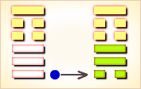
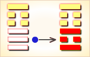
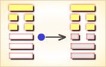
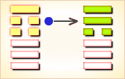
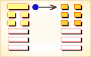

---
hide:
  - navigation
---
# 周易第26卦_大畜卦(山天大畜)_艮上乾下 

<table>
	<tbody>
		<tr>
			<td class="td1">
				</td>
			<td class="td1">
				</td>
			<td class="td1">
				</td>
			<td class="td1">
				</td>
		</tr>
		<tr>
			<td style="text-align: center;">
				<strong>本卦</strong></td>
			<td style="text-align: center;">
				<strong>互卦</strong></td>
			<td style="text-align: center;">
				<strong>错卦</strong></td>
			<td style="text-align: center;">
				<strong>综卦</strong></td>
		</tr>
		<tr>
			<td style="text-align: center;">
				<a href="" style="text-decoration: none;">第26卦：大畜卦(山天大畜)</a></td>
			<td style="text-align: center;">
				<a href="../54.雷泽归妹" style="text-decoration: none;">第54卦：归妹卦(雷泽归妹)</a></td>
			<td style="text-align: center;">
				<a href="../45.泽地萃" style="text-decoration: none;">第45卦：萃卦(泽地萃)</a></td>
			<td style="text-align: center;">
				<a href="../25.天雷无妄" style="text-decoration: none;">第25卦：无妄卦(天雷无妄)</a></td>
		</tr>
	</tbody>
</table>

## 周易第二十六卦详解

**大畜卦原文**

大畜。利贞，不家食，吉。利涉大川。

象曰：天在山中，大畜。君子以多识前言往行，以畜其德。

**白话文解释**

大畜卦：吉利的贞兆。不食于家，食于朝廷，吉利。筮遇此卦，有利于涉水渡河。

《象辞》说：内卦为乾为天，外卦为艮为山，太阳照耀于山中，万物摄取阳光雨露，各遂其生，这是大畜的卦象。君子观此卦象，从而广泛地了解古人的嘉言善行，来培养自己的德行。

**《断易天机》解**

大畜卦艮上乾下，为艮宫二世卦。畜为积蓄之意，艮为止，提示人们要停止下来积蓄力量，多主吉。

**北宋易学家邵雍解**

以阳畜阴，制止欲进；坚守正道，先凶后吉。

得此卦者，宜坚守正道，脚踏实地，务实行事，方可成就大业。切勿骄傲自满，目空一切。

台湾国学大儒傅佩荣解

时运：守静二年，方可展运。

财运：暂时株守，良机必至。

家宅：家业日隆；婚姻大吉。

身体：健康有力。

**传统解卦**

这个卦是异卦（下乾上艮）相叠。乾为天，刚健；艮为山，笃实。畜者积聚，大畜意为大积蓄。为此不畏严重的艰难险阻，努力修身养性以丰富德业。

大象：天之大而在山之中，以小阻大，以阴畜阳，为止为养。

运势：处事不可好高骛远，宜脚踏实地，可成大业，忌目空一切。

事业：务必端正行为，修养德行。行为应大胆、果断，但需适可而止，注意休整，决不可冒险闯进。宜注意吸收前人的经验教训，有所畏而不行，否则必有危害。再取得成就之后，应适可而止，不可贪图眼前小利而走向反面。

经商：本着循序渐进的原则，把握正当的商业道德，会有重大收获。此时，切忌贪心不足，而应见机而退，保守事业，深思熟虑，再图发展，一味自信冒进，决不可取。

求名：注意积累学问，提高德行，勿三天打鱼两天晒网，持之以恒，且以学问、知识报效国家，抱负终将实现。

婚恋：顺利。建立在共同勤俭持家的基础上，相互坦诚而待，美满幸福。

决策：蓄财的人，但决不可抱投机取巧心理，得靠个人诚实工作，多动心机，真诚与他人合作，共创事业，困难时仍应持正道，尤其不可粗心大意，牢记成就大阻力也大的道理。

**第二十六卦的哲学含义**

大畜卦卦象，山天大畜卦的象征意义

大畜卦，此卦是异卦相叠，乾在下，艮在上。乾为天，刚健；艮为山，笃实。畜者积聚，有积蓄和停止两种含义。大畜意为大积蓄。

大蓄卦与小蓄卦都有蓄养的意思，其不同的是，小畜的卦象是“”，是以孤阴畜止群阳，阳盛而阴衰，一个阴爻养五个阳爻，力量不足，不得不暂时停顿，积蓄力量。由此喻指处于乱世的贤能之士生不逢时，只好消极隐退，畜德积学，独善其身。大畜则不同，大畜象征大量的畜养积聚，如同大山蕴藏天下万物，所畜至为广大，喻指治世的明君要畜养贤士，利用人才来成就大业。

大畜卦位于无妄卦之后，《序卦》之中说道：“有无妄然后可畜，故受之以大畜。”不虚妄是真诚而实在的，由此培养内涵，然后可以大有积蓄。

《象》对此卦的解释是：天在山中，大畜；君子以多识前言往行，以畜其德。

《象》中指出大畜卦的卦象是乾（天）下艮（山）上，为天被包含在山里之表象，象征大量的畜养积聚；君子效法这一精神，应当努力更多地学习领会前代圣人君子的言论和行为，以此充实自己，培养美好的品德和积聚广博的知识。大畜卦启示了止而不止的道理，属于中上卦。《象》中这样来断此卦：忧愁常锁两眉头，千头万绪挂心间，从今以后防开阵，任意行而不相干。

## 周易第二十六卦初九爻详解

**初九爻辞**

初九。有厉，利已。

象曰：有厉利已，不犯灾也。

**白话文解释**

初九：将有危险，祭祀鬼神则能化凶为吉。

《象辞》说：将有危险，停止所为则能化凶为吉，因为这样就不会犯灾触难。

**北宋易学家邵雍解**

凶：得此爻者，宜守旧，不然会有不测之祸。做官的宜退居闲职，或退位。

台湾国学大儒傅佩荣解

时运：采取守势，等待援兵。

财运：等待帮手，方可获利。

家宅：屋宅忌高；夫顺妻吉。

身体：有病无虞。

**初九变卦**

初九爻动变得周易第18卦：山风蛊。这个卦是异卦（下巽上艮）相叠，与随卦互为综卦。蛊本意为事，引申为多事、混乱。器皿久不用而生虫称“蛊”，喻天下久安而因循、腐败，必须革新创造，治理整顿，挽救危机，重振事业。

**初九爻的哲学含义**

大畜卦第一爻，爻辞：初九：有厉，利已。

大畜卦第一爻初九：有厉，利已。爻辞释义

厉：是指危险。已：是指停止。

本爻辞的意思是：有危险，适宜停止。

《象》在解释这句爻辞时说道：“有厉，利己”，不犯灾也。这里指出，“有危险，适宜停止”，是为了不要招惹灾祸。

从整个卦象来看，初九是本卦最底层，意味着做事的初始阶段，与“潜龙勿用”的意思相近。大蓄卦以积蓄涵养为原则，初九是阳爻居刚位。易动，虽然德行和才能都没有学到位，但是却跃跃欲试。羽翼未非，躁动冒进，必有危险。也就是说，这时若是不顾一切地贸然前进就会有危险发生，只有暂时停下来不勉强前进才会有利，不要冒着灾难风险前进。

占得此爻者，有危险时不要莽撞作出决定，如果没有明确的目标和十足的把握，就暂时停下来充实自己。

## 周易第二十六卦九二爻详解

**九二爻辞**

九二。舆说輹。

象曰：舆说輹，中无尤也。

**白话文解释**

九二：车辐脱落，车轮坏了。

《象辞》说：车辐脱落车轮坏了，九二之爻居下卦中位，这种爻象表明毕竟没有忧患。

**北宋易学家邵雍解**

凶：得此爻者，须谨防是非，或有足疾、腰疾。

台湾国学大儒傅佩荣解

时运：以退为进，可保无患。

财运：早些脱手，减少损失。

家宅：谨慎守业；贵婿大吉。

身体：腹痛难愈，但无大碍。

**九二变卦**

九二爻动变得周易第22卦：山火贲。这个卦是异卦（下离上艮）相叠。离为火为明；艮为山为止。文明而有节制。贲卦论述文与质的关系，以质为主，以文调节。贲，文饰、修饰。

**九二爻的哲学含义**

大畜卦第二爻，爻辞：九二：舆说輹。

九二：舆说輹。爻辞释义

舆：指车子。说：同“脱”，脱离。輹：车轴。

本爻辞的意思是：车身脱去车轴自动停下来不再前进。

开始做事了，但是如果发现时机不成熟时，要自动停

下来，不再前进。

九二这一爻属于阳爻居阴位。阳爻有刚健、易动、急躁的特性，所以决定着手行动。可是因为失位，行动受阻。占得此爻者，要刚柔相济，恪守中道，审时局，知进退，冷静地放弃暂时的进取计划，争取积蓄力量。有如行到中途，发现不利于前进，就自动卸下车轴，不再前进，以待时机。

《象》曰：“舆说馥”，中无尤也。

这就是说：“车子脱去轮馥自动停下来不再前进”，说明九二爻虽然刚健急躁，但它能够自度量时，自动停止不前，所以没有贸然前进的过失。

九二：舆说輹。

## 周易第二十六卦九三爻详解详解

**九三爻辞**

九三。良马逐，利艰贞。曰闲舆卫，利有攸往。

象曰：利有攸往，上合志也。

**白话文解释**

九三：良马交配。占问艰难之事吉利。每天练习防卫性车战。有所往则有利。

《象辞》说：有所往则有利，所往必得，尚可符合心意。

**北宋易学家邵雍解**

平：得此爻者，会得到长辈的重用，或知己相助，前运辛苦，后可有获。做官的会有实权。

台湾国学大儒傅佩荣解

时运：临事而惧，马到成功。

财运：买卖合宜，有利可图。

家宅：勤俭兴家；男女合志。

身体：谨慎调养，可保无碍。

**九三变卦**

九三爻动变得周易第41卦：山泽损。这个卦是异卦（下兑上艮）相叠。艮为山；兑为泽。上山下泽，大泽浸蚀山根。损益相间，损中有益，益中有损。二者之间，不可不慎重对待。损下益上，治理国家，过度会损伤国基。应损则损，但必量力、适度。少损而益最佳。

**九三爻的哲学含义**

大畜卦第三爻，爻辞：九三：良马逐，利艰贞。

九三：良马逐，利艰贞。曰闲舆卫，利有攸往。爻辞释义

良马：指骏马。闲：通“娴”，指娴熟。舆：这里指驾车。卫：指防卫。

人若想开创事业，或者是想做某事时，就要像古代的战士去战场一样，首先要掌握好作战的本领，驾车要熟练，防卫的本领要过硬，这样在战场上才不至于失利。

占得此爻者，通过不断地学习、实践和总结，在艰难的时候磨练自己，等到具备了一定的能力，就可以动手去做事情了。只是在做的过程中，虽然可以快马加鞭，但是要注意没有一直平坦的路，要注意前进路上的各种艰难。只要你坚守正道，会顺利

## 周易第二十六卦九四爻详解详解

**六四爻辞**

六四。童豕之牿，元吉。

象曰：六四元吉，有喜也。

**白话文解释**

六四：将木棒横缚在好斗公牛的犄角上。筮遇此爻，大吉大利。

《象辞》说：**六四爻辞**讲的大吉大利，是指将有喜庆之事。

**北宋易学家邵雍解**

吉：得此爻者，营谋有望，财富增加。做官的会有升迁之喜。

台湾国学大儒傅佩荣解

时运：得人赏识，可以升迁。

财运：新货到手，蓄积有利。

家宅：新居有路；少年联姻。

身体：防小儿病。

**六四变卦**

六四爻动变得周易第14卦：火天大有。这个卦是异卦（下乾上离）相叠。上卦为离，为火；下卦为乾，为天。火在天上，普照万物，万民归顺，顺天依时，大有所成。

**九四爻的哲学含义**

大畜卦第四爻，爻辞：六四：童牛之牿，元吉。

八四：童牛之牿，元吉。爻辞释义

童牛：指未经驯化的小牛。牿：用来防止牛角抵人而安在牛角上的横木。本爻辞的意思是：给小牛犊戴上木枷，约束它，吉利。

从卦象上讲，六四处于上卦艮卦的下方，坤卦上面加一根横木便是艮卦，坤为牛，所以六四爻会有这样的爻辞。这一爻辞是告诉人们，好的习惯需要逐渐培养，就像驯小牛一样，逐渐让人们成为习惯。所以说人类的好习惯需要惩恶扬善的政策进行培养。

占得此爻者，应该对孩子严加管束，科学教育。对自己员工，应该做适当的培训和教育。

## 周易第二十六卦九五爻详解详解

**六五爻辞**

六五。豮豕之牙，吉。

象曰：六五之吉，有庆也。

**白话文解释**

六五：将好奔突的大猪圈起来，吉利。

《象辞》说：**六五爻辞**讲的吉利，是指有吉庆之事。

**北宋易学家邵雍解**

吉：得此爻者，营谋遂意，多有喜庆之事。做官的会高升。

台湾国学大儒傅佩荣解

时运：不可躁进，定而后动。

财运：得人支持，买卖有利。

家宅：住屋风水；婚姻合宜。

身体：调养节制。

**六五变卦**

六五爻动变得周易第9卦：风天小畜。这个卦是异卦（下乾上巽）相叠，乾为天，巽为风。喻风调雨顺，谷物滋长，故卦名小畜（蓄）。力量有限，须待发展到一定程度，才可大有作为。

**九五爻的哲学含义**

大畜卦第五爻，爻辞：六五：豮豕之牙，吉。

六五：豮豕之牙，吉。爻辞释义

豮：指阄割。豕，指公猪。

本爻辞的意思是：面对长有锋利牙齿的猪，将它阉割，这样就可以制服它的烈性，使其驯服，可获大吉。

这一爻讲述了用人、驭人的道理。野猪长着獠牙，是很凶猛的，对人很有威胁。你若想让其为你所用，不是拔掉它的牙齿，而是避其锋利，击其要害，将它阉割。这样就可以制服它刚暴凶猛的本性，使它变得温顺，这样便能平安无事。

对于一些很有能力人，恃才自傲，刚暴难制。六五处于君主之位，为大畜之王，对于这样的人才也想招来为己所用。其采用以柔制健的方法，禁暴抑盛，使有如长獠牙的野猪一样的人才，无形之中自然蜕化而得以驯服。因为能够抓住事物的关键，从根本上予以治理，因而是可庆可贺的。占得此爻者，在用人方面要学习这一点。

六五：豮豕之牙，吉。

象曰：六五之吉，有庆也。

经文意思是：割掉公猪的生殖器，猪嘴里的长牙便不会伤害人了，吉祥。象辞意思是：六五的吉祥是因为有值得庆幸的事。

“豮猪”是指割掉生殖器的公猪。野猪是一种极其凶猛的动物，人类很难驯服它。于是人们想出了一个办法，就是将野猪绑起来，然后把它的生殖器割掉，于是猪就老实了。古人就是用这个办法驯服了野猪而使它成为家畜。被驯服的野猪，虽然嘴里还长着长牙，可是性情温顺了，所以对人不会有伤害。

大畜卦的爻辞中，反映的是上古人们驯服家畜的情形，这正是人类能够积累财富的重要条件。如果远古人类不驯服动物，那么生产资料便不会得到更大的积蓄，财物便不会得到更多的积累。而《周易》中引用古人驯服动物的事迹，其一是让后人不要忘记先人的业绩;其二便是让人们明白培养人类道德思想时要借鉴驯服动物的经验。

## 周易第二十六卦上九爻详解详解

**上九爻辞**

上九。何天之衢，亨。

象曰：何天之衢，道大行也。

**白话文解释**

上九：得到上天的福佑，大吉大利。

《象辞》说：得到上天的福佑，行事畅通无阻。

**北宋易学家邵雍解**

吉：得此爻者，万事如意，心想事成，好运连连。做官的会得到上司的提拔，或被举荐而高升。读书人会进取成名。

台湾国学大儒傅佩荣解

时运：青云直上，可喜可贺。

财运：毫无阻碍，大获其利。

家宅：道旁吉宅；天作之合。

身体：健康平安。

**上九变卦**

上九爻动变得周易第11卦：地天泰。这个卦是异卦（下乾上坤）相叠，乾为天，为阳；坤为地，为阴，阴阳交感，上下互通，天地相交，万物纷纭。反之则凶，万事万物，皆对立，转化，盛极必衰，衰而转盛，故应时而变者泰（通）。

**上九爻的哲学含义**

 大畜卦第六爻，爻辞：上九：何天之衢，亨。

上九：何天之衢，亨。爻辞释义

何：通“荷”，为担负、承受、获得之意。衢：为交通要道。本爻辞的意思是：处于上天所赐的道路，通达。

这一爻是大蓄之后，开始收获的阶段了。

《象》曰：“何天之衢”，道大行也。这里指出：四通八达，畅通无阻的天街大道，是由于大量畜养积聚贤士，天下已经贤路大开了。

占得此爻者，经过一段时间的积蓄，使自己得到了提升，已经具备了通天之才，具备了更大的发展空间。这时会有让你施展才能的通天之路，有才能的人可以亨通发达了。

占得此爻者，在求功名上很顺利，前途畅通，可以自由地去实现自己的抱负。

从卦象上看，大畜卦的上卦为巽，六五相当于天子之位，象征天，而天上面的一横则像征天上的大街道。所以这一爻辞会有“何天之衢”