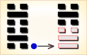
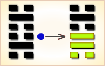
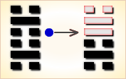
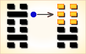
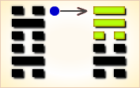

---
hide:
  - navigation
---
# 周易第29卦_坎卦(坎为水)_坎上坎下 

<table>
	<tbody>
		<tr>
			<td class="td1">
				</td>
			<td class="td1">
				</td>
			<td class="td1">
				</td>
			<td class="td1">
				</td>
		</tr>
		<tr>
			<td style="text-align: center;">
				<strong>本卦</strong></td>
			<td style="text-align: center;">
				<strong>互卦</strong></td>
			<td style="text-align: center;">
				<strong>错卦</strong></td>
			<td style="text-align: center;">
				<strong>综卦</strong></td>
		</tr>
		<tr>
			<td style="text-align: center;">
				<a href="" style="text-decoration: none;">第29卦：坎卦(坎为水)</a></td>
			<td style="text-align: center;">
				<a href="../27.山雷颐" style="text-decoration: none;">第27卦：颐卦(山雷颐)</a></td>
			<td style="text-align: center;">
				<a href="../30.离为火" style="text-decoration: none;">第30卦：离卦(离为火)</a></td>
			<td style="text-align: center;">
				<a href="" style="text-decoration: none;">第29卦：坎卦(坎为水)</a></td>
		</tr>
	</tbody>
</table>

## 周易第二十九卦详解

**坎卦原文**

坎。习坎，有孚，维心亨，行有尚。

象曰：水洊至，习坎。君子以常德行，习教事。

**白话文解释**

习坎卦：抓获俘虏，劝慰安抚他们，通泰。途中将得到帮助。

《象辞》说：坎为永，水长流不滞，是坎卦的卦象。君子观此卦象，从而尊尚德行，取法于细水长流之象，学习教化人民的方法。

**《断易天机》解**

坎卦坎上坎下，为坎宫本位卦。坎为陷入、陷阱，为险难之境。此时应坚持信心，才能豁然贯通。

**北宋易学家邵雍解**

艰难危险，重险重陷；事多困阻，谨慎行事。

得此卦者，运气不佳，多难危险，事多困阻，宜谨言慎行，退守保安。

台湾国学大儒傅佩荣解

时运：逐步升迁，随时防患。

财运：财如流水，商运亨通。

家宅：邻居营造；亲上加亲。

身体：水泻之症，虔心祷告。

**传统解卦**

这个卦是同卦（下坎上坎）相叠。坎为水、为险，两坎相重，险上加险，险阻重重。一阳陷二阴。所幸阴虚阳实，诚信可豁然贯通。虽险难重重，却方能显人性光彩。

大象：两水重叠，坎水为险，进固险，退亦险，进退两难。

运势：危机重重，宜沉著应付，保持心境开朗，凡事莫与人争。

事业：陷入重重艰难险阻之中，险况丛生。既不得冒险，也不可束手待毙，应以积极态度，努力创造条件，改变处境，化险为夷。务必实心实意，充满信心，不图侥幸，不辞艰险，宜静观待变，运用智慧，突破险境，转危为安。

经商：十分不利，甚至陷入面临破产的境地，但内心应沉着踏实，保持头脑冷静，身陷险境而心不陷，勿轻举妄动，先求自保以观变，把握时机以脱险。

求名：不为他人理解，怀才不遇，千万不可自暴自弃。不改初衷，泰然自若，循序渐进，终可为人理解和发现。

婚恋：多遭不利，应冷静分析原因，积极改变自身条件。双方同舟共济，共渡难关。

决策：不幸。然而是转运前的考验。只要能不因困境而失常，且不图侥幸，保持信心，勿自陷险境。镇定自若，不轻举妄动，洞察时机，必可转危为安，成出险之功。

**第二十九卦的哲学含义**

坎卦卦象，坎为水卦的象征意义

坎为水，《易经》中坎卦的符号为“”。这个符号的产生，是由于古人观望滔滔的江河，见中流强劲有力，像射出的箭一样，并向两边撞开一道道或缓或急的波汶和水流，于是以“一”象征中流，以“一”象征涌向两边的支流或波纹，合在一起，便形成了“”这一符号，以象征水。

坎卦除了象征水之外，还代表着月亮。

坎卦表示艰难、险阻的状态。

六四十卦之中的坎卦，这个卦是两个坎卦相叠。坎为水、为险，两坎相重，

险上加险，险阻重重。一阳陷二阴。所幸阴虚阳实，诚信可豁然贯通。虽险难重重，却方能显人性光彩。

坎卦位于大过卦之后，《序卦》之中说道：“物不可以终过，故受之以坎。

坎者，陷也。”大过卦有行动过当之意，如果行动过当，就会陷入危险之中，所以接下来谈坎卦。

《象》中这样解释坎卦：水洧至，习坎；君子以常德行，习教事。

《象》中指出：坎卦的卦象是坎（水）下坎（水）上，为水流之表象。流水相继而至、潮涌而来，必须充满前方无数极深的陷坑才能继续向前，所以象征重重的艰险困难；君子因此应当坚持不懈地努力，反复不间断地推进教育事业。

坎卦启示了行险用险的道理，属于下下卦。《象》中这样来断此卦：一轮明月照水中，只见影儿不见踪，愚夫当财下去取，摸来摸去一场空。

此卦名为坎。《说文》中说：“坎，陷也。”可见坎的本义是指坑与穴。但是这种地方正是水的居留之地，“水就下，处卑下之地”，所以坎也代表水。事物不可能永远是顺利地得以通过，总会有坎坷阻挡，所以大过之后便是坎卦。这就是《序卦传》中所说的：“物不可以终过，故受之以坎”。正因为这样，坎卦也含义险阻的含义。

卦画：坎卦的卦画是四个阴爻两个阳爻，两个阳爻分别位于上下卦之中。

卦象：从卦象上分析，坎卦是两个三爻坎卦重叠而成，象征一个陷阱接着一个陷阱，一个险阻接着一个险阻，一个险难接着一个险难，大水泛滥，灾难重重，缕遭坎坷。上卦的坎可代表天上的水，即雨、露、霜、雪、云、雾等，也代表外面来的灾难；下卦的坎可代表地中的水，即河、海、泉、湖、泊等，也代表内部引发的灾难。总之坎卦是内忧外患，险难不绝。

## 周易第二十九卦初九爻详解

**初六爻辞**

初六。习坎，入于坎窞。凶。

象曰：习坎入坎，失道凶也。

**白话文解释**

初六：坎坑之中又有坎坑，陷入重坑之中，凶险。

《象辞》说：“坎坑之中又有坎坑，陷入重坑当中”，不行坦途，偏要走险道，必招致灾殃。

**北宋易学家邵雍解**

凶：得此爻者，时运不佳，宜防跌入陷阱灾难之中。做官的须防小人。

台湾国学大儒傅佩荣解

时运：侥幸求名，反而受损。

财运：贩卖失利，有去无回。

家宅：不安之屋；婚姻小心。

身体：求医失当，情况危急。

**初六变卦**

初六爻动变得周易第60卦：水泽节。这个卦是异卦（下兑上坎）相叠。兑为泽，坎为水。泽有水而流有限，多必溢于泽外。因此要有节度，故称节。节卦与涣卦相反，互为综卦，交相使用。天地有节度才能常新，国家有节度才能安稳，个人有节度才能完美。

**初九爻的哲学含义**

坎卦第一爻，爻辞：初六：习坎，入于坎窖，凶。爻辞释义

习坎，我们知道，是双坎之下。“窖”是指坎中的小坑，深坑，也泛指洞穴。“入于坎窖”就是指掉进了坎中之坎。初六为阴爻居于刚位，这就属于失位，而它上面是阳，本身柔弱又无上无援，此为失道，所以为凶。

爻辞的解释就是：初六，在重重险阻之中，掉入陷阱。有凶祸。

《象》中这样说道：“习坎入坎”，失道“凶”也。这句话的意思是说：在双重危险之中又遇到危险，在行为上失掉正道，必然要遭受凶险。

这一爻一是劝人不要在重重危险之中视而不见，如果继续一意孤行，将会失掉朋友的帮助而陷入更大的困难之中。另一方面，还劝人走正道，如果不走平坦之路，偏走险道，必招致凶险。

占得此卦者，若是以前有违法犯罪的前科，虽被带进公安局或被拘留了却还是不知悔改，这一次就非常严重了，恐怕是大拘留或判刑了。有道是，“天作孽，犹可违，人作孽，不可活”。祸咎自取，可让人感叹，不可让人原谅。

初六阴爻居于阳位，又处于险难的最深处，与六四不应而敌，所以有陷入险难中不能自拔的形象。所以凶险。

## 周易第二十九卦九二爻详解

**九二爻辞**

九二。坎有险，求小得。

象曰：求小得，未出中也。

**白话文解释**

九二：坑坑坎坎，道有险阻。敢于行险道，或小有收获。

《象辞》说：敢于行险道，或小有收获，因为九二之爻居下卦的中位，像人尚未偏离正道。

**北宋易学家邵雍解**

平：得此爻者，有小成就，女命或为侍妾，凶者防险难或生心腹血气之疾。做官的会有小的成就，大事不成。

台湾国学大儒傅佩荣解

时运：小试有利，不可图大。

财运：小心经营，可有小利。

家宅：防止河岸。

身体：医治有效，但难全好。

**九二变卦**

九二爻动变得周易第8卦：水地比。这个卦是异卦（下坤上坎）相叠，坤为地，坎为水。水附大地，地纳河海，相互依赖，亲密无间。此卦与师卦完全相反，互为综卦。它阐述的是相亲相辅，宽宏无私，精诚团结的道理。

**九二爻的哲学含义**

坎卦第二爻，爻辞：九二：坎有险，求小得。爻辞释义

本爻辞的意思是：坎陷中出现险阻，求取小事情会有收获。

九二爻以阳爻居于阴位，失位，且处于下坎之中，难免遇到险阻。不过，它有初六来承比，是求小而有所得。九二居中，但是也陷于二阴爻之中间，上无应

援，所以未能离开困境，只能“求小得”，而无法求大得

占得此卦者，可注意从小处入手。在困境重重的时刻，如果你想投资做生意，只适合谋求小的利益，不要太贪心。如果遇到困难，也要注意从小处谋求脱险，这样才能成功。当发现自己处于危险的境地之时，不要逞一时之勇去拼，不要硬碰硬，而要小心谨慎，不走极端，这样就不会造成大的损失。

九二：坎有险，求小得。象曰：求小得，未出中也。

经文意思是：坎中有险，小的要求会得到满足

象辞意思是：小的要求会得到满足，是还没有从险中走出来

九二阳爻居于偶位为不得位，可是他能够居中，又有上下两个阴爻相辅助，所以会得到小的利益。可是为什么没有大的收获呢？因为三个爻同处于险难之中，初六与六三保住自己已经很困难，自然不会对九二有很大的帮助，并且九二与九五不应而相敌，所以只能得到小的利益。而这种利益也不过是两个阴爻能够舍己救主而已。

## 周易第二十九卦九三爻详解详解

**六三爻辞**

六三。来之坎坎，险且枕，入于坎窞，勿用。

象曰：来之坎坎，终无功也。

**白话文解释**

六三：向坑坎走来，这坑坎既险又深，陷入重坎之中，非常不利。

《象辞》说：来到这多坎之地，终无功利。

**北宋易学家邵雍解**

凶：得此爻者，多坎坷，多争诉之事。做官的宜退守。

台湾国学大儒傅佩荣解

时运：守住困穷，以待未来。

财运：航行受阻，暂时守成。

家宅：填满坎陷；求婚不成。

身体：不宜过劳。

**六三变卦**

六三爻动变得周易第48卦：水风井。这个卦是异卦（下巽上坎）相叠。坎为水；巽为木。树木得水而蓬勃生长。人靠水井生活，水井由人挖掘而成。相互为养，井以水养人，经久不竭，人应取此德而勤劳自勉。

**九三爻的哲学含义**

坎卦第三爻，爻辞：六三：来之坎坎，险且枕，入于坎窖，勿用。爻辞释义

这句爻辞的意思：来去都是险，四处充满了危险和困难。掉入陷阱之中，不可能有所作为。

坎卦第三爻，爻辞：六三：来之坎坎，险且枕，入于坎窖，勿用。人生启示：学会等待

本爻是说坎上坎下两卦皆险，而六三身居这两险之间，说明前临是险，后面也是险，自己处于这两险之间。

既然来去都处于危险之中，既不能前进又不能后退，不如姑且伏枕等待，不可轻举妄动。占得此卦者，最明智的行动就是等待，伏枕睡觉。

有些人遇到困难时，可能会想着拼一拼，搏一搏，以为这样就会成功。但是，有些时候，当到处都是危险时，你最好不要有所行动，学会等待，这是最好

的办法。比如在炒股时，行情不好，你不要行动，也不要买，也不要卖，等待时机吧。

六三：来之坎坎，险且枕，入于坎容，勿用。

象曰：来之坎坎，终无功也。

经文意思是：来去都是险阻，险境很深，小心落入危险的深渊，不要有所行动。象辞意思是：来去都是险，最终不会有成功。

六三处于上下坎卦的交界处，有内外临险的形象，所以有“来之坎坎”的爻辞。处于这种内忧外患、险象重生的情形下，是不利于有所行动的。所以爻辞说“勿用”。

## 周易第二十九卦九四爻详解详解

**六四爻辞**

六四。樽酒簋贰，用缶，纳约自牖，终无咎。

象曰：樽酒簋贰，刚柔际也。

**白话文解释**

六四：用铜樽盛酒，用圆簋盛饭。然而对于关押在坎窖里的犯人，只须用瓦盆子就行了，牢饭从天窗里送进取出，其人遭此噩运，但最后还是没有危险。

《象辞》说：“平时享受美食美器，此时用瓦盆子吃牢饭”，爻象表明六四阴爻处于九五阳爻之卞，像人被强者所压，受此磨难。

**北宋易学家邵雍解**

平：得此爻者，多喜事，或有结婚之喜。做官的多饮食之乐。

台湾国学大儒傅佩荣解

时运：春风得意，欢宴嘉宾。

财运：造酒之业，颇为顺利。

家宅：节俭持家；婚姻吉祥。

身体：最好祷告。

**六四变卦**

六四爻动变得周易第47卦：泽水困。这个卦是异卦（下坎上兑）相叠。兑为阴为泽喻悦；坎为阳为水喻险。泽水困，陷入困境，才智难以施展，仍坚守正道，自得其乐，必可成事，摆脱困境。

## 周易第二十九卦九五爻详解详解

**九五爻辞**

九五。坎不盈，只既平，无咎。

象曰：坎不盈，中未大也。

**白话文解释**

九五：坎坑虽没有填满，小山头却被锄平。没有灾难。

《象辞》说：小山头虽锄平，但坎坑尚未填满，说明道路不平，未成坦途。

**北宋易学家邵雍解**

平：得此爻者，平淡无常，宜养精蓄锐。做官的没有危难，职位无忧。

台湾国学大儒傅佩荣解

时运：不可自大，功名有限。

财运：不谈近利，考虑长远。

家宅：景观可喜；门当户对。

身体：平心静气。

**九五变卦**

九五爻动变得周易第7卦：地水师。这个卦是异卦（下坎上坤）相叠。“师”指军队。坎为水、为险；坤为地、为顺，喻寓兵于农。兵凶战危，用兵乃圣人不得已而为之，但它可以顺利无阻碍地解决矛盾，因为顺乎形势，师出有名，故能化凶为吉。

## 周易第二十九卦上九爻详解详解

**上六爻辞**

上六。系用徵纆，寘于丛棘，三岁不得，凶。

象曰：上六失道，凶三岁也。

**白话文解释**

上六：把犯人用绳索捆紧，投入周围有丛棘的监狱中，三年不得释放，这是凶险之事。

《象辞》说：**上六爻辞**所描述的，正说明官吏违背正道，违法囚人，历时三年之久。

**北宋易学家邵雍解**

凶：得此爻者，须防牢狱之灾。做官的须防职权旁落之忧。

台湾国学大儒傅佩荣解

时运：意外之灾，小心牢狱。

财运：纺织生意，三年有成。

家宅：整修家园；良缘须待三年。

身体：不易动弹，安心静养。

**上六变卦**

上六爻动变得周易第59卦：风水涣。这个卦是异卦（下坎上巽）相叠。风在水上行，推波助澜，四方流溢。涣，水流流散之意。象征组织和人心涣散，必须用积极的手段和方法克服，战胜弊端，挽救涣散，转危为安。