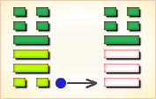
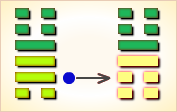
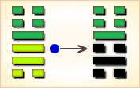
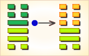
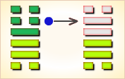
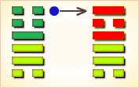

---
hide:
  - navigation
---
# 周易第32卦_恒卦(雷风恒)_震上巽下 

<table>
	<tbody>
		<tr>
			<td class="td1">
				</td>
			<td class="td1">
				</td>
			<td class="td1">
				</td>
			<td class="td1">
				</td>
		</tr>
		<tr>
			<td style="text-align: center;">
				<strong>本卦</strong></td>
			<td style="text-align: center;">
				<strong>互卦</strong></td>
			<td style="text-align: center;">
				<strong>错卦</strong></td>
			<td style="text-align: center;">
				<strong>综卦</strong></td>
		</tr>
		<tr>
			<td style="text-align: center;">
				<a href="" style="text-decoration: none;">第32卦：恒卦(雷风恒)</a></td>
			<td style="text-align: center;">
				<a href="../43.泽天夬" style="text-decoration: none;">第43卦：夬卦(泽天夬)</a></td>
			<td style="text-align: center;">
				<a href="../42.风雷益" style="text-decoration: none;">第42卦：益卦(风雷益)</a></td>
			<td style="text-align: center;">
				<a href="../31.泽山咸" style="text-decoration: none;">第31卦：咸卦(泽山咸)</a></td>
		</tr>
	</tbody>
</table>

## 周易第三十二卦详解

**恒卦原文**

恒。亨，无咎，利贞。利有攸往。

象曰：雷风，恒。君子以立不易方。

**白话文解释**

恒卦：通达，没有过失，吉利的卜问。有所往则有利。

《象辞》说：本卦上卦为震，震为雷，下卦为巽，巽为风，风雷荡涤，宇宙常新，这是恒卦的卦象。君子观此卦象，从而立于正道，坚守不易。

**《断易天机》解**

恒卦震上巽下，为震宫三世卦。恒卦的意思就是要坚持、恒定、有恒心，这样才能获得亨通。

**北宋易学家邵雍解**

经常恒久，长久不变；君子以利，不易其方。

得此卦者，须立身正道，坚守不易，持续努力，必能亨通。缺少毅力，朝三暮四者则不会成功。

台湾国学大儒傅佩荣解

时运：努力耕耘，不可躁进。

财运：贸易之地，不可更改。

家宅：方向不改；百年好合。

身体：气喘有痰，仍服旧方。

**传统解卦**

这个卦是异卦（下巽上震）相叠。震为男、为雷；巽为女、为风。震刚在上，巽柔在下。刚上柔下，造化有常，相互助长。阴阳相应，常情，故称为恒。

大象：震者为动，宜向外发展，巽为入，为内向，一内一外，各居本位，故能永恒不变，喻夫妇之道。

运势：万事亨通，能恒久努力，安守本份则吉，妄动则招灾。

事业：诸事无不成于恒，持之以恒，必有成效。恒乃成功之本。为此，务必动机纯正，守静而勿躁动，不可急于求成，也不可固守死道，应从个人实际出发。最忌人云亦云，最宜随机应变。如此，诸事顺而成。

经商：大胆行动，有所往必有所利。注意市场行情和周围的情况。随时变化经营策略，但不得改变常理常道，坚持慎重选择的方向，勿追随潮流。忌不自量而冒险强求。

求名：有始有终，善始善终，立于正道，坚持不懈，学习方面尤应提高涵养，必可成。

婚恋：好事多磨，有曲折，唯不可见异思迁，和睦相处，勿固执己见。

决策：循序渐进，不要在一开始时期望过高，但不能因此放弃追求，应脚踏实地，从实际也发，不要好高骛远，更不可不自量，勿冒险激进，勿反复无常。坚信宇宙常新，不断修正自己的见解，补充新内容。

**第三十二卦的哲学含义**

恒卦卦象，雷风恒卦的象征意义

恒卦，这个卦是异卦相叠，巽为下卦，震为上卦。震为男、为雷；巽为女、为风。震刚在上，巽柔在下。刚上柔下，造化有常，相互助长。阴阳相应，常情，故称为恒。

恒卦位于咸卦之后，《序卦》中说道：“夫妇之道不可以不久也，故受之以恒。恒者，久也。”咸卦描述男女感应，推及夫妇之道；在迅速引发情感之后，接着要考虑的是长久维持，所以出现了恒卦。

《象》中这样解释恒卦：雷风，恒；君子以立不易方。这里指出，恒卦的卦象是巽（风）下震（雷）上，为风雷交加之表象，二者常是相辅相成而不停地活动的形象，因而象征常久；君子效法这一现象，应当树立自身的形象，坚守常久不变的正道。

从卦象上进行分析，恒卦上卦为震为雷为长子，下卦为巽为风为长女，雷动风随，这是自然界最大的永远相随的形象，也是人们都能看到的形象。一打雷接着就会刮风,古人从这一自然现象来说明阴阳相随的道理。从而引申出夫妇亦应当像雷与风一样永远和睦相处。上一卦咸卦为少男与少女，这一卦则变为长子长女，这是喻示着男女由年少的相恋，到现在已经长大成熟，成为持久的夫妇关系。恒卦中内卦为巽外卦为震，则表示妻主内男主外的生活模式。

## 周易第三十二卦初九爻详解

**初六爻辞**

初六。浚恒，贞凶，无攸利。

象曰：浚恒之凶，始求深也。

**白话文解释**

初六：掘进不止，卜问凶险，没有什么好处。

《象辞》说：掘进不止之所以凶险，因为冒险求深，必遭崩塌之祸。

**北宋易学家邵雍解**

凶：得此爻者，人情乖离，前途渺茫，静守可免祸。做官的难于受到上司的赏识。

台湾国学大儒傅佩荣解

时运：安分知足，求荣反辱。

财运：得利即售，勿贪高价。

家宅：华丽难久；勿求攀结。

身体：运动伤害，操之过急。

**初六变卦**

初六爻动变得周易第34卦：雷天大壮。这个卦是异卦（下乾上震）相叠。震为雷；乾为天。乾刚震动。天鸣雷，云雷滚，声势宏大，阳气盛壮，万物生长。刚壮有力故曰壮。大而且壮，故名大壮。四阳壮盛，积极而有所作为，上正下正，标正影直。

**初九爻的哲学含义**

恒卦第一爻，爻辞：初六：浚恒，贞凶，无攸利。爻辞释义

浚：疏浚，指将河道挖深，疏通水流。

本爻辞的意思是：刨根挖底地深入追求常久之道，结果必然凶险，没有一点好处。

初六位于恒卦的第一爻，喻指事情处于初始阶段。初六阴柔失正，居位卑下，上应九四，处恒道之始，欲求深远之成果，却欲速不达。故应谨守正道以防凶险。否则执意浚恒，必将不得其利。

地深入追求常久之道所产生的凶险”，是因为事情刚开始，追求的目标就过于深远的缘故。

占得此爻者，可能正准备开始做某件事情，在这个时候，不适宜追求过分深入，也不要一下子投入太多。还没有真正地深入了解情况，就开始按恒久的打算来行事，会难以控制以后的发展。

恒卦也指夫妻情感，卦的上体为夫，下体为妇。按古人的观点，妻子应该顺从，应该是以下顺上，女人不应该主动。所以本爻如果从男女关系或夫妻感情上看，喻指女人急于求成，主动追求，缺乏自制的理智和涵养，这样是不利的。

天地的恒久之道有四季的变化，日月的恒久之道有消长盈虚的变化，而人也应当效法天地与日月的恒久之道，不可因恒而不变。

恒久是相对的，恒久是会有好结果的。爻辞中以“浚恒”为例，说明了这个道理。古人择水边而居，于是河水泛滥之灾成为人们生活的隐患。所以古人要适时地对河床进行清理，以防止河床变浅而导致水漫田庄。可是如果每天都进行清理河床，就没有必要了。这样做只能费力不讨好，因为人们不会因为每天清理河床而得到更多的生活资料。所以说天天清理河床，尽管出发目的是好的，但是结果也会凶险。

## 周易第三十二卦九二爻详解

**九二爻辞**

九二。悔亡。

象曰：九二悔亡，能久中也。

**白话文解释**

九二：没有悔恨。

《象辞》说：**九二爻辞**说没有悔恨，因为能坚守中正之道。

**北宋易学家邵雍解**

平：得此爻者，安分守己则无忧。做官的宜洁身自爱，谨慎行事。

台湾国学大儒傅佩荣解

时运：稳住阵脚，可以免祸。

财运：苦撑待变，将可回本。

家宅：位置不利，须待十年。

身体：尚称平顺。

**九二变卦**

九二爻动变得周易第62卦：雷山小过。这个卦是异卦（下艮上震）相叠。艮为山，震为雷，过山雷鸣，不可不畏惧。阳为大，阴为小，卦外四阴超过中二阳，故称“小过”，小有越过。

**九二爻的哲学含义**

恒卦第二爻，爻辞：九二：悔亡。爻辞释义

亡：是指自行消失。

本爻辞的意思是：悔恨自行消除。

从卦象上看，九二属于阳爻居柔位，本有失正之悔，但是由于其居位而应中，能谨守中道而恒久不偏，所以能消除失正之悔。

《象》中这样分析此爻：九二“悔亡”，能久中也。这里指出，九二这一爻能够使“悔恨自行消除”，是由于它能够常久地守中不偏的缘故。

占得此爻者，应该记住本爻的启示，在处理问题时要坚持不偏不倚的原则，这样便没有什么可担忧的，“人存中正德，守己自然安”，做事坚持正道，安分守己，一切都会变得顺利。

占得此爻者，如果现在正为所做过的事情后悔，那么不妨离开一段时间，或者是转移一下注意力，后悔就会自行消除了。

女子占得此爻，表示争强好胜，才能突出，在男人面前很强势，对丈夫横加指责或挑剔，有些违逆不敬的现象存在。但是女人对其丈夫是忠诚的，并无悖德行为发生，所以不会有灾祸，也不会发生什么后悔的事情。

九二爻居于下卦的中位，又与六五相应，所以不会有悔恨的事情发生。在恒卦中，九二能够恒久地守于中庸之道，既不过激也不过缓，所以可以恒而有成，不会造成悔恨。

## 周易第三十二卦九三爻详解详解

**九三爻辞**

九三。不恒其德，或承之羞，贞吝。

象曰：不恒其德，无所容也。

**白话文解释**

九三：不能保持其德行，必然蒙受耻辱。卜问得艰难之兆。

《象辞》说：不能保持其德行，反复无常，无人信任，必然落到无所容身的地步。

**北宋易学家邵雍解**

凶：得此爻者，须防小人诽谤，争诉之扰。做官的须防被贬。

台湾国学大儒傅佩荣解

时运：三心二意，如何成功。

财运：没有恒业，难以获利。

家宅：不利久居；难以偕老。

身体：运动无恒，如何健康。

**九三变卦**

九三爻动变得周易第40卦：雷水解。这个卦是异卦（下坎上震）相叠。震为雷、为动；坎为水、为险。险在内，动在外。严冬天地闭塞，静极而动。万象更新，冬去春来，一切消除，是为解。

**九三爻的哲学含义**

恒卦第三爻，爻辞：九三：不恒其德，或承之羞，贞吝。爻辞释义

或：指或许、有时、常常。承：是指承受、遭受。羞：是指羞辱。

本爻辞的意思是：不能恒守德行的人，常常会受到羞辱，若坚持不改则会有困难。

从卦象上看，九三属于阳爻居刚位，具有好动、急躁、盲进之象，其正应于上六，位处内外卦之间，会出现躁动盲进、守恒不终的情况，“凡无恒者，皆不能保其德”，不能长期地保持自己的美德，有时就会蒙受羞辱，行事艰难。

从夫妻关系、男女感情上看，因为下卦代表女人，九三这一爻指女人很强悍，不但性情泼辣，还有不能恒久坚守妇道之嫌，为此会被人羞辱。如果坚持不悔改，则难有好结果。

《象》中分析此爻道：“不恒其德”，无所容也。这里指出，“不能常久地保持美好的品德”，是说由于急躁妄动，不安分守己，没有恒心，因此落了个无处容身的下场。

九三：不恒其德，或承之羞，贞吝。

象曰：不恒其德，无所容也。

经文意思是：不能保持自己道德的持久，或受到羞辱，守正道而有忧吝。

象辞意思是：不能恒久保持道德，这种人哪里都不会容纳他。

九三爻处于恒卦下卦巽的最上爻，巽有相随、随顺的含义，所以九三爻的性情应当是极其随和的，但怎么会“不恒其德”呢？原来九三爻处于下互卦乾卦的中位，有健而动的形象，并且又与上六相应，所以他的随顺不是一味的顺从，而是左右摇摆，一会儿跟随这个人，一会儿又跟随那个人，这种行为就叫“不恒其德”，这样也就难免会“承羞”、“贞吝”了。这位九三爻就好比三国中的吕布，虽然勇猛英俊，但是总是对主人不忠，见谁势力大就跟谁，所以人们骂他是“三姓家奴”，到最后没人敢收留他了，落得被杀的下

场。这就是象辞所说的“不恒其德，无所容也”。

## 周易第三十二卦九四爻详解详解

**九四爻辞**

九四。田无禽。

象曰：久非其位，安得禽也。

**白话文解释**

九四：畋猎无所获。

《象辞》说：长久处于不适宜的环境，怎会有收获？

**北宋易学家邵雍解**

凶：得此爻者，营谋费力，难以成事。做官的时运不济，有所退步。

台湾国学大儒傅佩荣解

时运：不得正位，徒劳无功。

财运：地方不对，如何有利。

家宅：方位不利；配偶不和。

身体：服药谨慎。

**九四变卦**

九四爻动变得周易第46卦：地风升。这个卦是异卦（下巽上坤）相叠。坤为地、为顺；巽为木、为逊。大地生长树木，逐渐成长，日渐高大成材，喻事业步步高升，前程远大，故名“升”。

**九四爻的哲学含义**

恒卦第四爻，爻辞：九四：田无禽。爻辞释义

本爻辞的意思是：到田间打猎，没有捕获到任何禽兽。

从卦象上看，九四这一爻属于阳爻居柔位，失位，恒居不当之位，虽有应于初六，做事却每每徒劳而无功，犹如到外面打猎却没有什么收获一样。

《象》中这样分析本爻：久非其位，安得禽也？

这里指出：长久地处在不属于自己应该处的位置上，又怎么能够捕获到禽兽呢？可见九四可能是做事不踏实，就像去打猎一样，不在猎物出没的地方守候，而是选择了错误的地方，或者虽去打错，实际却心不在焉，游山玩水去了。

“久猎于山必得兽，久钓鱼水必得鱼，若不得其位，犹缘木求鱼，固无得矣。”占得此爻者，在做事时可能选错了方向，导致一无所获。如果想求财，也是难以如愿。

占得此爻者，在夫妻关系上是不和谐的。恒卦的上卦代表男人，九四这一爻在上卦之初。古人是男子养家，到外面打猎一无所获，那么用什么来养家呢？这表示男人的能力欠缺，由于阳爻居阴位，失位不中，可能是怀才不遇，或者能力欠缺，穷困潦倒，不能尽男人的职责来养家，所以夫妻关系可能会发生动摇。

九四也是一位坚持恒久的人，可是阳爻居于偶位，又是上卦震的主爻，所以有喜动不静的形象，也就是说九四的恒久是恒久地运动。打猎四处游走，可以捕到走兽，但这样经常走动却无法获得飞禽。为什么呢？因为鸟会受惊而飞走。我们捕鸟的时候必须要静悄悄地躲在一边，这样才会有鸟飞过来。如果大声喧哗，四处走动，鸟是不会飞过来的。

## 周易第三十二卦九五爻详解详解

**六五爻辞**

六五。恒其德，贞。妇人吉，夫子凶。

象曰：妇人贞吉，从一而终也。夫子制义，从妇凶也。

**白话文解释**

六五：操行一贯。卜得妇人吉利，丈夫凶险。

《象辞》说：爻辞讲妇人操守贞洁则吉利，这是符合从夫以终其身的道理。丈夫则因事制义，其道多方，如果以妇德来约束男子，则必遭凶险。

**北宋易学家邵雍解**

凶：得此爻者，多招毁谤，有所损失。做官的多阿谀权势而有失。

台湾国学大儒傅佩荣解

时运：迷恋感情，因小失大。

财运：只见小利，如何致富。

家宅：女强男弱；女占喜，男占凶。

身体：男女异命。

**六五变卦**

六五爻动变得周易第28卦：泽风大过。这个卦是异卦（下巽上兑）相叠。兑为泽、为悦，巽为木、为顺，泽水淹舟，遂成大错。阴阳爻相反，阳大阴小，行动非常，有过度形象，内刚外柔。

**九五爻的哲学含义**

恒卦第五爻，爻辞：六五：恒其德，贞；妇人吉，夫子凶。爻辞释义

本爻辞的意思是：长久地保持美德，坚守正道。对女子吉祥，对男子有凶

六五这一爻，要看占之者是男是女，同样要求做到“恒”，对于女人来说，

强调的是嫁人及夫妻关系，对于男人则调强的做事，开创事业，所以男女“丨亘”的结果是不同的。

《象》这样分析本爻：妇人贞吉，从一而终也；夫子制义，从妇凶也。这里指出，女人恒其美德，坚守正道可以获得吉祥，是说女人一生应该只嫁一个丈夫，终身都不能改嫁他人；男人遇事应当果断处理，如果像女人那样只知顺从、优柔寡断的话，就会遭遇凶险。因为男人在社交活动中，要因事制宜，善于权变，如果像女人一样处处唯唯诺诺，默守陈规陋俗，缺乏开创精神，是很难有所成就的，甚至会出现不能挣钱养家的情况。

六五以阴柔之德居于尊位，虽不得位但是居中，所以能够坚守中庸之道。六五的恒久相对妇人来讲是吉祥的。因为跟一个男人白头到老符合封建的礼教思想。可是男人如果像女人一样就会凶险了，这是怎么回事呢？其实六五的夫子指的便是九二与九四。六五地位髙于九二与九四，所以九二与九四必须听从六五的，故此爻辞中说六五的丈夫凶险。而六五的吉祥则来自于她在九二与九四之间选一个人作为自己的丈夫，并且能够从一而终，所以吉祥。从卦象上分析，他选择的应当是九四。也正因为这样，九四才会“田无禽”。因为九四与初六相应，有相恋之象，可是由于与六五的关系，他又无法与初六进一步发展，所以“无禽”。

## 周易第三十二卦上九爻详解详解

**上六爻辞**

上六。振恒，凶。

象曰：振恒在上，大无功也。

**白话文解释**

上六：久动不息，凶险。

《象辞》说：统治者朝令夕改，政令无常，其结果必所向无功。

**北宋易学家邵雍解**

凶：得此爻者，求名望利，小能成，大则无功，女人不利夫子。做官的会很劳累，多动少静。

台湾国学大儒傅佩荣解

时运：功名已尽，不可妄动。

财运：不愿结算，无利可言。

家宅：旧宅不改；再娶必凶。

身体：小心保养。

**上六变卦**

上六爻动变得周易第50卦：火风鼎。这个卦是异卦（下巽上离）相叠。燃木煮食，化生为熟，除旧布新的意思。鼎为重宝大器，三足稳重之象。煮食，喻食物充足，不再有困难和困扰。在此基础上宜变革，发展事业。

** 上九爻的哲学含义**

恒卦第六爻，爻辞：上六：振恒，凶。

恒卦第六爻，爻辞：上六：振恒，凶。爻辞释义

本爻辞的意思是：摇摆不定，不能坚守常久之道，凶险。

《象》分析此爻说：振恒在上，大无功也。这里指出：摇摆不定，不能坚守常久之道，但是又高高在上，终将一无所成，不会有所建树。

从卦象上看，上六居于全卦最高位置，有如上位者。如果他不断地改变政策和作风，别人将无所适从。占得此爻者，做事要有恒心，耐住性子，坚持始终才会有所收获。倘若见异思迁，好动不止，不能守恒，是成不了大事的。

从夫妻关系上看，若是不能“守恒”，不能对妻子保持忠诚，而是在外面拈花惹草，动念不止，夫妻之情是难以恒久的，结果也必然凶险。

上六：振恒，凶。

象曰：振恒在上，大无功也。

经文意思是：震动长时间不停，凶险。

象辞意思是：上六在最上位摇摆不定，什么事也办不成所以有凶险。

上六处于全卦的最高处，可是他由于又是震卦的最上爻，所以有剧烈摆动的形象。身临高位而摇摆不定，是不会有所作为的，所以上六凶险。《老子》中说：“治大国，若烹小鲜。”什么意思呢？就是说治理大的邦国，政策不能频繁改动，如果朝令夕改，那么百姓很难明白国君的政策到底是什么。因为古代信息不发达，所以大国家的君王要像烹饪小鱼小虾一样治理国家，小鱼小虾烹饪时不能经常翻动，如果翻动就会变成碎末，所以治大国也要这样。而上六就好比一个经常改变自己主意的君王，怎么会不凶险呢？