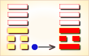
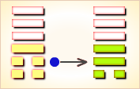
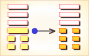
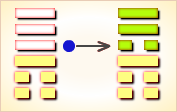
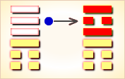

---
hide:
  - navigation
---
# 周易第33卦_遁卦(天山遁)_乾上艮下 

<table>
	<tbody>
		<tr>
			<td class="td1">
				</td>
			<td class="td1">
				</td>
			<td class="td1">
				</td>
			<td class="td1">
				</td>
		</tr>
		<tr>
			<td style="text-align: center;">
				<strong>本卦</strong></td>
			<td style="text-align: center;">
				<strong>互卦</strong></td>
			<td style="text-align: center;">
				<strong>错卦</strong></td>
			<td style="text-align: center;">
				<strong>综卦</strong></td>
		</tr>
		<tr>
			<td style="text-align: center;">
				<a href="" style="text-decoration: none;">第33卦：遁卦(天山遁)</a></td>
			<td style="text-align: center;">
				<a href="../44.天风姤" style="text-decoration: none;">第44卦：姤卦(天风姤)</a></td>
			<td style="text-align: center;">
				<a href="../19.地泽临" style="text-decoration: none;">第19卦：临卦(地泽临)</a></td>
			<td style="text-align: center;">
				<a href="../34.雷天大壮" style="text-decoration: none;">第34卦：大壮卦(雷天大壮)</a></td>
		</tr>
	</tbody>
</table>

## 周易第三十三卦详解

**遁卦原文**

遁。亨。小利贞。

象曰：天下有山，遁。君子以远小人，不恶而严。

**白话文解释**

遁卦：通达。小有利之占问。

《象辞》说：本卦上卦为乾，乾为天，下卦为艮，艮为山，天下有山，天高山远，是遁卦的卦象。君子观此卦象，从而不用以恶报恶的方法对付小人，而是采取严厉的态度，挂冠悬笏，自甘退隐，远离小人。

**《断易天机》解**

遁卦乾上艮下，为乾宫二世卦。卦下阴爻逐渐生长，是阳道将衰，恶事将起之兆，说明小人欲制君子，此时君子处于退避的状态。

**北宋易学家邵雍解**

逃避退隐，盛极必衰；言行严禁，待机再举。

得此卦者，宜退不宜进。退守可以保身，若轻举妄动则会招灾。宜谨言慎行，待机行事。

台湾国学大儒傅佩荣解

时运：最好退隐，君子有吉。

财运：物价涨跌，相去甚远。

家宅：须防作祟；婚姻不宜。

身体：避居吉地。

**传统解卦**

这个卦是异卦（下艮上乾）相叠。乾为天，艮为山。天下有山，山高天退。阴长阳消，小人得势，君子退隐，明哲保身，伺机救天下。

大象：山在天之下，阴渐长，而阳渐消，宜退避三舍。

运势：小人道长，君子道消，凡事宜退不宜进，穷则独善其身，修身养性。

事业：时运不佳，应考虑退隐，勿与不正派的人同流合污。但不是消极逃避，而是为保存实力，总结经验，把握时机，待机而出。切忌贸然行事，造成不必要的损失。同时勿为眼前小利禄所诱惑。

经商：市场进入衰落的状况，行情不佳。决不可执意追求，盲目投入，而应沉着冷静，坚持商业道德，远离小人、奸商，保存自己的实力，等待市场行情好转，再图发展。

求名：明哲保身，甘居退隐。全力总结提高，为复出做准备。

婚恋：勿急于解决，更不可妄动强求。时机成熟时，须以纯正的态度去正确对待。

决策：处于衰败时期，小人得志。盲目行动必遭不利。虽不必以恶报恶，但更不可同流合污，因小失大，因权宜轻重，韬光养晦，保存实力，断然离去，不可犹豫不决。潜心发展个人实力，隐忍待机。只要能坚定正道，坚持中正，必可在时机成熟时复出，成就大业。

**第三十三卦的哲学含义**

遁卦卦象，天山遁卦的象征意义

遁卦，是异卦相叠，下卦为艮，上卦为乾。从卦象来看，乾为天，艮为山。天下有山，山高天退。阴长阳消，小人得势，君子退隐，明哲保身，伺机救天若从另一个角度来看，艮为下卦，具有静止的意思，并不是隐退。而是喻指形势不利，要注意收敛自己的言行，与人和善相处。艮在乾卦之后，想要前进，被强大的乾卦挡住了去路，这时若是强行通过，肯定要经过一番拼杀，可是艮却不是乾的对手，明显会失利。所以为了保存实力，艮暂时停止，采取了回避的方遁卦在恒卦之后，《序卦》这样解释道：“物不可以久居其所，故受之以遁。遁者，退也。”恒卦以恒久为主旨，到了下一步则是退让，以便再度进取。

《象》中这样解释道：天下有山，遁；君子以远小人，不恶而严。

这里指出，遁卦的卦象是艮（山）下乾（天）上，为天下有山之表象，象征着隐让退避。因为山有多高，天就有多高，似乎山在逼天，而天在步步后退，但天无论怎样后退避让，却始终高踞在山之上。君子应同小人保持一定的距离，以傲然不可侵犯的态度截然划清彼此的界限，这样一来，就自然而然会生出一种震慑住小人的威严来。

遁卦所要启示的道理是遁世救世，它不同于小蓄、大蓄中倡导的陷居蓄德，也不同于随卦之中的顺从为人，与谦卦所中所倡导的内修谦和的性格也不同，它倡导的是：人在特殊环境下的一种主动的生存方式，讲求和善下处，适时进退。暂时的停止或妥协，是为了日后能够成功，此时的遁世，目的是将来能更好地救世。

遁卦象征退避，属于下下卦。遁也是消息卦，代表六月。《象》中这样来评断此卦：浓云蔽日不光明，劝君且莫出远行，婚姻求财皆不利，提防口舌到门

## 周易第三十三卦初九爻详解

**初六爻辞**

初六。遁尾，厉。勿用有攸往。

象曰：遁尾之厉，不往何灾也。

**白话文解释**

初六：君子全部隐退，国家就危险了。不能有所作为了。

《象辞》说：逃遁隐藏仍未脱离危险，若能坚持苦斗，设法取胜，有什么灾难？

**北宋易学家邵雍解**

凶：得此爻者，宜安分守己，可无忧。做官的宜择机而退。

台湾国学大儒傅佩荣解

时运：深藏不露，不会有难。

财运：全部出手，可以免灾。

家宅：早迁为宜；婚姻不合。

身体：走路小心。

**初六变卦**

初六爻动变得周易第13卦：天火同人。这个卦是异卦（下离上乾）相叠，乾为天，为君；离为火，为臣民百姓，上天下火，火性上升，同于天，上下和同，同舟共济，人际关系和谐，天下大同。

**初九爻的哲学含义**

遁卦第一爻，爻辞：初六：遁尾；厉。勿用有攸往。爻辞释义

尾：指后面。厉：指危厉，危险。

本爻辞的意思是：遁退不及时而落在后面，将有危险。暂时不宜有所行动。

从卦象上看，初六为阴爻，阴爻居于柔位，具有优柔寡断、办事迟疑不决的特点。危机来临，本来应该早些撤退，可是由于迟疑贻误了时机，这时再做退避已经来不及了，定会有凶险。该走的时候没有走成，隐退避让错过时机落在了后边，这时就不避再退让了，可以镇定自若，沉着地坚守在安全的住所，应该静观待变而不要有所行动，否则将会更加不利。

《象》这样分析本爻：遁尾之厉，不往何灾也？

《象》中指出：错过隐退避让的时机却还要隐退就会带来祸患，但是静观不动就不会造成什么危害。这是因为初六以阴爻处于柔位，性格温和地位卑微，所以不会有太大的灾祸。

初六：遁尾，厉，勿用有攸往。

象曰：遁尾之厉，不往何灾也。

经文意思是：逃跑落在最后，危险，不要往前走。

象舌羊意思是：逃跑落在后面的危险，不前往怎么会有突难呢?

小人得势的时代，贤明的君子总是能够及早看出势态变化而及早归隐，而归隐得不够及时，落在了归隐的最后一个，那么肯定是会遭到凶险的。比如小人掌握了大权，结果贤臣一个个都不在朝中为官，这样做会受到小人的迫害。所以说，隐遁一定要掌握好时机。

“遁尾”还有另一层意思，便是动物界的生存法则。在动物界中，獅子以羚羊为食，獅子虽然凶猛，但不如羚羊跑得快，所以双方各存优势，谁也没有把谁灭掉。但是獅子也练习奔跑的速度，它的目的是只要比跑在最后的羚羊速度快，它就会得到食物而不至于饿死；羚羊们也不断在提高自己的奔跑速度，每只羚羊必须保证自己的速度不是最后一名，才能保存自己不被狮子吃掉。而跑在最后的一只羚羊，便属于“遁尾”，会有危险。

## 周易第三十三卦九二爻详解

**六二爻辞**

六二。执之用黄牛之革，莫之胜说。

象曰：执用黄牛，固志也。

**白话文解释**

六二：抓来用黄牛革绳紧紧捆绑，这样就不能解脱了。

《象辞》说：用黄牛革绳捆绑，表示意志坚固。

**北宋易学家邵雍解**

平：得此爻者，家中有争执，安常守分无忧，农人有进牛畜之喜 。

台湾国学大儒傅佩荣解

时运：虽有才华，功名难望。

财运：守住本金，脱售不及。

家宅：迁移有利；退婚不易。

身体：运动有恒。

**六二变卦**

六二爻动变得周易第44卦：天风姤。这个卦是异卦（下巽上乾）相叠。乾为天，巽为风。天下有风，吹遍大地，阴阳交合，万物茂盛。姤（gǒu）卦与夬卦相反，互为“综卦”。姤即媾，阴阳相遇。但五阳一阴，不能长久相处。

**九二爻的哲学含义**

遁卦第二爻，爻辞：六二：执之用黄牛之革，莫之胜说。爻辞释义

执：指固结，捆住。革：指皮革。说：同“脱”，解脱。

本爻辞的意思是：用黄牛皮做成的绳子捆住，没有人能够逃脱。

六二这一爻所描述的是意志坚定，坚守不遁的情况。六二阴爻居柔位，属于：得位。执中守正，谨守静止之道。又上应九五君爻，坚韧而又有远见。

《象》中这样分析本爻：执用黄牛，固志也。

《象》中指出：“像用黄牛的皮捆绑起来那样”，意思是说，要坚定自己的志向，决不因任何情况而动摇。

占得此爻者，注意观察一下你周围的形势，虽然小人势力很强，情况对你不利，但是当有某种确定不移的原因要求你暂时不要退却时，那就要强化自己的意志，坚守下来，直到有所收获。

六二：执之用黃牛之革，莫之胜说。

象曰：执用黃牛，固志也。

经文意思是：用黄牛皮拧成的绳子拴住，没有人能够逃脱。

象辞意思是：用黄牛皮拧成的绳子拴住，是巩固他的意志。 

中国有一句成语叫“心猿意马”，便是说人的心像在树上荡来荡去的猿猴一样，意念像脱缰的野马一样无法约束。这正是人的最大弱点，所以《西游记》中唐僧骑着白龙马则象征着他征服了“意马”，给孙悟空戴上紧箍咒则象征他战胜了“心猿”。这是中国古老的养生之道，既战胜心猿意马，使心志保持平静，调摄精神。这种理论便是来源于《周易》。此处六二用黄牛皮拧成的绳子拴住自己，不是拴住自己的身体，而是拴住自己的意志，使自己的意志不会动摇。

## 周易第三十三卦九三爻详解详解

**九三爻辞**

九三。系遁，有疾厉。畜臣妾，吉。

象曰：系遁之厉，有疾惫也。畜臣妾吉，不可大事也。

**白话文解释**

九三：被拖累而不能决然隐退，就像身染重病，情形危险。在这种情况下，蓄养奴婢或可有利。

《象辞》说：被拖累以至不能决然隐退所造成的危险，有如被疾病折腾得疲惫不堪，所以说蓄养奴婢则吉，意思是暂且养疾疗伤，不可贸然行动。

**北宋易学家邵雍解**

平：得此爻者，多灾多难，良善者，得妻之力，或进人口。做官的宜急流勇退。

台湾国学大儒傅佩荣解

时运：急流勇退，可保无害。

财运：当售即售，久留必损。

家宅：急速迁移；娶妻不利。

身体：纵欲伤身。

**九三变卦**

九三爻动变得周易第12卦：天地否。这个卦是异卦（下坤上乾）相叠，其结构同泰卦相反，系阳气上升，阴气下降，天地不交，万物不通。它们彼此为“综卦”，表明泰极而否，否极泰来，互为因果。

**九三爻的哲学含义**

从卦象上看，九三阳爻居刚位，虽然得位，但是没有居中。上与上九相敌无应，下与六二、初六亲比，有亲小人远君子之象。在两阴爻的影响下，很快就会有变质堕落之危。

占得此爻者，要注意观察一下周围的朋友和所交往的人，如果与作奸犯科的小人为友，而不能快速地与他们断绝关系、远离他们，很快就会沦为他们的同党，而受到牵累。若是能以自己的阳刚正气畜止别人对自己的不良影响，则会平安吉祥。

《象》中分析此爻道：“系遁之厉”，有疾惫也。“畜臣妾吉”，不可大事

也。

这里指出：“由于被牵累而难以遁去，会有危险”，因为在这种想退而又不能退的情况下，就像疾病缠身那样使人疲惫不堪。“畜养仆人和侍妾就会吉祥”的意思是说，处在有所系累的情况下，是不可能有什么大作为的。

占得此爻要记住，不要过多地屈从于身边朋友和环境的影响，做自己意志的主人。不要让感情放纵，否则会弄得你疲惫不堪，并妨碍你的工作。

九三：系遁，有疾厉，畜臣妾吉。

象曰：系遁之厉，有疾惫也。畜臣妾吉，不可大事也。

经文意思是：系住逃跑的人，有大病一场的危险，畜养奴仆妹妾则吉祥。

象辞意思是：系住逃跑者的危险，是因为就像长期患病一样疲惫不堪。畜养奴仆婢妾则吉，是不可以办大事的意思。

“九三”柔比六二，心为所系。似得了厉害的疾病，退避时迟疑不决，故有危害。

正是有这种惩戒的方法，所以“畜臣妾吉”，因为奴隶或臣妾明白不忠于主人的下场。可是这毕竟不是治理天下的大道，所以“不可大事也”。

## 周易第三十三卦九四爻详解详解

**九四爻辞**

九四。好遁，君子吉，小人否。

象曰：君子好遁，小人否也。

**白话文解释**

九四：喜爱隐居，这对君子是吉利的，对小人则未必。

《象辞》说：君子不以利禄为心，喜爱隐居；小人以利禄为心，不甘退隐。

**北宋易学家邵雍解**

平：得此爻者，虽有收获，但谨防因小人而受祸。做官的宜告休避难。

台湾国学大儒傅佩荣解

时运：君子正名，小人盗名。

财运：出货得利，不必迟疑。

家宅：隐居为宜；离婚之忧。

身体：大人可治，小孩危险。

**九四变卦**

九四爻动变得周易第53卦：风山渐。这个卦是异卦（下艮上巽）相叠。艮为山，巽为木。山上有木，逐渐成长，山也随着增高。这是逐渐进步的过程，所以称渐，渐即进，渐渐前进而不急速。

**九四爻的哲学含义**

遁卦第四爻，爻辞：九四：好遁，君子吉，小人否。爻辞释义

好：指有利于。否：通“闭”，指遁道闭塞。

本爻辞的意思是：形势有利于遁让之时，君子能适时隐退而获吉。若是小人，则因错失良机致使遁道闭塞不通。

九四这一爻给人的启示是：当退则退，把握时机。从卦象上看，九四阳爻居于阴位，下与初六正应。当阴长阳消之时，九四之阳退变为阴，这时就应该觉察到形势不妙，急流勇退，回归正道。

九四位处遁卦的上卦乾的初始，乾为刚进、为果决。九四若能不恋继续攀升的私欲，及时回归正道，自然可以获吉。如若贪恋名利，不时识务，可能就会失去遁的好时机，而使自己身陷危险之中。

《象》中分析本爻道：君子好遁，小人否也。这里指出：君子能够做到该退就退，从容自如，而小人却做不到这一点。

占得此爻者，尽管心中怀有不舍，但是已经该适时退避了，该隐退时就隐退，这是意志坚强的表现，这一点只有君子才能够做到。若是意志脆弱，怀有不舍，或因为退避而觉得羞辱、害怕，而迟迟不肯退避，则会面临灾难。

九四：好遁，君子吉，小人否。

象曰：君子好遁，小人否也。

经文意思是：该退就退，君子吉祥，小人闭塞。

象辞意思是：君子能够急流勇退，小人则做不到这一点。

## 周易第三十三卦九五爻详解详解

**九五爻辞**

九五。嘉遁，贞吉。

象曰：嘉遁贞吉，以正志也。

**白话文解释**

九五：退隐以时，值得赞美，卜问前程，通泰吉利。

《象辞》说：退隐以时，值得赞美；遵循正道，所以吉利，因为他存心正直，品德崇高。

**北宋易学家邵雍解**

吉：得此爻者，近贵多利。做官的或升迁，或功成身退。

台湾国学大儒傅佩荣解

时运：功成身退，值得嘉许。

财运：应变得宜，仍可获利。

家宅：高风可尚；志同为婚。

身体：避开阴邪。

**九五变卦**

九五爻动变得周易第56卦：火山旅。这个卦是异卦（下艮上离）相叠。此卦与丰卦相反，互为“综卦”。山中燃火，烧而不止，火势不停地向前蔓延，如同途中行人，急于赶路。因而称旅卦。

**九五爻的哲学含义**

遁卦第五爻，爻辞：九五：嘉遁，贞吉。爻辞释义

嘉：美好而值得期许。

本爻辞的意思是：能够进退自如地隐退避让，坚守正道，其结果是吉祥的。

九五这一爻的“嘉遁”是比九四爻“好遁”更胜一筹。它距离阴爻的逼进尚远，却能明辨时势而不恋战，但是同时并未放弃自己当下的职责。

《象》这样分析本爻：“嘉遁，贞吉”，以正志也。这里指出：“能够自如地隐退避让，坚守正道将会获得吉祥”，关键是要坚定自己的信念和志向。

占得此爻者，要注意自己是该选择退避的时候了。要见好就收，选择最好的时机，把一切都安排就绪，没有什么好牵挂的了，及时退避，可获吉祥。

九五：嘉遁，贞吉。

象曰：嘉遁贞吉，以正志也。

经文意思是：功成身退，守正道吉祥。象辞意思是：功成身退而守正道的吉祥，是因为他明白正确的志向。

嘉遁的典型例子便是周公的事迹。周公对西周的贡献太大了，他平叛了“三叔”之乱，一举东征，不但扩大了西周的疆域，而且使西周的政权得到了巩固。东征归来后制礼作乐，总结前代贤人的治国之道，完善了礼乐治国的理论，为封建社会的社会治理开创了新的规范。可是他尽管这么有能力，却没有坐在君王的位子上不下来。而是功成身退，把君王的位子又还给了成王。如果周公当时被权势所诱惑而继上

## 周易第三十三卦上九爻详解详解

**上九爻辞**

上九。肥遁，无不利。

象曰：肥遁无不利，无所疑也。

**白话文解释**

上九：远走高飞，退隐山林，无不利。

《象辞》说：**上九爻辞**讲远走高飞，退隐山林，无不利，说明其人善观形势，急流勇退。

**北宋易学家邵雍解**

吉：得此爻者，营谋获利，家肥业厚。做官的乐天知命，退居闲职。

台湾国学大儒傅佩荣解

时运：乐天知命，安享天年。

财运：人弃我取，退可得利。

家宅：利于求财；私奔之虞。

身体：过胖虚脱。

**上九变卦**

上九爻动变得周易第31卦：泽山咸。这个卦是异卦（下艮上兑）相叠。艮为山；泽为水。兑柔在上，艮刚在下，水向下渗，柔上而刚下，交相感应。感则成。

**上九爻的哲学含义**

 遁卦第六爻，爻辞：上九：肥遁无不利。爻辞释义

月巴：借指为“飞”。

本爻辞的意思是：远走高飞，逃得无影无踪，无所不利。

从卦象上看，上九居遁卦最高位，又在上卦乾之中，乾为天，可以任它遨游，有高飞远引而去，啸傲山林之意。因为上九既无牵累，又已远离，早已处在隐退避让中，就像是远走高飞一样，所以无论这时做什么，都不会有什么不利。

占得此爻者，如果你能超越物质与欲望的诱惑，把感情从世俗中分离出来，你便能潇洒地遁去，既没有疑虑，也没有失落，还会有更重要的事等你去做。保持这种心境，你将会有更大的收获。

上九：肥遁，无不利。

象曰：肥遁，无本利；无所疑也。

经文意思是：飞一样的隐遁，没有任何不利的。

经文意思是：飞快隐遁而没有不利，是因为无所顾虑。

隐遁如飞，像飞鸟一样迅捷而自由，肯定是没有任何不利的因素。古代的隐士们便是这样，他们非常自由，将情志寄托于山水之间，自得其乐。可是他们仍然关心国家大事，他们既可以受到帝王们的重视和召见，又可深入百姓民众中了解民间的疾苦；既可以向贤明的君王提出忠告而得到赏赐，又可以避开当权的小人明哲保身，闭口不言，归隐保全。所以，“无不利”。