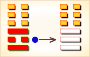
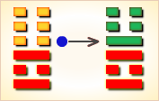
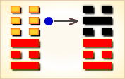
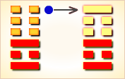

---
hide:
  - navigation
---
# 周易第36卦_明夷卦(地火明夷)_坤上离下 

<table>
	<tbody>
		<tr>
			<td class="td1">
				</td>
			<td class="td1">
				</td>
			<td class="td1">
				</td>
			<td class="td1">
				</td>
		</tr>
		<tr>
			<td style="text-align: center;">
				<strong>本卦</strong></td>
			<td style="text-align: center;">
				<strong>互卦</strong></td>
			<td style="text-align: center;">
				<strong>错卦</strong></td>
			<td style="text-align: center;">
				<strong>综卦</strong></td>
		</tr>
		<tr>
			<td style="text-align: center;">
				<a href="" style="text-decoration: none;">第36卦：明夷卦(地火明夷)</a></td>
			<td style="text-align: center;">
				<a href="../40.雷水解" style="text-decoration: none;">第40卦：解卦(雷水解)</a></td>
			<td style="text-align: center;">
				<a href="../06.天水讼" style="text-decoration: none;">第6卦：讼卦(天水讼)</a></td>
			<td style="text-align: center;">
				<a href="../35.火地晋" style="text-decoration: none;">第35卦：晋卦(火地晋)</a></td>
		</tr>
	</tbody>
</table>

## 周易第三十六卦详解

**明夷卦原文**

明夷。利艰贞。

象曰：明入地中，明夷。君子以莅众，用晦而明。

**白话文解释**

明夷卦：卜问艰难之事则利。

《象辞》说：本卦内卦为离，离为日，外卦为坤，坤为地。太阳没入地中，是明夷的卦象。君子观此卦象，治民理政，不以苛察为明，而是外愚内慧，容物亲众。

**《断易天机》解**

明夷卦坤上离下，为坎宫游魂卦。明夷即明德被伤，象征君子受厄，此时百事宜息，静观待变。

**北宋易学家邵雍解**

日入地中，光明被伤；万事阻滞，等待时运。

得此卦者，时运不佳，事事劳苦，宜坚守正道，忍耐自重，等待时机。

台湾国学大儒傅佩荣解

时运：明哲保身，以避灾厄。

财运：明无利润，暗中分红。

家宅：父子分居为宜；不是明媒正娶。

身体：肝大郁积，注意保养。

**传统解卦**

这个卦是异卦（下离上坤）相叠。离为明，坤为顺；离为日；坤为地。日没入地，光明受损，前途不明，环境困难，宜遵时养晦，坚守正道，外愚内慧，韬光养晦。

大象：太阳掩没在坤地之下，大地黑暗，有失明之象。

运势：百事阻滞，小人加害，遇事多迷惑，宜守，静待时机而动。

事业：处于不利的环境，宜心境坦然地处置险恶的条件，增强心理素质，承受各种压力。表面柔顺小心，内心洞察事理，当离去则离去，避免灾祸，脱离危险。防患于未然，坚持逆境中奋斗。

经商：认真观察市场动态，待机行动，但须坚持商业道德，即使处于不利情况下，也要冒险向前，特别是要向南方发展，会大有收获。

求名：内心保持大志，行动刻苦忍耐，奋斗于逆境，自守其志，收敛聪明而不外露，于混乱中更应坚持正义，守愚藏拙。

婚恋：必须全面分析对方情况，不能因小失大。注意大节。

决策：处在不佳的状况下，环境困难，前途不明。但若能坦处厄运，能伸能屈，前景会变光明。尤其应加强修养，隐忍行志，外愚内慧，可以遇难呈祥。如能谨慎行事，处处小心，更能有所作为。

**第三十六卦的哲学含义**

明夷卦卦象，地火明夷卦的象征意义

明夷卦是异卦相叠，下卦为离，上卦为坤。离为明，坤为顺；离为日，坤为地。日没入地，光明受损，前途不明，环境困难。施于人事，则为暗主在上，明臣在下，而不敢显其明智之谓也。宜遵时养晦，坚守正道，外愚内慧，韬光养晦，以避小人之害。

明夷卦位于晋卦之后，与晋卦为正覆卦。《序卦》说：“进必有所伤，故受之以明夷。夷者，伤也。”晋升或前进之中难免有所损伤，所以接着出现了明夷卦，意指光明受到伤害。程颐这样解释明夷卦与晋卦的区别：“晋者明盛之卦，明君在上，群贤并进之时也。明夷昏暗之卦，暗君在上，明者见伤之时也。”

《象》中这样解释明夷卦：明入地中，“明夷”；君子以莅众，用晦而明。

《象》中指出：明夷卦的卦象是离（火）下坤（地）上，离为火，代表光明，为光明入地下之表象，象征着“光明被阻”。君子要能够遵循这个道理去管理民众，即有意不表露自己的才能和智慧，反而能在不知不觉中使民众得到治

明夷卦象征光明受阻，属于中下卦。《象》中对此卦的评断是：时乖运拙走不着，急忙过河拆了桥，恩人无义反为怨，凡事无功枉受劳。

## 周易第三十六卦初九爻详解

**初九爻辞**

初九。明夷于飞，垂其翼。君子于行，三日不食。有攸往，主人有言。

象曰：君子于行，义不食也。

**白话文解释**

初九：“鹈鹕在飞翔，停栖在沼畔。君子离家走，三日无食粮。”筮遇此爻，有所往，则必遭主人谴责。

《象辞》说：君子在旅途中，依礼义不能蒙羞受食。

**北宋易学家邵雍解**

平：得此爻者，或有手足之伤，善者有进财纳福之喜。做官的有飞黄腾达之象，但谨防有失。

台湾国学大儒傅佩荣解

时运：未能腾达，善自保全。

财运：资本有损，主人烦言。

家宅：最好迁居；婚姻不谐。

身体：食道有疾，或病在手。

**初九变卦**

初九爻动变得周易第15卦：地山谦。这个卦是异卦（下艮上坤）相叠，艮为山，坤为地。地面有山，地卑（低）而山高，是为内高外低，比喻功高不自居，名高不自誉，位高不自傲。这就是谦。

**初九爻的哲学含义**

明夷卦第一爻，爻辞：初九：明夷于飞，垂其翼；

初九：明夷于飞，垂其翼；君子于行，三日不食。有攸往，主人有言。爻辞释义

于飞：指在飞行之中。

本爻辞的意思是：光明遭到损伤时，就像飞鸟低垂着翅膀，惊慌快行。君子若要退避隐藏，就是丢掉职位、没有饭吃也不在乎。但君子若在此时行动，必然要受到当政者的责备。

初九：明夷于飞，垂其翼；君子于行，三日不食。有攸往，主人有言。人生启示

“明夷卦”是“明入地中”，大地陷入黑暗。初九有动向，想要迅速离开，飞离此地。但是迫于时势，要“垂其翼”，希望低调保命。占得此爻者，在困难时期要保持低调，不要与人争强好胜，默默地做好手头上的事，不要着手上新的项目，也不要理会周围的流言蜚语。

《象》中说道：“君子于行”，义不食也。这里指出：“君子隐藏退避”是由于坚持道义和原则而不愿再拿这份俸禄了。明夷卦强调要坚守正道，对于君子来说，为了做到这一点，即使失去俸禄或钱财也不在所不惜了。

初九：明夷于飞，垂其翼。君子于行，三日不食。有攸往，主人有言。

象曰：君子于行，义不食也。

经文意思是：光明进入地中，鸟儿都回到了巢里不再飞翔。君子要离开，三天不吃东西。有所往，主人有责怪之言。象辞意思是：君子决意要离开，道义上不能再接受食祿。

明夷卦是从小过卦变化而来，小过卦的九四爻与初六爻互换，便成为明夷卦。小过卦有飞鸟的形象，小过的初六为鸟翼，现在来到了明夷卦六四的位置，所以有鸟收拢双翼的形象（即垂其翼）。

## 周易第三十六卦九二爻详解

**六二爻辞**

六二。明夷，夷于左股，用拯马壮，吉。

象曰：六二之吉，顺以则也。

**白话文解释**

六二：鹈鹕，鹈鹕，伤于左股，君子负伤，因马获救。吉利。

《象辞》说：**六二爻辞**所讲的吉利，是因为六二阴爻处于九三阳爻之下，正像马顺从主人善体人意。

**北宋易学家邵雍解**

吉：得此爻者，常人或有难，但会得贵人之助。做官的会有实权，能当大任。读书人会取得好成绩。

台湾国学大儒傅佩荣解

时运：贵人相助，幸免于难。

财运：策划不当，难免损失。

家宅：修缮完整；妇有足疾。

身体：左足受伤。

**六二变卦**

六二爻动变得周易第11卦：地天泰。这个卦是异卦（下乾上坤）相叠，乾为天，为阳；坤为地，为阴，阴阳交感，上下互通，天地相交，万物纷纭。反之则凶，万事万物，皆对立，转化，盛极必衰，衰而转盛，故应时而变者泰（通）。

**九二爻的哲学含义**

明夷卦第二爻，爻辞：六二：明夷，夷于左股，用拯马壮，吉。爻辞释义

左股：左边大腿。拯：拯救。马壮：指壮马。

从卦象上看，六二这一爻属于阴爻居柔位，得势，守中得正。六二具有柔顺中正的特性，这种人在昏暗之时，更容易被人欺侮，所以会受到伤害。不过由于这一爻守中得正，会有人前来相助，从而获吉。

《象》中分析此爻道：六二之吉，顺而则也。这里指出：六二爻之所以能够获得吉祥，是因为它柔顺而又坚持原则。

占得此爻者，当处境进一步恶化时，你的活动会受到制约。这时若是有强有力的朋友来帮助，可以帮助你减轻压力。

如果在单位里，可能遇到这样的情况：身边辅佐的人员受到了伤害，应当赶快补充强有力的人来解救危难局面，这就有如伤及左腿时，要以强壮的马来拯救一样，这样方能脱离险境，逢凶化吉。

六二：明夷，夷于左股，用拯马壮，吉。

象曰：六二之吉，顺以则也。

经文意思是：光明进入地中，左股受伤，有强壮的马来拯救，吉祥。象辞意思是：六二爻的吉祥，是由于他即顺从又有原则。

这就好比一个人走夜路，结果把大腿摔伤了。可是由于自己有一匹强壮的马，所以被马所拯救。遇险而有救，所以最终吉祥。六二爻是明夷卦下互卦坎卦的下爻，坎为美脊马、曳马，又代表险，所以有遇险而有马救的爻辞。马是极其通人性的，在故事片中我们会经常看到马怎样救主人的情景。有这样一匹好马，他的主人当然会吉祥了。

## 周易第三十六卦九三爻详解详解

**九三爻辞**

九三。明夷于南狩，得其大首，不可疾，贞。

象曰：南狩之志，乃大得也。

**白话文解释**

九三：在南方的猎区，拉弓射箭，获得一些大野兽。筮遇此爻，占问疾病则不利。

《象辞》说：决心在南方狩猎，大称其意。

**北宋易学家邵雍解**

平：得此爻者，有修屋宇造作之兆。不良者，左股或有伤，多忧愁分离之患。

台湾国学大儒傅佩荣解

时运：退守南方，可以得志。

财运：耐心经营，终见光明。

家宅：乡里富家；得其佳偶。

身体：南方修养较宜。

**九三变卦**

九三爻动变得周易第24卦：地雷复。这个卦是异卦（下震上坤）相叠。震为雷、为动；坤为地、为顺，动则顺，顺其自然。动在顺中，内阳外阴，循序运动，进退自如，利于前进。

**九三爻的哲学含义**

明夷卦第三爻，爻辞：九三：明夷于南狩，得其大首；不可疾，贞。爻辞释义

狩：指狩猎。大首：指首领。疾：指急切。

明夷卦第三爻，爻辞：九三：明夷于南狩，得其大首；不可疾，贞。人生启示

从卦象上看，九三爻属于阳爻居刚位，得位。阳爻具有好动、积极向上的特性，九三在下卦的终位，既有动向又心存光明，可以付诸行动。

《象》中这样分析本爻：南狩之志，乃大得也。这里指出：有到南方征伐巡狩的志向，就会有非常大的收获。

占得此爻者，虽然在艰难之中，但仍然可以有所作为，只要不操之过急，行动仍然能有所收获。

九三：明夷于南狩，得其大首，不可疾，贞。

象曰：南狩之志，乃大得也。

经文意思是：光明进入地中，在南方狩猎，捕捉到大首领，不可操之过急，坚守正道。象舌羊意思是：南方狩猎的事件，说明可以得到大的收获。

天黑了，动物们都在熟睡，这种情况去捕捉动物，则更容易获取猎物。然而相对于战争来说，夜袭也是一种极容易克敌制胜的战术。爻辞中所描述的便是一次成功的夜袭经过。不但打败了敌人，而且还俘获了敌人的头领。但是在这种情况下，由于黑暗不明，所以不利于穷追不舍，将敌人斩尽杀绝，所以“不可疾”。

爻辞中之所以“南狩”，主要是因为九三是明夷卦的下卦离卦的最上爻，离在文王八卦方位图中代表南方。

## 周易第三十六卦九四爻详解详解

**六四爻辞**

六四。入于左腹，获明夷之心，出于门庭。

象曰：入于左腹，获心意也。

**白话文解释**

六四：回到深隐之处吧！走出居室，进入社会，就感到环境的险恶，退隐的念头油然而生。

《象辞》说：回到深隐之处，就满足了退隐的心意。

**北宋易学家邵雍解**

平：得此爻者，出外营谋者会顺利，妇人有孕者生男，不良者或生心腹之疾。做官的闲职者会复职，在职者，多出外任职，韬光养晦者必出身成名。

台湾国学大儒傅佩荣解

时运：出明入暗，出门为宜。

财运：外出经商，称心致富。

家宅：路有阻碍；妇已有孕。

身体：心腹之症，出门求医。

**六四变卦**

六四爻动变得周易第55卦：雷火丰。这个卦是异卦（下离上震）相叠，电闪雷鸣，成就巨大，喻达到顶峰，如日中天。告戒：务必注意事物向相反方面发展，盛衰无常，不可不警惕。

**九四爻的哲学含义**

明夷卦第四爻，爻辞：六四：入于左腹，获明夷之心，于出门庭。爻辞释义

本爻辞的意思是：进入左方腹部，能够深入了解光明被阻的内部情况，于是坚定地跨出门庭，离开这里。

从卦象上看，六四爻属于阴爻居柔位，位居上卦之初。明夷卦的昏暗在上卦，所说六四已经进入了昏暗之中。

《象》中这样分析道：“入于左腹”，获心意也。这里指出：六四爻已经“进入左方腹部”，因此能够从内部深刻了解光明受阻的情形，了解到昏暗之君的心思与用意，然后决定离去，就像商朝时微子了解了商纣王之后，离开朝廷一样。

占得此爻者，陷入了困境之中，而且了解到了困境形成的原因：可能是领导昏庸，可能是小人当道。这时要下定决心，离开是非之地。当然，在这种最黑暗的时候，仍然要心存光明，坚守正道，这样才能重新被理解和重用。

六四：入于左腹，获明夷之心，出于门庭象曰：入于左腹，获心意也。

经文意思是：进入近臣内侧，获悉光明损伤的内情，走出了院子象辞意思是：进入近臣内侧，可以获得君王的真实想法。

## 周易第三十六卦九五爻详解详解

**六五爻辞**

六五。箕子之明夷，利贞。

象曰：箕子之贞，明不可息也。

**白话文解释**

六五：殷亡后，箕子逃到东方邻国避难，卜问得吉兆。

《象辞》说：箕子退隐守正，他的光辉形像千古不灭。

**北宋易学家邵雍解**

平：得此爻者，难逢知己，或有家难之祸。做官的须修德养性可保无忧。

台湾国学大儒傅佩荣解

时运：君子固穷，未来通达。

财运：历经艰难，方可获利。

家宅：亲族失和；罢婚为宜。

身体：精神症状。

**六五变卦**

六五爻动变得周易第63卦：水火既济。这个卦是异卦（下离上坎）相叠。坎为水，离为火，水火相交，水在火上，水势压倒火势，救火大功告成。既，已经；济，成也。既济就是事情已经成功，但终将发生变故。

**九五爻的哲学含义**

明夷卦第五爻，爻辞：六五：箕子之明夷，利贞。爻辞释义

箕子：是商纣王的叔父。《韩非子？喻老》篇载：“昔者纣为象箸而箕子怖”。商纣王让人给自己做了一双象牙筷子，别人不以为然，箕子知道后就感到很可怕。箕子说道：“用象牙筷子吃饭就一定不肯用粗碗具，必将犀玉杯盘、山珍海味，进而穿绫着缎、建高阔殿宇楼台，如此下去将一发不可收拾。”后来，纣王越发奢侈淫佚，箕子屡谏而纣王不听。有人劝箕子说：“这个国家已经无可救药了，快走吧。”箕子回答道：“为人臣谏不听而去，是彰君之恶而自说於民，吾不忍为也。”他认为作为一个臣子，进谏规劝君王的不合规矩的言行是自己的责任，君王不听谏，因此要离开君王，这样的做法就是要彰显君主的恶性恶德，标榜自己以取悦于民，自己不能这么做。

箕子在这里遵循了隐恶扬善的原则，这是古代倡导的正人君子所要坚守的美德。作为一个君子，不能整天掀起是非，不能哗众取宠。箕子没有选择离去，又不想助纣为虐，他披散着头发，佯装发狂。后来被商纣王贬为家奴，他就在箕山这个地方隐居下来，经常鼓琴悲怆地歌唱，后人将他歌唱的曲子纪录下来，名为《箕子操》。

在昏暗的专制社会，一个臣子若想不助纣为虐并能安全地活下来，是非常艰难的。箕子在这种情况下，不惜牺牲物质利益、权力和个人名誉，而等待昏暗的过去，光明的到来。他终于等到了这一天，后来周武王打败纣王后，曾经恭恭敬敬、诚惶诚恐地求教于箕子。箕子就把洪范九畴治国大道传授给周武王。

本爻辞的意思是：应采取箕子那种自掩其聪明才智的做法，这样做有利于坚守正道。

## 周易第三十六卦上九爻详解详解

**六五爻辞**

六五。箕子之明夷，利贞。

象曰：箕子之贞，明不可息也。

**白话文解释**

六五：殷亡后，箕子逃到东方邻国避难，卜问得吉兆。

《象辞》说：箕子退隐守正，他的光辉形像千古不灭。

**北宋易学家邵雍解**

平：得此爻者，难逢知己，或有家难之祸。做官的须修德养性可保无忧。

台湾国学大儒傅佩荣解

时运：君子固穷，未来通达。

财运：历经艰难，方可获利。

家宅：亲族失和；罢婚为宜。

身体：精神症状。

**六五变卦**

六五爻动变得周易第63卦：水火既济。这个卦是异卦（下离上坎）相叠。坎为水，离为火，水火相交，水在火上，水势压倒火势，救火大功告成。既，已经；济，成也。既济就是事情已经成功，但终将发生变故。

**上九爻的哲学含义**

明夷卦第六爻，爻辞：上六：不明，晦；初登于天，后入于地。爻辞释义

晦：含有黑暗和昏庸之意。

本爻辞的意思是：没有光明，一片晦暗。起初升到天上，后来陷入地下。

上六爻位于全卦的顶端，代表的是最黑暗之时。五爻与上爻属于上天之位，天上应该有太阳，照射四方的。可是上位者昏庸，不守正道，结果光明“陷入地下"。

《象》中这样解释本爻：“初登于天”，照四国也；“后入于地”失则也。这里指出：“超初升到天上”，是说它的光明能够普照四方各国；“后来陷入地下”，是说它已经因违背正道而丧失了应有的作用，由光明转入了黑暗。

占得此爻者，所处的集团或单位之中，领导昏庸，小人当道，身陷昏暗之上六：不明，晦，初登于天，后入于地。

象曰：初登于天，照四国也。后入于地，失则也。

经文意思是：不光明，晦暗。起初升上天空，后来落在地上。

象辞意思是：起初升上天空，可以光耀四方。后来落在地上，是失去了法则。

上六处于黑暗的极至之处，而最黑暗的时代，同时也是光明快要来临的时代。这就是所谓的黎明前的黑暗。所以在这里，向人们说明了光明与黑暗的轮回与交替现象。“初登于天”，描写的是日出；

“后入于地”，描写的是日落。所以在最黑暗的时刻，要明白光明就要来临了。

象辞对爻辞作进一步的发挥，认为日落导致的黑暗，是因为失去了法则造成的。在这里的日落，已不是我们在傍晚所看到的日落，而指的是一种政治上朋夷卦的腐败，是文明制度的日落，是黑暗腐败的意思。