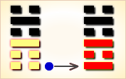
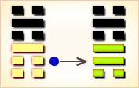
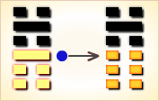
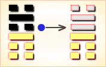
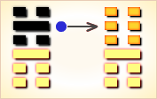
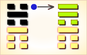

---
hide:
  - navigation
---
# 周易第39卦_蹇卦(水山蹇)_坎上艮下 

<table>
	<tbody>
		<tr>
			<td class="td1">
				</td>
			<td class="td1">
				</td>
			<td class="td1">
				</td>
			<td class="td1">
				</td>
		</tr>
		<tr>
			<td style="text-align: center;">
				<strong>本卦</strong></td>
			<td style="text-align: center;">
				<strong>互卦</strong></td>
			<td style="text-align: center;">
				<strong>错卦</strong></td>
			<td style="text-align: center;">
				<strong>综卦</strong></td>
		</tr>
		<tr>
			<td style="text-align: center;">
				<a href="" style="text-decoration: none;">第39卦：蹇卦(水山蹇)</a></td>
			<td style="text-align: center;">
				<a href="../64.火水未济" style="text-decoration: none;">第64卦：未济卦(火水未济)</a></td>
			<td style="text-align: center;">
				<a href="../38.火泽睽" style="text-decoration: none;">第38卦：睽卦(火泽睽)</a></td>
			<td style="text-align: center;">
				<a href="../40.雷水解" style="text-decoration: none;">第40卦：解卦(雷水解)</a></td>
		</tr>
	</tbody>
</table>

## 周易第三十九卦详解

**蹇卦原文**

蹇。利西南，不利东北。利见大人，贞吉。

象曰：山上有水，蹇。君子以反身修德。

**白话文解释**

蹇卦：筮遇此卦，利西南行，不利东北行。利见贵族王公，获吉祥之兆。

《象辞》说：上卦为坎，坎为水；下卦为艮，艮为山，山石磷峋，水流曲折，是蹇卦的卦象。君子观此卦象，悟行道之不易，从而反求诸己，修养德行。

**《断易天机》解**

蹇卦坎上艮下，为兑宫四世卦。此卦利于向西南方向行，不利于向东北方向，又利见大人。

**北宋易学家邵雍解**

踏步难行，艰辛万苦；进退维谷，容忍待时。

得此卦者，身心忧苦，举步维艰，宜守正道，不可妄动，涉险境者会有灾难。

台湾国学大儒傅佩荣解

时运：处于艰困，更加奋勉。

财运：财不流通，难以得利。

家宅：防水冲损；婚姻有悔。

身体：足部有疾，小心保养。

**传统解卦**

这个卦是异卦（下艮上坎）相叠。坎为水，艮为山。山高水深，困难重重，人生险阻，见险而止，明哲保身，可谓智慧。蹇，跋行艰难。

大象：前路险陷，后有高山，进退维谷，如跛者举步为艰。

运势：多灾多难，进退两难，此时宜守正道，不可轻举妄动，动反招祸。

事业：诸事开头难，坚持下去，会有好的结果。人生不易，首先得求助自己，修德养性。志高自信，奋勇进取。逢到困难，得求友人相助，行动不可冒险，要以柔克刚，待机候时，量力而行。

经商：逐步起业，冒险行事，自寻苦恼。宜加强商业道德，真诚同他人合作，陷入困境时，不得见死不救，而应奋不顾身。联合行动，可活跃于市场竞争之中。

求名：循序渐进，加强自身修道。居静观动，待变，伺机而动，能进则进。内心坦然，不可为追逐名利而冒险。与贤能结合，追随高人，必能转危为安。

婚恋：不很顺利，不得急，宜慎重选择。但应有自知之明。

决策：艰难不利。但可视为考验。奋进向前，充满信心，切勿自寻苦恼，交结贤人，相互帮助，坚守中正之道，可遇难呈祥，结得善果。

**第三十九卦的哲学含义**

蹇卦，这个卦是异卦相叠，下卦为艮，上卦为坎。坎为水，艮为山。山高水深，困难重重，人生险阻，见险而止，明哲保身，可谓智慧。

蹇，是指跋行艰难。蹇卦位于睽卦之后，《序卦》解释说：“乖必有难，故受之以蹇。蹇者，难也。”在睽卦的乖离之后，一定会出现艰难险阻，这正是蹇卦的用意。

《象》中这样解释本卦：山上有水，蹇；君子以反身修德。

《象》中指出：蹇卦的卦象是（山）下坎（水）上，为高山上积水之表象，象征艰难险阻，行动困难。面对这种情况，君子应该很好地反省自己，提高自己的品德修养，通过自身的努力渡过困境。

蹇卦象征陷入困境，难以前进，属于下下卦。《象》中这样来断此卦：大雨倾地雪满天，路上行人苦又寒，拖泥带水费尽力，事不遂心且耐烦。

## 周易第三十九卦初九爻详解

**初六爻辞**

初六。往蹇来誉。

象曰：往蹇来誉，宜待也。

**白话文解释**

初六：出门艰难，归来安适。

《象辞》说：出门艰难，归来安适，知难而退，坐待时机。

**北宋易学家邵雍解**

平：得此爻者，宜守旧安常。做官的稳步进取，好运将至。

台湾国学大儒傅佩荣解

时运：暂时退守，以待好运。

财运：不可冒险，守本为宜。

家宅：迁居不利；婚姻宜待。

身体：有病初起，退而自养。

**初六变卦**

初六爻动变得周易第63卦：水火既济。这个卦是异卦（下离上坎）相叠。坎为水，离为火，水火相交，水在火上，水势压倒火势，救火大功告成。既，已经；济，成也。既济就是事情已经成功，但终将发生变故。

**初九爻的哲学含义**

蹇卦第一爻，爻辞：初六：往蹇，来誉。爻辞释义

往：是指前往。来：是指回来。

本爻辞的意思是：前进将会进入险境，后退将得到赞美。

初六这一爻辞给的启示就是：势弱力柔，应见险而止，等待时机。

初六处蹇卦的开始，以阴爻居卑位，柔弱不正，位处下艮止卦之初，往前必将陷入上卦坎险中，是为“往蹇”。若能识时退处，见险而止，就能获得赞誉。

《象》中这样解释本爻：“往蹇来誉”，宜待也。这里指出：“前进将会进入险境，后退将得到赞美”，处在这种情况下，最好是安心等待，寻找时机，不要轻举妄动。

占得此爻者，如果你意识到前进有困难，暂时返回来等待，不失为一种明智的选择。

象辞意思是：前往遇险，回来有荣誉，这是说明应当等待时机。

初六身为蹇卦的最下爻，又是柔爻居于奇位为不得位，所以他没有力量跨越险阻。初六与九四相应，九四正是上卦坎卦的下爻，即险阻的边缘，也就是说初六虽然没有跨越险阻的能力，但是他的预见能力很强，所以还没有到危险的边缘，便知险而退。这种后退使自己减少了损失，自然会受到人们的赞誉。在现实生活中，我们经常会看到一些胆子小的人，这种人其实也有优点，就是能够及早预感到危险而做到防患未然，使自己不受损失。

## 周易第三十九卦九二爻详解

**六二爻辞**

六二。王臣蹇蹇，匪躬之故。

象曰：王臣蹇蹇，终无尤也。

**白话文解释**

六二：王臣之所以屡犯艰难，并不是为自身私利。

《象辞》说：王臣出以公心屡犯艰难，其自身始终没有过失。

**北宋易学家邵雍解**

凶：得此爻者，涉艰历险，营谋有阻。做官的宜保持忠贞，报效国家。

台湾国学大儒傅佩荣解

时运：劳碌不已，避开险难。

财运：中途受阻，人财两失。

家宅：方向不利；夫恐有难。

身体：过劳之厄。

**六二变卦**

六二爻动变得周易第48卦：水风井。这个卦是异卦（下巽上坎）相叠。坎为水；巽为木。树木得水而蓬勃生长。人靠水井生活，水井由人挖掘而成。相互为养，井以水养人，经久不竭，人应取此德而勤劳自勉。

**九二爻的哲学含义**

蹇卦第二爻，爻辞：六二：王臣蹇蹇，匪躬之故。爻辞释义

王：指九五爻。臣：指六二爻。蹇蹇：济蹇之时又遇蹇难，指想帮助别人渡度险阻，没想到也遇到了险阻。匪：同非。躬：自身。

本爻辞的意思是：臣子为了解救君王的困境努力奔走在危难之中，他们并不是为了自己。

从卦象上看，六二属于阴爻居柔位，居中守正，具有忠诚柔顺的特性，但是明显资质柔弱，才力不足。其与本卦的君王九五爻正应，对其可谓是忠心耿耿。九五陷于蹇难之中，六二奋力出手相助，其并不具备济蹇的条件，这一出手相助，使自己陷入了险阻之中。但是其深知这不是为了自己，而是为了匡救王室，因此虽赴汤蹈火，也在所不辞。

《象》中对此爻的解释是：“王臣蹇蹇”，终无尤也。这时指出：“臣子为了解救君主的困境而努力奔走在危难之中”，终究不会受到责怪。

虽然六二并不具备解救君王的能力，但是这种品质还是值得钦佩的。他没有私身远害，明哲保身，而是为了社稷宁愿赴汤蹈火，奔走济难，即使失败了，也不会被人责怪，当然，也不会自责。

占得此爻者，在不能前进的时候，任劳任怨地做好手边的工作。发现领导或上级遇到麻烦，要尽自己所能前去帮助，不要害怕能力不足而畏缩不前，前去行动，不会受到责难的。

六二爻居中而得正，所以具有中正之德，与他相应的是九五爻，九五爻也居中‘为臣，六二与九五都具有中正之德，所以不会犯任何错误，然而却险难重重，这险难来自于哪里呢？从卦象上看，九五处于上卦坎的中位，坎为险为难，所以有身陷险难之中的含义；六二爻为下互卦坎卦的下爻，所以也有身临险境的含义。可是这些灾难不是自己的错误导致的，所以最终不会有过失

## 周易第三十九卦九三爻详解详解

**九三爻辞**

九三。往蹇来反。

象曰：往蹇来反，内喜之也。

**白话文解释**

九三：出门困难重重，归来笑逐颜开。

《象辞》说：出门困难重重，归来笑逐颜开，这是发自内心的喜悦。

**北宋易学家邵雍解**

平：得此爻者，不宜进取，或有妻子之喜。做官的位高者会晋升。

台湾国学大儒傅佩荣解

时运：前进不易，且先退守。

财运：货物不畅，转销内地。

家宅：团聚之喜；重逢有缘。

身体：多加保养。

**九三变卦**

九三爻动变得周易第8卦：水地比。这个卦是异卦（下坤上坎）相叠，坤为地，坎为水。水附大地，地纳河海，相互依赖，亲密无间。此卦与师卦完全相反，互为综卦。它阐述的是相亲相辅，宽宏无私，精诚团结的道理。

**九三爻的哲学含义**

蹇卦第三爻，爻辞：九三：往蹇，来反。爻辞释义

反：同“返”。

本爻辞的意思是：前往有灾难，又返回来了。

九三爻给人的提示是：形势仍无转机，往则入险，返则得所。

从卦象上看，九三爻以阳爻居刚位，处于可进可退之际。它有上六正应，所以有上进之心。但是，面临的是上卦坎，坎为险，所以又返回来了。

《象》中这样解释本爻：“往蹇来反”，内喜之也。这里指出：“前往有灾难，又返回来了。”这样内部的力量必会来依附于己。

九三处于下卦最上端，下面是两个阴爻，九三是它们的顶梁柱。在蹇难之时，阴柔之爻不能自立，而要依赖九三的力量。九三本想上进，可是遇到困难回来了，两个阴爻自然十分高兴，乐于依附。

占得此爻者，若是你发现事业遇到险阻，再往前发展十分困难，这时不如回到家里，与家人在一起团聚欢乐。

象辞意思是：前往遇险又返回，是说内卦的两个阴爻都喜欢九三爻回来。

九三爻处于下互卦坎卦的中位，所以有身陷险中的含义，怎么办呢？他想走出险境，可是结果却遇到了更大的险。因为他前面正是蹇卦的上卦坎卦，所以他只得退了回来。由于九二交是下卦艮的上爻，所以他在更大的险难面前停止了。这就好比一个家里日渐穷困的男人，他为了给家里带来财富不得不离开家门，结果遇到了大的险阻，不得不返回到家中继续过贫穷的日子。可是他的返回，却使他的两个妻子非常髙兴，因为虽然穷，但毕竟一家人又可以团圆了。

## 周易第三十九卦九四爻详解详解

**六四爻辞**

六四。往蹇来连。

象曰：往蹇来连，当位实也。

**白话文解释**

六四：出门步履艰难，归来时却有车可乘。

《象辞》说：出门步履艰难，归来时却有车可乘，因为六四阴爻居阴位，像人才正当其位，德符其名。

**北宋易学家邵雍解**

凶：得此爻者，不良者会有争诉。做官的进升有机，求名望利皆有实而不虚。

台湾国学大儒傅佩荣解

时运：同心协力，可以过关。

财运：客人皆来，当然有利。

家宅：比邻而居；亲上加亲。

身体：久病缠身，一时难愈。

**六四变卦**

六四爻动变得周易第31卦：泽山咸。这个卦是异卦（下艮上兑）相叠。艮为山；泽为水。兑柔在上，艮刚在下，水向下渗，柔上而刚下，交相感应。感则成。

**九四爻的哲学含义**

蹇卦第四爻，爻辞：六四：往蹇，来连。爻辞释义

连：是指联合。

本爻辞的意思是：如若前往必有险阻，只有联合其他的力量，才有可能解救危难。

九三这一爻给人的启示是：处蹇难之时，应建立统一战线。

从卦象上看，六四是阴爻居柔位，自己无力渡过险阻，如想渡过，就要想办法联合其他力量。六四与九五亲比，又与九三阴阳相合，所以可以得到援助，走出危难。

《象》中分析道：“往蹇来连”位当实也。“只有联合其他的力理，才有可能解救危难”，是指这一爻所处的位置决定了他应该这样去做。

这一爻的启示，与三国时期蜀国的做法相似。刘备去世后，蜀国折兵损将，同时又面对魏国大兵压境，处于危急存亡的关头，在这国家蹇难之时，诸葛亮首先考虑到的就是建立统一战线，恢复与东吴的联盟关系。由于统一战线的建立，抵住了魏军对蜀国的侵犯，诸葛亮再无后顾之忧，得以放手南征，七擒孟获，北伐中原，六出祁山，取得了一系列的胜利。

占得此爻者，若是前进受阻，不如找朋友联络感情，或以真诚的态度结交朋友，寻求朋友的帮助，可助你走出险阻，也会使你以后的事业发展的基础更加稳。

## 周易第三十九卦九五爻详解详解

**九五爻辞**

九五。大蹇朋来。

象曰：大蹇朋来，以中节也。

**白话文解释**

九五：经历了很多艰难困苦，终予获得大利。

《象辞》说：大难当前，得到友人相助，因为九五之爻居上卦中位，像人节操贞正自能获救。

**北宋易学家邵雍解**

吉：得此爻者，会得到贵人提举，无往不利。

台湾国学大儒傅佩荣解

时运：转危为安，另图发展。

财运：货物太多，不易脱手。

家宅：不宜居家。

身体：众医会诊，才可治好。

**九五变卦**

九五爻动变得周易第15卦：地山谦。这个卦是异卦（下艮上坤）相叠，艮为山，坤为地。地面有山，地卑（低）而山高，是为内高外低，比喻功高不自居，名高不自誉，位高不自傲。这就是谦。

**九五爻的哲学含义**

蹇卦第五爻，爻辞：九五：大蹇，朋来。爻辞释义

朋：友朋，志同道合者。

本爻辞的意思是：处境极为艰难，但有志同道合者前来协助其渡过危难。

九五这一爻属于阳爻居刚位，居蹇卦上体坎险之中位，处在蹇难的深处，所以叫“大蹇”；这时有六二这样的臣子忠心耿耿地奔走济难。

《象》中这样分析道：“大蹇朋来”以中节也。这里指出：“处境极为艰难，但有志同道合者前来协助其渡过危难”，表明其能够坚守正道，行为合乎准则，所以有众多的人前来协助他。

从卦象上看，九五为阳爻且履中得正，有阳刚中正之德，故有解民倒悬、赴难济蹇的雄心壮志，身陷险难之中，不改济蹇之节，所以得到众多人的帮助。

占得此爻者，事业陷入极大的困境，但是在这种时候，也要坚守正道，不要采取违法或不合理的做法，这样就会有朋友前来相助。当你被困得进退不得的时候，只要你再坚持片刻，便会有朋友前来助你脱离险境。

## 周易第三十九卦上九爻详解详解

**上六爻辞**

上六。往蹇来硕，吉。利见大人。

象曰：往蹇来硕，志在内也；利见大人，以从贵也。

**白话文解释**

上六：出门困难重重，归来欢喜跳跃。筮遇此爻，吉利，利于会见贵族王公。

《象辞》说：出门困难重重，归来欢喜跳跃，说明志气高昂，奋勇取胜。爻辞说：利于会见贵族王公，说明追随贵人，必获福利。

**北宋易学家邵雍解**

吉：得此爻者，好运来到，营谋遂意。做官的会身居要职，读书人进取成名。

台湾国学大儒傅佩荣解

时运：大运将至，名利皆实。

财运：货价高涨，保本获利。

家宅：贵人相助；婚姻主贵。

身体：良医出手。

**上六变卦**

上六爻动变得周易第53卦：风山渐。这个卦是异卦（下艮上巽）相叠。艮为山，巽为木。山上有木，逐渐成长，山也随着增高。这是逐渐进步的过程，所以称渐，渐即进，渐渐前进而不急速。

**上九爻的哲学含义**

蹇卦第六爻，爻辞：上六：往蹇，来硕；吉；利见大人。爻辞释义。硕：丰硕。

本爻辞的意思是：前进有险阻，归来获丰收。这样做就会吉祥如意；有利于出现大人物。

上六以柔爻居阴位，且处全卦之极，不可能再往前了，若硬往前行非但无益，反而更生蹇难，如果归来，联合九三，归顺九五，有这两刚相助，济蹇之大功即可告成，所以爻辞说“来硕”。六爻的蹇难就全部得以解脱，所以得“吉”。

《象》中这样分析本爻：“往蹇来硕”，志在内也；“利见大人”，以从贵也。这里指出：“前进有险阻，归来获丰收”，是因为关鍵在于首先要联合自己内部的各种力量才能够共同度过艰难时世。“利于出现大人物”，说明应当追随尊贵的君主去建功立业。

占得此爻者，可能在前进时遇到困难，事业到了绝路上，这时人不妨退下来，可能会有意想不到的收获。下一步，你要结交朋友，然后去求见有影响力的大人物，会得到他们的帮助而走出难关。

上六：往蹇来硕，吉；利见大人。

象曰：往蹇来硕，志在内也。利见大人，以从贵也。

经文意思是：前往遇到险阻，回来有大功劳，吉祥，有利于拜见大人物。

象辞意思是：前往遇到险阻，回来有大功劳，是上六爻与大家齐心协力的结果。有利于拜见大人物，说明上六爻跟随尊贵的君主。

上六处于艰险的极至上，他的险难不是山川险阻之难，而是穷途末路、无处可走的险难。怎么办呢？只有退回来，退回来与众人一起渡过眼前的险难。上六与九三相应，与九五相合，所以他有回来的意愿。他回转后便可与九五相合，所以“利见大人”。上六的吉祥就在于能够在无路可走的情况下退回来。这就好比一个部落中发生了水灾，上六从水灾中逃了出来，可是他却发现前面虽然没有水的灾害，但是却无路可走了。在这种情况下，他又回到了灾区，与大家团结在一起，共同抵抗灾害。俗话说“人多力量大，人心齐泰山移”，上六的回来增添了抗灾的力量，当然会吉祥了。