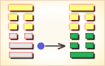
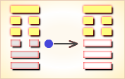
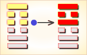
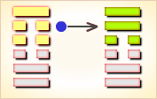
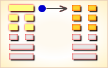

---
hide:
  - navigation
---
# 周易第41卦_损卦(山泽损)_艮上兑下 

<table>
	<tbody>
		<tr>
			<td class="td1">
				</td>
			<td class="td1">
				</td>
			<td class="td1">
				</td>
			<td class="td1">
				</td>
		</tr>
		<tr>
			<td style="text-align: center;">
				<strong>本卦</strong></td>
			<td style="text-align: center;">
				<strong>互卦</strong></td>
			<td style="text-align: center;">
				<strong>错卦</strong></td>
			<td style="text-align: center;">
				<strong>综卦</strong></td>
		</tr>
		<tr>
			<td style="text-align: center;">
				<a href="" style="text-decoration: none;">第41卦：损卦(山泽损)</a></td>
			<td style="text-align: center;">
				<a href="../24.地雷复" style="text-decoration: none;">第24卦：复卦(地雷复)</a></td>
			<td style="text-align: center;">
				<a href="../31.泽山咸" style="text-decoration: none;">第31卦：咸卦(泽山咸)</a></td>
			<td style="text-align: center;">
				<a href="../42.风雷益" style="text-decoration: none;">第42卦：益卦(风雷益)</a></td>
		</tr>
	</tbody>
</table>

## 周易第四十一卦详解

**损卦原文**

损。有孚，元吉，无咎，可贞。利有攸往。曷之用？二簋可用享。

象曰：山下有泽，损。君子以征忿窒欲。

**白话文解释**

损卦：筮遇此卦，将有所俘获，大吉大利，没有灾难，是称心的卜问。而且所往将获利。将有人送来两盆食物，可享口福。

《象辞》说：本卦上卦为艮，艮为山；下卦为兑，兑为泽，可见山下有泽是损卦的卦象。君子观此卦象，以泽水浸蚀山脚为戒，从而制止其忿怒，杜塞其贪欲。

**《断易天机》解**

损卦艮上兑下，为艮宫三世卦。损象征损益、减少，为损己之兆，多主不吉，但只要坚守诚信，就会有利。

**北宋易学家邵雍解**

损下益上，损盈益虚；先难后易，量入为出。

得此卦者，损己利人，虽然开始会有所不顺，但付出总会有所回报，因祸得福之象。

台湾国学大儒傅佩荣解

时运：心平气和，才有发展。

财运：和气生财，损己利人。

家宅：地势宜平；夫妇得正。

身体：修身养性。

**传统解卦**

这个卦是异卦（下兑上艮）相叠。艮为山；兑为泽。上山下泽，大泽浸蚀山根。损益相间，损中有益，益中有损。二者之间，不可不慎重对待。损下益上，治理国家，过度会损伤国基。应损则损，但必量力、适度。少损而益最佳。

大象：山高水深，各得其所，因损得益之象。

运势：现况诸事不顺，有破财之象，虽先损失，但后反而得益，因祸得福。

事业：开拓事业要有所投入，投入多少应事先精心算计，力求损益得当。诸事皆应有节度，切忌欺诈、贪婪。天下事克己最难，务必严格要求自己，刻苦奋斗，手段灵活，争取事业成功。

经商：全面调查市场行情，计算投入和收益的比例。不必过于计较利润的多少，获利即可。真诚与他人合作，彼此信任，手段灵活，切勿自我封闭。

求名：为了成长进步，务必有所投入，且应付诸实践。以损增益，成就理想。

婚恋：全面权衡对方的长处与短处，应从大处着眼。

决策：为人聪颖，善于权衡利弊。顺应自然发展规律，积极主动与他人合作，助人为乐，适度投入，资助他人，而自己要宁俭勿奢。如此，诸事都可以十分顺利。

**第四十一卦的哲学含义**

损卦卦象，山泽损卦的象征意义

损卦，这个卦是异卦相叠。上卦为艮，下卦为兑，艮为山；兑为泽。兑下艮上，说明山下有泽。泽水由下向上渗透，滋润山上万物生长，但是却使泽水减少。所以兑下艮上这一卦被命名为含有减少之意的“损”。

从另一个角度来看，艮上兑下，山上泽下，意味着大泽浸蚀山根。损下益上，治理国家，过度会损伤国基。应损则损，但必量力、适度。少损而益最佳。损卦象征着损益相间，损中有益，益中有损。二者之间，不可不慎重对待。

损卦位于解卦之后，《序卦》中这样解释道：“缓必有所失，故受之以损。”解卦在缓和了困难之后，一定会因松懈而造成损失，所以接着就出现了损卦。

《象》中对本卦的解释是：山下有泽，损；君子以惩忿窒欲。这里指出：损卦的卦象是兑（泽）下艮（山）上，为山下有湖泽之表象，湖泽因为滋润山上的万物而减损自己，这就是损卦的含义。按照这一现象中包含的哲理来做人，君子就应该抑制狂怒暴躁的脾性，杜绝私欲，多做点有益于大家的事情。

损卦象征着减损，是下下卦。《象》中这样来断此卦：时动不至费心多，比作推车受折磨，山路崎岖吊下耳，做插右按按不着。

## 周易第四十一卦初九爻详解

**初九爻辞**

初九。已事遄往，无咎，酌损之。

象曰：已事遄往，尚合志也。

**白话文解释**

初九：祭祀大事，得赶快去参加，这才不会有灾难。祭品过丰，可以酌情减损。

《象辞》说：“祭祀大事，得赶快去参加”，这是体现了敬畏鬼神的心意。

**北宋易学家邵雍解**

平：得此爻者，谋事得当，可获利，不良者，或因酒食误事。做官的会因为工作忙碌而顾不得家庭，声望日盛。

台湾国学大儒傅佩荣解

时运：加进努力，或仍有望。

财运：判断准确，自有利益。

家宅：早些迁移；即日迎娶。

身体：立即行动。

**初九变卦**

初九爻动变得周易第4卦：山水蒙。这个卦是异卦（下坎上艮）相叠，艮是山的形象，喻止；坎是水的形象，喻险。卦形为山下有险，仍不停止前进，是为蒙昧，故称蒙卦。但因把握时机，行动切合时宜，因此，具有启蒙和通达的卦象。

**初九爻的哲学含义**

损卦第一爻，爻辞：初九：已事遄往，无咎；酌损之。

已：停止。遄：急，快速。酌：适当。

本爻辞的意思是：停下正在做的事情赶快前去助人，没有灾祸；不过适当斟酌减损自己一部分利益就可以了。

从卦象上看，初九位于损卦之初，要做损下益上之事，必须要适当，不可过度或过量。

《象》中这样解释本爻：“已事遄往”，尚合志也。这里指出：“停下正在做的事情赶快前去助人”，处在尊位的柔弱之辈正需要帮助，地位卑下的阳刚之士首当其冲，义不容辞，立刻牺牲自己的事业而成人之美，表现出与尊贵者心心相印的关系。

占得此爻者，如果周围有人遇到了困难，你要及时出手相助，这虽然会有一定的损失，但是，这能积累人脉关系，给别人留下好印象。不过，不要倾囊相助，只提供适当的帮助就可以了。

初九：已事遄往，无咎，酌损之。

象曰：已事通往，尚合志也。

经文意思是：办完事急忙去，没有灾难，只是少喝点酒的损失。象辞意思是：办完事急忙去，早往合乎心志。

初九与六四相应，就好比六四设宴邀请初九，初九由于身边有事，所以做完手头的工作后便去赴宴，结果去得有些晚了，大家都已经吃得喝得只剩残局。这种损失，只是少喝点酒的损失，所以不会造成灾难。因为初九前去赴宴的目的，不是为了吃喝，而是为了与六四进行交往。

## 周易第四十一卦九二爻详解

**九二爻辞**

九二。利贞，征凶。弗损，益之。

象曰：九二利贞，中以为志也。

**白话文解释**

九二：吉利的卜问。征伐他国则凶。因为这样作对于他国非但不能损伤，反而有利。

《象辞》说：**九二爻辞**讲的吉利的卜问，因为九二之爻居下卦中位，像人行事以处正守贞为心。

**北宋易学家邵雍解**

凶：得此爻者，宜谨守勿动。做官的时机未成熟，难于升迁。

台湾国学大儒傅佩荣解

时运：中庸处世，自有好运。

财运：货物合宜，应可获利。

家宅：守之则吉；门当户对。

身体：平常状态。

**九二变卦**

九二爻动变得周易第27卦：山雷颐。这个卦是异卦（下震上艮）相叠。震为雷，艮为山。山在上而雷在下，外实内虚。春暖万物养育，依时养贤育民。阳实阴虚，实者养人，虚者为人养。自食其力。

**九二爻的哲学含义**

损卦第二爻，爻辞：九一：利贞，征凶；弗损放之。爻辞释义

弗损：是指不要自损。

本爻辞的意思是：利于坚守正道，主动出击会有凶险；可在没有任何损失的情况下就可以使尊贵者受益。

从卦象上看，九二居下卦兑中，属于阳爻居阴位，失位。九二因为阳爻具有好动、冒进的特性，若是出征，可能会遇到凶险，所以应该守中，不要出征。

《象》中这样解本爻：九二利贞，中以为志也。这里指出：九二这一爻利于坚守正道，是因为处在不高不下的适中位置上，本身地位又不很稳固，不宜于积极行动。只有持不偏不激也不过于保守的中庸态度，作为始终不变的志向，才能够使他人受益。

占得此爻者，因为自己能力有限，所以在助人时要衡量自己的能力，不要躁进冒险，那样不但帮不上别人，可能会给别人添麻烦。另外，若是想助人，也要考察一下其是否值得你同情和帮助。若真正想帮助别人，也可以在没有任何损失的情况下，去实现助人的目的。

九二：利贞，征凶，弗损益之。

九二处于下卦之中，可是阳爻居于偶位为不得位，并且他又是下互卦震的最下爻，所以有不安于现状的形象。他不满意的便是凌驾于他上面的六三爻，因为这个位置原来是上九的位置（即从泰变损），所以他想排挤掉六三爻，这种想法与行动是凶险的，所以爻辞中说“征凶”。这九二就好比一个单位的部门经理，本来他的直接领导者是一位有才干的人，可是调走了，上面派下来一个平庸之辈做自己的上级领导。于是这位部门经理便有些不服，想把这位新领导排挤走。这种行为肯定会遭到总经理的反对而不会成功。所以这位部门经理如果不想给自己带来不良后果，唯一的选择便是保持中庸之道，做好本职工作，不要做与上层组织的意志相违背的事情。

## 周易第四十一卦九三爻详解详解

**六三爻辞**

六三。三人行，则损一人；一人行，则得其友。

象曰：一人行，三则疑也。

**白话文解释**

六三：三人同行，难免意见分岐，必有一人被孤立。一人独行，孤单无助，则主动邀人作伴。

《象辞》说：一人独行，凡事自作主张，事无掣肘。三人同行，遇事各持己见，滋生疑惑。

**北宋易学家邵雍解**

平：得此爻者，合力经营，获利者多，未婚者配。做官的与同僚关系融洽，进取有望。

台湾国学大儒傅佩荣解

时运：双月有利，不可贪多。

财运：一人独资，不会损失。

家宅：一家二丁；得偶为吉。

身体：寡欲修身。

**六三变卦**

六三爻动变得周易第26卦：山天大畜。这个卦是异卦（下乾上艮）相叠。乾为天，刚健；艮为山，笃实。畜者积聚，大畜意为大积蓄。为此不畏严重的艰难险阻，努力修身养性以丰富德业。

**九三爻的哲学含义**

损卦第三爻，爻辞：六三：三人行，则损一人；一人行，则得其友。爻辞释义

本爻辞的意思是：三个人一起前行，其中一个人会受到伤害；一个人独自行动，就能遇到志同道合的朋友。

《象》中这样分析本爻：一人行，三则疑也。这里指出：三个人一起前行，其中一个人会受到伤害；一个人独自行动，就能遇到志同道合的朋友。说明损下益上不能不分情况地一窝蜂上，而要审时度势，讲求实效。

占得此爻者，在做事时，不要找太多的合伙人，否则的话就会因为有争执和差异而闹翻。若是一个人单独去做事，一边做一边寻找志同道合的朋友，这样会得到朋友的帮助。

占得此爻者，在做事时要专心致志，不要想法太多，或者同时从事太多的事情，若是太多自己难以做好，必遭受损失。做事专心，还要有自己的主见，不要随便就听从别人，跟着别人去做。

象辞意思是：一个人行走则得友，是因为三个人在一起就会产生猜疑。

“三人行”，指的便是泰卦下面的三个阳交，“损一人”则指的是变为损卦后泰卦的九三爻离开本位来到了损卦的上爻。“一^人行”指的也是泰卦的九二交来到了损卦的上爻位置。“得其友”则说的是损卦的上九爻与六五相合，与六三相应。

从道理上来讲，这一爻反映出了人性的一个弱点。比如西方国家认为一个中国人可以打败一个日本人，可是十个中国人就打不过十个日本人了。这是怎么回事呢？因为存在“二人行，则损一^人”的情形。十个中国人在一起，往往会出现“窝里斗”的局面，这样自然无法与对方的十个人抗衡了。这里说明的是人性的弱点也会给集体力量造成损失。

## 周易第四十一卦九四爻详解详解

**六四爻辞**

六四。损其疾，使遄有喜，无咎。

象曰：损其疾，亦可喜也。

**白话文解释**

六四：要消除疾病，赶快求巫祭神，病就会有好转，必无灾难。

《象辞》说：“求巫祭神消除疾病”，也是可喜之事。

**北宋易学家邵雍解**

平：得此爻者，多喜庆之事，有灾者转好运，有病者愈，有忧者转喜。做官的闲职者将被起复。

台湾国学大儒傅佩荣解

时运：小灾之后，转忧为喜。

财运：减少货物，信之有利。

家宅：阴气过剩，祈祷可安；婚姻可喜。

身体：立即就医，否则堪虑。

**六四变卦**

六四爻动变得周易第38卦：火泽睽。这个卦是异卦（下兑上离）相叠。离为火；兑为泽。上火下泽，相违不相济。克则生，往复无空。万物有所不同，必有所异，相互矛盾。睽即矛盾。

**九四爻的哲学含义**

损卦第四爻，爻辞：六四：损其疾，使遄有喜。无咎。

遄：迅速，马上。

本爻辞的意思是：尽量克服自身的弱点，迎接马上到来的喜庆，不会有任何灾祸。

从卦象上看，六四在互震〔九二、六三、六四）之中，震为决躁，引申为犹豫不决的毛病。爻辞中强调要立刻改掉这一毛病，才会有喜庆的事。

《象》中这样解释本爻：“损其疾”，亦可喜也。这里指出，要尽量克服自身的弱点，等待接受别人助益。这种克服自身弱点的举动，是十分可喜的事情。

占得此爻者，要克服自己的弱点，所做的事要是遇到了麻烦，就要减少其中的弊病，迅速使事情有转机，这样会得到收益。若是遇到需要帮助的朋友，你在帮助他的同时，还要指出他的弱点，他一定会感谢你的。

六四：损其疾，使遄有喜，无咎。

象曰：损其疾，亦可喜也。

经文意思是：减轻疾病痛苦，使病情快速好转，没有灾难象辞意思是：减轻疾病痛苦，也是件可喜的事。

这里的“损其疾”指的是什么疾病呢？就是“窝里斗”的疾病。在泰卦中，上卦是三个阴爻，众阴爻在一起就相当于上面我们讲的十个中国人，这种局面很容易因“窝里斗”而使集体力量造成损失。怎么办呢？只能减损一个阴爻到下卦中，从下卦减损一个阳爻以上卦来。这样就形成了损卦。由于这样变动便不会出现“窝里斗”现象了，所以集体的力量便会得到增强。这就是损失便是强盛的开始的意思。

## 周易第四十一卦九五爻详解详解

**六五爻辞**

六五。或益之，十朋之龟，弗克违。元吉。

象曰：六五元吉，自上佑也。

**白话文解释**

六五：有人送给他价值十朋的大龟，这不能拒而不收，得龟用于占卜这是大吉之事。

《象辞》说：**六五爻辞**讲的大吉大利，因为上天保佑他，赐以灵龟，所以大吉。

**北宋易学家邵雍解**

吉：得此爻者，运势大好，财利丰富。做官的会得到领导的赞赏和提拔。读书人会取得佳绩。

台湾国学大儒傅佩荣解

时运：运势大好，意外之助。

财运：利润自来，不必推辞。

家宅：家业兴隆；天作之合。

身体：病愈得财。

**六五变卦**

六五爻动变得周易第61卦：风泽中孚。这个卦是异卦（下兑上巽）相叠。孚本义孵，孵卵出壳的日期非常准确，有信的意义。卦形外实内虚，喻心中诚信，所以称中孚卦。这是立身处世的根本。

**九五爻的哲学含义**

损卦第五爻，爻辞：六五：或益之十朋之龟，弗克违，元吉。爻辞释义

或益之十朋之龟：“朋”，古为货币单位，双贝为一朋。“龟”，指神龟。

此句为敌对一方能奉送一个价值十朋的大神龟。

弗克违：不要推辞。

本爻辞的意思是：有人送来价值十朋的神龟，不要推辞，大吉大利。

从卦象上看，六五这一爻是阴爻居刚位，刚柔相济，除了与九二阴阳正应之外，还有上九可以相承。

《象》中这样分析本爻：六五元吉，自上佑也。这里指出：六五能获得大吉大利，完全是上天保佑的结果。因为六五爻本身阴柔，居于尊位，仍想着自我减损而使他人受益。这样不但得到大众的广泛助益，也博得了上天的好感。

占得此爻，非常吉祥，有如凿石见玉一样，将会得到一笔钱财。可能是你以前帮助过的人，开始报答你了。送到你手上的财富是你应该得到的，不要拒绝它。若是你感到迷惑的时候，有人建议你买只贵重的龟放生，你可以去做，这样会大吉大利。

六五：或益之十朋之龟，弗克违，元吉。象曰：六五元吉，自上佑也。

经文意思是：有人送给价值十朋的宝龟，不要拒绝，大吉祥。

象辞意思是六五的大吉祥，是来自上九的保佑。

五得到了价值十朋的宝龟,其实这宝龟正是权力的象征。六五居于尊位，是谁给他的这个位置呢？是上九，上九从泰卦的九三爻来到损卦的上九爻，便是要帮助六五巩固政权。所以六五不用拒绝，只要正确行使自己的权力，便会大吉大利。

## 周易第四十一卦上九爻详解详解

**上九爻辞**

上九。弗损，益之，无咎。贞吉。利有攸往，得臣无家。

象曰：弗损益之，大得志也。

**白话文解释**

上九：不要减损，不要增益，一任其旧，没有灾难，卜问得吉兆。筮遇此爻，有所往则必获利，将得到一单身奴隶。

《象辞》说：不要减损，不要增益，公允执中，如此行事，平生志愿当能实现。

**北宋易学家邵雍解**

吉：得此爻者，贵人扶持，财利可期。做官的会得到下属的爱戴，领导的器重。

台湾国学大儒傅佩荣解

时运：一帆风顺，所图可成。

财运：物价平平，获利不少。

家宅：不必改造。

身体：出外求医。

**上九变卦**

上九爻动变得周易第19卦：地泽临。这个卦是异卦（下兑上坤）相叠。坤为地，兑为泽，地高于泽，泽容于地。喻君主亲临天下，治国安邦，上下融洽。

**上九爻的哲学含义**

损卦第六爻，爻辞：上九：弗损益之；无咎，贞吉，有攸往，得臣无家。爻辞释义

本爻辞的意思是：不作任何损失的情况下就能使他人获得收益，没有过错。坚守正道就会吉祥。这时要勇于前去办事，将会惠及天下，万民归心。

上九居于损卦顶端，《象》中这样分析本爻：“弗损益之”，大得志也。这里指出：“不作任何损失的情况下就能使他人获得收益”，是因为处在损卦最高位置，本身所获取的大量的助益，使得不用自我减损就可以有益他人，这当然是损卦的最高境界，实现了损卦所追求的目标。

《损》卦谈的是减损自己的卦。但是这种减损，并不意味着损伤自己一部分利益去援助别人，也不是一般的损人利己；而是如何在不使自己一方受到丝毫损伤的情况下去获得相当的利益，或是不用损己就能利人；如何在不得已的情况下适当减损或放弃一部分利益而去追求更大更多的利益。这是《损》卦最本质的东

上九：弗损益之，无咎，贞吉，利有攸往，得臣无家。象曰：弗损益之，大得志也。

经文意思是：没有减损而是得到了益处，没有灾难，守正道吉祥，前往有利，得到无私忘家的臣子。

象辞意思是：没有减损而是有所收益，是志向可以得到大的施展。

泰卦的九三来到了上九的位置上形成损卦，这不是使损卦的上卦受损，而是使损卦上卦的力量得到增强，所以爻辞说“弗损益之”。

上九对上卦是有帮助的，怎么会有灾难呢？所以只要守正道自然吉祥。“得臣无家”则是说上九原为泰卦的九三交，下卦为内为家，所以泰卦的九三爻为下卦的家长。可是到了损卦的上爻后，拥有了下面三个阴爻（即得臣），却已经不再是下卦的一家之长所以“得臣无家”。