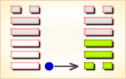
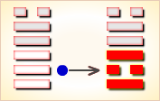
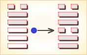
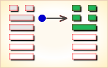
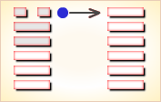

---
hide:
  - navigation
---
# 周易第43卦_夬卦(泽天夬)_兑上乾下 

<table>
	<tbody>
		<tr>
			<td class="td1">
				</td>
			<td class="td1">
				</td>
			<td class="td1">
				</td>
			<td class="td1">
				</td>
		</tr>
		<tr>
			<td style="text-align: center;">
				<strong>本卦</strong></td>
			<td style="text-align: center;">
				<strong>互卦</strong></td>
			<td style="text-align: center;">
				<strong>错卦</strong></td>
			<td style="text-align: center;">
				<strong>综卦</strong></td>
		</tr>
		<tr>
			<td style="text-align: center;">
				<a href="" style="text-decoration: none;">第43卦：夬卦(泽天夬)</a></td>
			<td style="text-align: center;">
				<a href="../01.乾为天" style="text-decoration: none;">第1卦：乾卦(乾为天)</a></td>
			<td style="text-align: center;">
				<a href="../23.山地剥" style="text-decoration: none;">第23卦：剥卦(山地剥)</a></td>
			<td style="text-align: center;">
				<a href="../44.天风姤" style="text-decoration: none;">第44卦：姤卦(天风姤)</a></td>
		</tr>
	</tbody>
</table>

## 周易第四十三卦详解

**夬卦原文**

夬。扬于王庭，孚号，有厉。告自邑，不利即戎，利有攸往。

象曰：泽上于天，夬。君子以施禄及下，居德则忌。

**白话文解释**

夬卦：王庭里正跳舞作乐。有人呼告：“有敌人来犯。”邑中传来命令：“出击不利，要严阵以待。”筮遇此爻，出外旅行则吉利。

《象辞》说：本卦上卦为兑，兑为泽；下卦为乾，乾为天，可见泽水上涨，浇灌大地，是夬卦的卦象。君子观此卦象，从而泽惠下施，不敢居功自傲，并以此为忌。

**《断易天机》解**

夬卦兑上乾下，为坤宫五世卦。此卦中的夬为决断、决裂，象征会有危险之事，利有攸往，往前有利。

**北宋易学家邵雍解**

排除决去，必须刚断；始吉终凶，谨慎自重。

得此卦者，大运将过，困难将至，宜提高警惕，谨言慎行。

台湾国学大儒傅佩荣解

时运：气运过盛，散财为吉。

财运：利己利人，财散人聚。

家宅：须防水患；婚姻不成。

身体：调养气息。

**传统解卦**

这个卦是异卦（下乾上兑）相叠。乾为天为健；兑为泽为悦。泽气上升，决注成雨，雨施大地，滋润万物。五阳去一阴，去之不难，决（去之意）即可，故名为夬（guài），夬即决。

大象：泽水积满而泛滥成灾，滔天之势。又五阳爻之盛势必除去唯一阴爻，故一阴孤立。

运势：目前虽吉，但困难及变动正在蕴酿中，宜提高警觉，忌骄傲，防口舌是非。

事业：处在兴盛阶段，但已孕育着普遍的危险。务必施恩泽给他人，勿居功自傲，主动团结他人，不干冒险的事。时时提高警惕，防止小人的破坏。但不可莽撞，应持和缓的手段去决断小人，避免过犹不及。

经商：市场正在走向衰落的状态，不宜大量活动，随时注意转向。开拓新领域时，加强同他人的合作。但务必充分注意别有用心的奸诈小人趁机捣乱和破坏。

求名：虚心求教，充实自身实力。但应量力而行，不可盲目自大，更不可同小人合流，图虚名而败坏事业。

婚恋：防止上介绍人的当，也应注意对方的目的。

决策：性格矛盾，往往表面刚强而内心虚弱，在关键的时刻，败坏事业。虚心听取他人劝告，切勿鲁莽，多谋深思，用柔和的态度待人处世。

**第四十三卦的哲学含义**

夬卦卦象，泽天夬卦的象征意义

夬卦，这个卦是异卦相叠，下卦为乾，上卦为兑。乾为天、为健；兑为泽、为悦。泽气上升，决注成雨，雨施大地，滋润万物。“五阳去一阴，去之不难，决即可，故名为夬（即又），夬即决。

夬卦位于益卦之后，《序卦》中说：“益而不已必决，故受之以夬。夬者，决也。”这就是说，如果一直增益下去，最后一定会溃决。

《象》中这样解释本卦：泽上于天，夬；君子以施禄及下，居德则忌。这里指出：夬卦的卦象是乾（天）下兑（泽）上，为湖水蒸发上天，即将化为雨倾注而下之表象，以此象征决断。君子从中得一启迪：应该自觉地向下层民众广施恩德，否则如果高高在上，不施恩德，就会遭到忌恨。

夬卦象征决断，属于上上卦。象曰：蜘蛛脱网赛天军，粘住游蜂翅翎毛，幸有大风吹破网，脱离灾难又逍遥。

## 周易第四十三卦初九爻详解

**初九爻辞**

初九。壮于前趾，往不胜为咎。

象曰：不胜而往，咎也。

**白话文解释**

初九：脚趾受伤，仍然继续前进，将因为脚力不胜而遭致灾难。

《象辞》说：脚力不胜而继续行进，将遭灾难。

**北宋易学家邵雍解**

凶：得此爻者，会有无妄之灾，宜静守。做官的躁动者有损。

台湾国学大儒傅佩荣解

时运：躁进取败，动辄得咎。

财运：任意经营，伤财害己。

家宅：地势太低；门户不对。

身体：小心足疾。

**初九变卦**

初九爻动变得周易第28卦：泽风大过。这个卦是异卦（下巽上兑）相叠。兑为泽、为悦，巽为木、为顺，泽水淹舟，遂成大错。阴阳爻相反，阳大阴小，行动非常，有过度形象，内刚外柔。

**初九爻的哲学含义**

夬卦第一爻，爻辞：初九：壮于前趾，往不胜为咎。爻辞释义

壮：刚壮，冒进。趾：脚趾。前趾：指初步行进之时。

本爻辞的意思是：脚趾前端盛壮，贸然前行不能取胜，反而会招来灾祸。

从卦象上看，初九以阳爻居刚位，好动，容易冒进，但是上临四个阳爻，实在无力可施。并且初九与九四无应，表示无功而返，还会招来麻烦。

《象》中这样解释本爻：不胜而往，咎也。这里指出：初九爻地位最低下，本应该积蓄力量等待时机，却轻率急躁地前往，孤军深入只能遭到失败。不仅完不成制裁小人的使命，还会给自身带来灾祸。

占得此爻者，如果没有必胜的把握，不要去做事，这样不但做不成，反而会惹来麻烦。还要注意，做事时要多动脑子。有些人有强壮的身体，加上刚猛的性格，做事不用脑子用蛮力。有时一时冲动，不全面地衡量一下自己的能力，不考虑事情的真实情况，只凭热情和勇敢去做，结果常常会惹上麻烦。

初九：壮于前趾，往不胜为吝。

象曰：不胜而往，咎也。

经文意思是：前脚趾健壮，前往不能胜任而造成灾难。

象辞意思是：不能胜任而前往，自找灾难啊。

初九代表阳气渐生，相对于人体来说就好比脚趾，相对于人的能力来说表示能力较弱，所以前往会有不能胜任之忧。这就好比一个还在学校学习的大学生，品学兼优，但是凭这些就想承担某个企业的主要领导职位，显然是能力还有些欠缺。

## 周易第四十三卦九二爻详解

**九二爻辞**

九二。惕号，莫夜有戎，勿恤。

象曰：有戎勿恤，得中道也。

**白话文解释**

九二：恐惧地惊叫，夜间有敌来犯，但不足为患。

《象辞》说：有敌来犯，不足为患，因为九二之爻居下卦中位，像人得中正之道。

**北宋易学家邵雍解**

凶：得此爻者，多忧愁，多惊险，谨防盗窃之事发生。做官的多掌兵权。

台湾国学大儒傅佩荣解

时运：凡事谨慎，可以无虑。

财运：货物保险，才可无忧。

家宅：宜防火灾；婚姻吉祥。

身体：阴虚火盛，调养可治。

**九二变卦**

九二爻动变得周易第49卦：泽火革。这个卦是异卦（下离上兑）相叠。离为火、兑为泽，泽内有水。水在上而下浇，火在下而上升。火旺水干，水大火熄。二者相生亦相克，必然出现变革。变革是宇宙的基本规律。

**九二爻的哲学含义**

夬卦第二爻，爻辞：九二：锡号，旲夜有戎，勿恤。爻辞释义

莫：同“暮”，指黄昏之时。戎：指战事。恤：指忧虑。

本爻辞的意思是：惊惧呼号，是因为深夜发生战事，但是没有危险，不必担忧。

从卦象上看，九二这一爻属于阳爻居阴位，阳刚之气稍减，并且居中而行，不会冒进，也不会做过分的事情，尽管遇到了危险，结果是“勿恤”。

《象》中这样解释本爻：“有戎勿恤”，得中道也。这里指出：“惊惧呼号，是因为深夜发生战事，但是没有危险，不必担忧。”这是因为九二爻处在下卦的中位，能够信守中庸之道，尽管遭到小人的骚扰，或遇上了危险，但终究是有惊无险，可以化险为夷。

占得此爻者，要时刻保持警惕，做到防患于未然，因为有小人的存在，在你不注意的时候，生活中可能会出现意外的情况。所以要保持警惕和戒备，这样做符合中庸之道，十分有利。

九二：惕号，莫夜有戎，勿恤。

象曰：有戎勿恤，得中道也。

经文意思是：受惊感叫，在夜里有兵戎经过，不用忧虑。

象辞意思是：夜里有兵戎经过，九二处于中正之道，所以不必忧虑。

九二有警惕之心，并且保持适中的原则，所以即使夜里有兵适中的原则，所以即使夜里有兵戎经过，也用不着忧虑。这就有些像俗话所说的“平生不做亏心事，夜半敲门心不惊”。不过从爻辞来看，九二还是因为兵戎的经过而受到了惊吓。可是这一点正说明九二的处事小心谨慎。谨慎而持中，所以不会有灾难。

## 周易第四十三卦九三爻详解详解

**九三爻辞**

九三。壮于頄，有凶。君子夬夬，独行遇雨，若濡有愠，无咎。

象曰：君子夬夬，终无咎也。

**白话文解释**

九三：颧骨受伤，这是凶象。君子匆匆忙忙地独个儿行路，碰上了雨，全身淋湿了，令人很不快，但没有灾难。

《象辞》说：君子匆匆忙忙地独个儿行路，但最后没有灾难。

**北宋易学家邵雍解**

凶：得此爻者，会有争诉之忧，品行端正者无忧，初见艰难，终得安乐。做官的除奸不成，反被倒咬一口。

台湾国学大儒傅佩荣解

时运：任意独行，受人疑忌。

财运：独自经营，较费时日。

家宅：早些整修；暂时不成。

身体：湿气上升，治之可愈。

**九三变卦**

九三爻动变得周易第58卦：兑为泽。这个卦是同卦（下泽上泽）相叠。泽为水。两泽相连，两水交流，上下相和，团结一致，朋友相助，欢欣喜悦。兑为悦也。同秉刚健之德，外抱柔和之姿，坚行正道，导民向上。

**九三爻的哲学含义**

夬卦第三爻，爻辞：九三：壮于頑，有凶；君子夬夬独行，遇雨若濡，有愠，无咎。

夬卦第三爻，爻辞：九三：壮于頑，有凶；君子夬夬独行，遇雨若濡，有愠，无咎。人生启示

从卦象上看，九三这一爻属于阳爻居阳位，得位，阳刚十足，刚猛的面貌十分明显，也具有果断、冲动的特性，所以独行前去。可是往上是互乾〔九三、九四、九五），九三未必施展得开，所以会凶。但是若是遇到了自己难以接受的事情，独自前去处理，虽然会非常生气，但是没有灾祸。

《象》中这样分析此爻：“君子夬夬”，终无咎也。这里指出：“君子若是果敢决绝毅然独自前去”，不露声色地与小人周旋，就能够避免打草惊蛇引起不测，又可斩断感情纠葛，避免优柔寡断，因而不会遇到灾祸。

占得此爻者，要注意说话办事，多采取一些柔顺的办法和方式。说话不要太冲，以免冲撞了别人。遇到了你不能容忍的事情，你要下定决心立刻去解决，但是在解决时要小心谨慎，虽然你可能为此特别生气，但是最终是可以解决掉的。

九三：壮于頄，有凶。君子夬夬，独行遇雨，若濡有愠，无咎。

象曰：君子夬夬，终无咎也。

经文意思是：颧骨强壮，有凶险。君子一个人走得很急，遇到下雨被淋湿而有怨气，没有灾难。

象辞意思是：君子走得很急，最终没有灾害。

## 周易第四十三卦九四爻详解详解

**九四爻辞**

九四。臀无肤，其行次且。牵羊悔亡，闻言不信。

象曰：其行次且，位不当也；闻言不信，聪不明也。

**白话文解释**

九四：臀部受伤，走起路来踉踉跄跄。牵羊上路，悔恨丢失了羊儿，这是由于对别人的告诫不相信。

《象辞》说：行路艰难，因为九四阳爻而居阴位，像人处境不利。对于别人的告诫不相信，说明听觉虽好，但不明事理。

**北宋易学家邵雍解**

凶：得此爻者，心绪不定，所谋不成。做官的有心而力不足，难于升迁。

台湾国学大儒傅佩荣解

时运：心思不定，所谋难成。

财运：错过时机，无利可图。

家宅：四周狭隘；久之可成。

身体：皮肤有病，须防失聪。

**九四变卦**

九四爻动变得周易第5卦：水天需。这个卦是异卦（下乾上坎）相叠，下卦是乾，刚健之意；上卦是坎，险陷之意。以刚逢险，宜稳健之妥，不可冒失行动，观时待变，所往一定成功。

**九四爻的哲学含义**

夬卦第四爻，爻辞：九四：臀无肤，其行次且；牵羊悔亡，闻言不信。爻辞释义

次且：趔趄，指行走不稳的样子。

本爻辞的意思是：屁股上蹭破了皮，行走十分艰难。若是紧紧牵着羊行走，就不会出现令人后悔的事，无奈听了这话的人并不相信。

《象》中这样分析本爻：“其行次且”，位不当也；“闻言不信”，聪不明也。这里指出：“屁股上蹭破了皮，行走十分艰难，”是因为所处位置失当，处处受到君王的掣肘，好像屁股蹭破了皮，走起路来十分艰难。“无奈听了这话的人并不相信”，说明处境艰难，别人建议他借重强有利的阳刚君子的帮助，他却听不进去，听觉正常而决断不明。

占得此爻者，在做事时要多听他人的劝告，可以寻找与自己性格相异的人一起合作，起到互补的作用，这样可以弥补自己的不足。

占得此爻者，可能正在为某件事坐立不安，相信很快就会有好消息传来。此时你若是不相信你所听到的话，将会失去一次好机会。

## 周易第四十三卦九五爻详解详解

**九五爻辞**

九五。苋陆夬夬，中行无咎。

象曰：中行无咎，中未光也。

**白话文解释**

九五：细角山羊在道路中间蹦蹦跳跳，筮遇此爻无灾难。

《象辞》说：行中正之道，仅称无灾难，大概是没有将中行之道推广施行。

**北宋易学家邵雍解**

平：得此爻者，营谋遂意，诉者伸，有病者愈。做官的须防奸邪之辈侵害。

台湾国学大儒傅佩荣解

时运：亲近君子，万事皆吉。

财运：尽速出手，不然有悔。

家宅：整理干净；婚姻合宜。

身体：调节气旺。

**九五变卦**

九五爻动变得周易第34卦：雷天大壮。这个卦是异卦（下乾上震）相叠。震为雷；乾为天。乾刚震动。天鸣雷，云雷滚，声势宏大，阳气盛壮，万物生长。刚壮有力故曰壮。大而且壮，故名大壮。四阳壮盛，积极而有所作为，上正下正，标正影直。

**九五爻的哲学含义**

夬卦第五爻，爻辞：九五：苋陆夬夬，中行无咎。

从卦象上看，九五这一爻属于阳爻居刚位，处于君主之位，职高权重。若过于用刚虽然能取得一定的胜利，不过行为偏激也会走向相反的一面，而且敌对势力很难斩草除根。好在九五居于上卦中位，又与上六亲比，所以同时具有刚健和能行中道的美德，对待敌对势力能恩威并施，从而没有灾难。

《象》中这样解释本爻：“中行无咎”，中未光也。这里指出：“在行为上宜奉行中庸之道，这样就会减少麻烦。”表明尽管处在尊贵地位，要解决小人为乱易如反掌，却也不能做得太过分，要恰到好处才能避免灾祸。这也说明坚守正道的举动并未大放光彩，仅仅起到免除祸殃的作用而已。

占得此爻者，在工作上或生活中遇到了障碍或者是小人，对此你应该冷静处置，不要走极端。虽然你自己能力很强，或者有权有势，但是也要尽量采用中庸之道，这样对你才有利。若是已经做了偏激、冒失的事，也应该停下来认真地反

省一下自己。

## 周易第四十三卦上九爻详解详解

**上六爻辞**

上六。无号，终有凶。

象曰：无号之凶，终不可长也。

**白话文解释**

上六：狗在哭叫，预兆着终将有凶险之事。

《象辞》说：国无号令，其势必遭凶险，说明国运衰微，终不可保。

**北宋易学家邵雍解**

凶：得此爻者，营谋不成，宜守常，不良者，骨肉刑克，是非缠绕。做官的难于久任，激流勇退为佳。

台湾国学大儒傅佩荣解

时运：声名大损，警惕免祸。

财运：再立新约，否则无利。

家宅：寂静不安；媒妁未成。

身体：无声可呼，已至险境。

**上六变卦**

上六爻动变得周易第1卦：乾为天。这个卦是同卦（下乾上乾）相叠。象征天，喻龙（德才的君子），又象征纯粹的阳和健，表明兴盛强健。乾卦是根据万物变通的道理，以“元、亨、利、贞”为卦辞，表示吉祥如意，教导人遵守天道的德行。

**上九爻的哲学含义**

夬卦第六爻，爻辞：上六：无号，终有凶。

从卦象上看，上六处于卦的顶端，阴爻居柔位，才质柔弱，又心怀阴险，行为非光明正大。上六以阴乘阳，下与九三有应，又在九五周围制造矛盾，不利团结。当阳长阴消之时，上六处于即将消亡的境地，非常凶险。

《象》中这样解释本爻：“晚号之凶”，终不可长也。这里指出：“嚎啕大哭也没有用，最终必然有凶险临头”，表明上六以阴柔小人凌驾于阳刚君子特别是君王之上，是众矢之的。其倒行逆施的状况不会持续很长时间，最终难以逃脱被制裁的命运。

占得此爻者，在做事时，可能是没有行正道，采取不正当的手段，在与人交往时，也没有以诚相待，而是拉帮结派，挑拔离间。这样，你最终会被朋友抛弃，做事也非常不顺，结果会令你失望。

占得此爻者，可能是退居二线的人物，失去了以往的尊贵的位置，没有下级的支持，也没有发布命令的权力，但是却不甘心于此，经常捣乱，搞破坏，最终会有凶事发生。

大势已去，上六的灭亡已不可避免。人在最悲伤的时候反而没有眼泪了，上六就是这样。他只能等待着凶险的来临，却没有一点办法。因为众阳的势力太强大了，自己无法与之抗衡。