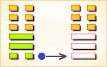
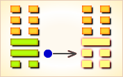
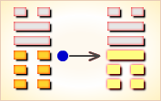
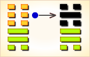
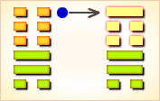

---
hide:
  - navigation
---
# 周易第46卦_升卦(地风升)_坤上巽下 

<table>
	<tbody>
		<tr>
			<td class="td1">
				</td>
			<td class="td1">
				</td>
			<td class="td1">
				</td>
			<td class="td1">
				</td>
		</tr>
		<tr>
			<td style="text-align: center;">
				<strong>本卦</strong></td>
			<td style="text-align: center;">
				<strong>互卦</strong></td>
			<td style="text-align: center;">
				<strong>错卦</strong></td>
			<td style="text-align: center;">
				<strong>综卦</strong></td>
		</tr>
		<tr>
			<td style="text-align: center;">
				<a href="" style="text-decoration: none;">第46卦：升卦(地风升)</a></td>
			<td style="text-align: center;">
				<a href="../54.雷泽归妹" style="text-decoration: none;">第54卦：归妹卦(雷泽归妹)</a></td>
			<td style="text-align: center;">
				<a href="../25.天雷无妄" style="text-decoration: none;">第25卦：无妄卦(天雷无妄)</a></td>
			<td style="text-align: center;">
				<a href="../45.泽地萃" style="text-decoration: none;">第45卦：萃卦(泽地萃)</a></td>
		</tr>
	</tbody>
</table>

## 周易第四十六卦详解

**升卦原文**

升。元亨。用见大人，勿恤，南征吉。

象曰：地中生木，升。君子以顺德，积小以高大。

**白话文解释**

升卦：非常亨通，有利于会见王公贵族，不用担忧。占得此爻，出征南方吉利。

《象辞》说：本卦外卦为坤，坤为地；内卦为巽，巽为木。可见木植于地中，是升卦的卦象。君子观此卦象，从而遵循德义，加强修养，从细小起步，逐步培育崇高的品德。

**《断易天机》解**

升卦坤上巽下，为震宫四世卦。升卦的意思就是上升、长进，为出暗向明，积小成大的亨达之象。

**北宋易学家邵雍解**

升腾上进，畅行其志；出暗向明，遂渐升进。

得此卦者，运气升腾，诸事皆积极向上发展，谋事有成，名利双收。

台湾国学大儒傅佩荣解

时运：大地春回，日益高升。

财运：储蓄积财，可成富人。

家宅：改造大厦；以妾作嫡。

身体：肝火渐旺，早些调养。

**传统解卦**

这个卦是异卦（下巽上坤）相叠。坤为地、为顺；巽为木、为逊。大地生长树木，逐渐成长，日渐高大成材，喻事业步步高升，前程远大，故名“升”。

大象：树木从地上不断向上，有进升之势。

运势：名利双收，发展开运之象，宜向南方发展。

事业：十分顺利，不断发展，依时而进，逐步上升，前程远大，但应逐步发展，切莫因顺利而冒进。谨慎小心，修养德行，追随有德行的前辈，真诚对待事业。

经商：遵守商业道德，从小处着手，逐渐开拓，通过自己的勤劳，真诚竞争，稳重为好，切莫冒失而成大错。

求名：努力学习，加强修养，以自己的聪明才智，必能得志，若有人引荐，前途更为广阔。但应注意节制。

婚恋：双方以诚相待，逐步培养情感，一定可以成功。

决策：如意随愿。聪明、灵活、具有良好的成功基础，严格要求自己，谦虚和顺，虚心向长辈求教，逐步、稳健地发展自己的事业，将犹如树木的成长，终于会成栋梁之才。但在成长过程中，务必处处谨慎，坚持真诚和正直，大胆前进。

**第四十六卦的哲学含义**

升卦卦象，地风升卦的象征意义

升卦，这个卦是异卦相叠，下卦为巽，上卦坤。巽为风，在下。坤为地，在上。风在地下发挥不出风的真正威力，只有从地下上升到地上，才能发挥出威力。

风在地下，如同有才干的人在人群中不容易被发现一样，只有提升上来才能发挥出才干。从这个角度来看，升的含义，就是把有才干的人提升到应有的岗位上。

坤为地、为顺；巽为木、为逊。大地生长树木，逐渐地成长，日渐高大成材，喻事业步步高升，前程远大，故名“升”。

升卦位于萃卦之后，《序卦》中这样解释道：“聚而上者谓之升，故受之以升。”聚集之后往上发展的，就是升进，所以接着出现了升卦。

《象》中这样解释升卦：地中生木，升；君子以顺德，积小以高大。这里指出：升卦的卦象是巽（风）下坤（地）上，而巽又象征高大树木，这样就成为地里边生长树木之表象。树木由矮小到高大，象征上升；与此相应，君子通过顺应自然规律来培养自己的品德，积累微小的进步来塑造高大完美的人格。

升卦象征着柔顺谦虚，代表着上升，属于上上卦。《象》曰：士人来占必得名，生意买卖也兴隆，匠艺逢之交易好，农间庄稼亦收成。

## 周易第四十六卦初九爻详解

**初六爻辞**

初六。允升，大吉。

象曰：允升大吉，上合志也。

**白话文解释**

初六：前进发展，大吉大利。

《象辞》说：前进发展，大吉大利，是说尚能契合心意。

**北宋易学家邵雍解**

吉：得此爻者，名利双收，营谋遂心。做官的晋升有望。

台湾国学大儒傅佩荣解

时运：名利双收，所求皆遂。

财运：货价涨升，大可获利。

家宅：乔迁之喜；两姓好合。

身体：有病即治，不可拖延。

**初六变卦**

初六爻动变得周易第11卦：地天泰。这个卦是异卦（下乾上坤）相叠，乾为天，为阳；坤为地，为阴，阴阳交感，上下互通，天地相交，万物纷纭。反之则凶，万事万物，皆对立，转化，盛极必衰，衰而转盛，故应时而变者泰（通）。

**初九爻的哲学含义**

升卦第一爻，爻辞：初六：允升，大吉。爻辞释义

允：是允许，跟从之意。

本爻辞的意思是：适宜升进，大吉大利。

从卦象上看，初六居升卦初位，心意是要往上走的，想要获得提升的。其在下卦巽中，巽为风，为随顺，它又上承九二，可以随顺九二前进。

《象》中这样分析本爻：“允升大吉”上合志也。这里指出：“适宜升进，大吉大利”，是因为阴柔处在最卑下的地位，位于其上的阳刚者同情其处境，希望其尽快上升，所以其上升合乎上面的意思。

占得此爻，意味着在做事时开局非常顺利，只要你照此行动，一定可以成功。你可能没有什么大的后台和背景，也可能初到一个单位，积极向上，希望得到提升和重用。可是单位的主要领导根本没有发现你。而你的顶头上司，发现你是个德才兼备的人，他逐渐地信任你，并希望你能得到提升，会为你的升迁说好话，铺好路。现在时机已经成熟，升职的条件已经具备，你应该坚定自己的信

初六： 允升，大吉。

象曰： 允升大吉，上合志也。

经文意思是：可以上升，大吉祥。 

象辞意思是：可以上升的大吉祥，是因为符合自己的志向。

## 周易第四十六卦九二爻详解

**九二爻辞**

九二。孚乃利用禴，无咎。

象曰：九二之孚，有喜也。

**白话文解释**

九二：春祭宜用俘虏作为人牲，则无灾祸。

《象辞》说：**九二爻辞**讲祭祀鬼神必以忠信，从而将有喜庆之事。

**北宋易学家邵雍解**

平：得此爻者，常人有喜，病者安，谋事可成。做官的有升迁之机。

台湾国学大儒傅佩荣解

时运：正当好运，喜事临门。

财运：诚信经营，可保获利。

家宅：必有喜事；阴阳合德。

身体：最好祈神。

**九二变卦**

九二爻动变得周易第15卦：地山谦。这个卦是异卦（下艮上坤）相叠，艮为山，坤为地。地面有山，地卑（低）而山高，是为内高外低，比喻功高不自居，名高不自誉，位高不自傲。这就是谦。

**九二爻的哲学含义**

升卦第二爻，爻辞：九二：孚乃利用檜，无咎。爻辞释义

孚：指诚信。檎：指春祭。

本爻辞的意思是：内心非常虔诚，这样有利祭祀祈福，可免除灾祸。

“孚乃利用檜”，这句话在萃卦中第二爻也曾经出现过，这里指只要有诚信，薄祭也可受福。

《象》中这样解释本爻：九二之孚，有喜也。这里指出：九二这一爻内心虔诚仁厚，一心成人之美，深得众人信服，必定会给自身带来喜庆。

占得此爻者，目前没有经验，没有背景，也不能给人带去好处，但是若想得到提升，可以怀着积极向上的热情和谦虚的态度，满怀诚信，并认真履行自己的职责。这样虽然你能奉献的很少，但是将得到加倍的报偿。

九二：孚乃利用输，无咎。

象曰：九二之孚，有喜也。

经文意思是：心诚有利于用

薄礼献祭，没有灾难。

象辞意思是：九二爻的心诚，肯定会带来喜庆。

## 周易第四十六卦九三爻详解详解

**九三爻辞**

九三。升虚邑。

象曰：升虚邑，无所疑也。

**白话文解释**

九三：登临于建立在大丘之上的城邑。

《象辞》说：登临于建立在大丘之上的城邑，登高望远，所见甚明，故无所疑惑。

**北宋易学家邵雍解**

平：得此爻者，营谋遂意。做官的会身居要位，读书人可成名。

台湾国学大儒傅佩荣解

时运：越来越好，不必担心。

财运：货物集散，财力可期。

家宅：先虚后实；空房独守。

身体：虚弱之症。

**九三变卦**

九三爻动变得周易第7卦：地水师。这个卦是异卦（下坎上坤）相叠。“师”指军队。坎为水、为险；坤为地、为顺，喻寓兵于农。兵凶战危，用兵乃圣人不得已而为之，但它可以顺利无阻碍地解决矛盾，因为顺乎形势，师出有名，故能化凶为吉。

**九三爻的哲学含义**

升卦第三爻，爻辞：九三：升虚邑。爻辞释义

邑：国邑，指诸侯封地。虚邑：指无人管理之地。

本爻辞的意思是：上升到空旷的城邑，如入无人之境。

从卦象上看，九三上临坤卦，坤为顺，并且与上六正应，非常顺利。

《象》中这样解释本爻：“升虚邑”，无所疑也。这里指出：“上升到空旷的城邑”，这是因为没有任何阻碍，上升得十分顺利，对此不要有半点迟疑。

占得此爻，象征着你现在事情进展顺利，可以大胆地向前推进，没有任何障碍，缺少的仅仅是机会。

占得此卦，你关心的地方或是将去的地方，可能会出现大面积的拆迁或地震或战争造成的一片废墟，后又建设成人口众多的繁华地区。

九三：升虚邑。

象曰：升虚邑，无所疑也。

经文意思是：升到没人设防的城邑。

象辞意思是：升到没人设防的城邑，说明上升不必疑虑。

## 周易第四十六卦九四爻详解详解

**六四爻辞**

六四。王用亨于岐山，吉，无咎。

象曰：王用亨于岐山，顺事也。

**白话文解释**

六四：周王在岐山祭祀鬼神。筮遇此爻，吉利，并无灾祸。

《象辞》说：周王在岐山祭祀鬼神，之所以吉而无灾祸，因为这是顺乎天理之事。

**北宋易学家邵雍解**

吉：得此爻者，得山林之利，隐者有山林之乐。做官的会升迁，身居要职。

台湾国学大儒傅佩荣解

时运：升迁在即，感谢神明。

财运：货物充裕，财神相助。

家宅：祭告宅神。

身体：虔诚祷告。

**六四变卦**

六四爻动变得周易第32卦：雷风恒。这个卦是异卦（下巽上震）相叠。震为男、为雷；巽为女、为风。震刚在上，巽柔在下。刚上柔下，造化有常，相互助长。阴阳相应，常情，故称为恒。

**九四爻的哲学含义**

升卦第四爻，爻辞：六四：王用亨于岐山，吉，无咎。爻辞释义

用享：指举行祭祀之礼。歧山：周部落发源地。

本爻辞的意思是：君王到岐山祭祀神灵，吉祥如意，没有灾祸。

从卦象上看，六四在上坤下巽之间，上和顺而下随从。

《象》中这样解释本爻：“王用亨于岐山”，顺事也。这里指出：“君王到岐山祭祀神灵”，就是向神灵表示恭顺，诚惶诚恐地供奉神灵，结果必然会带来吉祥如意。

在古代，人们信奉神灵，即将登上成功阶梯的人，要诚心祭神，来倾听神灵的启示，以便事情进行得更顺利。现在的人占得此爻，也正处于大获成功之时，这时要注意听别人的有益的意见，以谦恭的态度对人，对人怀有感恩之心，这样有助于成功。

六四：王用亨于岐山，吉无咎。

象曰：王用亨于岐山，顺事也。

经文意思是：君王在岐山举行祭祀，吉祥没有灾难。

象辞意思是：君王在岐山举行祭犯，是顺承先祖的事业。

## 周易第四十六卦九五爻详解详解

**六五爻辞**

六五。贞吉，升阶。

象曰：贞吉升阶，大得志也。

**白话文解释**

六五：占得吉兆，所占之事将逐步发展。

《象辞》说：信守正道，自然吉利，其事业必然逐步发展，说明其志愿得伸，目的达到。

**北宋易学家邵雍解**

吉：得此爻者，正行好运，大愿可成。做官的会高升。

台湾国学大儒傅佩荣解

时运：大愿可成，功名皆吉。

财运：经营得中，利益不断。

家宅：步步高升；攀结高亲。

身体：病情升高。

**六五变卦**

六五爻动变得周易第48卦：水风井。这个卦是异卦（下巽上坎）相叠。坎为水；巽为木。树木得水而蓬勃生长。人靠水井生活，水井由人挖掘而成。相互为养，井以水养人，经久不竭，人应取此德而勤劳自勉。

**九五爻的哲学含义**

升卦第五爻，爻辞：六五：贞吉，升阶。爻辞释义贞：指占卜。

本爻辞的意思是：占卜的结果很吉祥，乘势沿着台阶稳步上升。

从卦象上看，六五这一爻有九二正应，全卦又是升卦，这足以使其继续高《象》中这样解释本爻：“贞吉升阶”，大得志也。这里指出：“占卜的结果很吉祥，乘势沿着台阶稳步上升”，表明上升已达到鼎盛时期，接近光辉的顶点，可说得上是春风得意，踌躇满志。同时也表明阴爻居于尊位，必须稳健行事，循序渐进，不可像“升虚邑”那样冒进。

占得此爻者，对于官员来说，以前若是凭着自己的能力一步一步地做出来的，而不是靠背景或是耍手段得成的，那意味着还有晋升的机会。若是学生，则还可以继续升学。做事只要守持正道，是靠自己的努力通过正道得来的，就可以沿着上升的台阶继续高升。

六五：贞吉，升阶。

象曰：贞吉升阶，大得志也。

经文意思是：守正道吉祥，升上台阶。

象辞意思是：守正道吉祥，升上台阶，说明会步步高升，满足大的志向。

## 周易第四十六卦上九爻详解详解

**上六爻辞**

上六。冥升，利于不息之贞。

象曰：冥升在上，消不富也。

**白话文解释**

上六：深夜不眠，勤勉不息地工作则符合此吉兆。

《象辞》说：**上六爻辞**讲深夜不眠，因为上六之爻据一卦之首，爻位孤悬，其人虽处高位，但环境不利，不过，勤于职守则可以消灾得福。

**北宋易学家邵雍解**

平：得此爻者，有贪得无厌之祸。做官的会告休。

台湾国学大儒傅佩荣解

时运：好运已过，预备退路。

财运：经营困难，人财两失。

家宅：难免中落；难以偕老。

身体：可能归天。

**上六变卦**

上六爻动变得周易第18卦：山风蛊。这个卦是异卦（下巽上艮）相叠，与随卦互为综卦。蛊本意为事，引申为多事、混乱。器皿久不用而生虫称“蛊”，喻天下久安而因循、腐败，必须革新创造，治理整顿，挽救危机，重振事业。

**上九爻的哲学含义**

升卦第六爻，爻辞：上六：冥升，利于不息之贞。爻辞释义

冥：指昏冥。不息之贞：指永不停息地坚守正道。

从卦象上看，上六居升卦的最顶端，又在上卦坤中，而坤代表着黑夜。上六与九三正应，只要坚守正道，尚可安稳。

《象》中这样解释本爻：冥升在上，消不富也。这里指出：“在昏暗幽冥状态下仍然上升”，本身已处在升卦的最高位置，按照盛极而衰的道理，上升的势头必然会逐渐消退，再不会如原来那样富有进取精神了。

占得此爻者，已经处于事业的高峰期，这时要保持谨慎，以守为主，盲目冒进会遇到麻烦。创业容易守业难，不要松懈，要更加努力以维持现状，否则会出现不进则退的情况。

上六：冥升，利于不息之贞。

象曰：冥升在上，消不富也。

经文意思是在昏昧中上升，利于停止增长而守正道。

象辞意思是：在昏暗中上升已经到了最上面，阴气削弱所以不富。