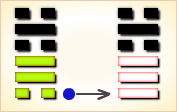
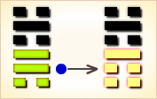
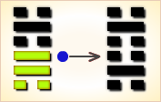
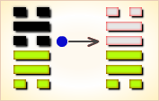
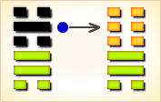
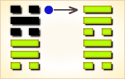

---
hide:
  - navigation
---
# 周易第48卦_井卦(水风井)_坎上巽下 

<table>
	<tbody>
		<tr>
			<td class="td1">
				</td>
			<td class="td1">
				</td>
			<td class="td1">
				</td>
			<td class="td1">
				</td>
		</tr>
		<tr>
			<td style="text-align: center;">
				<strong>本卦</strong></td>
			<td style="text-align: center;">
				<strong>互卦</strong></td>
			<td style="text-align: center;">
				<strong>错卦</strong></td>
			<td style="text-align: center;">
				<strong>综卦</strong></td>
		</tr>
		<tr>
			<td style="text-align: center;">
				<a href="" style="text-decoration: none;">第48卦：井卦(水风井)</a></td>
			<td style="text-align: center;">
				<a href="../38.火泽睽" style="text-decoration: none;">第38卦：睽卦(火泽睽)</a></td>
			<td style="text-align: center;">
				<a href="../21.火雷噬嗑" style="text-decoration: none;">第21卦：噬嗑卦(火雷噬嗑)</a></td>
			<td style="text-align: center;">
				<a href="../47.泽水困" style="text-decoration: none;">第47卦：困卦(泽水困)</a></td>
		</tr>
	</tbody>
</table>

## 周易第四十八卦详解

**井卦原文**

井。改邑不改井，无丧无得。往来井井。汔至，亦未繘井，羸其瓶，凶。

象曰：木上有水，井。君子以劳民劝相。

**白话文解释**

井卦：改建邑落而不改建水井，等于什么也没有干。人们往来井边汲水，水井干涸淤塞，不去加以淘洗，反而将吊水罐打破，这是凶险之象。

《象辞》说：本卦下卦为巽，巽为木；上卦为坎，坎为水。水下浸而树木生长，这是井卦的卦象。君子观此卦象，取法于井水养人，从而鼓励人民勤劳而互相劝勉。

**《断易天机》解**

井卦坎上巽下，为震宫五世卦。井不可移动，象征静止，此卦也是提示占卦者要安身守道，不可贪求。

**北宋易学家邵雍解**

静水通源，气运平静；不变所守，维持现状。

得此卦者，宜修身养性，顺其自然，泰然处之，静有利，动则凶。

台湾国学大儒傅佩荣解

时运：木水相生，功名有望。

财运：利大于本，自然可喜。

家宅：修屋防水；阴阳得正。

身体：肾水过胀，立即调治。

**传统解卦**

这个卦是异卦（下巽上坎）相叠。坎为水；巽为木。树木得水而蓬勃生长。人靠水井生活，水井由人挖掘而成。相互为养，井以水养人，经久不竭，人应取此德而勤劳自勉。

大象：水被植物吸收，滋养树身又象征汲器入井取水，有节约重覆之意。

运势：井为静物，不能移动，故凡事不能进取主动，又缺乏冲劲，不如处之泰然更有利。

事业：处于平稳状态。既不宜贸然前进，也不必后退，而应以积极的态度努力进修，提高自己，充实个人实力，待机而起，将大有成就。最怕的是停顿不前，否则将会因不合时宜而被淘汰。

经商：市场情况良好，可继续按照原来的方针。同时，继续本着勤劳、奋进的精神，诚心诚意地开拓市场，特别注意与人的合作，相互协助，在实践活动中丰富和积累经验。

求名：本着正当的目的，为社会做贡献，因此而努力学习。应特别注意向贤德的人求教，以便被发现而受到推荐。

婚恋：不必过急，会有般配的伴侣。

决策：聪明、机敏、乐于助人。同时，也会有机会充分施展个人的才能。只要能学习“水井”的精神，真诚奉献，不断丰富自己的才能，一定会受到社会的重视。

**第四十八卦的哲学含义**

井卦卦象，水风井卦的象征意义

井卦，这个卦是异卦相叠，下卦为巽，上卦为坎。坎为水在上，巽为木在下。木桶从下向上破水而出，如同从井中汲水一般，故为“井”。

井中有水，树木得水而蓬勃生长。人靠水井生活，水井由人挖掘而成。相互为养，井以水养人，经久不竭，人应取此德而勤劳自勉。

井卦位于困卦之后，《序卦》这样解释道：“困乎上者必反正，故受之以井。”在升卦与困卦之后，一定会回到下边，所以接下来谈的就是井卦。

《象》中这样解释本爻：木上有水，井；君子以劳民劝相。这里指出：井卦的卦象是巽（木）下坎（水）上，即是说水分沿着树身向上运行，直达树冠，为井水源源不断地被汲引到地面之表象，因此象征无穷；井水无穷无尽，孜孜不倦地养育着人们，君子应当效法这种美德，不辞劳苦地为大众谋福利，倡导助人为乐的社会风尚。

井卦象征无穷，属于上上卦。《象》曰：枯井破费已多年，一朝流泉出来鲜，资生济渴人称羡，时来运转喜自然。

## 周易第四十八卦初九爻详解

**初六爻辞**

初六。井泥不食，旧井无禽。

象曰：井泥不食，下也。旧井无禽，时舍也。

**白话文解释**

初六：井水混浊不可食用。墤塌的陷阱已关不住野兽。

《象辞》说：井水混浊不可食用，因为泥土落入其中。墤塌的陷阱已关不住野兽，是说人们已将这陷阱舍弃不用了。

**北宋易学家邵雍解**

凶：得此爻者，谋事有阻。做官的会退居闲职，求名者不遂。

台湾国学大儒傅佩荣解

时运：时过运衰，年老无用。

财运：货物陈旧，难以售出。

家宅：荒芜难居；婚姻不成。

身体：旧症不治。

**初六变卦**

初六爻动变得周易第5卦：水天需。这个卦是异卦（下乾上坎）相叠，下卦是乾，刚健之意；上卦是坎，险陷之意。以刚逢险，宜稳健之妥，不可冒失行动，观时待变，所往一定成功。

**初九爻的哲学含义**

井卦第一爻，爻辞：初六：井泥不食，旧井无禽。爻辞释义

井泥：泥是相对于水而言的，井枯无水见污泥。喻指身困才竭，废而无用。

从卦象上看，初六位于井卦底部，阴爻居阳位，阴柔有泥象。上与六四无应，上无进身之路，沉滞积污，不见掏掘，所以井底全是泥污，成为一口废旧失

修之井。

《象》中这样解本爻：“井泥不食”，下也；“旧井无禽”，时舍也。这里指出：“废旧干枯的废井，全是污泥，不能提供饮用的水”，完全是因为位置处在最下面，相当于井底部位，水中泥沙不断沉淀最后都淤积在这里；“连鸟雀都不来光顾”，反映出一种时过境迁，被世间万物所遗忘抛弃的凄凉遭遇。

占得此爻者，要注意自己是否旧习难改，自己有多久没有看书学习了，有多久没有反省自己了。人就像一口井一样，如果不及时清理，除掉淤泥，那就会被淘汰掉。

初六：井泥不食，旧井无禽。

象曰：井泥不食，下也。旧井无禽，时舍也。

## 周易第四十八卦九二爻详解

**九二爻辞**

九二。井谷射鲋，瓮敝漏。

象曰：井谷射鲋，无与也。

**白话文解释**

九二：在井口张弓射井中小鱼。瓮瓶又破又漏。

《象辞》说：在井口张弓射井中小鱼，如此谋食求生，可见其人无依无靠。

**北宋易学家邵雍解**

凶：得此爻者，宜谨守以避祸。做官的宜退以自保。

台湾国学大儒傅佩荣解

时运：得小失大，徒有虚名。

财运：贪财失利，得不偿失。

家宅：水不可饮；婚姻不佳。

身体：下漏之症，求医难治。

**九二变卦**

九二爻动变得周易第39卦：水山蹇。这个卦是异卦（下艮上坎）相叠。坎为水，艮为山。山高水深，困难重重，人生险阻，见险而止，明哲保身，可谓智慧。蹇，跋行艰难。

**九二爻的哲学含义**

九二：井谷射鲋，瓮敝漏。象曰：井谷射鲋，无与也。爻辞释义

井谷：井中积水的低洼处。射鲋：是指捉鱼。敝漏：是指陈旧破漏。

从卦象上看，九二以阳爻居柔位，失位。其位于下卦的中爻，象征德才兼备的贤士，可是与九五无应，却与初六亲比。这就喻示着虽然有才有德，但是不能得到领导的赏识，被当作平庸无能之人了。

《象》中这样解本爻：“井谷射鲋”，无与也。这里指出：“井中积水之处被当作捉鱼的场所”，主要是由于上面没有接应，难以把水送到地面上去供人饮用。于是井的作用得不到发挥，只好退而求其次，盛水的地方成了抓鱼的所在。由于水井陷于瘫痪状态，因而汲水的器具也破损不堪用不成了。

占得此爻者，处于怀才不遇的境地，虽然很有才能，但是没有被领导发现，把你当作普通的员工一样任用。还有可能，你根本找不到工作，没有人雇用你，这个时候，你只得退而求其次，就像是井水不是被提上来供给万物，而只是成了养鱼池一样。你不妨从小事做起，把自己的大材小用一下，然后再一步一步地往上走，这样总比闲置要好。

九二：井谷射鲋，瓮敝漏。象曰：井谷射鲋，无与也。

经文意思是：投射井中的小鱼，结果水雄被碰破而漏水。

象辞意思是：用水罐投射井中的小鱼，不会有收获。

## 周易第四十八卦九三爻详解详解

**九三爻辞**

九三。井渫不食，为我心恻。可用汲，王明，并受其福。

象曰：井渫不食，行恻也。求王明，受福也。

**白话文解释**

九三：君上看见井水污浊不能食用，为我们感刭伤心。淘洗干净，就可汲饮。君上英明，众人都获得他们的好处。

《象辞》说：井水污浊不能食用，这是触景生情的感叹。盼求君王英明，是企望获得好处。

**北宋易学家邵雍解**

平：得此爻者，安分守己为吉，不良者或有灾。做官的难逢明主，需另觅良机。

台湾国学大儒傅佩荣解

时运：有才无命，须待两年。

财运：贩运不当，无利可图。

家宅：洗井可饮；二年可成。

身体：心神不安，井泉可愈。

**九三变卦**

九三爻动变得周易第29卦：坎为水。这个卦是同卦（下坎上坎）相叠。坎为水、为险，两坎相重，险上加险，险阻重重。一阳陷二阴。所幸阴虚阳实，诚信可豁然贯通。虽险难重重，却方能显人性光彩。

**九三爻的哲学含义**

井卦第三爻，爻辞：九三：井渫不食，为我心恻；可用汲，王明并受其福。

渫：指的是除污，疏通。恻：指悲伤，同情，不忍心。

本爻辞的意思是：井中已经除污，但仍然没有人来取水饮用，使人心生中悲伤。可以来汲水使用，君王贤明是大家共同的福气。

从卦象上看，九三属阳爻居刚位，得正失中，位于下卦的上端，表明其有积极向上的动向，但是九三与九五阳刚相敌，没有得到其重用。九三又与上六正应，上六对九三怀才不遇的境地感到惋惜。

《象》中这样分析本爻：“井渫不食”，行恻也；求“王明”，受福也。这里指出：“井中已除污泥，但仍然没有人来取水饮用”，表明尽管积极上进，一心想有所作为来造福于民，但是一片好心无人领受，满怀热情的善行只落了个令人悲叹的结局；希望“君王贤明”，直接从井水说到人事，盼望圣明的君主出现，思贤若渴，像汲水一样选拔吸收重用人才，求贤若渴，这样大家都可以享受到由此带来的恩惠。

占得此爻者，求职屡受打击，尽管各方面都做好了准备，但是就得不到重用。这时不要气馁，还需要等待时机。

九三：井渫不食，为我心恻，可用汲，王明，并受其福。

象曰：井渫不食，行恻也。求王明，受福也。

## 周易第四十八卦九四爻详解详解

**六四爻辞**

六四。井甃，无咎。

象曰：井甃无咎，修井也。

**白话文解释**

六四：用砖石垒筑井壁，进行顺利。

《象辞》说：用砖石垒筑井壁，进行顺利，这是讲修井之事。

**北宋易学家邵雍解**

平：得此爻者，宜安分守己，或有迁居之喜。做官清廉者，修身立命，可望上进。

台湾国学大儒傅佩荣解

时运：修身立名，可望上达。

财运：整理旧业，应有利润。

家宅：修整为宜；尚须待时。

身体：运动健身。

**六四变卦**

六四爻动变得周易第28卦：泽风大过。这个卦是异卦（下巽上兑）相叠。兑为泽、为悦，巽为木、为顺，泽水淹舟，遂成大错。阴阳爻相反，阳大阴小，行动非常，有过度形象，内刚外柔。

**九四爻的哲学含义**

井卦第四爻，爻辞：六四：井瓷，无咎。爻辞释义

瓷：指用砖砌的井壁。

本爻辞的意思是：用砖石垒砌加固井壁，就不会出差错了。

从卦象上看，六四以阴爻居柔位，得位。并且已经进上卦，具备致通的条件。六四上承九五，下乘九三。虽才质柔弱不能广济万物，却有荫庇井养之功，因此可至无咎。

《象》中这样解释本爻：“井瓷无咎”，修井也。这里指出：“用砖石垒砌加固井壁，就不会出差错了”，表明六四爻以阴柔之象处在井卦居中部位，正好相当于井壁的关键部位，不可有丝毫闪失。因此应当及时修缮使其坚固，才能免

除灾祸。

## 周易第四十八卦九五爻详解详解

**九五爻辞**

九五。井冽，寒泉食。

象曰：寒泉之食，中正也。

**白话文解释**

九五：水洁泉寒，清凉可口，可以食用。

《象辞》说：**九五爻辞**讲水洁泉寒，清凉可口，因为九五之爻居上卦中位，象征人得中正之道。

**北宋易学家邵雍解**

吉：得此爻者，营谋遂意。做官的品行端正，会得到上司的赞赏。

台湾国学大儒傅佩荣解

时运：品行中正，可望进用。

财运：财源长远，可以获利。

家宅：谦让有礼；同甘共苦。

身体：外寒内热，寒剂可解。

**九五变卦**

九五爻动变得周易第46卦：地风升。这个卦是异卦（下巽上坤）相叠。坤为地、为顺；巽为木、为逊。大地生长树木，逐渐成长，日渐高大成材，喻事业步步高升，前程远大，故名“升”。

**九五爻的哲学含义**

井卦第五爻，爻辞：九五：井洌，寒泉食。爻辞释义

洌：指清澈明净。寒：指凉爽。

本爻辞的意思是：井水清澈明净，就像甘甜凉爽的泉水一样，可供饮用。

从卦象上看，九五以阳爻居君位，持中守正。是有德有才的大有作为的领导。国君为民谋福，有如甘泉供人食用。

《象》中这样评价此爻：“寒泉之食”，中正也。这里指出：：“像甘甜凉爽的泉水一样可供天下人饮用”，这是因为九五爻处在最尊贵的地位，位置适中而且十分妥当。象征行为不偏不倚，内心纯正无私。因而能够集中体现水井滋润万物，造福大众的美德。

占得此爻者，在事业上是一个好的发展时机，你可以从事自己喜欢的工作。若是领导，可以任用一些德才兼备的人，让其辅助自己做事，对成功更为有利。

九五：井冽，寒泉食。

象曰：寒泉之食，中正也。

经文意思是：井水清澈，清凉的泉水众人饮用。

象辞意思是：清凉的泉水众人饮用，是因为九五居中而得位。

## 周易第四十八卦上九爻详解详解

**上六爻辞**

上六。井收勿幕，有孚元吉。

象曰：元吉在上，大成也。

**白话文解释**

上六：陷阱下宽上窄，十分隐蔽，甚至可以不加伪装。果然捕获了野兽，大吉大利。

《象辞》说：**上六爻辞**讲大吉大利，因为上六之爻处一卦之首位，说明其人爵位高登，大有成就。

**北宋易学家邵雍解**

吉：得此爻者，谋事顺利，财用充足。做官的功高德厚，能得升迁。

台湾国学大儒傅佩荣解

时运：功德在世，大受推崇。

财运：利益汇集，可大可久。

家宅：积善旺家；两姓好合。

身体：即日可愈。

**上六变卦**

上六爻动变得周易第57卦：巽为风。这个卦是同卦（下巽上巽）相叠，巽为风，两风相重，长风不绝，无孔不入，巽亦为顺、谦逊的态度和行为，可无往不利。

**上九爻的哲学含义**

 井卦第六爻，爻辞：上六：井收，勿幕；有孚，元吉。爻辞释义

收：指收取。幕：指覆盖。孚：指诚信。

从卦象上看，上六阴爻居柔位，阴爻是“一”，代表着井口不掩之象，没有盖上盖子。上六得位，又与九五亲比，帮助九五纳才，而且待之以诚，明君与贤士志同道合，相互亲比，自然“元吉”。

《象》中这样解释本爻：“元吉”在上，大成也。这里指出：“吉祥”的情况出现在井卦最上面的位置，是因为上下照应，同心协力可将水提出井口。而且在这以后并不把井口盖严，继续怀着诚心为人们不断提供饮水的方便，功德无量，必然会有大吉大利到来。

占得此爻者，意味着你长期从事的事情已经到了收获的时候，不要放弃，更不要半途而废，更大的成就在等着你。记住，“不要把井盖上盖子”，要让别人分享你的成就。

上六：井收勿幕，有孚无吉。

象曰：元吉在上，大成也。

经文意思是：井口建成后，不加盖，有诚信大吉祥。

象辞意思是：大吉祥于上位，是大功告成的意思。