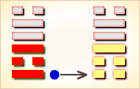
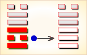
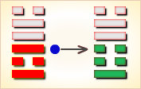
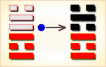
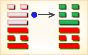
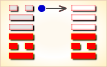

---
hide:
  - navigation
---
# 周易第49卦_革卦(泽火革)_兑上离下 

<table>
	<tbody>
		<tr>
			<td class="td1">
				</td>
			<td class="td1">
				</td>
			<td class="td1">
				</td>
			<td class="td1">
				</td>
		</tr>
		<tr>
			<td style="text-align: center;">
				<strong>本卦</strong></td>
			<td style="text-align: center;">
				<strong>互卦</strong></td>
			<td style="text-align: center;">
				<strong>错卦</strong></td>
			<td style="text-align: center;">
				<strong>综卦</strong></td>
		</tr>
		<tr>
			<td style="text-align: center;">
				<a href="" style="text-decoration: none;">第49卦：革卦(泽火革)</a></td>
			<td style="text-align: center;">
				<a href="../44.天风姤" style="text-decoration: none;">第44卦：姤卦(天风姤)</a></td>
			<td style="text-align: center;">
				<a href="../04.山水蒙" style="text-decoration: none;">第4卦：蒙卦(山水蒙)</a></td>
			<td style="text-align: center;">
				<a href="../50.火风鼎" style="text-decoration: none;">第50卦：鼎卦(火风鼎)</a></td>
		</tr>
	</tbody>
</table>

## 周易第四十九卦详解

**革卦原文**

革。己日乃孚。元亨利贞。悔亡。

象曰：泽中有火，革。君子以治历明时。

**白话文解释**

革卦：祭祀之日用俘虏作人牲，亨通，吉利的卜问。没有悔恨。

《象辞》说：本卦外卦为兑，兑为泽；内卦为离，离为火。内蒸外煏，水涸草枯，如同水泽之中，大火燃烧，这是革卦的卦象。君子观此卦象，了解到泽水涨落，草木枯荣的周期变化，从而修治历法，明确时令。

**《断易天机》解**

革卦兑上离下，为坎宫四世卦。革就是需要变革，提醒占筮者需要变革才会更进一步。

**北宋易学家邵雍解**

事多变动，坚守正道；顺天应人，实施变革。

得此卦者，凡事均在变动之中，宜去旧立新，以应革新之象，则会吉祥。

台湾国学大儒傅佩荣解

时运：改变之时，顺时而动。

财运：消耗过多，迁地贸易。

家宅：小心防火；改娶之象。

身体：肾水干枯，肝火上升。

**传统解卦**

这个卦是异卦（下离上兑）相叠。离为火、兑为泽，泽内有水。水在上而下浇，火在下而上升。火旺水干，水大火熄。二者相生亦相克，必然出现变革。变革是宇宙的基本规律。

大象：兑为金，被离火所烧，变革之象。

运势：凡事均在变动之中，宜去旧立新，以应革新之象。

事业：正处在转折的关键时刻，必须密切注意各种信息，认真思考。首先巩固自己的地位，完善个人的行为。时机成熟后，立即行动，积极进行变革。但应注意动机纯正，手段正当，不保守也不妄进，事业必定发达。

经商：市场竞争十分激烈。为了立于不败之地，一定要敢于大胆求新，适时改变自己的经营方向，受到挫败，马上总结经验，重新奋起，拓展商业活动，但要注意竞争方式。

求名：首先要努力提高自己，完善个人的学识和品德。同时，服从上级指挥搞好工作，二者的关系一定要得到妥善处理。

婚恋：可能会出现一些节外生枝的麻烦事，应冷静处理，感情专注。

决策：十分吉利、顺利。以自己的聪明才智，顺应形势，根据时代特点，依理而动，变革渐合时宜的事物，壮大自己的事业。但应谨慎，时机不成熟不可妄动，尤忌急功近利。行动之前应三思而行。

**第四十九卦的哲学含义**

革卦卦象，泽火革卦的象征意义

革卦，这个卦是异卦相叠，下卦为离，上卦为兑。离为火，兑为泽，泽内有水。水在上，火在下，表明火在下可以把泽水烤干，失去水的泽就变成了其他性质的东西。从另一个角度来说，如果泽水四溢，就会把下面的火浇灭。火灭之后，也就不再是火了，而变成其他性质的东西。火旺水干；水大火熄。二者相生亦相克，必然出现变革，所以本卦命名为“革”。

同时，离具有光明之意，兑又指喜悦。这又告诉人们，革的目的是消灭旧的，产生新的光明，给人们带来喜悦。

革卦位于井卦之后，《序卦》中这样解释道：“井道不可不革，故受之以革。”一口井使用久了，必须定期清理，所以井卦之后要求变革。《杂卦》中说道：“革，去故也。”，因此，革卦指变革，指除旧布新。

《象》中这样解释革卦：泽中有火，革；君子以治历明时。这里指出：革卦的卦象是离（火）下兑（泽）上，为泽中有火之表象。大水可以使火熄灭；大火也可以使水蒸发，如此，水火相克相生，从而产生变革。君子根据变革的规律制定历法以明辨春、夏、秋、冬四季的变化。

革卦象征变革，所要表达的道理就是顺天应人，属于上上卦。《象》曰：苗逢旱天渐渐衰，幸得天恩降雨来，忧去喜来能变化，求谋干事遂心怀。

## 周易第四十九卦初九爻详解

**初九爻辞**

初九。巩用黄牛之革。

象曰：巩用黄牛，不可以有为也。

**白话文解释**

初九：用黄牛的皮革束紧加固(战车)。

《象辞》说：用黄牛的皮革束紧加固，说明其人被紧紧束缚不能有作为。

**北宋易学家邵雍解**

平：得此爻者，宜谨守常规，不可存非分之想。做官的不宜进取，切不可怀出位之念。

台湾国学大儒傅佩荣解

时运：最好固守，再等几年。

财运：先立基础，勿图更张。

家宅：新造之屋；待婚三年。

身体：中腹胀硬，消积健脾。

**初九变卦**

初九爻动变得周易第31卦：泽山咸。这个卦是异卦（下艮上兑）相叠。艮为山；泽为水。兑柔在上，艮刚在下，水向下渗，柔上而刚下，交相感应。感则成。

**初九爻的哲学含义**

革卦第一爻，爻辞：初九：巩用黄牛之革。

巩：巩固，捆绑。黄：黄色，黄为中央之土，喻示为中庸之道。

本爻辞的意思是：用黄牛的皮革牢牢地捆绑住，以免轻举妄动。

初九这一爻给人的启示就是：变革要掌握好时机。从卦象上看，初九这一爻属于阳爻居刚位，得位，有争于上进之象。初九上与九四相敌无应，虽有阳刚之才德，但得不到上位者的支持，变革的条件并不成熟，所以不应该轻举妄动，急功近利。

《象》中这样分析本爻：“巩用黄牛”，不可以有为也。这里指出：“用黄牛的皮革牢牢地捆绑住”，因为初九在卦的最下位，位卑微而不可能有所作为。

占得此爻者，目前的形势不适合变革，你应该采取保守的态度，并能从这种无所作为之中获得好处。虽然你感觉像被绳子紧紧束缚住一样，不能施展自己的才能，但是这样对你是有利的。

如果此卦是为孩子之事而占问的，那应该紧紧地看住孩子，防止他犯法。

初九：巩用黃牛之革。

象曰：巩用黃牛，不可以有为也。

经文意思是：用黄牛皮制成的绳子捆牢。

象辞意思是：用黄牛皮制成的绳子捆牢，是不能认为这便是有所作为的。

## 周易第四十九卦九二爻详解

**六二爻辞**

六二。己日乃革之。征吉，无咎。

象曰：己日革之，行有嘉也。

**白话文解释**

六二：祭祀的日期要改变。随之要重新卜问征战的日期，结果卜得吉兆，没有灾难。

《象辞》说：祭祀的日期要改变，大概是因为将有喜庆之事。

**北宋易学家邵雍解**

吉：得此爻者，多喜庆之事，做官的会升迁。

台湾国学大儒傅佩荣解

时运：配合吉日，建立功名。

财运：择吉开张，生意畅旺。

家宅：择日修宅；可称佳偶。

身体：即将痊愈。

**六二变卦**

六二爻动变得周易第43卦：泽天夬。这个卦是异卦（下乾上兑）相叠。乾为天为健；兑为泽为悦。泽气上升，决注成雨，雨施大地，滋润万物。五阳去一阴，去之不难，决（去之意）即可，故名为夬（guài），夬即决。

**九二爻的哲学含义**

革卦第二爻，爻辞：六二：己日乃革之，征吉，无咎。

“己、庚、辛、壬、癸”的第六位，若按太阳上午、中午、下午的计时看，它当值日过中午偏西下斜之势；故“己日”当按日己过极盛转衰之时讲。此处有喻国势由盛转衰之迹象，是改革条件成熟的时候。

本爻辞的意思是：到了己日断然进行变革，前途必获吉祥，不会有灾祸。

从卦象上看，六二以阳爻居柔位，得中且正。上应九五，又与初九、九三成乘刚承阳之势。既有下面的拥护，又有上面的支持，已具备改革的条件了。

《象》中这样分析本爻：“己日革之”，行有佳也。这里指出：“在己日进行变革”，必然会有好的功效。

占得此爻，如果你想在事业上做些变革，或是在生活上做些变动，现在可以行动了。不过要经过长时间的论证之后才能进行的，你得到了上下级或是家人的支持，注意在变革时要循序渐进地进行，不可进展过快，这样做起来才会顺利。

六二：己日乃革之，征吉，无咎。

象曰：己日革之，行有嘉也。

## 周易第四十九卦九三爻详解详解

**九三爻辞**

九三。征凶，贞厉。革言三就，有孚。

象曰：革言三就，又何之矣。

**白话文解释**

九三：出征，吃了败仗，卜问得凶兆。但是，只要振奋精神，整顿装备，重新开战，则能转败为胜，生擒强敌。

《象辞》说：犯人屡次推翻供辞，只得反复进行审讯，这说明抵赖无用，只能招出实情。

**北宋易学家邵雍解**

凶：得此爻者，多事之时，谨慎而行。做官的有躁动失政之忧。

台湾国学大儒傅佩荣解

时运：再三考虑，可免后患。

财运：信用良好，才可获利。

家宅：三迁为宜；三人为媒。

身体：三日可愈。

**九三变卦**

九三爻动变得周易第17卦：泽雷随。这个卦是异卦（下震上兑）相叠，震为雷，为动；兑为悦，动而悦就是“随”。随指相互顺从，己有随物，物能随己，彼此沟通。随必依时顺势，有原则和条件，以坚贞为前提。

**九三爻的哲学含义**

革卦第三爻，爻辞：九三：征凶，贞厉；革言三就，有孚。

征：指躁动，过于激进。言：指改革的理论，政策方针。三：这里指上下级及改革设计者三方面，也指概数，众多阶层人士。就：这里指征求意见。有孚：指诚信，信服。

本爻辞的意思是：在进行变革时，过于躁动激进会发生凶险，要以正防危；对于变革的言论，要多次研究周密考虑，赢得人们的信赖，才会获得成功。

本爻启示的是在改革时不要激进的道理。从卦象上看，九三属于阳爻居刚位，得阳刚之正，躁进有凶，守则失时。此时应牢记乾卦之中第三爻的爻辞：“君子终日乾乾，夕惕若厉，无咎”之诫，既不冒进，又不保守，慎重稳进是应该采用的态度。九三下与六二亲比，上与上六正应，上下征求意见，以使改革在上下的支持和拥护下顺利进行。

《象》中这样解释本爻：“革言三就”，又何之矣！这里指出：“对于变革的言论，要多次研究周密考虑”，其它的路是没有的，变革已经势在必行，只有走变革的道路。

占得此爻者，已经开始了变革或改变，这时你还需要同有关人士进行探讨，就改革中出现的问题进行协商，可能不会有什么结果，但是非常必要，让不同的人表达了他们的意见后，你再用自己的理由说服他们。在改革的时候，一定要注意稳步前进，不可激进，否则会带来麻烦。

九三：征凶，贞厉，革言三就，有孚。

象曰：革言三就，又何之矣。

## 周易第四十九卦九四爻详解详解

**九四爻辞**

九四。悔亡，有孚，改命，吉。

象曰：改命之吉，信志也。

**白话文解释**

九四：没有悔恨。至于占问战争，则小有战果，如果改帅易将，则将大吉。

《象辞》说：**九四爻辞**讲改帅易将之所以吉利，因为这样能使有才德的人施展抱负。

**北宋易学家邵雍解**

平：得此爻者，会有转变，有收获。做官的会有升迁之机。

台湾国学大儒傅佩荣解

时运：转换跑道，好运自来。

财运：重兴旧业，可以得利。

家宅：整建有利；再婚有利。

身体：改求良医。

**九四变卦**

九四爻动变得周易第63卦：水火既济。这个卦是异卦（下离上坎）相叠。坎为水，离为火，水火相交，水在火上，水势压倒火势，救火大功告成。既，已经；济，成也。既济就是事情已经成功，但终将发生变故。

**九四爻的哲学含义**

革卦第四爻，爻辞：九四：悔亡，有孚改命，吉。

革卦第四爻，爻辞：九四：悔亡，有孚改命，吉。爻辞释义

本爻辞的意思是：悔恨已经消失，仍旧需要人们的信赖以革除旧的事物，如此改革定会吉祥。

从卦象上看，九四以阳爻居柔位，故而有悔。但是其进入了上卦，刚柔相济而不偏，又能调节其间矛盾，勇当改革的中流砥柱，所以“悔亡”。九四位近九五君主，又具刚柔相济之才能，足以肩负改革的重任，故而得吉。

《象》中这样解释本爻：改命之吉，信志也。这里指出：革除旧的事物，这样做是吉祥的，因为这符合变革的志向。

占得此爻者，你所进行的改革已经开始了，虽然事先经过论证，各种改变也非常合理，但是由于人们习惯于旧的规则和秩序，一下子难以接受新的规则和秩序，为此可能对此说三道四，甚至会拒绝接受，你应该以自己的热情去改变他们，结果会很吉祥。

九四：悔亡，有孚改命，吉。

象曰：改命之吉，信志也。

经文意思是：没有悔恨，有信心改变旧的天命，吉祥。

象辞意思是：改变天命的吉祥，是信心所成就的。

## 周易第四十九卦九五爻详解详解

**九五爻辞**

九五。大人虎变，未占有孚。

象曰：大人虎变，其文炳也。

**白话文解释**

九五：王公大人赫然斯怒，化柔弱为威猛，不用卜占，即知将大获胜仗。

《象辞》说：王公赫然斯怒，威猛如虎，说明其人仪表威严，光采照人。

**北宋易学家邵雍解**

吉：得此爻者，时运转好，多吉利之事。做官的晋升有望。

台湾国学大儒傅佩荣解

时运：大运来到，得意非凡。

财运：订好价钱，自可获利。

家宅：不利迁动；须防不贞。

身体：肝火浮动，不药可愈。

**九五变卦**

九五爻动变得周易第55卦：雷火丰。这个卦是异卦（下离上震）相叠，电闪雷鸣，成就巨大，喻达到顶峰，如日中天。告戒：务必注意事物向相反方面发展，盛衰无常，不可不警惕。

**九五爻的哲学含义**

革卦第五爻，爻辞：九五：大人虎变，未占有孚。爻辞释义

本爻辞的意思是：伟大的人物像猛虎一般进行变革，不必置疑一定能光大诚信的美德。

从卦象上看，九五以阳爻居刚位，为既中且正的得位大人。在革卦中，其变如虎。虎是就其皮革的毛色亮丽美妙而言的。

《象》中这样解释本爻：“大人虎变”，其文炳也。这里指出：“伟大的人物像猛虎一般进行变革”，表明变革必然成功，其美德光照天下。

占得此爻者，应该明白，在改革之时，依靠的并不完全是你的领导地位和职权，还要依靠自己的人格力量去唤起他人的信任和热情，这样人们自然就会拥护你，所做的事也非常容易成功。

九五：大人虎变，未占有孚。

象曰：大人虎变，其文炳也。

经文意思是：大人物像老虎换毛一样改变自己，不用占卜也会得到人们的信任。

象辞意思是：大人物像老虎换毛一样改变自己，是文采炳耀。

## 周易第四十九卦上九爻详解详解

**上六爻辞**

上六。君子豹变，小人革面。征凶，居贞吉。

象曰：君子豹变，其文蔚也。小人革面，顺以从君也。

**白话文解释**

上六：君子精神振奋，但基层官兵一反常态。筮遇此爻，占问征伐，则凶险。卜问居处则吉利。

《象辞》说：君子精神振奋，说明其仪态清朗雍容。小人洗心革面，说明小人去恶从善，服从君上。

**北宋易学家邵雍解**

平：得此爻者，安分守己则是非不扰。做官的进取者会晋升，离退休者会功成身退。

台湾国学大儒傅佩荣解

时运：守成为宜，功成身退。

财运：名利兼收，知足常乐。

家宅：居之得安；多求必应。

身体：静养修心。

**上六变卦**

上六爻动变得周易第13卦：天火同人。这个卦是异卦（下离上乾）相叠，乾为天，为君；离为火，为臣民百姓，上天下火，火性上升，同于天，上下和同，同舟共济，人际关系和谐，天下大同。

**上九爻的哲学含义**

 革卦第六爻，爻辞：上六：君子豹变，小人革面；征凶，居贞吉。爻辞释义

豹：阴伏伺机而动的猛兽，这里喻指应变能力强。征：指过于激进。

从卦象上看，上六处革卦的最顶端，阴爻居柔位，得正。又与九五亲比，表征君子能顺从改革大势，拥护改革主张。

《象》中这样解释本爻：“君子豹变”，其文蔚也；“小人革面”，顺以从君也。这里指出：“君子会像豹子一样闻风而动，顺从王命，响应改革”，说明君子协助有道德的大人物一起变革，必然使变革的成就更加光辉灿烂；“小人虽难改旧习，但是也开始顺应改革而进行改变”，说明大势所趋，小人也不得不顺从变革。

占得此爻者，应该使变革进行彻底，从最初的构想到最后的细节，都要落实到位。随着变革的深入，阻力会增加，但是一定要坚持到底，到最后连观望者也会加入到你的行列中来。

上六：君子豹变，小人革面，征凶，居贞吉。

象曰：君子豹变，其文蔚也。