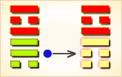
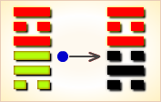
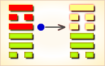
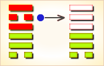
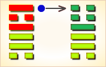

---
hide:
  - navigation
---
# 周易第50卦_鼎卦(火风鼎)_离上巽下 

<table>
	<tbody>
		<tr>
			<td class="td1">
				</td>
			<td class="td1">
				</td>
			<td class="td1">
				</td>
			<td class="td1">
				</td>
		</tr>
		<tr>
			<td style="text-align: center;">
				<strong>本卦</strong></td>
			<td style="text-align: center;">
				<strong>互卦</strong></td>
			<td style="text-align: center;">
				<strong>错卦</strong></td>
			<td style="text-align: center;">
				<strong>综卦</strong></td>
		</tr>
		<tr>
			<td style="text-align: center;">
				<a href="" style="text-decoration: none;">第50卦：鼎卦(火风鼎)</a></td>
			<td style="text-align: center;">
				<a href="../43.泽天夬" style="text-decoration: none;">第43卦：夬卦(泽天夬)</a></td>
			<td style="text-align: center;">
				<a href="../03.水雷屯" style="text-decoration: none;">第3卦：屯卦(水雷屯)</a></td>
			<td style="text-align: center;">
				<a href="../49.泽火革" style="text-decoration: none;">第49卦：革卦(泽火革)</a></td>
		</tr>
	</tbody>
</table>

## 周易第五十卦详解

**鼎卦原文**

鼎。元吉，亨。

象曰：木上有火，鼎。君子以正位凝命。

**白话文解释**

鼎卦：大吉大利，亨通。

《象辞》说：本卦下卦为巽，巽为木；上卦为离，离为火。可见木上有火，以鼎烹物，这是《鼎》卦的卦象。君子观此卦象，取法于鼎足三分，正立不倚，从而持正守位，为君上所倚重，不负使命。

**《断易天机》解**

鼎卦离上巽下，为离宫二世卦。鼎为鼎定、和美之意，多主吉，但对诉讼、求官不利。

**北宋易学家邵雍解**

因败致功，因人成事；万事通达，平步青云。

得此卦者，时运正佳，能得到朋友的帮助，取得不错的成就。与人合伙共事更佳。

台湾国学大儒傅佩荣解

时运：功名日进，贵不可言。

财运：自然得利，不劳而获。

家宅：小心火灾；正配内助。

身体：肝火上冲，顺气以治。

**传统解卦**

这个卦是异卦（下巽上离）相叠。燃木煮食，化生为熟，除旧布新的意思。鼎为重宝大器，三足稳重之象。煮食，喻食物充足，不再有困难和困扰。在此基础上宜变革，发展事业。

大象：木之上有离火，为燃炊烹饪之象，鼎有去旧立新，改过迁善之意。

运势：时运仍佳，事业可成，但诸事不宜迟滞，及防有诉讼之累。

事业：具备开拓事业的各种条件。耳聪目明，头脑冷静，应以端正的态度为人处世，严于律己，慎终如始，刚柔兼备，与有才德的人合作，勿妄进失度，则会无往不利。

经商：经过一番奋斗，已经可以比较顺利地发展自己的商业活动，遇到困难也能够克服。如果坚持商业道德，参与正常竞争活动，无轻举妄动和邪思，刚中自守，商业可大发展，但若不量入为出，坐吃山空，必败业。

求名：首先应积功累德，严于律己，不陷入与他人的怨仇之中，柔而上行，循序渐进。得到知人者的善用，更是前途广大。

婚恋：个人条件比较理想，顺利，但勿不切合实际。

决策：天资聪颖，反应敏捷，头脑灵活，具备随机应变，随时应变和随势应变的能力。因此，前程远大，即使暂时不受重视，无出路也无防，最终可实现抱负。

**第五十卦的哲学含义**

鼎卦卦象，火风鼎卦的象征意义

鼎卦，这个卦是异卦相叠，下卦为巽，上卦为离。燃木煮食，化生为熟，除旧布新的意思。鼎为重宝大器，三足稳重之象。煮食，喻食物充足，不再有困难和困扰。在此基础上宜变革，发展事业。

鼎卦位于革卦之后，《序卦》中这样分析道：“革物者莫若鼎，故受之以鼎。”最能变革的事物是鼎。鼎在古代为炊煮之具，使生食变为熟食，没有比此更彻底的变革了，所以接着要谈鼎卦。

鼎不但是煮食物的器皿，古代也将鼎看作代表君王权威与供养贤士的器皿。鼎上的花纹，有镇邪的作用，有时也将法律条文刻在鼎上，以显示法律的庄严。改朝换代后，新登位的君王的第一件工作就是铸鼎，颁布法律，以象征新朝代的开始，并表示吉祥，朝代改变也称作“革鼎”。《杂卦》中说：“革，去故也；鼎，取新也。”可见先革后鼎，才是真正的去旧更新。

《象》中这样分析本卦：木上有火，鼎，君子以正位凝命。这里指出：鼎卦的卦象是巽（木）下离（火）上，为木上燃着火之表象，是烹饪的象征，称为鼎；君子应当像鼎那样端正而稳重，以此完成使命。

鼎卦象征革故鼎新，属于中下卦。《象》曰：莺鹜蛤蜊落沙滩，蛤蜊莺鹜两翅扇。渔人进前双得利，失走行人却自在。

## 周易第五十卦初九爻详解

**初六爻辞**

初六。鼎颠趾，利出否。得妾以其子，无咎。

象曰：鼎颠趾，未悖也。利出否，以从贵也。

**白话文解释**

初六：将鼎倾覆，鼎足向上，筮遇此爻，利于清除恶人。以无子而纳妾。因纳妾而得子，没有灾祸。

《象辞》说：将鼎倾覆，这不是悖乱之举。清除朝中恶人，这是听从了上面的旨意。

**北宋易学家邵雍解**

平：得此爻者，因人成事，多喜事，或结婚，或生子，忧者喜，贱者贵。做官的会因功得晋升。

台湾国学大儒傅佩荣解

时运：因祸得福，荣封之喜。

财运：小损大利，以商为家。

家宅：修整有吉；妾生贵子。

身体：腹下泻症，即可痊愈。

**初六变卦**

初六爻动变得周易第14卦：火天大有。这个卦是异卦（下乾上离）相叠。上卦为离，为火；下卦为乾，为天。火在天上，普照万物，万民归顺，顺天依时，大有所成。

**初九爻的哲学含义**

鼎卦第一爻，爻辞：初六：鼎颠趾，利出否；得妾以其子无咎。爻辞释义

颠：指颠覆，倾倒。否：同“痞”，指不好、丑恶的劣质的东西。“出否”指吐故纳新。

本爻辞的意思是：烹饪食物的鼎足颠翻，有利于倒出鼎中陈积的污秽之物；娶妾生子可以扶为正室，不会发生灾祸。

初六是鼎卦的初始，在这个时候，要鼎新必须先革故，正如用鼎烹饪食物前，必须要清除里面的残浊物一样，初六是为纳新在做准备工作。

《象》中这样分析本爻：“鼎颠趾”，未悖也；“利出否”，以从贵也。这里指出：“烹饪食物的鼎足颠翻”，看似反常，实则不然；“却顺利地倒出了鼎中陈积的污秽之物”，便于除旧布新，反常的现象得以向好的方面转化。

占得此爻者，若想开创新事业，最好先清理一下自己的思想，把陈旧的观念从大脑中排除，才能适应新的形势。

初六：鼎颠趾，利出否，得妾以其子，无咎。

象曰：鼎颠趾，朱悖也。利出否，以从贵也。

## 周易第五十卦九二爻详解

**九二爻辞**

九二。鼎有实，我仇有疾，不我能即，吉。

象曰：鼎有实，慎所之也。我仇有疾，终无尤也。

**白话文解释**

九二：鼎中有食物。筮遇此爻，家里有饭吃，仇家有疾病，再没有什么东西困扰我，吉利。

《象辞》说：家里有饭吃，家境优裕，犹宜重其身家，慎其出处。仇家有疾病，我可以安亨清福，终于没有灾祸。

**北宋易学家邵雍解**

吉：得此爻者，虽有收获，但须防忧。做官的秉公执政，须防小人的谗言之扰。

台湾国学大儒傅佩荣解

时运：功名正盛，小心中伤。

财运：袋中有财，须防盗窃。

家宅：富家防窃；不宜娶女。

身体：实热之症。

**九二变卦**

九二爻动变得周易第56卦：火山旅。这个卦是异卦（下艮上离）相叠。此卦与丰卦相反，互为“综卦”。山中燃火，烧而不止，火势不停地向前蔓延，如同途中行人，急于赶路。因而称旅卦。

**九二爻的哲学含义**

鼎卦第二爻，爻辞：九二：鼎有实；我仇有疾，不我能即，吉。爻辞释义

仇：指与自己意志不合的者，相对立者。疾:指妒害之意。即：靠近，接

本爻辞的意思是：鼎中装满可供济养的食物，容易招来敌对者的嫉妒，却不能把自己怎么样，结果是吉祥的。

从卦象上看，九二爻以阳爻居于柔位，刚柔相济，上应六五之君，不致失

《象》曰：“鼎有实”，慎所之也；“我仇有疾”，终无尤也。这里指出：“鼎中盛满可供济养的食物”，应该谨慎行事，不要走错方向；“招来敌对者的嫉妒”，但因无隙可乘，故终将无所怨尤。

占得此爻者，要当心小人。在你推进事业中，可能取到了一些成绩，但是由此会招来嫉妒。你要持中守正，不能做出违法违纪的事，给人家抓住把柄。注意保持与嫉妒你的人的距离，不要与他们过于亲近，这样他们无机可乘，你才能平安无事。

九二：鼎有实，我仇有疾，不我能卽，吉。象曰：鼎有实，愼所之也。我仇有疾，终无尤也。

经文意思是：鼎中有食物，我的敌人有病，不能和我一起分享，吉祥。

象辞意思是：鼎中有食物，要谨慎地移动它。我的敌人有病，最终没有忧虑。

## 周易第五十卦九三爻详解详解

**九三爻辞**

九三。鼎耳革，其行塞，雉膏不食。方雨，亏悔，终吉。

象曰：鼎耳革，失其义也。

**白话文解释**

九三：鼎耳脱落了。筮遇此爻，打猎无所获。野味莫吃光，老天要下雨，不知何日能出猎，坐吃山空，食物将匮乏，节约渡难关，终于得吉利。

《象辞》说：鼎耳脱落，意在说其人行动失宜。

**北宋易学家邵雍解**

平：得此爻者，先难后易，老者多福，年轻人多不如意。做官的会遇到阻力，但最终的结果会好。

台湾国学大儒傅佩荣解

时运：妄意改变，难免有悔。

财运：目前滞销，须待三年。

家宅：须防突变；可能悔婚。

身体：小心失聪。

**九三变卦**

九三爻动变得周易第64卦：火水未济。这个卦是异卦（下坎上离）相叠。离为火，坎为水。火上水下，火势压倒水势，救火大功未成，故称未济。《周易》以乾坤二卦为始，以既济、未济二卦为终，充分反映了变化发展的思想。

**九三爻的哲学含义**

鼎卦第三爻，爻辞：九三：鼎耳革，其行塞，雉膏不食；方雨亏悔，终吉。爻辞释义

鼎耳：鼎腹两边高出部位谓之鼎耳，中空以便于穿进横木杠，搬运鼎身。雉膏：指甘美的山鸡汤。方雨：指下雨的时候。亏悔：指消释悔恨。

本爻辞的意思是：鼎的耳朵被破坏了，无法被移动，鼎中甘美的山鸡汤也喝不上了。待到阴阳调和，润雨出现才能消释悔恨，最终还可以获得吉祥。

《象》中这样解释本爻：“鼎耳革”，失其义也。这里指出：“鼎器的耳部被破坏了”，鼎无法移动，也就失去了它虚中纳物的意义。

从卦象上看，九三居下卦的顶端，虽然属于得正，但是失中，没在这卦的中间位置，这意味着其行动不能坚守中庸之道。本卦的最高领导六五这一爻，属于阴爻居阳位，与九三性格相异，意见等难以协调统一。加上九三与上面的九四逆比，行动受阻。九三如果能改变自己的行为，自思己过，听命于本卦最大的领导六五，那么阴阳调和，终能获得吉祥。

占得此爻，你是性格争躁、敢说敢做之人，可是你的领导却是做事优柔寡断，你不要为此看不起他，与之发生冲突，否则你会被闲置起来，再有才能也施展不出来。你应该听命于领导，凡事要请示和商量，这样才能最终实现目标。

九三：鼎耳革，其行塞，雉膏不食，方雨亏悔，终吉。

象曰：鼎耳革，失其义也。

经文意思是：鼎耳掉了，移动鼎有困难，里面的山鸡肉也吃不上，刚好有雨，悔恨渐消，最终吉祥。

象辞意思是：鼎耳掉了，便失去了鼎耳的意义。

## 周易第五十卦九四爻详解详解

**九四爻辞**

九四。鼎折足，覆公餗，其形渥，凶。

象曰：覆公餗，信如何也。

**白话文解释**

九四：鼎足太轻，不堪重负，以致折断，倾覆王公的珍馐美味，弄得汁液满地，形容狼藉。这是凶险之兆。

《象辞》说：倾覆了王公的珍馐美味，这是喻指其人德薄而位尊，力小而任重，以致败坏军国大事，其结果如何呢？

**北宋易学家邵雍解**

凶：得此爻者，多灾之时，或生足疾。做官的有被贬职之忧。

台湾国学大儒傅佩荣解

时运：小损大刑，千万小心。

财运：有去无回，小心性命。

家宅：栋折之患；男女足疾。

身体：足上生疮，难保完整。

**九四变卦**

九四爻动变得周易第18卦：山风蛊。这个卦是异卦（下巽上艮）相叠，与随卦互为综卦。蛊本意为事，引申为多事、混乱。器皿久不用而生虫称“蛊”，喻天下久安而因循、腐败，必须革新创造，治理整顿，挽救危机，重振事业。

**九四爻的哲学含义**

鼎卦第四爻，爻辞：九四：鼎折足，覆公錬，其形渥，凶。爻辞释义

公：指位高权重的王公大臣。錬：是一种用碎米与竹笋做成的菜粥。渥：汗流满面，沾濡之貌，这里指尴尬的样子。

本爻辞的意思是：移鼎不慎而折足，使得鼎中王公的粥饭洒了出来。王公为此汗颜，很不吉利。

鼎断了腿，那么就失去了平衡，里面的食物都翻倒在地。承担了自己所不能胜任的工作，才会既折了自己的足，又误了别人委托的大事。而且事态严重，不可收拾。个人信誉也有很大的损害。

九四这一爻紧邻六五，属于近君大臣。九四应该选用德才兼备的人来协助自己，去完成君主交给的任务，然而其却用人不当，“覆公錬”，差点砸了九四的饭碗。

《象》中这样分析本爻：“覆公诉”，信如何也！这里指出：“王公鼎里的粥饭倾倒出来了”，哪里还有什么信誉可言呢！

占得此爻者，在选人用人上，一定注意，要做到知人善用。如果选的人不堪

重任，会坏了你的事。在选择合伙人时，要深入地了解对方，如果不了解就合

作，可能会使得合伙计划流产，你也因此而前功尽弃。

九四：鼎折足，覆公餗，其形渥，凶。

象曰：覆公餗，信如何也。

经文意思是：鼎腿折断，（鼎倒使）王公的美味佳肴洒了一地，显得又脏又乱，凶险。象辞意思是：王公的粥都酒了，还怎么再受信任呢？

## 周易第五十卦九五爻详解详解

**六五爻辞**

六五。鼎黄耳金铉，利贞。

象曰：鼎黄耳，中以为实也。

**白话文解释**

六五：豪华之鼎，上面装配有铜耳、铜铉。筮遇此爻吉利。

《象辞》说：豪华之鼎，上面装配着铜耳、铜铉，这样的食鼎，理应盛着佳霉美味。

**北宋易学家邵雍解**

吉：得此爻者，时运不错，多获利。做官的多吉兆，多升迁。

台湾国学大儒傅佩荣解

时运：守住大贵，自然吉祥。

财运：信息通达，可获大利。

家宅：富贵之家；联姻贵族。

身体：保护胸耳。

**六五变卦**

六五爻动变得周易第44卦：天风姤。这个卦是异卦（下巽上乾）相叠。乾为天，巽为风。天下有风，吹遍大地，阴阳交合，万物茂盛。姤（gǒu）卦与夬卦相反，互为“综卦”。姤即媾，阴阳相遇。但五阳一阴，不能长久相处。

**九五爻的哲学含义**

鼎卦第五爻，爻辞：六五：鼎黄耳金铉，利贞。爻辞释义

鼎耳：鼎腹两边高出部位谓之鼎耳，中空以便于穿进横杠，搬运鼎身。黄：黄色为土色，以五行论属于中央位，寓意守中。铉：是古代横鼎耳用来扛鼎的杠子。金：指刚实坚硬之质。

本爻辞的意思是：鼎耳的位置适中，又配上了结实的鼎杠，这样在抬鼎的时候就能保持中正，不至于倾斜。

从卦象上看，六五以阴爻居君位，得中，具有怀柔之德，下应九二，上与九四、上九亲比有应。象征仁德之君，善于纳贤。黄耳金铉，这是功成名就之象，所以利于安居守正。

《象》中这样解释本爻：“鼎黄耳”中以为实也。这里指出：“鼎耳的位置适中，又配上了结实的鼎杠”，是由于六五爻居中，自然可获得实惠。

占得此爻者，事业会非常顺利，不会出现什么偏差，但是前提是你要广纳贤

立在坚实的基础之上，随着相互信任的加深，你们的事业也会蒸蒸日上。

六五：鼎黃耳，金铉，利贞。

象曰：鼎黃耳，中以为实也。

经文意思是：鼎上铸有黄色的鼎耳，铜饰的举鼎杠，利于守正道。

象辞意思是：鼎上铸有黄色的鼎耳，说明六五居中坚实。

## 周易第五十卦上九爻详解详解

**上九爻辞**

上九。鼎玉铉，大吉，无不利。

象曰：玉铉在上，刚柔节也。

**白话文解释**

上九：金属之鼎配以玉石之铉。占得此爻，大吉，无所不利。

《象辞》说：**上九爻辞**讲玉石之铉配在金属之鼎上面，表明刚柔相接，上下安份，没有凌乱侵夺的现象。

**北宋易学家邵雍解**

吉：得此爻者，安稳利达，谋求遂意。做官的闲职者复职，离退者功成身退。

台湾国学大儒傅佩荣解

时运：和善待人，无往不利。

财运：美玉待沽，自然有利。

家宅：地位甚高；金玉之盟。

身体：耳痛之症。

**上九变卦**

上九爻动变得周易第32卦：雷风恒。这个卦是异卦（下巽上震）相叠。震为男、为雷；巽为女、为风。震刚在上，巽柔在下。刚上柔下，造化有常，相互助长。阴阳相应，常情，故称为恒。

**上九爻的哲学含义**

鼎卦第六爻，爻辞：上九：鼎玉铉，大吉，无不利。爻辞释义

本爻辞的意思是：在用来抬大鼎的鼎杠上配上玉饰，十分吉祥，不会有什么不利。

从卦象上看，上九以阳爻居柔位，刚柔相济，又与六五爻成正比，受到六五的尊重，既有名声又有地位。

《象》中这样分析本爻：玉铉在上，刚柔节也。这里指出：配上玉饰的的鼎杠高处上方，表明刚柔相济，互相调节。玉是比金更贵重的物品。名至实归之象。占得“大吉，无不利”，一切都可称心如意。

占得此爻者，虽然不是单位的一把手，但也是受到领导重用和尊重的人，你应该为领导网罗人才，尽心尽力地做事。这样就会有升迁的机会，功名皆获。当然，你要身居高位而不自傲，懂得关心和尊重你周围的人，如果能做到这一点，可以功成名就了。

上九：鼎玉铉，大吉，无不利。

象曰：玉较在上，刚柔节也。

经文意思是：鼎上配以玉饰的举鼎杠，大吉祥，没有不利的。

象辞意思是：玉饰的举鼎牡在上位，是刚柔调节。