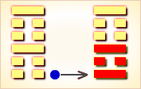
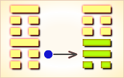
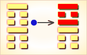
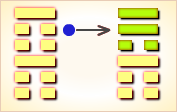
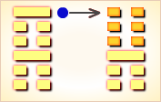

---
hide:
  - navigation
---
# 周易第52卦_艮卦(艮为山)_艮上艮下 

<table>
	<tbody>
		<tr>
			<td class="td1">
				</td>
			<td class="td1">
				</td>
			<td class="td1">
				</td>
			<td class="td1">
				</td>
		</tr>
		<tr>
			<td style="text-align: center;">
				<strong>本卦</strong></td>
			<td style="text-align: center;">
				<strong>互卦</strong></td>
			<td style="text-align: center;">
				<strong>错卦</strong></td>
			<td style="text-align: center;">
				<strong>综卦</strong></td>
		</tr>
		<tr>
			<td style="text-align: center;">
				<a href="" style="text-decoration: none;">第52卦：艮卦(艮为山)</a></td>
			<td style="text-align: center;">
				<a href="../40.雷水解" style="text-decoration: none;">第40卦：解卦(雷水解)</a></td>
			<td style="text-align: center;">
				<a href="../58.兑为泽" style="text-decoration: none;">第58卦：兑卦(兑为泽)</a></td>
			<td style="text-align: center;">
				<a href="../51.震为雷" style="text-decoration: none;">第51卦：震卦(震为雷)</a></td>
		</tr>
	</tbody>
</table>

## 周易第五十二卦详解

**艮卦原文**

艮。艮其背，不获其身。行其庭，不见其人。无咎。

象曰：兼山，艮。君子以思不出其位。

**白话文解释**

艮卦：卸掉责任，挂笏隐退，朝列之中已看不到他的身影，在他的庭院中寻找，也没有找到。其人远走高飞，自无灾祸。

《象辞》说：本卦为两艮卦相重，艮为山，可见艮卦的卦象是高山重立，渊深稳重。君子观此卦象，以此为戒，谋不踰位，明哲保身。

**《断易天机》解**

艮卦艮上艮下，为艮宫本位卦。艮为停止的意思，为钱财散失之象，需谨慎提防。

**北宋易学家邵雍解**

停留阻止，无可再进；随份勿贪，不可强求。

得此卦者，前路受阻，不宜妄进，宜守待机。

台湾国学大儒傅佩荣解

时运：运势平平，不宜妄进。

财运：守好本业，不可贪财。

家宅：不宜改造；命由前定。

身体：带病延年。

**传统解卦**

这个卦是同卦（下艮上艮）相叠。艮为山，二山相重，喻静止。它和震卦相反。高潮过后，必然出现低潮，进入事物的相对静止阶段。静止如山，宜止则止，宜行则行。行止即动和静，都不可失机，应恰到好处，动静得宜，适可而止。

大象：两重高山并峙，故宜止不宜进，阻塞之象。

运势：凡事不宜妄动，前路受阻，只好待机而动。

事业：在经过一段发展后，应进行调整，暂时停止行动，总结经验教训。不可因贪名利而妄进。自我克制，自我约束，谨言慎行，不要盲目追求他人。经过休整后，在适当时机到来时，再大显身手。

经商：进入停滞不前的状态，切勿盲目冒进，而宜适时停止，进入安静退守，不要受外界干扰，尤其是应该保持内心和理智上的宁静，更不要轻易与他人合作。等待时机，必有光明前途。

求名：应保持纯正的目的，静守正道。勿为功名诱惑，秉守忠厚，可得成功。

婚恋：重感情，彼此以诚相待，可白头到老。

决策：性格沉静、内向，不喜好活动，也不善于交际，为人忠诚老实，讲信义。注意听取他人的建议，明哲保身。机遇不到，不宜积极活动，该止则止，勿抱不切实际的想法。

**第五十二卦的哲学含义**

艮卦卦象，艮为山卦的象征意义

艮为山，《易经》中艮卦的符号为“”。八卦中艮卦的符号的产生，是古人观察到山是由一块一块的石头组成的，故用两个阴性符号“二二”，以象征高山上的大小不等的石块。再由低到高，最上层是起伏不平的山顶线，用一个阳性符号“一”画出，于是形成了象征山的符号艮。

“艮”的卦形为一阳居于二阴之上，犹如山之顶为阳，其下蕴藏阴质。由于山总是静止不动的，所以“艮”的性质为“止”，其所代表的象意包括：禁止、阻滞、静止、界限、沉着、冷静、更替、固执、主观、重新开始、标准、独立、转变、讼狱、笃实、消亡、叮咛、等待、厚重等。

艮卦所启示的道理是动静适时，属于中下卦，《象》中这样来断此卦：财帛常打心头走，可惜眼前难到手，不如意时且忍耐，逢着闲事休开口。

## 周易第五十二卦初九爻详解

**初六爻辞**

初六。艮其趾，无咎。利永贞。

象曰：艮其趾，未失正也。

**白话文解释**

初六：歇脚养息，不要轻举妄动，自然无灾难，这是长期吉利的贞兆。

《象辞》说：歇脚养息，不要轻举妄动，远离不义，不失正道，自然永远吉利。

**北宋易学家邵雍解**

平：得此爻者，宜守本份，不要纵欲。做官的保守己职者无失。

台湾国学大儒傅佩荣解

时运：初交好运，退守无咎。

财运：知足常乐，多行善事。

家宅：可以长住；百年好合。

身体：足疾就医。

**初六变卦**

初六爻动变得周易第22卦：山火贲。这个卦是异卦（下离上艮）相叠。离为火为明；艮为山为止。文明而有节制。贲卦论述文与质的关系，以质为主，以文调节。贲，文饰、修饰。

**初九爻的哲学含义**

艮卦第一爻，爻辞：初六：艮其址，无咎，利永贞爻辞释义

本爻辞的意思是：在脚趾迈出之前若发现错了就该马上停止，这样就不会有过错，有利于长久坚守正道。

从卦象上看，初六以阴爻居刚位，是为失位，又没有居于中位，是为不能守中，这一爻意味着在行为的初始阶段，就出现了偏差。

《象》中这样解释本爻：“艮其趾”未失正也。这里指出：“在脚趾迈出之前若发现错了就该马上停止”，这就说明没有失去正道，所以不会有错。

占得此爻者，你想做些事，可是现在形势难以捉摸，你最好保持冷静，如果在还没有做之前就停下来，是再好不过的事了。

初六：艮其趾，无咎，利永贞。

象曰：艮其趾，朱失正也。

经文意思是：脚趾停止运动，没有灾难，利于永远守正道。

象辞意思是：脚处停止运动，是没有失去正道。

## 周易第五十二卦九二爻详解

**六二爻辞**

六二。艮其腓，不拯其随，其心不快。

象曰：不拯其随，未退听也。

**白话文解释**

六二：停立不行，但腿部肌肉还是负伤。心里很不愉快。

《象辞》说：腿部肌肉还是负伤，因为其人固执己见，没有退回来，听取别人的意见。

**北宋易学家邵雍解**

凶：得此爻者，运势受阻，或奔波在外，多劳苦；或有足疾。做官的得不到他人的帮助，不宜上进。

台湾国学大儒傅佩荣解

时运：运途受阻，缺少援手。

财运：止而不售，难免心忧。

家宅：不宜迁居；避开此婚。

身体：药物难治。

**六二变卦**

六二爻动变得周易第18卦：山风蛊。这个卦是异卦（下巽上艮）相叠，与随卦互为综卦。蛊本意为事，引申为多事、混乱。器皿久不用而生虫称“蛊”，喻天下久安而因循、腐败，必须革新创造，治理整顿，挽救危机，重振事业。

**九二爻的哲学含义**

艮卦第二爻，爻辞：六二：艮其腓，不拯其随，其心不快。爻辞释义

腓：指膝关节以下的小腿部位。

本爻辞的意思是：抑止在小腿上，既然无法拯救别人，只好随别人行动，心中感觉不畅快。

从卦象上看，六二属于阴爻居于柔位，得位守中，具备中正仁和之德。六二与九三、六四一起组成坎卦，坎卦指危险。六二居坎卦之初，最先意识到这种危险，但其上级九三却不能守中，阳刚激进，不计后果。六二想劝止其行为，但九二地位比九三低，正像人的小腿不能控制大腿一样，六二不能劝阻九三，只能勉强相随。

《象》中这样分析此爻：“不拯其随”，未退听也。这里指出：“既然无法拯救别人，只好随别人行动”，因为九三不能退下来听从抑止的意见，因而六二心中不快。

占得此爻者，你意识到了某种危险的存在，可是上级或领导不听你的意见，你必须跟他们一起去冒这个险。在这个时候，确实是非常无奈的。

六二：艮其腓，不拯其随，其心不快。

象曰：不拯其随，朱退听也。

## 周易第五十二卦九三爻详解详解

**九三爻辞**

九三。艮其限，列其夤，厉薰心。

象曰：艮其限，危薰心也。

**白话文解释**

九三：卸掉重担，保护腰部，但是胁间肉却已裂开了，引退不及时，则罹凶险。这是由于为名利所惑，不能迅速引退卸职所招致的灾祸。

《象辞》说：“卸掉重担，保护腰部，胁间肉却已裂开了，引退不及时，则罹凶险”，危险是由为名利迷惑所致。

**北宋易学家邵雍解**

凶：得此爻者，不顺之时，危难不安。

台湾国学大儒傅佩荣解

时运：顺时可成，不可勉强。

财运：闭关自守，难免穷困。

家宅：往来为宜；不拘门户。

身体：血脉不通。

**九三变卦**

九三爻动变得周易第23卦：山地剥。这个卦是异卦（下坤上艮）相叠。五阴在下，一阳在上，阴盛而阳孤；高山附于地。二者都是剥落象，故为“剥卦”。此卦阴盛阳衰，喻小人得势，君子困顿，事业败坏。

**九三爻的哲学含义**

艮卦第三爻，爻辞：九三：艮其限，列其夤，厉薰心。爻辞释义

限：指界限。列：指分开，并列不相连。夤：指人的脊柱，位置与心相对。

本爻辞的意思是：抑止腰部的行动，以至于撕裂了脊背的肉，身陷危险而心忧如焚。

从卦象上看，九三属于阳爻居刚位，得位但不居中，急躁易动。九三处于由六二、九三、六四一起组成坎卦之中，坎卦指危险，九三身陷危险之中，既没有援助，自己又不能动。有如脚步已迈进门槛的时候，才想起了抑止自己的行动，这样的抑止实际上是控制不住的，它会裂断脊背上的肉的；这样做是很凶厉的，它有如烈火薰心一样难受。

《象》中这样分析本爻：“艮其限”，危薰心也。这里指出：“抑止腰部的行动”，说明其身陷危险而心忧如焚。本爻告诉人们的道理就是：当行则行，当止则止，但如果停止的时机和位置不恰当，会给你带来不必要的损失。

占得此爻者，因为不能承受工作压力又没有及时辞职卸任，以至于腰部出现了问题。

占得此爻者，还可能因为贪慕名或利，本想尽心尽力帮助别人做些事情，以达到目的，可是黄昏时却与人家发生冲突，这时就要停下来要做的事，不要利益薰心向人家索要利益。

九三：艮其限，列其夤，厉薰心。

象曰：艮其限，危薰心也。

经文意思是：止住腰部，撕裂脊背，危险如烈火烧心。

象辞意思是：止住腰部，其危险如烈火烧心一样。

## 周易第五十二卦九四爻详解详解

**六四爻辞**

六四。艮其身，无咎。

象曰：艮其身，止诸躬也。

**白话文解释**

六四：引退保身，没有灾祸。

《象辞》说：引退保身，是说其人注意力全部集中在自身的安危上，所以不会招惹灾难。

**北宋易学家邵雍解**

平：得此爻者，宜安分守常，不可有非分之想。

台湾国学大儒傅佩荣解

时运：无得无失，保身无咎。

财运：可以保本，另得良机。

家宅：平安无事；婚姻平平。

身体：带病延年。

**六四变卦**

六四爻动变得周易第56卦：火山旅。这个卦是异卦（下艮上离）相叠。此卦与丰卦相反，互为“综卦”。山中燃火，烧而不止，火势不停地向前蔓延，如同途中行人，急于赶路。因而称旅卦。

**九四爻的哲学含义**

艮卦第四爻，爻辞：六四：艮其身，无咎。爻辞释义

本爻辞的意思是：抑止身体上部不动，就不会受害。

从卦象上看，六四已经进入了上卦，临近君主六五，属于近君大臣。这个位置有如人体的胸腹部，保护着五脏六腹，制约四肢。六四以阴爻居柔位，当位得正。既能抑止急进躁动的九三，又能自我审视，管住自己，并且听从六五的命令，所以无咎。

《象》中这样分析本爻：“艮其身”，止诸躬也。这里指出：“抑止身体上部不动”，自我控制不超越本身的地位。

本爻提示人们，任何事情都有度，在做事的时候一定要考虑这一点。占得此爻者，要明白当下自己的关键之事就是掌握好这个度，既要把握下级做事的度，也要审视自己，在执行领导的命令时是否适度。你可以检查一下自己在这些方面，是不是有什么失误或过错。

六四：艮其身，无咎。象曰：艮其身，止诸躬也。

## 周易第五十二卦九五爻详解详解

**六五爻辞**

六五。艮其辅，言有序，悔亡。

象曰：艮其辅，以中正也。

**白话文解释**

六五：闭口少言，讲话有分寸，自然没有悔恨。

《象辞》说：闭口少言，讲话有分寸，没有悔恨，因为六五之爻居上卦中位，像人谨守中正之道。

**北宋易学家邵雍解**

平：得此爻者，正人君子，人情和合，谋望遂意。做官的会居要职。

台湾国学大儒傅佩荣解

时运：言谈中正，自然可取。

财运：保密为要，商机可成。

家宅：位得中正；慎防巧言。

身体：口能发声，病即可治。

**六五变卦**

六五爻动变得周易第53卦：风山渐。这个卦是异卦（下艮上巽）相叠。艮为山，巽为木。山上有木，逐渐成长，山也随着增高。这是逐渐进步的过程，所以称渐，渐即进，渐渐前进而不急速。

** 九五爻的哲学含义**

艮卦第五爻，爻辞：六五：艮其辅，言有序，悔亡。爻辞释义

辅：指脸辅，面颊。言有序：只说话讲分寸，言之有序。

本爻辞的意思是：约束自己的嘴巴，不要随便乱说，说话很有分寸和条理。

从卦象上看，六五以阴爻居于君主之位，才质柔弱，有失正之嫌。但是其居于上卦中间，能执守中道，有效地约束自己的言行，说出的话都是“金口玉言”，这样就不会出现悔恨之事。

《象》中这样解释本爻：“艮其辅”，以中正也。这里指出：“约束自己的嘴巴，不要随便乱说”，说明六五爻居于中位能守中道。这一爻告诉人们的正是“小心祸从口出”的道理。

占得此爻者，可能是非常爱说的人，有些人还带有夸大、吹嘘的成分，甚至引起周围人的反感。在说话时一定要注意，言多必失，不该说的话不要说，以免引起不必要的麻烦。慎言、慎行，一旦出大事，不会殃及自己，就不会有后悔的事。

## 周易第五十二卦上九爻详解详解

**上九爻辞**

上九。敦艮，吉。

象曰：敦艮之吉，以厚终也。

**白话文解释**

上九：注意保护自己的脑袋，首级不失，自然吉利。

《象辞》说：爻辞讲以忠厚为归宿之所以吉利，因为上九之爻为一卦之终爻，像人秉守忠厚，必得善终。

**北宋易学家邵雍解**

吉：得此爻者，多福多利，但易防不吉之事。做官的会升迁，读书人会取得佳绩。

台湾国学大儒傅佩荣解

时运：好上加好，自然吉祥。

财运：上手生意，获利自多。

家宅：世代忠厚；婚姻吉祥。

身体：体质厚实。

**上九变卦**

上九爻动变得周易第15卦：地山谦。这个卦是异卦（下艮上坤）相叠，艮为山，坤为地。地面有山，地卑（低）而山高，是为内高外低，比喻功高不自居，名高不自誉，位高不自傲。这就是谦。

**上九爻的哲学含义**

艮卦第六爻，爻辞：上九：敦艮，吉。爻辞释义

敦：指敎厚、驾实的意思。

本爻辞的意思是：能够以敦厚笃实的德行抑止邪欲，这样就会获得吉祥。

从卦象上看，上九位于艮卦的最上端，不但沉厚而且高大，以其至厚之德将止道贯彻始终。《象》中这样解释本爻：“敦艮之吉”，以厚终也。这里指出：“能够以敦厚笃实的德行抑止邪欲，这样就会获得吉祥”，说明上九能够将敦厚的德行保持至终。

这一爻告诉人们，要抑止自己的言行，必须要有敦厚的德行才行，只有敦厚诚实的品德，才会吉祥；不然则会变为小人的投机取巧，既害人，又害己。