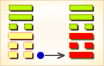
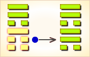
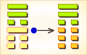
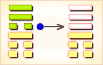
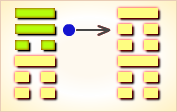
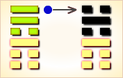

---
hide:
  - navigation
---
# 周易第53卦_渐卦(风山渐)_巽上艮下 

<table>
	<tbody>
		<tr>
			<td class="td1">
				</td>
			<td class="td1">
				</td>
			<td class="td1">
				</td>
			<td class="td1">
				</td>
		</tr>
		<tr>
			<td style="text-align: center;">
				<strong>本卦</strong></td>
			<td style="text-align: center;">
				<strong>互卦</strong></td>
			<td style="text-align: center;">
				<strong>错卦</strong></td>
			<td style="text-align: center;">
				<strong>综卦</strong></td>
		</tr>
		<tr>
			<td style="text-align: center;">
				<a href="" style="text-decoration: none;">第53卦：渐卦(风山渐)</a></td>
			<td style="text-align: center;">
				<a href="../64.火水未济" style="text-decoration: none;">第64卦：未济卦(火水未济)</a></td>
			<td style="text-align: center;">
				<a href="../54.雷泽归妹" style="text-decoration: none;">第54卦：归妹卦(雷泽归妹)</a></td>
			<td style="text-align: center;">
				<a href="../54.雷泽归妹" style="text-decoration: none;">第54卦：归妹卦(雷泽归妹)</a></td>
		</tr>
	</tbody>
</table>

## 周易第五十三卦详解

**渐卦原文**

渐。女归吉，利贞。

象曰：山上有木，渐。君子以居贤德善俗。

**白话文解释**

渐卦：女大当嫁，这是好事。这是吉利的贞卜。

《象辞》说：本卦下卦为艮，艮为山；上卦为巽，巽为木，木植山上，不断生长，是渐卦的卦象。君子观此卦象，取法于山之育林，从而以贤德自居，担负起改善风俗的社会责任。

**《断易天机》解**

渐卦巽上艮下，为艮宫归魂卦。渐为渐进，筮遇此卦，女嫁则吉，举事有利。

**北宋易学家邵雍解**

循序渐进，积少成多；渐进即利，性急即败。

得此卦者，逐步开运，凡事宜循序渐进，则谋事可成，不宜急进，性急则败。

台湾国学大儒傅佩荣解

时运：时来运转，可以得意。

财运：逐渐得利，多行善事。

家宅：君子居之；贤女可妻。

身体：安居调养。

**传统解卦**

这个卦是异卦（下艮上巽）相叠。艮为山，巽为木。山上有木，逐渐成长，山也随着增高。这是逐渐进步的过程，所以称渐，渐即进，渐渐前进而不急速。

大象：山上种有树木，逐渐生长，比喻循序渐进。

运势：逐渐走向光明前途，凡事宜打根基，可得吉庆，但须防色情之难及文书错失。

事业：在经过一个相对静止的时期后，重新开始了事业的新阶段。这时最怕的是急躁冒进，务必循序上进，脚踏实地。同时注意品德修养，以沉着、谦逊的态度对待事业，可无往而不利。

经商：正处在稳步向前发展的阶段，要把握时机，既不可盲目乐观，也不要停步不前，而应采取逐步前进的策略，量力而行。遵守商业道德，以良好的服务，开拓市场。

求名：效法树木植根山上，逐渐生长的精神。在品德和学业两个方面，扎扎实实地提高自己。同时，肩负起改善社会风俗的责任。求名应以渐进为宜，切不可急进。

婚恋：不可操之过急。幸福、美满，夫妻白头和谐。

决策：时来运转的时刻已经到来，切莫错过良机。务必小心谨慎，渐进有益有利。以谦和的态度处世，可以得到强有力的支持，会获得重大成功。

**第五十三卦的哲学含义**

渐卦卦象，木山渐卦的象征意义

渐卦，这个卦是异卦相叠，下卦为艮，上卦为巽。艮为山，巽为木。山上有木，逐渐成长，山也随着增高。这是逐渐进步的过程，所以称渐。“渐”即“进”，渐渐前进而不急速。

渐卦位于艮卦之后，《序卦》中这样解释道：“物不可以终止，故受之渐。渐者，进也。”艮卦谈止，止到尽头又须开始活动，这时出现的是渐卦。渐为进，并且是有秩序地渐进。《杂卦》中这样说道：“渐，女归待男行也。”古代女子若要出嫁，必须要等待男方行聘，以便依序进展，这也体现了渐的特点。

《象》中这样解释渐卦：山上有木，渐；君子以居贤德善俗。这里指出：渐卦的卦象是艮（山）下巽（风）上，表明高山上的树木逐渐成长，象征循序渐进；君子观看高山上的树木逐渐成长，于是修养德性，改善社会的风尚、礼节和习惯。

渐卦象征着循序渐进，告诉人们渐进蓄德的道理，属于上上卦。《象》中这样来断此卦：俊鸟幸得出笼中，脱离灾难显威风，一朝得意福力至，东西南北任意行。

## 周易第五十三卦初九爻详解

**初六爻辞**

初六。鸿渐于干，小子厉。有言，无咎。

象曰：小子之厉，义无咎也。

**白话文解释**

初六：鸿雁走进了山涧。筮遇此爻，警惕小孩顽皮，遭遇危险，应该加以谴责，则没有灾难。

《象辞》说：小孩顽皮遭遇危险，因为有家长呵责制止，理应不会出事故。

**北宋易学家邵雍解**

凶：得此爻者，运气不佳，谋为不利。

台湾国学大儒傅佩荣解

时运：初行好运，要有耐心。

财运：有约在先，宜防小人。

家宅：尚无大碍；女长男少。

身体：大人没事，小孩就医。

**初六变卦**

初六爻动变得周易第37卦：风火家人。这个卦是异卦（下离上巽）相叠。离为火；巽为风。火使热气上升，成为风。一切事物皆应以内在为本，然后伸延到外。发生于内，形成于外。喻先治家而后治天下，家道正，天下安乐。

**初九爻的哲学含义**

渐卦第一爻，爻辞：初六：鸿渐于干；小子厉，有言，无咎。爻辞释义

干：通“岸”。有言：是指有怨言，被人议论。

本爻辞的意思是：鸿雁迁移远行之前，汇聚于河岸，做好结队飞行的准备。小雁不知道旅途的艰险，不能耐心等待，因而受到众人的责备。做事如果能够循序渐进，就不会受害。

从卦象上看，初六属于阴爻居柔位，才质柔弱，像小雁子一样，能力不足。初六位于初始之位，没有居中，意味着其做事不能持中，有冒进之嫌，像小雁子急于迁移，不能耐心等待，但是自身能力又不足，所以会被人责备，但是别人看其年幼无知，也不会进行刁难，责备之后还会进行帮助。

《象》中这样解释本爻：“小子之厉”，义无咎也。这里指出：“小雁不知道旅途的艰险，不能耐心等待，因而受到众人的责备”，但不会发生什么危险

占得此爻者，可能是年龄较小，也可能是刚毕业参加工作，还有可能换了工作，来到了一个新的陌生的行业。单位里有一次重要的任务，别人正在精心谋划，你却认为没必要那么做，直接去做就行了，可能领导或老员工会责备你，但是看在你是新来的不太懂的份上，不会过于打击你的。

占得此爻者，一定要意识到自己年幼无知或是经验不足，做事不要冒进，要循序渐进。要养精蓄锐，不要急于发表自己的观点，要看大家怎么做，然后跟着大家去做，这样才能免受责难。

初六：鸿渐于干，小子厉，有言，无咎。

象曰：水子之厉，义无咎也。

经文意思是：大雁渐渐飞到了水边，小雁有危险，被大雁叫住，没有灾难。

象辞意思是：小雁的危险，从道义上讲不应该有突难。

## 周易第五十三卦九二爻详解

**六二爻辞**

六二。鸿渐于磐，饮食衎衎，吉。

象曰：饮食衎衎，不素饱也。

**白话文解释**

六二：鸿雁走上水边高地，饱饮饱食，自得喜乐。筮遇此爻，吉利。

《象辞》说：饱饮饱食，自得喜乐，喻指其人，自食其力，从不白吃白喝。

**北宋易学家邵雍解**

吉：得此爻者，无往不利，随处皆安。

台湾国学大儒傅佩荣解

时运：嘉宾安乐，名利皆有。

财运：日益增加，稳若磐石。

家宅：和乐相处；百年偕老。

身体：饮食过度之症。

**六二变卦**

六二爻动变得周易第57卦：巽为风。这个卦是同卦（下巽上巽）相叠，巽为风，两风相重，长风不绝，无孔不入，巽亦为顺、谦逊的态度和行为，可无往不利。

**九二爻的哲学含义**

渐卦第二爻，爻辞：六二：鸿渐于磐，饮食桁桁，吉。爻辞释义

磐：指磐石。桁桁：形容和谐欢快的气氛。

本爻辞的意思是：鸿雁已经从河岸渐渐地升进聚集到磐石上，作起程前最后的准备。一起安享饮食，吉祥。

从卦象上看，六二以阴爻居柔位，而且上应九五之君。六二能持中守正，不会冒进，按着规矩来循序渐进地行进。“饮食”是准备吃饱了大干一场。

《象》中这样解释道：“饮食桁桁”，不素饱也。这里指出：“饮食和乐”，说明绝不是素餐不干事情的。

占得此爻者，你还没有到展翅高飞的时候，要一步一步地做准备，等待时机一到，就能大展身手了。任何事情都有自己的步骤，不能一蹴而就，你应该意识到这个过程，不要急于冒进。

六二：鸿渐于磐，饮食衎衎，吉。

象曰：饮食衎衎，不素饱也。

经文意思是：大雁渐渐飞到磐石上，饮食和乐，吉祥。

## 周易第五十三卦九三爻详解详解

**九三爻辞**

九三。鸿渐于陆，夫征不复，妇孕不育，凶。利御寇。

象曰：夫征不复，离群丑也。妇孕不育，失其道也。利用御寇，顺相保也。

**白话文解释**

九三：鸿雁走到旱地上。筮遇此爻，丈夫出征可能不再回返，妇女怀孕可能流产，这是凶险之兆。但有利于抵御敌寇。

《象辞》说：丈夫出征不再回返，说明其人掉队遇险。妇女怀孕而流产，说明其人失其保胎之道。利于抵御敌寇，说明国人能够同心同德，保家卫国。

**北宋易学家邵雍解**

凶：得此爻者，多惊扰，人情不睦，盗贼侵害。做官的上进有阻力，有被贬之忧。

台湾国学大儒傅佩荣解

时运：运势不正，须防有祸。

财运：不易得利，防有盗贼。

家宅：不利生产，须防离散。

身体：生产时恐难两全。

**九三变卦**

九三爻动变得周易第20卦：风地观。这个卦是异卦（下坤上巽）相叠，风行地上，喻德教遍施。观卦与临卦互为综卦，交相使用。在上者以道义观天下；在下者以敬仰瞻上，人心顺服归从。

**九三爻的哲学含义**

渐卦第三爻，爻辞：九三：鸿渐于陆，夫征不复，妇孕不育，凶；利御宼。爻辞释义

陆：指较平的山顶。不复：不回来。

本爻辞的意思是：鸿雁飞起来逐渐前进到较平的山顶上，每一只都要紧跟群体。若是单独行动则难以回来。也不可苟徇私情，随意结合，否则将会虽孕却难以生育，这当然是凶险的事。坚守正道，谨慎防守，可抵御敌人的侵犯。

《象》中这样解释本爻：“夫征不复”，离群丑也；“妇孕不育”，失其道也；“利用御宼”，顺相保也。这里指出：“若是单独行动则难以回来”，离开自己的同类是值得忧虑的；“虽孕却难以生育”，因为违反了妇道；“坚守正道，谨慎防守，可抵御敌人的侵犯”，说明守正能够和顺相保。

占得此爻者，如果你想成事业，必须依附于一个团队，凭自己的单打独斗，难以有所成就。在一个团队之中，要就遵守团队的纪律，不要乱来。大家团结在一起，更有利于抵御困难。

占得此爻者，如果不顾劝阻离乡背井去从事冒险的事业，想办的事办不成，帮助你的人会因此受累，你会长期流落在外而难以归家。

九三：鸿渐于陆，夫征不复，妇孕不育，凶；利御寇。

象曰：夫征不复，离群

## 周易第五十三卦九四爻详解详解

**六四爻辞**

六四。鸿渐于木，或得其桷，无咎。

象曰：或得其桷，顺以巽也。

**白话文解释**

六四：鸿雁飞到树木上，有的停息在河边堆放的桷木上。筮遇此爻，没有灾难。

《象辞》说：有的鸿雁停息在河边堆放的桷木上之所以没有灾难，因为六四阴爻居于九五阳爻之下，像人有驯服而又谦逊之德。

**北宋易学家邵雍解**

平：得此爻者，利于修造，自给自足。做官的须随遇而安，升迁无定。

台湾国学大儒傅佩荣解

时运：随遇而安，可以免咎。

财运：利润甚微，保本即可。

家宅：可能寡居。

身体：肝火过盛。

**六四变卦**

六四爻动变得周易第33卦：天山遁。这个卦是异卦（下艮上乾）相叠。乾为天，艮为山。天下有山，山高天退。阴长阳消，小人得势，君子退隐，明哲保身，伺机救天下。

**九四爻的哲学含义**

渐卦第四爻，爻辞：六四：鸿渐于木，或得其桷，无咎。爻辞释义

木：指大树。桷：树干主枝的分叉处，常为飞禽做窝栖息之地。

本爻辞的意思是：鸿雁飞起来逐渐前进到一片大树林，或许能找到较平的枝杈得以栖息，不会带来什么灾祸。

从卦象上看，六四以阴爻居于柔位，紧临九五，属于近君大臣。尽管六四的处境不安，因为爻中以鸿雁栖树为例，鸿雁乃水鸟，脚蹼不同于鸟爪，在树上呆不稳，“栖而不安”，要时刻防止跌落，所以树上并不是长久的栖息之地。但是六四能够对九五能言听计从，柔顺以待，所以得其荫护，没有灾祸。

《象》中这样解释本爻：“或得其桷”，顺以巽也。这里指出：“或许能寻找到较平的枝杈得以栖息”，说明六四柔顺和服从。

占得此爻者，可能找到一个新的岗位，或是被推荐到一个更高的职位，但是真正地做起之后，会发现这里并不安全，自己要非常谨慎，否则可能就会被撤职。这个时候，你要对领导或上级表现出柔和与服从，得到领导的赏识和关照，就不会出什么差错了。

六四：鸿渐于木，或得其祸，无咎。

象曰：或得其桷，顺以巽也。

## 周易第五十三卦九五爻详解详解

**九五爻辞**

九五。鸿渐于陵，妇三岁不孕，终莫之胜，吉。

象曰：终莫之胜，吉，得所愿也。

**白话文解释**

九五：鸿雁走到山陵上。筮遇此爻，妻子多年不能怀孕，但始终不会被人取代，吉利。

《象辞》说：始终没有被人取代，吉利，妻子实现了与其丈夫和谐白头的愿望。

**北宋易学家邵雍解**

吉：得此爻者，先难后易，做官的多招诽谤，先暗后明。

台湾国学大儒傅佩荣解

时运：运势中正，三年必成。

财运：眼前平平，三年大发。

家宅：可以安居；得子稍迟。

身体：三年可愈。

**九五变卦**

九五爻动变得周易第52卦：艮为山。这个卦是同卦（下艮上艮）相叠。艮为山，二山相重，喻静止。它和震卦相反。高潮过后，必然出现低潮，进入事物的相对静止阶段。静止如山，宜止则止，宜行则行。行止即动和静，都不可失机，应恰到好处，动静得宜，适可而止。

**九五爻的哲学含义**

渐卦第五爻，爻辞：九五：鸿渐于陵，妇三岁不孕；终莫之胜，吉。爻辞释义

本爻辞的意思是：鸿雁飞起来逐渐前进到丘陵上，好比丈夫远出在外，妻子三年没有怀孕；但邪毕竟不能胜正，因此最终得到吉祥。

从卦象上看，九五以阳爻居君位，居中守正。其与六二正应，象征两夫妻，都能居中守正，最后能得到吉祥。

《象》中这样解释本爻：“终莫之胜吉”，得所愿也。这里指出：“邪终久不能胜正，因此就得到吉祥”，实现了夫妇聚首的愿望。

占得此爻者，在事业上可能遇到了险阻，但是因守持正道，努力克服，现在终于实现了自己的愿望。在婚姻上，可能因为种种阻隔夫妻难以团聚，但是相互之间都彼此忠诚，没有背叛，最终得以团聚。

九五：鸿渐于陵，妇三岁不孕，终莫之胜，吉。

象曰：终莫之胜，吉；得所愿也。

## 周易第五十三卦上九爻详解详解

**上九爻辞**

上九。鸿渐于陆，其羽可用为仪，吉。

象曰：其羽可用为仪，吉，不可乱也。

**白话文解释**

上九：鸿雁走到山头上，它的羽毛可用来编织舞具。这是吉利之兆。

《象辞》说：鸿雁的羽毛可用来编织舞具，这是吉利之兆，编织舞具的羽毛应该纯而不杂，像人心志不乱。

**北宋易学家邵雍解**

吉：得此爻者，得人荐举，谋望有成，祸患不侵，多福多利。做官的大运来到，会得到重用。读书人会取得好成绩。

台湾国学大儒傅佩荣解

时运：大运来到，谋望有成。

财运：货美价高，自然获利。

家宅：辉煌可观；婚姻吉祥。

身体：健康活泼。

**上九变卦**

上九爻动变得周易第39卦：水山蹇。这个卦是异卦（下艮上坎）相叠。坎为水，艮为山。山高水深，困难重重，人生险阻，见险而止，明哲保身，可谓智慧。蹇，跋行艰难。

**上九爻的哲学含义**

渐卦第六爻，爻辞：上九：鸿渐于陆，其羽可用为仪，吉。爻辞释义

雁群通过循序渐进、有秩序地飞行，终于达到目的地。而婚礼这种仪式，也不可乱，古代婚礼的六个步骤中，第一个为纳采，纳采时用雁，最后一个步骤是亲迎，新郎迎亲时帽子上需插雁翎，这也象征通过循序渐进的步骤，而得以圆满的结合。

《象》中这样解释本爻：“其羽可用为仪，吉”，不可乱也。这里指漂亮的羽毛可以作为典礼上的装饰品，吉祥”，说明典礼包括婚礼是不能乱的占得此爻者，经过以前循序渐进的行动，一步一步踏实地工作，终于取得了圆满。

上九：鸿渐于陆，其羽可用为仪，吉。

象曰：其羽可用为仪，吉；不可乱也。