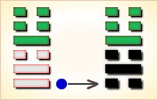
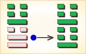
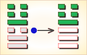
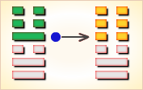
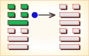
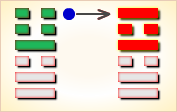

---
hide:
  - navigation
---
# 周易第54卦_归妹卦(雷泽归妹)_震上兑下 

<table>
	<tbody>
		<tr>
			<td class="td1">
				</td>
			<td class="td1">
				</td>
			<td class="td1">
				</td>
			<td class="td1">
				</td>
		</tr>
		<tr>
			<td style="text-align: center;">
				<strong>本卦</strong></td>
			<td style="text-align: center;">
				<strong>互卦</strong></td>
			<td style="text-align: center;">
				<strong>错卦</strong></td>
			<td style="text-align: center;">
				<strong>综卦</strong></td>
		</tr>
		<tr>
			<td style="text-align: center;">
				<a href="" style="text-decoration: none;">第54卦：归妹卦(雷泽归妹)</a></td>
			<td style="text-align: center;">
				<a href="../63.水火既济" style="text-decoration: none;">第63卦：既济卦(水火既济)</a></td>
			<td style="text-align: center;">
				<a href="../53.风山渐" style="text-decoration: none;">第53卦：渐卦(风山渐)</a></td>
			<td style="text-align: center;">
				<a href="../53.风山渐" style="text-decoration: none;">第53卦：渐卦(风山渐)</a></td>
		</tr>
	</tbody>
</table>

## 周易第五十四卦详解

**归妹卦原文**

归妹。征凶，无攸利。

象曰：泽上有雷，归妹。君子以永终知敝。

**白话文解释**

归妹卦：筮遇此爻，出征凶险。无所利。

《象辞》说：归妹之卦，下卦为兑，兑为泽；上卦为震，震为雷。可见泽上雷鸣，雷鸣水动，用以喻男女心动相爱而成眷属。这是归妹卦的卦象。君子观此卦象，从而在长期的婚姻生活中，体察到婚姻的成功与失败。

**《断易天机》解**

归妹卦震上兑下，为兑宫归魂卦。占得此卦，天地不交，闭塞不通，有殃有咎，无始无终，所作不顺，百事不利。

**北宋易学家邵雍解**

违反常理，其道将穷；明察事理，止绝妄念。

得此卦者，困难之时，做事有违常理，灾祸不断。宜明察事理，修身养性，断绝妄念。

台湾国学大儒傅佩荣解

时运：进不以道，难以持久。

财运：货价尚可，结局未必。

家宅：已婚不宜居母家；勿眈情欲。

身体：大限将至。

**传统解卦**

这个卦是异卦（下兑上震）相叠。震为动、为长男；兑为悦、为少女。以少女从长男，产生爱慕之情，有婚姻之动，有嫁女之象，故称归妹。

大象：震长男在上，兑少女在下，女必归从，归即是出嫁，但少女配长男，非正常组合。

运势：处事有违常理正道，先得其益，但随后祸事百端。

事业：正在进入新的阶段，很快将会出现另一番景象。这时首先必须具备远大眼光，识破利弊和吉凶，有备始能无患。其次是坚守纯正的品德和正确的原则。

经商：开拓新的市场即将成功，在未来的商业活动中必须注意经营的方向和种类，加强与他人合作。

求名：务必以坚定的决心，努力提高自己，为成名立业奠定基础，最可怕是儿女情长影响了自己的前途和事业。

婚恋：顺其自然，不可违背原则，尤其不可强求，宁可晚婚也要选择理想的对象。夫妻经过生活考验，可和谐到老。

决策：对于人生必须坚持公正纯洁的品德，正确对待婚姻和家庭，以幸福美满的家庭为基础，开拓和发展自己的事业。

**第五十四卦的哲学含义**

归妹卦卦辞，雷泽归妹卦的象征意义

归妹卦，这个卦是异卦相叠。上卦为震，下卦为兑。震为动，为长男；兑为悦，为少女。以少女从长男，产生爱慕之情，有婚姻之动，有嫁女之象，故称归归妹卦位于渐卦之后，《序卦》这样解释道：“进必有所归，故受之以妹。”渐卦是讲进展的，进展到一定时候，就要有个归宿，其含义就可以推广到嫁出女子。《杂卦》中说道：“归妹，女之终也。”就强调了这层意思。古人以女子出嫁为有所归，有如回到家一般。

《象》中这样解释本卦：泽上有雷，归妹，君子以永终知敝。这里指出：归妹卦的卦象是兑（泽）下震（雷）上，兑又代表少女，震又代表长男，为嫁出少女之象；君子应当永远使夫妇和谐，白头偕老，防止夫妇关系被破坏。

归妹卦象征婚嫁，启示的是立家兴业的道理，属于下下卦。《象》中这样来断此卦：求鱼须当向水中，树上求之不顺情，受尽爬揭难随意，劳而无功运平平。

## 周易第五十四卦初九爻详解

**初九爻辞**

初九。归妹以娣，跛能履，征吉。

象曰：归妹以娣，以恒也。跛能履吉，相承也。

**白话文解释**

初九：嫁女而将其妹妹一同陪嫁。跛脚而能行走。筮遇此爻，出行吉利。

《象辞》说：嫁女而将其妹妹一同陪嫁，是说姊妹共嫁一夫，这是古代贵族婚嫁的常规。跛脚而能行走，出行吉利，因为跛者获得别人的帮助。

**北宋易学家邵雍解**

吉：得此爻者，有小德，谋望顺遂。做官的或有政绩。

台湾国学大儒傅佩荣解

时运：因人成事，乏善可陈。

财运：奉命而行，幸可获利。

家宅：偏屋亦吉。

身体：不良于行。

**初九变卦**

初九爻动变得周易第40卦：雷水解。这个卦是异卦（下坎上震）相叠。震为雷、为动；坎为水、为险。险在内，动在外。严冬天地闭塞，静极而动。万象更新，冬去春来，一切消除，是为解。

**初九爻的哲学含义**

归妹卦第一爻，爻辞：初九：归妹以娣，跛能履，征吉。爻辞释义

娣：古时姐姐出嫁以妹妹陪嫁作偏房称为娣。履：前行。

本爻辞的意思是：姐姐出嫁做正室，妹妹出嫁做偏房，共侍一夫。如同跛足之人，虽偏斜不正，但互相协助，依礼而行，前进也可获得吉祥。

从卦象上看，初九位于卦的底端，位置最低，不可被位居于君爻的六五所看重，不是正妻之位。初九又与九二逆比，九二与六五正应，初九若是不愿意做妾，则难以找到心仪的丈夫。其认识到自己的前程渺茫，所以委曲求全嫁为偏房，因为能守规守矩，所以也是吉利的

。

《象》中这样分析本爻：“归妹以娣”，以恒也；跛能履，吉相承也。这里指出：“姐姐出嫁做正室，妹妹出嫁做偏房”，这是婚嫁中的正常情况；“如同跛足之人，虽偏斜不正，但互相协助，依礼而行”，说明能以偏房侧室的地位辅佐和照顾丈夫，也能获得吉祥。

占得此爻者，要明白这样的道理：明知道自己得到的待遇不公正，还是心甘情愿地去接受，持有这种谦卑的态度，可获吉祥。

占得此爻，做事别急于求成，否则就会如同出嫁女子做小妾一样，虽有结果，但并不如意。

## 周易第五十四卦九二爻详解

**九二爻辞**

九二。眇能视，利幽人之贞。

象曰：利幽人之贞，未变常也。

**白话文解释**

九二：眼睛瞎了而能看得见。这是利于囚徒的贞卜。

《象辞》说：这是利于囚徒的贞卜，因为身处囚笼尚不失正道，故能重见光明。

**北宋易学家邵雍解**

平：得此爻者，不宜进取，守旧者则祸害不生。

台湾国学大儒傅佩荣解

时运：不必幻想，安心修养。

财运：独到之见，暗中得利。

家宅：适合隐居；偏房为宜。

身体：保养眼睛。

**九二变卦**

九二爻动变得周易第51卦：震为雷。这个卦是同卦（下震上震）相叠。震为雷，两震相叠，反响巨大，可消除沉闷之气，亨通畅达。平日应居安思危，怀恐惧心理，不敢有所怠慢，遇到突发事变，也能安然自若，谈笑如常。

**九二爻的哲学含义**

归妹卦第二爻，爻辞：九二：眇能视，利幽人之贞。爻辞释义

眇：原指视力有毛病，这里指睁只眼闭只眼，难得糊涂，有宽容忍让的美德。幽：指幽怨。贞：守正。

从卦象上看，九二以阳爻居刚位，处于卦的中间，虽然心里不甘，但是能坚守中道。正如少女急于求嫁，但是找了一位并不满意的丈夫。虽然心怀幽怨，但是只能睁只眼闭只眼，抱着这种想法固守正道。

《象》中这样解释本爻：“利幽人之贞”，未变常也。这里指出：“这样想有利于心怀幽怨的人坚守正道”，这是因为能遵守恒常的规则。

占得此爻者，在事业上可能遇到不顺，对领导或上级心怀不满，他们的行为令你不屑，但是你是很需要这份工作的，所以应该对领导或上级眼只眼闭只眼，做好自己的工作、完成自己的本份事，拿到自己的工资就可以了。在婚姻方面，可能对另一半心怀不满，但又无法改变现状，这时只好不去管束，尽好自己的本份即可。

九二：眇能视，利幽人之贞。

象曰：利幽人之贞，朱变常也。

## 周易第五十四卦九三爻详解详解

**六三爻辞**

六三。归妹以须，反归以娣。

象曰：归妹以须，未当也。

**白话文解释**

六三：嫁女而用其姊陪嫁，随后又与其妹妹返归父母家。

《象辞》说：嫁女而用其姊陪嫁，这件事不妥当。

**北宋易学家邵雍解**

凶：得此爻者，进退无常，劳役悲苦。做官的有被降职之忧。

台湾国学大儒傅佩荣解

时运：受人抑制，忍耐一时。

财运：眼前无利，可图未来。

家宅：不是正宅；不是正娶。

身体：待时可愈。

**六三变卦**

六三爻动变得周易第34卦：雷天大壮。这个卦是异卦（下乾上震）相叠。震为雷；乾为天。乾刚震动。天鸣雷，云雷滚，声势宏大，阳气盛壮，万物生长。刚壮有力故曰壮。大而且壮，故名大壮。四阳壮盛，积极而有所作为，上正下正，标正影直。

**九三爻的哲学含义**

归妹卦第三爻，爻辞：六三：归妹以须，反归以娣。爻辞释义

须：作等待讲，这里指急欲媚上待嫁而不得嫁时，只好返回等待。

本爻辞的意思是：女子想嫁为正室，一直未找到合适的对象，还在等待，结果误了青春而急于出嫁，以陪嫁女的侧室身份出嫁。

六三以阴爻居于刚位，失位。《象》中这样解释本爻：“归妹以须”，未当也。“女子想嫁为正室，一直未找到合适的对象，还在等待”，这是不正当的。

占得此爻者，可能在生活或事业上找不到合适的位置，这时你不应该继续空等下去，而应该降低标准，这样才能为别人所接受。虽然会觉得委屈，但是总比浪费时间和青春要好。

从另一个角度看，六三也提醒人们，在做事时不要急于求成，有如嫁女一样，本不想做小妾，但是急于出嫁，最后成了偏房小妾。

六三：归妹以须，反归以娣。

象曰：归妹以须，朱当也。

## 周易第五十四卦九四爻详解详解

**九四爻辞**

九四。归妹愆期，迟归有时。

象曰：愆期之志，有待而行也。

**白话文解释**

九四：出嫁时超过了婚龄，迟迟不嫁是因为有所等待。

《象辞》说：超龄而不嫁，因为她决意找到合意的郎君。

**北宋易学家邵雍解**

平：得此爻者，不是佳期，须待时运。

台湾国学大儒傅佩荣解

时运：行运有时，不宜躁进。

财运：待时而动，自可获利。

家宅：暂勿迁居；须待时日。

身体：安心静养。

**九四变卦**

九四爻动变得周易第19卦：地泽临。这个卦是异卦（下兑上坤）相叠。坤为地，兑为泽，地高于泽，泽容于地。喻君主亲临天下，治国安邦，上下融洽。

**九四爻的哲学含义**

归妹卦第四爻，爻辞：九四：归妹愆期，迟归有时。爻辞释义

愆期：延误日期，这里指当嫁却不急于草率成亲。

本爻辞的意思是：待嫁少女延迟出嫁的日期，静等好的时机。

从卦象上看，九四以阳爻居阴位，紧临六五，属于近君大臣之位，这里指出身高贵的女人，而且德才兼备，其不愿意草率嫁人，而是在等待好的时机。

《象》中这样解释本爻：愆期之志，有待而行也。这里指出：错过出嫁的时机，是为等待更好的时机到来。

占得此爻者，虽然到了婚嫁的年龄，可是你却为找到一位合适的配偶而迟迟未婚。只要你再等一等，中意的人就会出现了。

占得此爻者，在做事上，不要急于求成，这样虽然可能会延误时机，但是却会得到更圆满的结果。

九四：归妹愆期，迟归有时。

象曰：愆期之志，有待而行也。

## 周易第五十四卦九五爻详解详解

**六五爻辞**

六五。帝乙归妹，其君之袂，不如其娣之袂良。月几望，吉。

象曰：帝乙归妹，不如其娣之袂良也。其位在中，以贵行也。

**白话文解释**

六五：帝乙嫁女于周文王，以其次女陪嫁。论嫁妆姊的不如妹的好。良辰择在某月十四日，吉利。

《象辞》说：帝乙嫁女于周文王，姊的嫁妆不如妹的好。六五之爻居上卦中位，像女嫁夫家处于尊贵之位。

**北宋易学家邵雍解**

吉：得此爻者，正值好运，或成婚，或得财。做官的会受到重用，身居要职。

台湾国学大儒傅佩荣解

时运：谦虚得福，联袂上进。

财运：后货较优，早售有利。

家宅：喜事临门；二女同归。

身体：半月可愈。

**六五变卦**

六五爻动变得周易第58卦：兑为泽。这个卦是同卦（下泽上泽）相叠。泽为水。两泽相连，两水交流，上下相和，团结一致，朋友相助，欢欣喜悦。兑为悦也。同秉刚健之德，外抱柔和之姿，坚行正道，导民向上。

**九五爻的哲学含义**

归妹卦第五爻，爻辞：六五：帝乙归妹，其君之袂，不如其娣之袂良；月几望，吉。爻辞释义

君：指家君。君夫人：这里指正室夫人。袂：指服饰。几：将近的意思。

望：月圆之日。

本爻辞的意思是：帝乙的妹妹出嫁，其所穿的衣裙还不如陪嫁的侧室的衣裙艳丽华美；月近十五将要圆了，吉祥。

从卦象上看，六五居于卦中的君主之位，帝乙的妹妹身居此位，却不以容饰取悦于人，也不凭着兄长的君主之位而自视甚高。

《象》中这样解释本爻：“帝乙归妹，不如其娣之袂良”也；其位在中，以贵行也。这里指出：“帝乙的妹妹出嫁，其所穿的衣裙还不如陪嫁的侧室的衣裙艳丽华美”，说明虽身居中位，十分尊贵，却能保持勤俭谦虚的美德。

占得此爻者，在婚姻方面，若是找到了满意的归宿，只要不攀附、不比较，而能保持谦卑柔顺的态度，就能美满幸福。若是你是一个女强人，或是比自己的丈夫地位高，更要注意这一点。

六五：帝乙归妹，其君之袂，不如其娣之袂良，月几望，吉。

象曰：帝乙归妹，不如其娣之袂良也。其位在中，以贵行也。

## 周易第五十四卦上九爻详解详解

**上六爻辞**

上六。女承筐无实，士刲羊无血，无攸利。

象曰：上六无实，承虚筐也。

**白话文解释**

上六：献祭之时，新娘捧着盛祭品的筐具，但筐中无物；新郎以刀刺羊，但羊不流血。此不祥之兆，无所利。

《象辞》说：上六之爻居一卦之尽头，孤悬无所依赖，正宜其捧着空空的筐具。

**北宋易学家邵雍解**

凶：得此爻者，事多不顺，营谋皆空。做官的居虚位而无实禄。

台湾国学大儒傅佩荣解

时运：诸事不顺，小心为宜。

财运：本虚货缺，如何得利。

家宅：须防纷争；婚娶不正。

身体：虚劳失血，不治之象。

**上六变卦**

上六爻动变得周易第38卦：火泽睽。这个卦是异卦（下兑上离）相叠。离为火；兑为泽。上火下泽，相违不相济。克则生，往复无空。万物有所不同，必有所异，相互矛盾。睽即矛盾。

** 上九爻的哲学含义**

归妹卦第六爻，爻辞：上六：女承筐，无实，士刦羊，无血。无攸利。爻辞释义

女：指未婚之少女。承：指托着。筐：奁具，用以装载陪嫁物品的器具。

士：指未婚之少男。刦：是“刺”的意思。

本爻辞的意思是：女子的筐篮里空空荡荡没有实物，男子用刀宰羊却不见出血，非常不利。

古代定婚嫁娶仪式上，女方应陪嫁一定的嫁妆，男方则刺杀一只公羊以羊血祭之。在上六这一爻里，女方筐中没有陪嫁，男方刺羊也未放出血，意味着此女不能生儿育女，男方没有血缘继承人，所以“无攸利”。

《象》中这样解释本爻：上六无实，承虚筐也。这里指出：上六空虚无实，好比手持空空的篮筐。

占得此爻者，夫妻关系不和谐，彼此都失去了吸引力，难以有什么结果了。

上六：女承筐无实，士刲羊无血，无攸利。

象曰：上六无实，承虛筐也。