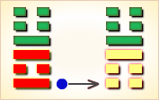
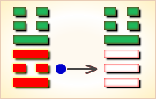
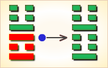
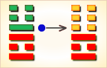
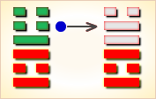
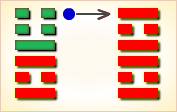

---
hide:
  - navigation
---
# 周易第55卦_丰卦(雷火丰)_震上离下 

<table>
	<tbody>
		<tr>
			<td class="td1">
				</td>
			<td class="td1">
				</td>
			<td class="td1">
				</td>
			<td class="td1">
				</td>
		</tr>
		<tr>
			<td style="text-align: center;">
				<strong>本卦</strong></td>
			<td style="text-align: center;">
				<strong>互卦</strong></td>
			<td style="text-align: center;">
				<strong>错卦</strong></td>
			<td style="text-align: center;">
				<strong>综卦</strong></td>
		</tr>
		<tr>
			<td style="text-align: center;">
				<a href="" style="text-decoration: none;">第55卦：丰卦(雷火丰)</a></td>
			<td style="text-align: center;">
				<a href="../28.泽风大过" style="text-decoration: none;">第28卦：大过卦(泽风大过)</a></td>
			<td style="text-align: center;">
				<a href="../59.风水涣" style="text-decoration: none;">第59卦：涣卦(风水涣)</a></td>
			<td style="text-align: center;">
				<a href="../56.火山旅" style="text-decoration: none;">第56卦：旅卦(火山旅)</a></td>
		</tr>
	</tbody>
</table>

## 周易第五十五卦详解

**丰卦原文**

丰。亨。王假之，勿忧，宜日中。

象曰：雷电皆至，丰。君子以折狱致刑。

**白话文解释**

丰卦：举行祭祀，君王将亲临宗庙。不要担心，最佳时刻当在正午时分。

《象辞》说：本卦上卦为震，震为雷；下卦为离，离为电。电闪雷鸣，是上天垂示的重大天象，这也是丰卦的卦象。君子观此卦象，有感于电光雷鸣的精明和威严，从而裁断讼狱，施行刑罚。

**《断易天机》解**

丰卦震上离下，为坎宫五世卦。丰即为盛大，本是吉兆，但盛极必衰，丰盛中也藏着隐忧，需小心谨慎。

**北宋易学家邵雍解**

盛大丰满，进财获利；谋望克遂，必有喜庆。

得此卦者，运势正强，谋事可成，名利双收。但不宜过贪，要知足常乐，谨防乐极生悲，损财甚至火险。

台湾国学大儒傅佩荣解

时运：气势正旺，谨慎小心。

财运：获利甚丰，须防诉讼。

家宅：宜向东南；天作之合。

身体：肝火上升，静养为宜。

**传统解卦**

这个卦是异卦（下离上震）相叠，电闪雷鸣，成就巨大，喻达到顶峰，如日中天。告戒：务必注意事物向相反方面发展，盛衰无常，不可不警惕。

大象：雷电交加，声势壮大，又离日动于天际，普照大地，皆为盛大之象。

运势：运势极强，为收获之时，但不宜贪得无厌，须知足常乐，要防是非、损财甚至火险。

事业：处于十分顺利的鼎盛时期，各方面都很顺利，成就很大。但务必注意开始出现的衰败症状，防微杜渐，严防骄傲自满。同时，不必盲目追求不切实际的事情，全力保持当前状况的延长。

经商：由于准确地把握了市场动态，商情对自己十分有利，可以大胆发展，但一定要密切注意行情，分析信息，稍有不慎，破产可能在一夜间。一旦破产应立即总结教训寻求真诚的合作者，早日走出困境。

求名：经过努力和奋斗，已获得成就，应注意保持和稳步发展，切勿追求虚名。

婚恋：可以成功，也会美满幸福，但若一方自持条件变化而动摇，则会导致不利。

决策：由于个人天资聪颖，条件好，因此各方面十分顺利。但务必深刻认识人生无常的真理，一切应保持适度，切记物极必反。更不应自我封闭，陷入困境，切莫灰心。

**第五十五卦的哲学含义**

丰卦卦象，雷火丰卦的象征意义

丰卦，这个卦是异卦相叠，下卦为离，上卦为震。离为火，震为雷。雷雨会使五谷丰登，火又可以把丰收的粮食变为丰盛的饭菜，所以此卦命为“丰”。

丰卦位于归妹卦之后，《序卦》这样解释道：“得其所归者必大，故受之以丰。丰者，大也。”归妹卦描述来归，有如众人来归则民聚国富，所以接着要谈代表盛大的丰卦。

《象》中这样解释本卦：雷电皆至，丰；君子以折狱致刑。这里指出：丰卦的卦象是离（火）下（震）雷上，离又代表闪电，震为雷，为雷电同时到来之表象，象征着盛大丰满；君子应该像雷电那样，审案用刑正大光明。

丰卦属于上上卦。《象》中这样来断此卦：古镜昏暗好几年，一朝磨明似月圆，君子谋事逢此卦，近来运转喜自然。

## 周易第五十五卦初九爻详解

**初九爻辞**

初九。归妹以娣，跛能履，征吉。

象曰：归妹以娣，以恒也。跛能履吉，相承也。

**白话文解释**

初九：嫁女而将其妹妹一同陪嫁。跛脚而能行走。筮遇此爻，出行吉利。

《象辞》说：嫁女而将其妹妹一同陪嫁，是说姊妹共嫁一夫，这是古代贵族婚嫁的常规。跛脚而能行走，出行吉利，因为跛者获得别人的帮助。

**北宋易学家邵雍解**

吉：得此爻者，有小德，谋望顺遂。做官的或有政绩。

台湾国学大儒傅佩荣解

时运：因人成事，乏善可陈。

财运：奉命而行，幸可获利。

家宅：偏屋亦吉。

身体：不良于行。

**初九变卦**

初九爻动变得周易第40卦：雷水解。这个卦是异卦（下坎上震）相叠。震为雷、为动；坎为水、为险。险在内，动在外。严冬天地闭塞，静极而动。万象更新，冬去春来，一切消除，是为解。

**初九爻的哲学含义**

丰卦第一爻，爻辞：初九：遇其配主，虽旬无咎，往有尚。爻辞释义

配：指匹配，般配。旬：指均等。

本爻辞的意思是：遇到与自己相配的主人，虽然能力学识均等，但是没有什么关系，今后的发展会呈现上升的趋势。

从卦象上看，初九以阳爻居刚位，得位。阳爻为君子，代表光明与动力。初九与上卦中的九四虽然不相应，但是互为宾主，形成二阳并进的局面。

《象》中这样解释本爻：“虽旬无咎”，过旬灾也。这里指出：“虽然能力学识均等，但是没有什么关系”，若是超过了均等就会出现麻烦。

占得此爻者，在做事时，会遇到一个与自己能力相当、志向一致的人，两个人一起为共同的事业而努力，相互配合，相得益彰，若是两个人非要争个高低，争出谁比谁更强，一个总是要超过另一个，那就会带来麻烦，影响事业的发展。

初九：遇其配主，虽旬无咎，往有尚。

象曰：虽旬无咎，过旬灾也。

## 周易第五十五卦九二爻详解

**六二爻辞**

六二。丰其蔀，日中见斗。往得疑疾。有孚发若，吉。

象曰：有孚发若，信以发志也。

**白话文解释**

六二：将小席拼缀起来，躺下休息。正午时分，有人说看见北斗星。看来旅伴之中有人精神错乱。对他加以刺激，或许可以使他清醒。

《象辞》说：存心诚信，一言一行都能表现出来，因为这是坦白直率地表达了自己的心愿。

**北宋易学家邵雍解**

吉：得此爻者，有久困发财之美，有讼者不辩自明，有病者会愈。做官的忠言多阻于邪议，先失后得。

台湾国学大儒傅佩荣解

时运：坚守正道，逢凶化吉。

财运：以诚待人，拨云见月。

家宅：明亮为宜；始疑终谐。

身体：狭心之症，需要开导。

**六二变卦**

六二爻动变得周易第34卦：雷天大壮。这个卦是异卦（下乾上震）相叠。震为雷；乾为天。乾刚震动。天鸣雷，云雷滚，声势宏大，阳气盛壮，万物生长。刚壮有力故曰壮。大而且壮，故名大壮。四阳壮盛，积极而有所作为，上正下正，标正影直。

**九二爻的哲学含义**

丰卦第二爻，爻辞：六二：丰其蔀，日中见斗，往得疑疾，有孚发若，吉。爻辞释义

为草席屋顶，这里指遮蔽。斗：星斗。发：启发。

本爻辞的意思是：遮蔽屋顶的草席被增大，遮蔽的范围更广。正午的阳光从缝隙中透过来，如同满天的星斗。君主若是如此昏暗，贤士前往就会受到猜忌，只有以谦虚的心态，积其至诚，来启示昏君，才会获吉。

从卦象上看，六二以阴爻居柔位，又位居下卦中间，当位得正。六二上与六五敌应，六五阴居阳位，是位昏君，就像住在“丰其蔀”的屋子里，被遮蔽了光明一样。六二打算前去劝谏，但是在劝谏方式上要采取以诚动人的办法，不可去指责或怀有不满，这样才能见效。

《象》中这样解本爻：“有孚发若”，信以发志也。这里指出：“只有以谦虚的心态，积其至诚，来启示昏君”，是有信以展拓其盛大之志。

占得此爻者，很想为企业或所在团体的发展出一份力，以其发展壮大为己任。但是领导却很昏庸，以为发展得不错了，不思进取，忠奸不分，这时，如果去劝其改正，必会受到猜疑，恐会惹祸上身。不如以诚心来对待他，对其尽职尽责，把对其的忠心、对企业或团体的大计落实在行动上，这样或许能对其有所启示，最终获得吉祥的结果。

六二：丰其蔀，日中见斗，往得疑疾，有孚发若，吉。

象曰：有孚发若，信以发志也。

## 周易第五十五卦九三爻详解详解

**九三爻辞**

九三。丰其沛，日中见昧。折其右肱，无咎。

象曰：丰其沛，不可大事也。折其右肱，终不可用也。

**白话文解释**

九三：将铺草加厚，躺下休息。正午时分，此人又说看见鬼魅。将他的右臂折断。经此一吓，或许他能清静。

《象辞》说：将铺草加厚，这起不了什么大的作用。将其右臂折断，那他就终身残废了。

**北宋易学家邵雍解**

平：得此爻者，营谋难遂，或明而受蔽，争诉日起，或手足有疾，难于做事。做官的有告休之兆。

台湾国学大儒傅佩荣解

时运：气运颠倒，须防灾难。

财运：涨跌难测，颇有损耗。

家宅：只可暂居。

身体：右臂受伤。

**九三变卦**

九三爻动变得周易第51卦：震为雷。这个卦是同卦（下震上震）相叠。震为雷，两震相叠，反响巨大，可消除沉闷之气，亨通畅达。平日应居安思危，怀恐惧心理，不敢有所怠慢，遇到突发事变，也能安然自若，谈笑如常。

**九三爻的哲学含义**

丰卦第三爻，爻辞：九三：丰其沛，日中见昧，折其右肱，无咎。爻辞释义

沛：与“旆”同义，指幡幔、窗帘类的物品，表示遮蔽程度比“蔀”更严

沬：同“昧”，指阳光由明变暗，时隐时现。右肱：指右臂，喻指帮手。

从卦象上看，九三是阳爻居刚位，位处离卦的最上爻，本应发挥其光明的作用，但是九三与上六正应，上六为至阴至暗之主。

《象》中这样解释本爻：“丰其沛”，不可大事也；“折其右舷”，终不可用也。这里指出：“用来遮蔽的东西更多了，挂上了窗帘”，在这种昏暗之中不可成就、胜任大事；“右臂折断而无为慎守”，最终得不到重用或不可能有所作为了。

占得此爻者，虽然你很有才能，但是怀才不遇，领导特别昏庸，根本不做正事。在这种情况下，难以大展身手，只能韬光养晦。

九三：丰其沛，日中见昧，折其右肱，无咎。

象曰：丰其沛，不可大事也。折其右肱，终不可用也。

## 周易第五十五卦九四爻详解详解

**九四爻辞**

九四。丰其蔀，日中见斗。遇其夷主，吉。

象曰：丰其蔀，位不当也。日中见斗，幽不明也。遇其夷主，吉，行也。

**白话文解释**

九四：将小席拼缀起来，躺下休息。正午时分，此人还在说看见北斗星，看来还未恢复正常。幸好遇着了他的老店主，把他托付给老店主，这一下可清静平安了。

《象辞》说：将小席拼缀起来，随地休息，是所处不得当，正如九四阳爻而处于阴位一样。正午时分看见北斗，也许天空迷暗不明的缘故。遇着他的老店主，这是吉利之行。

**北宋易学家邵雍解**

平：得此爻者，明而受蔽，得人解释而吉。做官的受到领导和同僚的猜忌，位不安。

台湾国学大儒傅佩荣解

时运：际遇不佳，由暗向明。

财运：走出暗昧，找到买主。

家宅：成败在人；巧遇良缘。

身体：眼疾待良医。

**九四变卦**

九四爻动变得周易第36卦：地火明夷。这个卦是异卦（下离上坤）相叠。离为明，坤为顺；离为日；坤为地。日没入地，光明受损，前途不明，环境困难，宜遵时养晦，坚守正道，外愚内慧，韬光养晦。

**九四爻的哲学含义**

丰卦第四爻，爻辞：九四：丰其蔀，日中见斗；遇其夷主，吉。爻辞释义

夷：指外族。这里指与自己能力相当但不属于同党的上级领导。

本爻辞的意思是：遮蔽屋顶的草席被增大，遮蔽的范围更广。正午的阳光从缝隙中透过来，如同满天的星斗。虽然国君昏暗，但是遇到与国君不属于同一派的能人并受其赏识，可获吉祥。

“遇夷主”中的“夷”，如果结合文王与商纣所在时期更容易理解。“夷”就是对于当时地处东南的“淮夷”、“岛夷”、“莱夷”的泛称。在商纣末期，商纣王征服东夷各族，但是，这些夷族并不是心甘情愿归顺。九四爻中所指出的“遇其夷主”，就是要结交、善待商纣王所要征服的、东南各夷君主的意思。武王牧野伐纣时，商纣王的士兵纷纷倒戈，这里面大都是被捉来的东南各夷奴隶而已。正是这些人“倒戈以战，以开武王”，所以周武王取得了伐纣的胜利。

《象》中这样分析本爻：“丰其蔀”，位不当也；“日中见斗”，幽不明也；“遇其夷主”，吉行也。这里指出：“遮蔽屋顶的草席被增大，遮蔽的范围更广”，是说九四爻所居的爻位不当；“正午的阳光从缝隙中透过来，如同满天的星斗”，说明由于蒙蔽而出现昏暗；“遇到与国君不属于同一派的能人并受其赏识”，行动还是会获得吉祥的。

占得此爻者，你所在的单位领导很昏庸，你为此很苦闷。但是你自可以踏踏实实地做事，不要因为领导昏庸自己就懒散。你在自己的岗位上尽职尽责，充分地展现自己的能力，这时可能就有公司的对立的单位的领导看中你，赏识你，你可能会得到了更好的机会。

九四：丰其蔀，日中见冲击，遇其夷主，吉。

象曰：丰其蔀，位不当也。日中见年，幽不明也。遇其夷主，吉；行也。

## 周易第五十五卦九五爻详解详解

**六五爻辞**

六五。来章，有庆誉，吉。

象曰：六五之吉，有庆也。

**白话文解释**

六五：赚得美玉，大家都庆贺夸奖他。这是吉利之兆。

《象辞》说：**六五爻辞**所讲的吉利，是因为有吉庆之事。

**北宋易学家邵雍解**

吉：得此爻者，会得好人提举，谋望称意。读书人会取得佳绩。

台湾国学大儒傅佩荣解

时运：实至名归，自然吉祥。

财运：经商有成，利名并至。

家宅：名门正户；天作之合。

身体：名医治之。

**六五变卦**

六五爻动变得周易第49卦：泽火革。这个卦是异卦（下离上兑）相叠。离为火、兑为泽，泽内有水。水在上而下浇，火在下而上升。火旺水干，水大火熄。二者相生亦相克，必然出现变革。变革是宇宙的基本规律。

**九五爻的哲学含义**

丰卦第五爻，爻辞：六五：来章，有庆誉，吉。爻辞释义

来：招徕，吸引。章：章明。庆：福庆。誉：美誉。

本爻辞的意思是：能招徕有美德的贤能之士辅佐，会有喜庆和美誉，吉祥。

从卦象上看，六五以阴爻居阳位，具备谦顺之德，所以能吸引到贤能之士前来辅佐。《象》中这样分析本爻：六五之吉，有庆也。这里指出：六五这一爻很吉祥，必定会有喜庆。

占得此爻者，应该明白广纳贤才对自己事业的重要作用，所以一定要放弃自己做为领导的高高在上的架势，要谦逊地对待下属，如果你能为更多人谋利，为他们的利益着想，将会赢得广泛的赞扬和名声。

六五：来章，有庆誉，吉。

象曰：六五之吉，有庆也。

## 周易第五十五卦上九爻详解详解

**上六爻辞**

上六。丰其屋，蔀其家，窥其户，阒其无人，三岁不见，凶。

象曰：丰其屋，天际翔也。窥其户，阒其无人，自藏也。

**白话文解释**

上六：房子空荡荡的，屋顶上散乱盖着草席，从门缝里探视，寂无一人。看样子这里多年未住人了。这是不祥之兆。

《象辞》说：增修扩建房屋，看来此人如鸟飞蓝天，志得意满，发财不小。从门缝里探视，寂无一人，看来财多害身，横遭灾祸，他逃生去了。

**北宋易学家邵雍解**

凶：得此爻者，骨肉相残，离祖成家，难免口舌之争。做官的位高者有危。

台湾国学大儒傅佩荣解

时运：有命无人，不堪设想。

财运：无人经营，一筹莫展。

家宅：没落之家；婚姻不详。

身体：大限将至。

**上六变卦**

上六爻动变得周易第30卦：离为火。这个卦是同卦（下离上离）相叠。离者丽也，附着之意，一阴附丽，上下二阳，该卦象征火，内空外明。离为火、为明，太阳反复升落，运行不息，柔顺为心。

**上九爻的哲学含义**

 丰卦第六爻，爻辞：上六：车其屋，蔀其家，窥其戶，阒其无人，三岁不觌，凶。爻辞释义

窥：指偷看。阒：指寂静。觌：指见。

本爻辞的意思是：建起房子，把居室用草席蒙蔽上，对着窗户窥视外面的世界，寂静无声，不见人影。多年来不出外见世面，必然有凶。

从卦象上看，上六以阴爻居柔位，处于丰卦的顶端，有独占丰收成果之象。上六与六五逆比，居高自傲而不能谦恭的服从君王，在自己的黑暗的房子里自闭，拒绝与人合作，这样会招致凶险。

《象》中这样分析本爻：“丰其屋”，天际翔也；“窥其户，阒其无人”，自藏也。这里指出：“建起房子”，居内自蔽，孤立于人，好似在天际飞翔；“窥视窗户，寂静而无人”，深深隐藏踪迹。这其中的道理是，在人间获得盛大成就的人，若不能超然物外，就须善自隐晦，否则后果堪忧。

占得此爻者，如果你怕别人觊觎你的财富，就关起门来像个守财奴一样，不与外界来往，人们就会远离你，你会被孤立起来。一旦遇到什么事情，也没有人愿意帮你，这对你来说非常危险。

上六：车其屋，蔀其家，窥其戶，阒其无人，三岁不觌，凶。

象曰：丰其屋，天际翔也。窥其戶，阒其无人，自藏也。