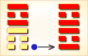
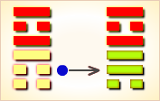
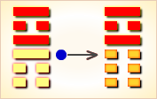
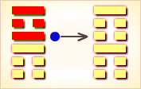
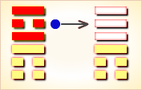
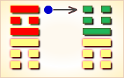

---
hide:
  - navigation
---
# 周易第56卦_旅卦(火山旅)_离上艮下 

<table>
	<tbody>
		<tr>
			<td class="td1">
				</td>
			<td class="td1">
				</td>
			<td class="td1">
				</td>
			<td class="td1">
				</td>
		</tr>
		<tr>
			<td style="text-align: center;">
				<strong>本卦</strong></td>
			<td style="text-align: center;">
				<strong>互卦</strong></td>
			<td style="text-align: center;">
				<strong>错卦</strong></td>
			<td style="text-align: center;">
				<strong>综卦</strong></td>
		</tr>
		<tr>
			<td style="text-align: center;">
				<a href="" style="text-decoration: none;">第56卦：旅卦(火山旅)</a></td>
			<td style="text-align: center;">
				<a href="../28.泽风大过" style="text-decoration: none;">第28卦：大过卦(泽风大过)</a></td>
			<td style="text-align: center;">
				<a href="../60.水泽节" style="text-decoration: none;">第60卦：节卦(水泽节)</a></td>
			<td style="text-align: center;">
				<a href="../55.雷火丰" style="text-decoration: none;">第55卦：丰卦(雷火丰)</a></td>
		</tr>
	</tbody>
</table>

## 周易第五十六卦详解

**旅卦原文**

旅。小亨，旅贞吉。

象曰：山上有火，旅。君子以明慎用刑，而不留狱。

**白话文解释**

旅卦：稍见亨通。贞卜旅行，吉利。

《象辞》说：本卦上卦为离，离为火；下卦为艮，艮为山。山上有火，洞照幽隐，这是旅卦的卦象。君子观此卦象，从而明察刑狱，慎重判决，既不敢滥施刑罚，也不敢延宕滞留。

**《断易天机》解**

旅卦离上艮下，为离宫初世卦。旅为做客、旅游之意，先主乐而后悲啼。

**北宋易学家邵雍解**

旅途穷困，飘摇不定；小望可成，宏愿难求。

得此卦者，事多变动，如在异乡，小事可成，大事难成，宜谨守常规。

台湾国学大儒傅佩荣解

时运：谨慎防灾，升用在即。

财运：出外经营，不可积货。

家宅：小心火灾；即日成亲。

身体：肝火过旺，性命交关。

**传统解卦**

这个卦是异卦（下艮上离）相叠。此卦与丰卦相反，互为“综卦”。山中燃火，烧而不止，火势不停地向前蔓延，如同途中行人，急于赶路。因而称旅卦。

大象：火烧山野，火头遍布，所到之处，无一幸免，火头尤如行旅之人，无所定处。

运势：诸事变动不定，此时只好坚守信心，多参考他人意见，否则必有凶。

事业：正处于创业、发展的阶段，各种困难很多。只要能坚持中正的方针，依正道办事，注意调查，处处小心谨慎，并根据情况的变化，采取应变措施，事业可顺利前进。

经商：市场行情犹如旅途一样，意想不到的情况，会随时发生。因此，首先应采取慎重的原则，不要冒险。但也不应缩手缩脚，尤其不要猜疑。开发市场之前，应进行充分的调查研究。

求名：根据时代的要求，丰富自己的知识和能力，不断提高自己，并且争取得到他人的相助。

婚恋：双方的不确定因素较多，如确有感情，可顺其发展，再行确定。婚姻美满。

决策：人生处于多变状态，一定要眼光远大，树立大志向，不断地充实自己，以诚心实意和谦虚的态度去待人处事，勿计较一时得失，广泛交际朋友。人生旅途十分顺利。

**第五十六卦的哲学含义**

旅卦卦象，火山旅卦的象征意义

旅卦，这个卦是异卦相叠，下卦为艮，上卦为离。艮为山，离为火。山中燃火，烧而不止，火势不停地向前蔓延，如同途中行人，急于赶路，因而称旅卦。

旅卦位于丰卦之后，《序卦》之中这样解释道：“穷大者必失其居，故受之以旅。”丰盛到极点而不知收敛，一定会离开居所，所在以丰卦之后，接着谈旅。《杂卦》中说道：“丰，多故也。亲寡，旅也。”丰卦有许多故旧，旅卦则很少有亲友。这两者是正覆关系。

《象》中这样解释旅卦：山上有火，旅；君子以明慎用刑，而不留狱。这里指出：《旅卦》的卦象是艮（山）下离（火）上，为火势匆匆蔓延之表象，象征行旅之人匆匆赶路；君子观此应谨慎使用刑罚，明断决狱。

旅卦象征旅行，启示的道理是依义顺时，属于下下卦。《象》中这样来断此卦：飞鸟树上垒窝巢，小人使计举火烧，君占此卦为不吉，一切谋望枉徒劳。

## 周易第五十六卦初九爻详解

**初六爻辞**

初六。旅琐琐，斯其所取灾。

象曰：旅琐琐，志穷灾也。

**白话文解释**

初六：旅人三心二意，进退犹豫，最后还是离开住所，结果自遭灾祸。

《象辞》说：旅人三心二意，说明其人四处碰壁，精神疲惫。

**北宋易学家邵雍解**

凶：得此爻者，运气不佳，须防祸难。做官的有才但不能受到上司的重用。

台湾国学大儒傅佩荣解

时运：所得有限，修行为宜。

财运：本小利微，小心灾祸。

家宅：谨慎免灾；小户联姻。

身体：病初即治。

**初六变卦**

初六爻动变得周易第30卦：离为火。这个卦是同卦（下离上离）相叠。离者丽也，附着之意，一阴附丽，上下二阳，该卦象征火，内空外明。离为火、为明，太阳反复升落，运行不息，柔顺为心。

## 周易第五十六卦九二爻详解

**六二爻辞**

六二。旅即次，怀其资，得童仆，贞。

象曰：得童仆贞，终无尤也。

**白话文解释**

六二：旅人来到市场，带着钱财，买来一男仆，卜问得吉兆。

《象辞》说：买一男仆，卜问得吉兆，看来这笔买卖没有问题。

**北宋易学家邵雍解**

吉：得此爻者，运气转好，营谋有成。做官的显耀。

台湾国学大儒傅佩荣解

时运：运势中正，名利皆得。

财运：生财有道，做客无忧。

家宅：寄居亦福；富室赘婿。

身体：旅途有恙，受人照料。

**六二变卦**

六二爻动变得周易第50卦：火风鼎。这个卦是异卦（下巽上离）相叠。燃木煮食，化生为熟，除旧布新的意思。鼎为重宝大器，三足稳重之象。煮食，喻食物充足，不再有困难和困扰。在此基础上宜变革，发展事业。

**初九爻的哲学含义**

旅卦第二爻，爻辞：六二：旅即次，怀其资，得童仆，贞。爻辞释义

艮口：为“就”。次：为“客舍”。《左传》中说道：“凡师，一宿为舍，再宿为信，过信为次。”这原本是说军队的行止，后来引申用于客旅。

本爻辞的意思是：旅客住在旅舍，携带钱财，有童仆照顾，能坚守正道。

从卦象上看，六二以阴爻居于柔位，居中得正。

《象》中这样分析本爻：“得童仆，贞”，终无尤也。这里指出：“有童仆照顾，能坚守正道”，故不会有过失。

占得本爻者，在旅行中非常顺利，怀中带着充足的钱财，但这次旅行并不用

你自己花上多少钱。到了旅馆，有吃有喝，还有童仆的照顾。在这个时候，你要

注意坚守正道，因为恐怕好景不长。

六二：旅卽次，怀其资，得重仆贞。

象曰：得童仆贞，终无尤也。

## 周易第五十六卦九三爻详解详解

**九三爻辞**

九三。旅焚其次，丧其童仆，贞厉。

象曰：旅焚其次，亦以伤矣。以旅与下，其义丧也。

**白话文解释**

九三：旅人来到着火的市场上，新买的男仆乘乱跑掉。卜问得险兆。

《象辞》说：旅人来到着火的市场，岂不遭受损失。因为旅人带着男仆同往，男仆乘乱跑掉是很自然的。

**北宋易学家邵雍解**

凶：得此爻者，运势转坏，多灾多难。做官的有离职之忧。

台湾国学大儒傅佩荣解

时运：运势颠倒，危难不少。

财运：不必求利，早些防祸。

家宅：小心防火；难以偕老。

身体：孩子或童仆难保。

**九三变卦**

九三爻动变得周易第35卦：火地晋。这个卦是异卦（下坤上离）相叠。离为日，为光明；坤为地。太阳高悬，普照大地，大地卑顺，万物生长，光明磊落，柔进上行，喻事业蒸蒸日上。

**九三爻的哲学含义**

旅卦第三爻，爻辞：九三：旅焚其次，丧其童仆，贞厉。爻辞释义

本爻辞的意思是：旅途中所住的客店失火，童仆跑掉了，失去正道，会出现危险。

从卦象上看，九三爻属于阳爻，居于刚位，又处于下卦艮的顶端，艮代表山，九三位于山巅，有自高自大、过刚而不能行中道之象。九三上与九四逆比，不顺于上，得罪主人，遭到当地主人的驱赶。其刚愎自用，上行受阻，又迁怒于下属，所以童仆跑掉了。九三违背了谦逊柔顺原则，遭此困阻，十分凶险。

《象》曰：“旅焚其次”，亦以伤矣；以旅与下，其义丧也。这里指出：“旅途中所住客店失火”，已经受到损伤；把童仆视为路人，童仆舍其而去，是必然的，合乎道理的。

占得此爻者，如果外出，一定要记住谦恭待人，不要自高自大，瞧不起当地人，不要与其他人发生争执，否则会自招灾祸。出现问题之后，要多找自己的毛病，不要对下属横加指责，认为都是他们的责任，这亲一来会失去下属的支持。

越是在一团乱的环境之中，越要保持冷静，守持中道。在不安定的环境之中，如果再失去安定的心境，将会倍感艰苦，难以安身。

九三：旅焚其次，丧其童仆贞，厉。

象曰：旅焚其次，亦以伤矣。以旅与下，其义丧也。

## 周易第五十六卦九四爻详解详解

**九四爻辞**

九四。旅于处，得其资斧，我心不快。

象曰：旅于处，未得位也。得其资斧，心未快也。

**白话文解释**

九四：旅人回到客居之处，因为赚了不少钱，心中不踏实。

《象辞》说：旅人回到客居之处，这不是恰当的住处。赚了不少钱，恐怕抢劫，自然心中不踏实。

**北宋易学家邵雍解**

凶：得此爻者，在外者会有所成就，但美中不足，有忧惨是非之事发生。从商者会获利。

台湾国学大儒傅佩荣解

时运：一时有困，来年再说。

财运：获利有限，心中不平。

家宅：地位不适；不是正室。

身体：忧郁不欢。

**九四变卦**

九四爻动变得周易第52卦：艮为山。这个卦是同卦（下艮上艮）相叠。艮为山，二山相重，喻静止。它和震卦相反。高潮过后，必然出现低潮，进入事物的相对静止阶段。静止如山，宜止则止，宜行则行。行止即动和静，都不可失机，应恰到好处，动静得宜，适可而止。

**九四爻的哲学含义**

旅卦第四爻，爻辞：九四：旅于处，得其资斧，我心不快。爻辞释义

处：指处所。资：指资财。斧：指利斧。

本爻辞的意思是：长期居于异乡，尽管得到了钱财之助，利斧之防，但心情仍然不愉快。

从卦象上看，九四是阳爻居于柔位，失位。九四在互巽（六二九三九四）

里，巽代表着赢利，在此指可以得到旅资，又在上卦离里，离为兵戈武器，可以得斧，故为“得其资斧”。程颐指出：资斧，就是“货财之资，器用之利”。这里指九四凭借自己的知识和能力，挣得了钱财，也能安身。但是，九四失位，又不得正，始终觉得自己只是宾客不是主人，大志未遂，故而心中常有不快。

《象》中这样解释本爻：“旅于处”，未得位也；“得其资斧”，心未快也。这里指出：“长期居于异乡”，只是属于宾客而不是主人。“尽管得到了钱财之助，利斧之防”，但仍然客居他乡，故此时心中仍不畅快。

占得此爻者，你长期漂泊在外，虽然经过一番奋斗，已经解决了居住和谋生的问题，也赚了一些钱，但是心里却有漂泊之感，为此难以快乐。所以要注意调整好自己的情绪，既来则安吧。

九四：旅于处，得其资斧，我心不快。

象曰：旅于处，未得位也。得其资斧，心未快也。

## 周易第五十六卦九五爻详解详解

**六五爻辞**

六五。射雉一矢亡，终以誉命。

象曰：终以誉命，上逮也。

**白话文解释**

六五：射野鸡，一发命中，其人因而博得善时的美名。

《象辞》说：终于博得善射的美名，众口传誉，上面的人也知道了。

**北宋易学家邵雍解**

吉：得此爻者，会得到老者的帮助，事有所成。

台湾国学大儒傅佩荣解

时运：晚运甚佳，值得恭喜。

财运：小失大得，有利有名。

家宅：可称美善；佳偶天成。

身体：殉难受奖。

**六五变卦**

六五爻动变得周易第33卦：天山遁。这个卦是异卦（下艮上乾）相叠。乾为天，艮为山。天下有山，山高天退。阴长阳消，小人得势，君子退隐，明哲保身，伺机救天下。

**九五爻的哲学含义**

旅卦第五爻，爻辞：六五：射雉，一矢亡，终以誉命。爻辞释义

雉：指野鸡。誉：指好的名声。命：指任命，爵命。

本爻辞的意思是：射野鸡，一箭射中，最终获得荣誉和爵命。

从卦象上看，六五属于阴爻居于柔位，处于君主之位，持中守正。所以做事顺利，很是吉祥。

《象》曰：“终以誉命”，上逮也。这里指出：“最终获得荣誉和爵命”，是由于能亲近居高位的尊者。

占得此爻者，在旅行中会遇到一显身手的机会，你要像射箭一样，看准目标，一箭中的。这样荣誉和地位就会自然而来。

六五：射雉一矢亡，终以誉命。

象曰：终以誉命，上逮也。

## 周易第五十六卦上九爻详解详解

**上九爻辞**

上九。鸟焚其巢，旅人先笑后号啕。丧牛于易，凶。

象曰：以旅在上，其义焚也。丧牛于易，终莫之闻也。

**白话文解释**

上九：鸟儿的巢窠被焚烧，周人的邑落被抢劫，四处流落的周人啊，美好的生活已成往事，悲惨的现实即在眼前，狄人牵着牛羊去，往后的日子怎么过。

《象辞》说：以商旅身份而身登高爵，非分之极，其居室被焚毁是意料之中的事，牛羊在易地被抢劫，也没有人来体恤安慰，是理所应当。

**北宋易学家邵雍解**

凶：得此爻者，先好后坏，或迁居修造以避灾难，或有目疾，或会遭火灾。做官的难保其位，有先得后失之忧。

台湾国学大儒傅佩荣解

时运：有失无得，乐极生悲。

财运：小利大损，十分凶险。

家宅：覆巢之险；先喜后悲。

身体：属牛者凶。

**上九变卦**

上九爻动变得周易第62卦：雷山小过。这个卦是异卦（下艮上震）相叠。艮为山，震为雷，过山雷鸣，不可不畏惧。阳为大，阴为小，卦外四阴超过中二阳，故称“小过”，小有越过。

**上九爻的哲学含义**

旅卦第六爻，爻辞：上九：鸟焚其巢，旅人先笑，后号眺；丧牛于易，凶。爻辞释义

本爻辞的意思是：鸟巢失火被烧掉，外出之人先喜悦欢笑，后来号啕痛哭；在边界丢失了牛，有凶险。

从卦象上看，上九爻以阳爻居阴位，刚进失位，又不能持中，与主张静止的九三爻敌应，躁进不已，失其顺德，不知适时变通，故而有凶。

占得此爻者，因为自己的自高自大，惹来了一系列的麻烦，所以一定要注意自己的为人处事的态度。

上九：鸟焚其集，旅人先笑后号啕。丧牛于易，凶。

象曰：以旅在上，其义焚也。丧牛于易，终莫之同也。