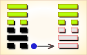
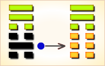
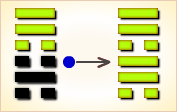
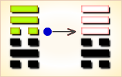

---
hide:
  - navigation
---
# 周易第59卦_涣卦(风水涣)_巽上坎下 

<table>
	<tbody>
		<tr>
			<td class="td1">
				</td>
			<td class="td1">
				</td>
			<td class="td1">
				</td>
			<td class="td1">
				</td>
		</tr>
		<tr>
			<td style="text-align: center;">
				<strong>本卦</strong></td>
			<td style="text-align: center;">
				<strong>互卦</strong></td>
			<td style="text-align: center;">
				<strong>错卦</strong></td>
			<td style="text-align: center;">
				<strong>综卦</strong></td>
		</tr>
		<tr>
			<td style="text-align: center;">
				<a href="" style="text-decoration: none;">第59卦：涣卦(风水涣)</a></td>
			<td style="text-align: center;">
				<a href="../27.山雷颐" style="text-decoration: none;">第27卦：颐卦(山雷颐)</a></td>
			<td style="text-align: center;">
				<a href="../55.雷火丰" style="text-decoration: none;">第55卦：丰卦(雷火丰)</a></td>
			<td style="text-align: center;">
				<a href="../60.水泽节" style="text-decoration: none;">第60卦：节卦(水泽节)</a></td>
		</tr>
	</tbody>
</table>

## 周易第五十九卦详解

**涣卦原文**

涣。亨，王假有庙。利涉大川，利贞。

象曰：风行水上，涣。先王以享于帝，立庙。

**白话文解释**

涣卦：亨通，因为君王亲临宗庙，禳灾祈福。利于涉水过江河。这是吉利的贞卜

《象辞》说：本卦上卦为巽，巽为风；下卦为坎，坎为水。风行水上，是涣卦的卦象。先王观此卦象，从而享祭天帝，建立宗庙，推行尊天孝祖的“德教”。

**《断易天机》解**

涣卦巽上坎下，为离宫五世卦。涣即涣散，表示恶事离身，患难将消，利涉大川，出入无阻，乃是吉卦。

**北宋易学家邵雍解**

离散解消，灾害涣散；乘机观变，养威蓄锐。

得此卦者，初有不顺，但终可解困，凡事宜小心则百事亨通，忌任性放纵。

**台湾国学大儒傅佩荣解**

时运：时来运转，水到渠成。

财运：神明保佑，财源流通。

家宅：祈神得福；自成佳偶。

身体：病情严重，恐难回天。

**传统解卦**

这个卦是异卦（下坎上巽）相叠。风在水上行，推波助澜，四方流溢。涣，水流流散之意。象征组织和人心涣散，必须用积极的手段和方法克服，战胜弊端，挽救涣散，转危为安。

大象：风吹在水面上，流动四散，又有春风吹散严寒，令冰雪消解。

运势：虽有忧患，但终可解困，百事亨通，忌任性散慢。

事业：处于比较困难的地步，主要是因为人心不齐。要采取强有力的办法，求得安定团结。其中，最为重要的是坚持正道，秉持大公无私的精神，收人心以聚涣散。

经商：市场状况混乱，方向不明，适当的冒险是完全必要的。但必须公正无私，克制私欲，争取有实力的合作者和支援也是完全有必要的。

求名：必须静下心来努力学习和提高知识水平，增加才干。涣散的形势必须进行治理，这需要多方面的人才。前途是光明的，关键取决于个人的努力。

婚恋：只要双方都抱着纯正的目的，一定美满成功。

决策：为了开拓事业，必须使用积极的手段，克服和战胜内部不团结的弊病。首先自己要除私心，牺牲小我，完成大我。切莫介入是非争端之中。这样，可以重新获得安定的局面。在良好的环境里，各项事业前途光明。

**第五十九卦的哲学含义**

涣卦，这个卦是异卦相叠，下卦为坎，上卦为巽。风在水上行，推波助澜，四方流溢。古人经过观察发现，如果地上有一坑水，这坑水在有风的天气比无风的天气干得快，所以意识到这是风把水给吹散了。当遇到坎水在下、巽风在上的卦体时，就自然想到了，风在上吹，风能把水吹得涣散，故坎下巽上这一卦被称为“涣”。然而，风把水吹散，又变成云气，为人们带来雨水。所以，虽然涣是水流流散之意，象征组织和人心涣散，但是用积极的手段和方法克服，战胜弊端，就能挽救涣散，转危为安。

涣卦位于兑卦之后，《序卦》之中这样解释道：“人在喜悦之后，心情就会涣散，所以接着要谈涣。”

《象》中这样解释道：“风行水上，‘涣’；先王以享于帝立庙。”这里指出：涣的卦象是坎（水）下巽（风）上，为风行水上之表象，象征涣散、离散。先代君王为了收合归拢人心便祭祀天帝，修建庙宇。

涣卦象征涣散，启示了如何拯救涣散的道理，属于下卦。《象》中这样来断此卦：隔河望见一锭金，欲取岸宽水又深，指望资财难到手，尽夜资财枉费心。

## 周易第五十九卦初九爻详解

**初六爻辞**

初六。用拯马壮，吉。

象曰：初六之吉，顺也。

**白话文解释**

初六：洪水突来，因而乘马逃避，匆促跌伤，幸免淹亡之祸，吉利。

《象辞》说：**初六爻辞**讲的吉利，是因为初六阴爻居九二阳爻之下，有阴柔顺从阳刚之意。像马顺从人意。

**北宋易学家邵雍解**

吉：得此爻者，得尊上提举，营谋皆遂。做官的会受到重用，有望晋升。

**台湾国学大儒傅佩荣解**

时运：险中得救，必有后福。

财运：同事相助，可以得利。

家宅：新厦可居。

身体：急治为宜。

**初六变卦**

初六爻动变得周易第61卦：风泽中孚。这个卦是异卦（下兑上巽）相叠。孚本义孵，孵卵出壳的日期非常准确，有信的意义。卦形外实内虚，喻心中诚信，所以称中孚卦。这是立身处世的根本。

**初九爻的哲学含义**

涣卦第一爻，爻辞：初六：用拯马壮，吉。爻辞释义

用：指利用。拯：指拯救。马壮：指壮马。

本爻辞的意思是：借助健壮的马匹来弥补力量的不足，吉祥。

从卦象上看，初六为阴爻居刚位，失位，又处于下卦坎卦之始，坎卦象征着危险。在这种情况下，初六才质柔弱，地位低下，相当危险。可是其与九二亲比，能借助九二的力量来拯救自己。

《象》曰：初六之吉，顺也。这里指出：初六之所以是吉祥的，这是由于它能顺承阳刚的缘故，能和九二亲比。

占得此爻者，正处于危险之中，凭自己的能力难以解决，这个时候，你要寻找到能力的人来依附，自己要顺从于他，借助其力量使自己走出危难。

【涣卦第一爻，爻辞：初六：用拯马壮，吉。释义】

初六：用拯马壮，吉。

象曰：初六之吉，顺也。

## 周易第五十九卦九二爻详解

**九二爻辞**

九二。涣奔其机，悔亡。

象曰：涣奔其机，得愿也。

**白话文解释**

九二：洪水奔涌，冲毁房基。性命无虞。不幸中之万幸。

《象辞》说：荡涤冲刷其污垢，正是心中所愿。

**北宋易学家邵雍解**

平：得此爻者，谋望有成，或会成家。做官的有实权。

**台湾国学大儒傅佩荣解**

时运：运势顺利，心想事成。

财运：货物贸易，如愿以偿。

家宅：先散后聚；女长于男。

身体：愁眉不展，良医可治。

**九二变卦**

九二爻动变得周易第20卦：风地观。这个卦是异卦（下坤上巽）相叠，风行地上，喻德教遍施。观卦与临卦互为综卦，交相使用。在上者以道义观天下；在下者以敬仰瞻上，人心顺服归从。

**九二爻的哲学含义**

涣卦第二爻，爻辞：九二：涣奔其机，悔亡。爻辞释义

本爻辞的意思是：处在涣散之时，要迅速脱离险境，转移到安全的地方，悔恨便会消失。

从卦象上看，九二以阳爻居刚位，是位很有能力的阳刚君子。但是其处于下卦坎卦的正中，处于危险的中间地带。而且其上行受阻，得不到上卦领导们的赏识和重用。好在能得到下面初六的拥护，因此在离乱之时虽然找不到靠山，但是却能找到一安居之所，被初六收留，这样有利于积蓄力量，等待新的时机。

《象》中这样分析本爻：“涣奔其机”，得愿也。这里指出：“涣散之时，要迅速脱离险境，转移到安全的地方”，脱离了危险，消失了悔恨，实现了自己的愿望。

占得此爻者，正处于局势混乱的危险之中，你不要指望领导来保护你，要赶紧脱离这种境地，暂时避一避锋芒。同时与一些同事或下级要保持交往，在他们需要时尽量帮助他们一把，以共同度过危难，等待更好的时机，来实现自己的愿

九二：渙奔其机，悔亡。

象曰：涣奔其机，得愿也。

## 周易第五十九卦九三爻详解详解

**六三爻辞**

六三。涣其躬，无悔。

象曰：涣其躬，志在外也。

**白话文解释**

六三：洪水冲到身上，幸免于难，尚可庆幸。

《象辞》说：冲刷他的身体，说明其人志在教育他人，治理国家。

**北宋易学家邵雍解**

平：得此爻者，常人获利。做官的出外就职。

**台湾国学大儒傅佩荣解**

时运：勇于赴难，值得尊敬。

财运：重财轻命，自讨苦吃。

家宅：出外免祸；守节之志。

身体：转危为安。

**六三变卦**

六三爻动变得周易第57卦：巽为风。这个卦是同卦（下巽上巽）相叠，巽为风，两风相重，长风不绝，无孔不入，巽亦为顺、谦逊的态度和行为，可无往不利。

**九三爻的哲学含义**

涣卦第三爻，爻辞：六三：涣其躬，无悔。爻辞释义

本爻辞的意思是：涣散出现在自己身上，不会遭遇困厄。

从卦象上看，六三以阴爻居刚位，又不居中，失位却不能守持中道，才质柔弱，却不安于目前的处境。其与六五无应，但是与上九正应。

《象》中这样解释道：“涣其躬”，志在外也。这里指出：“涣散出现在自己身上”，说明志向在外。六三虽无力解决自身的涣散之难，但是有上六相助，

所以不会遭遇困厄。

占得此爻者，如果在工作或生活中遇到了麻烦，找领导是没有用的，这时不妨找一些退休的或是资历老而不在位的人，求其帮助一下，就会走出麻烦。

六三：渙其躬，无悔。

象曰：渙其躬，志在外也。

## 周易第五十九卦九四爻详解详解

**六四爻辞**

六四。涣其群，元吉。涣有丘，匪夷所思。

象曰：涣其群，元吉，光大也。

**白话文解释**

六四：洪水冲向人群，然而十分幸运，因为人群聚集在山丘上，洪水只能淹到山脚，否则其后果是平常难以想像的。

《象辞》说：冲刷大众百姓，说明君王德教广施，教化大行。

**北宋易学家邵雍解**

吉：得此爻者，先凶后吉，谋望和合，求利可获。做官的会身居要职。

**台湾国学大儒傅佩荣解**

时运：大运亨通，脱困成业。

财运：散财济危，自成天地。

家宅：自有可观。

身体：凝聚元气，病体自愈。

**六四变卦**

六四爻动变得周易第6卦：天水讼。这个卦是异卦（下坎上乾）相叠。同需卦相反，互为“综卦”。乾为刚健，坎为险陷。刚与险，健与险，彼此反对，定生争讼。争讼非善事，务必慎重戒惧。

**九四爻的哲学含义**

涣卦第四爻，爻辞：六四：涣其群，元吉；涣有丘，匪夷所思。爻辞释义

群：指朋党，结成的私党。丘：指像山丘一样大的群体，这里指权力相对集中。

本爻辞的意思是：尽散朋党，可大吉大利。同时，又能将化解的小群聚成山丘一般大的群体，这不是常人所能想到的。

从卦象上看，六四以阴爻居柔位，得位，具有谦卑柔顺的特质，做为近君大臣，这一点是很重要的，证明其能与九五的君王关系融洽，并得其信赖与赏识。

从涣卦来看，出现了涣散的情况，是因为初六与九二结成朋党，而六三又与上九关系密切。九四做为近君大臣，附助国王治理涣散，打击朋党，取得了很好的成绩，使得所有人聚集在了君主的身边。

《象》中这样分析道：“涣其群元吉”，光大也。这里指出：“尽散朋党，大吉大利”，表明无自私自利之心，品行光明正大。

占得此爻者，作为领导的助手，要帮助其协调好内部人际关系，没有自私自利之心，这样会受到重用的。

六四：涣其群，元吉。

涣有丘，匪夷所思。

象曰：涣其群，元吉；光大也。

## 周易第五十九卦九五爻详解详解

**九五爻辞**

九五。涣汗其大号，涣王居，无咎。

象曰：王居无咎，正位也。

**白话文解释**

九五：洪水横溢，淹没国都，淹及王宫，牵好人员早巳撤走，没有大的灾难。

《象辞》说：王宫没有遭遇灾难，因为九五阳爻居上卦中位，位尊且正，自然无灾难。

**北宋易学家邵雍解**

吉：得此爻者，正当好运，事事皆吉，求利者遂。做官的会升迁。

**台湾国学大儒傅佩荣解**

时运：中正之位，诸事皆吉。

财运：言行中庸，利润自来。

家宅：富贵之家；必得贵婿。

身体：大汗可愈。

**九五变卦**

九五爻动变得周易第4卦：山水蒙。这个卦是异卦（下坎上艮）相叠，艮是山的形象，喻止；坎是水的形象，喻险。卦形为山下有险，仍不停止前进，是为蒙昧，故称蒙卦。但因把握时机，行动切合时宜，因此，具有启蒙和通达的卦象。

**九五爻的哲学含义**

涣卦第五爻，爻辞：九五：，涣汗其大号，涣王居，无咎。爻辞释义

汗：指汗液，在人发热或是受惊时，会遍布全身。大号：指号令传达的范围很广。居：指安居。

本爻辞的意思是：像挥发身上的汗水一样发布重大的命令，只要确保王位不失，就不会有什么祸患。

从卦象上看，九五属于阳爻居于君位，得中且正，是天下的中心所在。面对涣散的局面，君王决定像治病发汗一样化解积郁。在六四的辅助下，解散朋党，顺应民心，所以不会有什么祸患。

《象》中这样解释本爻：“王居无咎”，正位也。这里指出：“只要确保王位不失，就不会有什么祸患”，是因为九五爻居于正位，行事端正。

占得此爻者，作为领导，你的地位岌岌可危，下属们人心涣散，你的事业也处于停滞不前状态，这时一定要及时整治，像生病要做手术一样来革除弊病，同时要选一个得力的助手来帮助你改变这种局面，才能避免灾祸。

九五：渙汗其大号，渙王居，无咎。

象曰：王居无咎，正位也。

## 周易第五十九卦上九爻详解详解

**上九爻辞**

上九。涣其血，去逖出，无咎。

象曰：涣其血，远害也。

**白话文解释**

上九：洪水退去，忧患消除，但仍须警惕，加强防范，这样就没有灾难。

《象辞》说：有血光之灾，走开，远远地走开，这样就可远离灾害。

**北宋易学家邵雍解**

平：得此爻者，先难后易，运势好转。做官的外出就职者会有灾难。

**台湾国学大儒傅佩荣解**

时运：运势通达，无须忧心。

财运：贸易顺利，财源自来。

家宅：避免冲突；远嫁之象。

身体：气血郁积，疏通即治。

**上九变卦**

上九爻动变得周易第29卦：坎为水。这个卦是同卦（下坎上坎）相叠。坎为水、为险，两坎相重，险上加险，险阻重重。一阳陷二阴。所幸阴虚阳实，诚信可豁然贯通。虽险难重重，却方能显人性光彩。

**上九爻的哲学含义**

涣卦第六爻，爻辞：上九：涣其血，去逖出，无咎。爻辞释义

本爻辞的意思是：摆脱伤害，远远地避开，这样就不会有祸患了。

从卦象上看，上九以阳爻居柔位，刚硬，缺少谦卑柔顺，与九五逆比相敌，属于处处作对的状态，所以会受到君主的排斥和打击。上九与下卦的六三相应，这意味着他要是放弃当前的地位和身份，远远地离开九五，去与九三会合，就不会有灾祸了。

《象》中这样解释本爻：涣其血，远害也。这里指出：“摆脱伤害”，就是远远地避开灾害。

占得此爻者，事情已经无法挽回了，你此时要果断出局，远远避开危及你的灾害。虽然你为现在的单位出了很多力，曾经做出过很大的贡献，但是你不要以功臣自居，领导并不赏识你，还会因为你在单位有一些追捧者而来打击你。你要识相点，赶紧找个低一点的职位安身，或是干脆离开此地另谋高就。

上九：渙其血，去逖出，无咎。

象曰：渙其血，远害也。