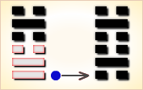
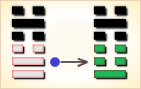
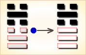
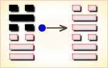
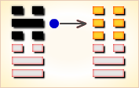
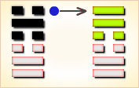

---
hide:
  - navigation
---
# 周易第60卦_节卦(水泽节)_坎上兑下 

<table>
	<tbody>
		<tr>
			<td class="td1">
				</td>
			<td class="td1">
				</td>
			<td class="td1">
				</td>
			<td class="td1">
				</td>
		</tr>
		<tr>
			<td style="text-align: center;">
				<strong>本卦</strong></td>
			<td style="text-align: center;">
				<strong>互卦</strong></td>
			<td style="text-align: center;">
				<strong>错卦</strong></td>
			<td style="text-align: center;">
				<strong>综卦</strong></td>
		</tr>
		<tr>
			<td style="text-align: center;">
				<a href="" style="text-decoration: none;">第60卦：节卦(水泽节)</a></td>
			<td style="text-align: center;">
				<a href="../27.山雷颐" style="text-decoration: none;">第27卦：颐卦(山雷颐)</a></td>
			<td style="text-align: center;">
				<a href="../56.火山旅" style="text-decoration: none;">第56卦：旅卦(火山旅)</a></td>
			<td style="text-align: center;">
				<a href="../59.风水涣" style="text-decoration: none;">第59卦：涣卦(风水涣)</a></td>
		</tr>
	</tbody>
</table>

## 周易第六十卦详解

**节卦原文**

节。亨，苦节不可贞。

象曰：泽上有水，节。君子以制数度，议德行。

白话文解释

节卦：亨通。如果以节制为苦，其凶吉则不可卜问。

《象辞》说：本卦下卦为兑，兑为泽；上卦为坎，坎为水。泽中水满，因而须高筑堤防，这是节卦的卦象。君子观此卦象，从而建立政纲制度，确立伦理原则。

**《断易天机》解**

节卦坎上兑下，为坎宫初世卦。节说明需节制、节约，停止挥霍，这样才能居家康宁。

**北宋易学家邵雍解**

操守节度，适可而止；审时度势，能知变通。

得此卦者，宜安分守己，切忌贪心不足，诸事必须节制，不宜过份，更要戒酒色。

台湾国学大儒傅佩荣解

时运：品行端正，名利自成。

财运：正派经营，富裕可求。

家宅：富有之家；婚姻吉祥。

身体：节制饮食。

**传统解卦**

这个卦是异卦（下兑上坎）相叠。兑为泽，坎为水。泽有水而流有限，多必溢于泽外。因此要有节度，故称节。节卦与涣卦相反，互为综卦，交相使用。天地有节度才能常新，国家有节度才能安稳，个人有节度才能完美。

大象：泽为池沼，坎水在上，喻蓄积及约束水份不使流失，但水位过高，则成泛滥。

运势：有志不能伸，诸事必须节制，不宜过份，更要戒酒色。

事业：正处在发展时期，一定要注意切勿冒进。但更不应放弃良好的机遇，只要坚持遵道守义的原则，可大胆行动。这样，事业可以继续兴旺发达。

经商：市场行情好，对自己很有利，应该努力开拓，勿失去机会。不过，头脑一定要冷静，投入应有限度，适可而止，该收则收。

求名：严格要求自己，办事知道节度，不走极端，可以通行无阻，顺利前进。

婚恋：不要陷入情不自禁的地步，顺其自然会有好结果。

决策：抓住机遇，勿失良机。适当节制自己的行动，不可勉强，更不可冒险，恰如其分。一切不可拘泥，该变就变。但是，该节制的时候一定要节制。节制必须有限度，过于节制就成为苦，不会有好的结果，这叫适得其反，务必十分注意。

**第六十卦的哲学含义**

节卦，这个卦是异卦相叠，下卦为兑，上卦为坎。兑为泽，坎为水。泽有水而流有限，多必溢于泽外。因此要有节度，故称节。天地有节度才能常新，国家有节度才能安稳，个人有节度才能完美。

节卦位于涣卦之后，《序卦》中这样解释道：“物不可终离，故受之以节。”一直离散、涣散下去，并不适宜，所以接着要谈节卦。节卦与涣卦相反，互为综卦，交相使用。

《象》中这样解释道：泽上有水，节；君子以制数度，议德行。这里指出：泽卦的卦象是兑（泽）下坎（水）上为泽上有水之象，象征以堤防来节制。水在泽中，一旦满了就溢出来，而堤防本身就是用来节制水的盈虚的。君子应当效法节卦的义理，制定典章制度和必要的礼仪法度来作为行事的准则，以此来节制人们的行为。

节卦象征万物有节，告诉人们节制的道理，属于上上卦。《象》中这样来断此卦：时来运转喜气生，登台封神姜太公，到此诸神皆退位，纵然有祸不成凶。

节卦卦象：从卦象上进行分析，节卦上卦为坎为水，下卦为兑为泽，泽上有水便是节卦的卦象。水会由高至低不停地流动，可是如果经过一个浅坑，水便会被积蓄而不再往前流了。沼泽比地面要低，所以下雨时或其他河水流经沼泽地时，便会在这里积聚。所以节积水成泽便是节卦的大形象。

## 周易第六十卦初九爻详解

初九爻辞

初九。不出户庭，无咎。

象曰：不出户庭，知通塞也。

白话文解释

初九：筮遇此爻，杜门不出，没有灾祸。

《象辞》说：杜门不出，因为其人知道所行必不通。

北宋易学家邵雍解

平：得此爻者，进取不利，宜守旧。

台湾国学大儒傅佩荣解

时运：闭门修行，平安是福。

财运：不利行商，可以开店。

家宅：可以安居；夫妇得当。

身体：安居静养。

**初九变卦**

初九爻动变得周易第29卦：坎为水。这个卦是同卦（下坎上坎）相叠。坎为水、为险，两坎相重，险上加险，险阻重重。一阳陷二阴。所幸阴虚阳实，诚信可豁然贯通。虽险难重重，却方能显人性光彩。

**初九爻的哲学含义**

节卦第一爻，爻辞：初九：不出户庭，无咎。爻辞释义

户庭：指户院围墙的出入口。

本爻辞的意思是：不迈出庭院，没有危害。

从卦象上看，初九爻属于阳爻居刚位，有好动之象。但是初九位于兑卦的初始，兑卦象征少女。古代提倡大家闺秀要“大门不出，二门不迈”，要节制自己的行动，显得有教养，要是经常出门，不懂得约束自己，名声则不好。从整个卦来看，初九好动，但是与上面的九二逆比，被其阻拦，所以上行受阻，最好呆在家里。

《象》中这样分析本爻：“不出户庭”，知通塞也。这里指出：“不迈出庭院”，说明知晓通则当行，阻则当止的道理。

占得此爻者，最近不要外出，最好是呆在家里，虽然这与你好动的本性不符，但是你一定要管束一下自己。要深居简出，自甘寂寞，只要不出门，就无灾。

初九：不出戶庭，无咎。

象曰：不出戶庭，知通塞也。

经文意思是：不走出房屋，没有灾难。

象辞意思是：不走出房屋，是因为明白闭塞与通达的时势规律。

## 周易第六十卦九二爻详解

**九二爻辞**

九二。不出门庭，凶。

象曰：不出门庭，失时极也。

**白话文解释**

九二：筮遇此爻，杜门不出，也有凶险。

《象辞》说：杜门不出，也有凶险，因为坐失良机，错误已极。

北宋易学家邵雍解

凶：得此爻者，时运不佳，事多乖离，宜动不宜静。做官的不得时运。

台湾国学大儒傅佩荣解

时运：因循自误，坐失良机。

财运：错过时机，不赚反赔。

家宅：屋内无人；旷怨难免。

身体：行走艰难。

**九二变卦**

九二爻动变得周易第3卦：水雷屯。这个卦是异卦（下震上坎）相叠，震为雷，喻动；坎为雨，喻险。雷雨交加，险象丛生，环境恶劣。“屯”原指植物萌生大地，万物始生，充满艰难险阻，然而顺时应运，必欣欣向荣。

**初九爻的哲学含义**

节卦第二爻，爻辞：九二：不出门庭，凶。爻辞释义

这句爻辞的意思是：因过分节制而不跨出门庭，会有凶险。

从卦象上看，九二属于阳爻居柔位，也是积极好动的。而且其与初九不一样，九二处于震卦〔九二，九三，九四）之中，震代表着长男，这与少女不同。在古代社会，女人要大门不出、二门不进，男人则要积极外出，到外闯荡，去承担家庭和社会的责任，尤其是家里的长男，责任更加重大。九二这一长男却遇到柔位，柔媚于坎难，向艰难屈首低头，守在家中，当进而不进，当出不出，这样会与社会脱节，会有凶险。

《象》中这样分析本爻：“不出门庭”，失时极也。这里指出：“因过分节制而不跨出门庭”，因此失去了适中、妥当的时机。

占得此爻者，应该摆脱当前的整天呆在家里的局面，要到外出走一走，去交往各种朋友，见见世面，做自己该做的事情。整天把自己关在屋子里，与世隔绝，你将会失去许多重要的机会，这对你是非常不利的。

九二：不出门庭，凶。

象曰：不出门庭，失时极也。

经文意思是：不走出家门，凶险。

象辞意思是：不走出家门，是失去时机到了点。

## 周易第六十卦九三爻详解详解

**六三爻辞**

六三。不节若，则嗟若。无咎。

象曰：不节之嗟，又谁咎也。

**白话文解释**

六三：不节俭则困穷，处困穷则知悔过，知悔过则可以无灾难。

《象辞》说：奢侈带来了悔恨，这是谁之过？

**北宋易学家邵雍解**

平：得此爻者，多辛苦，少收获。

台湾国学大儒傅佩荣解

时运：得而后失，叹息无奈。

财运：不知守财，咎由自取。

家宅：先富后贫；先喜后悲。

身体：饮食不节致病。

**六三变卦**

六三爻动变得周易第5卦：水天需。这个卦是异卦（下乾上坎）相叠，下卦是乾，刚健之意；上卦是坎，险陷之意。以刚逢险，宜稳健之妥，不可冒失行动，观时待变，所往一定成功。

**九三爻的哲学含义**

节卦第三爻，爻辞：六三：不节若，则嗟若，无咎。爻辞释义

本爻辞的意思是：本该约束节制的，却不能节制，事后却嗟叹后悔不已，没有祸患。

从卦象上看，六三以阴爻居刚位，既不当位又不居中，行为失正，因行为不能节制，有失职之咎。但其事后能及时发觉，有着改过迁善之心，所以没有过《象》中这样解释本爻：“不节之嗟”，又谁咎也！这里指出：“本该约束节制的，却不能节制，事后却嗟叹后悔不已，”，这样的话，谁还能再责备他占得此爻者，你要注意约束自己的言行，如果你不能意识到自己的不足，又听不进别人的劝告，就只能事后后悔了。虽然没有人责备你，但是这对你并没有好处。

六三：不节若，则嗟若，无咎。

象曰：不节之嗟，又谁咎也。

经文意思是：不节制自己，就会哀叹悲伤，没有灾难。象舌辛意思是：因自己不节制导致悲伤，又能责怪谁呢？

## 周易第六十卦九四爻详解详解

**六四爻辞**

六四。安节，亨。

象曰：安节之亨，承上道也。

**白话文解释**

六四：安于节俭遵礼的生活，通泰。

《象辞》说：安于节俭遵礼的生活之所以吉利，是因为顺从了君上的旨意。

北宋易学家邵雍解

吉：得此爻者，秉公守法，安于正道，福利可获。做官的会得到上司的欣赏，升迁有望。

台湾国学大儒傅佩荣解

时运：平安是福，听命行事。

财运：安居外地，一切节俭。

家宅：平安无事；夫妻平顺。

身体：病由口入。

**六四变卦**

六四爻动变得周易第58卦：兑为泽。这个卦是同卦（下泽上泽）相叠。泽为水。两泽相连，两水交流，上下相和，团结一致，朋友相助，欢欣喜悦。兑为悦也。同秉刚健之德，外抱柔和之姿，坚行正道，导民向上。

**九四爻的哲学含义**

节卦第四爻，爻辞：六四：安节，亨。爻辞释义

本爻辞的意思是：安然实行节制，可获亨通。

从卦象上看，六四以阴爻居柔位，当位得正。其上承九五，与九五属于亲比关系，下与初九正应，上下关系融洽。上面遵从君主，下面接受贤士的监督，并以此为动力对自己实行节制，故而能亨通。

《象》中这样解释本爻：“安节之亨”，承上道也。这里指出：“安然实行节制，可获亨通”，说明谨守柔顺尊上之道。

占得此爻者，在各个方面都能做到节制，而且自己非常愿意这么做，度也掌握得很好。这样在各个方面都可获亨通。

六四：安节，亨。

象曰：安节之亨，承上道也。

经文意思是：安于节制，亨通。

象辞意思是:安于节制的亨通，是顺承九五的天道。

## 周易第六十卦九五爻详解详解

**九五爻辞**

九五。甘节，吉，往有尚。

象曰：甘节之吉，居位中也。

**白话文解释**

九五：以节俭遵礼为乐，吉利。秉此而行，所往必得别人资助。

《象辞》说：以节俭遵礼为乐之所以吉利，因为九五之爻，所居恰当，像人居德行义，自然获得人家资助。

**北宋易学家邵雍解**

吉：得此爻者，正当好运，谋望有成。

台湾国学大儒傅佩荣解

时运：苦尽甘来，功名必显。

财运：贩米外地，获利必丰。

家宅：正直节俭；百年好合。

身体：节食可治。

**九五变卦**

九五爻动变得周易第19卦：地泽临。这个卦是异卦（下兑上坤）相叠。坤为地，兑为泽，地高于泽，泽容于地。喻君主亲临天下，治国安邦，上下融洽。

**九五爻的哲学含义**

节卦第五爻，爻辞：九五：甘节，吉，往有尚。爻辞释义

甘节：指心甘情愿地节制。

本爻辞的意思是：能心甘情愿地节制，可获吉祥。前行一定会受到褒奖。

从卦象上看，九五以阳爻居君位，持中守正，做事能讲究分寸，不偏不倚，而且做为君主，也是甘愿这么做，以给自己的臣民起到表率作用，得到百姓的拥护，吸引更多的贤士前来辅佐自己。

《象》中这样解释本爻：“甘节之吉，位居中也。”这里指出：“能心甘情愿地节制，可获吉祥”，这是由于居位中正的缘故。

占得此爻者，可能是一个单位的领导或是孩子的家长，你应该在各个方面节制自己，这样给下属或孩子起到表率作用，你会得到他们的尊敬的。

九五：甘节，吉；往有尚。

象曰：甘节之吉，居位中也。

经文意思是：以节俭的生活为甜美，吉祥，前往会受到尊重。

象辞意思是：以节俭的生活为鉗美的吉祥，是由于九五居中得位。

## 周易第六十卦上九爻详解详解

**上六爻辞**

上六。苦节，贞凶。悔亡。

象曰：苦节贞凶，其道穷也。

**白话文解释**

上六：以节俭遵礼为苦，卜问得凶兆，其人将为家道败落而悔恨。

《象辞》说：以节俭遵礼为苦，卜问得凶兆，正如上六阴爻孤悬一卦之尽头，像人走入穷困不通的境地。

**北宋易学家邵雍解**

凶：得此爻者，不得天时，名利皆无。做官的不知变通，前途渺茫。

台湾国学大儒傅佩荣解

时运：不知变通，贫困一生。

财运：失去良机，怨叹无用。

家宅：开明为宜；顽固难处。

身体：病势垂危。

**上六变卦**

上六爻动变得周易第61卦：风泽中孚。这个卦是异卦（下兑上巽）相叠。孚本义孵，孵卵出壳的日期非常准确，有信的意义。卦形外实内虚，喻心中诚信，所以称中孚卦。这是立身处世的根本。

**上九爻的哲学含义**

节卦第六爻，爻辞：上六：苦节；贞凶，悔亡。爻辞释义

本爻辞的意思是：因节制过分，则会感到苦涩，若坚持不改，会发生凶险。如果能对过分节制感到懊悔，则凶险有可能消失。

从卦象上看，上六属于阴爻居于柔位，当位得正，但是其属于节卦的最高位，又不居中，不能守中，有越过中道而行极端之节道之象，苦苦地加强节制而不知松动，知塞而不通。

《象》中这样分析本爻：“苦节贞凶”，其道穷也。这里指出：“因节制过分，则会感到苦涩，而且会发生凶险”，因为过分节制必然导致末路穷途。

占得此爻者，你已经有节制过头的倾向了，比如虽然节俭是美德，可是为了节省钱你吃不好穿不好，这就是节制过度了。不要过度节制，若过度地约束自己，生活得像个苦行僧，事业上也放不开手脚，这样对你不利。当务之急，就是在自我放任和自我节制之间找到一个折中点，因为不管是对自己还是对他人，过度地节制都是行不通的。

上六：苦节，贞凶，悔亡。

象曰：苦节贞凶，其道穷也。

经文意思是过度苦苦节制，守正道凶险，但没有悔恨。

象辞意思是：过度节制的凶险，是因为穷途末路。