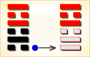
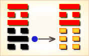
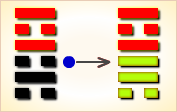

---
hide:
  - navigation
---
# 周易第64卦_未济卦(火水未济)_离上坎下 

<table>
	<tbody>
		<tr>
			<td class="td1">
				</td>
			<td class="td1">
				</td>
			<td class="td1">
				</td>
			<td class="td1">
				</td>
		</tr>
		<tr>
			<td style="text-align: center;">
				<strong>本卦</strong></td>
			<td style="text-align: center;">
				<strong>互卦</strong></td>
			<td style="text-align: center;">
				<strong>错卦</strong></td>
			<td style="text-align: center;">
				<strong>综卦</strong></td>
		</tr>
		<tr>
			<td style="text-align: center;">
				<a href="" style="text-decoration: none;">第64卦：未济卦(火水未济)</a></td>
			<td style="text-align: center;">
				<a href="../63.水火既济" style="text-decoration: none;">第63卦：既济卦(水火既济)</a></td>
			<td style="text-align: center;">
				<a href="../63.水火既济" style="text-decoration: none;">第63卦：既济卦(水火既济)</a></td>
			<td style="text-align: center;">
				<a href="../63.水火既济" style="text-decoration: none;">第63卦：既济卦(水火既济)</a></td>
		</tr>
	</tbody>
</table>

## 周易第六十四卦详解

**未济卦原文**

未济。亨，小狐汔济，濡其尾，无攸利。

象曰：火在水上，未济。君子以慎辨物居方。

**白话文解释**

未济卦：亨通。小狐狸快要渡过河，却打湿了尾巴。看来此行无所利。

《象辞》说：本卦上卦为离，离为火；下卦为坎，坎为水。火在水上，水不能克火，是未济卦的卦象。君子观此卦象，有感于水火错位不能相克，从而以谨慎的态度辨辩事物的性质，审视其方位。

**《断易天机》解**

未济卦离上坎下，为离宫三世卦。未济就是未完成，此卦爻位不正，形象上极端恶劣，但变化在酝酿之中，未来充满希望。

**北宋易学家邵雍解**

不能资助，待时而动；由小而大，不可躁进。

得此卦者，运势不通，诸事不能如愿，宜由小及大，稳步进取，要耐心去突破难关，则终可成功。

**台湾国学大儒傅佩荣解**

时运：运势颠倒，务必谨慎。

财运：诸事不顺，步步为营。

家宅：改变方向；门户不合。

身体：血脉不顺，用药谨慎。

**传统解卦**

这个卦是异卦（下坎上离）相叠。离为火，坎为水。火上水下，火势压倒水势，救火大功未成，故称未济。《周易》以乾坤二卦为始，以既济、未济二卦为终，充分反映了变化发展的思想。

大象：水性下注，火势向上，水火不交，阴阳不得正位，未能完成和未能成功之意。

运势：运气欠佳，但必须耐心突破难关，终可成功，有初凶后吉之象。

事业：处于最后的关键时刻，成功与否就在眼前，因此务必不可掉以轻心。自我节制非常重要，坚持到底，必要时也可能慎重地进行适度冒险，以成就事业。

经商：市场处于大变动的前夕，前景如何尚不明显。这是最为艰苦的时期，头脑必须冷静，切勿冒险，不可行动过度，适度节制，观察动向，决定行动。

求名：长期的努力和追求即会有结果。在成败的关键时刻应泰然自若，听天由命，顺其自然。

婚恋：已经渡过了困难阶段，再慎重地加把劲，会有美满的结果。

决策：此卦的意思是“未完成”，表明前途无量，有充分发展的可能。因此，必须坚持中正的原则，以明智、中庸、诚信、谦逊的态度，成就事业。面对人生，唯有勤勤恳恳，极力尽人事，听天命，不必过分计较成功与否。

**第六十四卦的哲学含义**

未济卦，这个卦是异卦相叠，下卦为坎，上卦为离。离为火，坎为水。火上水下，火势压倒水势，救火大功未成，故称未济。

未济卦位于既济卦之后，《序卦》这样解释道：“物不可穷也，故受之以未济。终焉。”既济卦是久则穷，所以必须重启生机，以显示变易而不穷的《易经》原理，也就是以未济卦作为六十四卦的压轴。“未济”是尚未完成也尚未结《象》中解释未济卦：火在水上，未济；君子以慎辨物居方。这里指出：未济卦的卦象是坎（水）下离（火）上，为火在水上之表象。火在水上，大火燃烧，水波浩浩，水火相对相克，象征着未完成；君子此时要明辨各种事物，看到事物的本质，努力使事物的变化趋向好的方面，这样做则万事可成。

未济卦象征事业未竟，属于中下卦。《象》中这样来断此卦：离地着人几丈深，是防偷营劫寨人，后封太岁为凶煞，时加谨慎祸不侵。

## 周易第六十四卦初九爻详解

**初六爻辞**

初六。濡其尾，吝。

象曰：濡其尾，亦不知极也。

**白话文解释**

初六：涉水渡河，沾湿了衣尾，前进有困难。

《象辞》说：涉水渡河，沾湿了衣尾，见微知巨，再冒险前进，是不知儆戒。

**北宋易学家邵雍解**

凶：得此爻者，经营不利，涉水行舟者，谨防溺水之患。做官的仕途有阻，不能前进。

**台湾国学大儒傅佩荣解**

时运：鲁莽行事，无路可走。

财运：不记教训，谋财无方。

家宅：门户方位不正；团聚不易。

身体：病在下身。

**初六变卦**

初六爻动变得周易第38卦：火泽睽。这个卦是异卦（下兑上离）相叠。离为火；兑为泽。上火下泽，相违不相济。克则生，往复无空。万物有所不同，必有所异，相互矛盾。睽即矛盾。

**初九爻的哲学含义**

本爻辞的意思是：小狐狸在渡河时被弄湿了尾巴，会有麻烦。

未济卦第一爻，爻辞：初六：濡其尾，吝。人生启示

从卦象上看，初六以阴爻居于阳位，具有冒进和急躁的特性。其处下卦坎中，坎代表水，其才质柔弱，贸然涉水，会有危险。

《象》中这样分析本爻：“濡其尾”，亦不知极也。这里指出：“小狐狸在渡河时被弄湿了尾巴”，说明其自不量力，不知道自己究竟能使多大的气力，急躁冒进，结果招致麻烦。

占得此爻者，不要过高地估计了自己的力量，也不要在没有弄清水的深浅之前就贸然前进，以期获得快速成功，如果这样，你就会招来麻烦。

初六：濡其尾，吝。

象曰:濡其尾，亦不知极也。

经义意思是：沾湿了尾巴，有忧吝。

象辞意思是：沾湿了尾巴，也不知道已到了自己承受的极限（即狐狸尾巴都湿了，说明水再深一些，小狐狸就有危险了）。

## 周易第六十四卦九二爻详解

**九二爻辞**

九二。曳其轮，贞吉。

象曰：九二贞吉，中以行正也。

**白话文解释**

九二：提着腰带涉水过河。卜问得吉兆。

《象辞》说：九二爻辞讲贞吉，因为九二阳爻处下卦中位，像人行事遵循正道。

**北宋易学家邵雍解**

吉：得此爻者，安份守纪者，谋望遂意。做官的克服困难者，晋升有望。

**台湾国学大儒傅佩荣解**

时运：上下相得，无往不利。

财运：用心经营，满载而归。

家宅：美善之家；必得贤妇。

身体：胸腹阻滞。

**九二变卦**

九二爻动变得周易第35卦：火地晋。这个卦是异卦（下坤上离）相叠。离为日，为光明；坤为地。太阳高悬，普照大地，大地卑顺，万物生长，光明磊落，柔进上行，喻事业蒸蒸日上。

**初九爻的哲学含义**

未济卦第二爻，爻辞：九二：曳其轮，贞吉。

爻辞释义曳：指拖住。

本爻辞的意思是：拖住车轮，使其速度不要太快，坚守正道可获吉祥。

从卦象上看，九二是以阳爻居于柔位，本身具有冒进和急躁的特性，但是能居中守正，把自己的脾性改掉了。

《象》中这样分析本爻：九二贞吉，中以行正也。这里指出：九二爻之所以可获吉祥，是因其持中不移，端正不偏倚，有所节制，这样行事必获吉祥。

占得此爻者，不是要让自己加快速度前进，而是应放缓速度。在你的事业刚刚开始的时候，不要贪功求快，须知“欲速则不达”。此时，你要有意放缓速度，稳扎稳打，一步一步地来推进，居中守正，自然获吉。

九二：曳其轮，贞吉。

象曰：九二贞吉，中以行正也。

## 周易第六十四卦九三爻详解详解

**六三爻辞**

六三。未济，征凶，利涉大川。

象曰：未济征凶，位不当也。

**白话文解释**

六三：渡不了河，出行有凶险。不利于涉水渡河。

《象辞》说：渡不了河，出行有凶险，因为六三阴爻居阳位，像人处境不利。

**北宋易学家邵雍解**

凶：得此爻者，宜见机行事，不宜妄动。做官的有因人成事之美。在商旅则涉川历险而利可获。

**台湾国学大儒傅佩荣解**

时运：见机而作，妄动则凶。

财运：把握良机，船运有利。

家宅：安居为宜；迎娶为吉。

身体：预防祸祟，渡川以解。

**六三变卦**

六三爻动变得周易第50卦：火风鼎。这个卦是异卦（下巽上离）相叠。燃木煮食，化生为熟，除旧布新的意思。鼎为重宝大器，三足稳重之象。煮食，喻食物充足，不再有困难和困扰。在此基础上宜变革，发展事业。

**九三爻的哲学含义**

未济卦第三爻，爻辞：六三：未济，征凶，利涉大川。爻辞释义

征：指征伐，进攻他人。

本爻辞的意思是：事情未完成，急躁冒进去远行，有凶险，但有利于渡过大河急流。

从卦象上看，六三以阴爻居于刚位，具有急躁冒进却才质柔弱、能力不足的特性，而且还处于下卦坎之中，坎代表凶险，所以其不利于出征。

《象》中这样分析本爻：“未济，征凶”，位不当也。这里指出：“事情未完成，急躁冒进去远行，有凶险”，说明此时所处的位置不当。但是，六三与位于全卦顶端的上九正应，这说明可以跋山涉水，到远处去做些事情，上卦是离卦，代表光明，意味着脱离危险找到光明，说明在朋友的帮助和照应下，会很吉占得此爻者，你所处的位置和形势对你不利，如果你想在这里有所作为的话，可能会遇到危险。如果有非常有能力的朋友在外地，你不妨投奔于他，在他的帮助下，或许能有所进展。或者若觉得当下的项目或行业不适于发展，很难取得成功，那可以转做其他项目，或转行做其他事情。

六三：未济，征凶，利涉大川。

象曰：未济征凶，位不当也。

## 周易第六十四卦九四爻详解详解

**九四爻辞**

九四。贞吉，悔亡，震用伐鬼方。三年有赏于大国。

象曰：贞吉悔亡，志行也。

**白话文解释**

九四：吉利的贞卜，没有悔恨。大动干戈，助殷讨伐鬼方，费时三年，打败了它，获得殷国的奖赏。

《象辞》说：吉利的卜问，没有悔恨，说明志得意行。

**北宋易学家邵雍解**

吉：得此爻者，会得好人提举，获利丰厚。做官的会受到重用，名利双全。读书人会取得佳绩。

**台湾国学大儒傅佩荣解**

时运：志得意满，名利双全。

财运：远方经营，利润可观。

家宅：安居乐业；二年成婚。

身体：可保三年。

**九四变卦**

九四爻动变得周易第4卦：山水蒙。这个卦是异卦（下坎上艮）相叠，艮是山的形象，喻止；坎是水的形象，喻险。卦形为山下有险，仍不停止前进，是为蒙昧，故称蒙卦。但因把握时机，行动切合时宜，因此，具有启蒙和通达的卦象。

**九四爻的哲学含义**

未济卦第四爻，爻辞：九四：贞吉，悔亡；震用伐鬼方，三年有赏于大国。爻辞释义

震用：指声势浩大如雷，使人担吓受怕。伐：征伐，讨伐。鬼方：指部落名称。大国：指殷商。

未济卦第四爻，爻辞：九四：贞吉，悔亡；震用伐鬼方，三年有赏于大国。人生启示

从卦象上看，九四以阳爻居于柔位，已经脱离了下卦坎，远离了危险，开始向胜利的转折时期，其为近君大臣，刚柔相济，只要能坚守正道，就不会有危《象》中这样解释本爻：“贞吉悔亡”，志行也。这里指出：“坚守正道可获吉祥，悔恨会消失”，说明实现了建功立业的梦想。

占得此爻，要明白这一点：克服险阻不是一朝一夕的事，妨碍和破坏你的事业的因素始终存在。这时你需要采取果断的行动，经过长久的努力才能取得成功。

九四：贞吉，悔亡，震用伐鬼方，三年有赏于大国。

象曰贞吉悔亡，志行也。

经文意思是：守正道吉祥，没有悔恨，振奋起来征伐鬼方国，三年获得成功，得到大国的奖赏。

象辞意思是：守正道吉祥，没有悔恨，是由于九四爻志在必行。

## 周易第六十四卦九五爻详解详解

**六五爻辞**

六五。贞吉，无悔，君子之光。有孚，吉。

象曰：君子之光，其晖吉也。

**白话文解释**

六五：吉利的贞卜，没有悔恨。打了胜仗，捕获了俘虏，这是君子的光荣，吉利。

《象辞》说：君子光荣，君子光明正大，自然吉利。

**北宋易学家邵雍解**

吉：得此爻者，谋望有成，财利丰厚。做官的能得到升迁。

**台湾国学大儒傅佩荣解**

时运：运势正旺，诸事皆吉。

财运：官方业务，获利稳定。

家宅：大吉之家；婚姻必成。

身体：神清气爽。

**六五变卦**

六五爻动变得周易第6卦：天水讼。这个卦是异卦（下坎上乾）相叠。同需卦相反，互为“综卦”。乾为刚健，坎为险陷。刚与险，健与险，彼此反对，定生争讼。争讼非善事，务必慎重戒惧。

**九五爻的哲学含义**

未济卦第五爻，爻辞：六五：贞吉，无悔；君子之光，有孚，吉。爻辞释义

本爻辞的意思是：坚守正道可获吉祥，没有悔恨；这是君子所具有的美德的光辉，有诚实守信的德行可获吉祥。

从卦象上看，六五属于阴爻居于君位，失位，意味着君主能力偏弱，但是君主在德不在才。如果能谦下仁和，讲究诚信，必然能得到有能力之人的辅佐。《象》中这样分析本爻：“君子之光”其晖吉也。这里指出：“君子所具有的美德的光辉”，说明应该具有诚实守信、光明正大的美德，才可得到吉祥。

占得此爻者，你的个人能力并不是太强，所以要谦虚待人，争取得到能人的帮忙。你的成功并不是靠自己的能力，而是靠自己的德行。经过长期的努力之后，你的人格光辉已经感染了许多人，这时已经具备了成功的条件。

六五：贞吉，无悔，君子之光，有孚，吉。

象曰：君子之光，其晖吉也。

## 周易第六十四卦上九爻详解详解

**上九爻辞**

上九。有孚于饮酒，无咎。濡其首，有孚失是。

象曰：饮酒濡首，亦不知节也。

**白话文解释**

上九：捕获了俘虏，饮酒庆贺。没有灾难，但酗酒闹事，头发都淋湿了。俘虏乘机作乱，将他们杀了。

《象辞》说：酗酒闹事头发都淋湿，也太不知节制了。

**北宋易学家邵雍解**

平：得此爻者，行险而顺，不良者有溺水之厄，纵酒之灾。做官的有望升迁。

**台湾国学大儒傅佩荣解**

时运：能知节俭，可保无虞。

财运：量入为出，永享其富。

家宅：勤俭持家；相敬如宾。

身体：饮食失节，不可不慎。

**上九变卦**

上九爻动变得周易第40卦：雷水解。这个卦是异卦（下坎上震）相叠。震为雷、为动；坎为水、为险。险在内，动在外。严冬天地闭塞，静极而动。万象更新，冬去春来，一切消除，是为解。

**上九爻的哲学含义**

未济卦第六爻，爻辞：上九：有孚于饮酒，无咎；濡其首，有孚失是。爻辞释义

本爻辞的意思是：诚信地饮酒，没有过错。纵情滥饮，被酒淋湿了头，虽有诚信但是失了法度，损害了君子的正道。

从卦象上看，上九以阳爻居于阴位，失位。上九处于未济卦的上端，事业已趋于圆满，上九属于功臣，其与六五亲比，具有辅佐君王济世之心，这是没有过错的。有如胜利后庆功一样，做为功臣，如果怀着诚意饮酒，是没有过错的。如果自恃有功，不讲礼术，也不知控制自己，纵情滥饮，这时即使对君主是忠诚的，也会被其厌恶，会为自己招来灾祸。

《象》中这样指出：饮酒濡首，亦不知节也。这里指出：“纵情滥饮，被酒淋湿了头”，这样喝得醉醺醺的，就会误了大事，就有灭顶之灾，这是放纵自己没有节制的结果。

占得此爻者，在单位里你可能是功臣，但是功劳已经属于过去了，你就像老年人该淡泊名利，颐养天年一样，不要再去提当年的功劳。你应该踏实地工作着，为下次立功做准备。若是自恃有功，甚至坏了一些礼仪规矩，就会惹上麻烦

的。

上九：有孚于饮酒，无咎。濡其首，有孚失是。

象曰：饮酒濡首，亦不知节也。